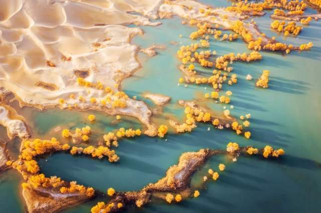
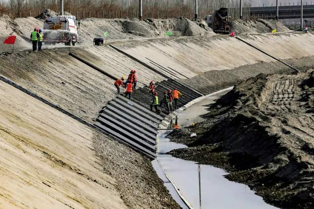
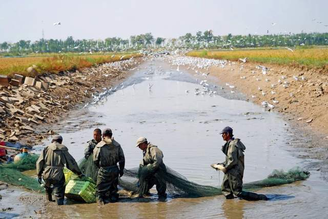

# 暴雨增多，西北为何还可能更旱？专家解读

近两年，关于西北暖湿化的讨论日益增多。随着西北地区暖湿化现象的凸显，一系列极端天气气候事件的发生，西北暖湿化被简化为一系列简单现象的集成：青海湖水位回升、绿洲面积扩大、草场变绿和沙漠出现湖泊。公众甚至会好奇，在气候变化影响下，西北地区是否真的会从沙漠变成江南，汉唐景致能否重现？

专家们反复澄清和强调，西北地区变暖变湿，虽然是不争的事实，但仍很难改变西北地区干旱的气候形态。实际上，西北暖湿化是一把双刃剑。

西北暖湿化的成因是怎样的？如何用全球气候变化的视角审视西北暖湿化？暖湿化对西北带来的真实影响有哪些？在当下和未来，应如何科学应对西北暖湿化带来的机遇和挑战？日前，围绕相关问题，《中国新闻周刊》专访了中国工程院院士、国家气候变化专家委员会顾问丁一汇，甘肃省气象局总工程师、中国气象局干旱气候变化与减灾重点开放实验室主任张强，他们分别从全球和区域视角，给出了回答。

_左：丁一汇 右：张强_

**西北暖湿化是全球气候变化**

**引起的结果**

**中国新闻周刊：西北暖湿化的成因是什么？如何从全球变暖的视角审视西北暖湿化？**

**丁一汇：**
西北暖湿化是全球气候变化引起的一个区域性演变的结果。西北地区从“暖干”到“暖湿”的转折点出现在20世纪80年代。从自然原因看，上世纪80年代起，大西洋的暖洋流开始增强，暖湿气流也在增强，这是海洋的年代际变化。2010年以来，这种增强的趋势和北极变暖更加显著，更多水汽和热量从北极向南输送到低纬度地区。

与此同时，大西洋暖洋流的改变也通过海气相互作用，经过全球性的西风环流，将更多暖湿气流带到欧洲和中亚地区，再到国内的西北地区；另一方面，水汽也更多直接输送到北非。近20年，在北非曾经的一些干旱之地，降水量也明显增加。因此，暖湿化不是中国西北地区独有的现象。大西洋暖湿的海水源源不断地产生，它带来的暖湿化影响不仅在北大西洋，而会通过大洋传送带影响全球尺度的天气气候。

另一方面，西北暖湿化的另一个源头来自北极升温，与前者的周期性自然变化不同，北极增暖主要受全球气候变暖影响，海冰融化，北极的冷空气不断南下，以冷高压的形式，形成了东风，经过西伯利亚地区到达亚洲中东部，把丰富的水汽带到中国西部与东部季风区。它将来自北极和太平洋的多种水汽源从东向西一路带到西北地区。

_青海湖。图/视觉中国_

以前，都是干冷空气自西与自北向中国东部输送，现在是东风将暖湿气流输送到西北。研究发现，在西北气候转型之前，自东向西的水汽输送很少，形成暖湿化趋势之后却明显增多。而且，东风逐渐增强的结果是水汽带向西扩展，东风的明显西扩，是过去很少发生的现象，最近却经常出现，这可能是加剧西北暖湿化的一个重要因素。

当越来越多的水汽从东向西输送过来，却未必能产生降水，因为降水不仅需要足够的暖湿水汽，一定要和冷空气相互作用。西北的冷空气主要从偏西、偏北路径向东扩，这正好和东部季风区吹来的水汽在新疆相遇，并产生明显的降水。所以，暖湿化最早出现在西北地区西部，新疆北部的降水增加尤为明显。

实际上，受大气环流影响，西北暖湿化正在向西扩展到中亚地区，向东辐射到华北西部。从中国、中亚地区一直到印度北部、巴基斯坦，亚洲中西部的暖湿趋势最为明显。如果不是大西洋暖洋流增强和北极升温同步发生，不可能出现从北非经过西亚，到中亚和东亚这么大范围的暖湿化。

**中国新闻周刊：20世纪80年代以来，西北气温和降水的变化趋势呈现什么规律？有何区域差异性？**

**张强：**
西北地区降水总体西少、东多，从近几年看，西北东部降水增幅更大，西部增幅较小，荒漠地区降水也有增加，但生态效应很弱。暖湿化趋势下，西北地区整体的区域水循环在加强，而且，增温使冰川加速消融，冰川是固体水库，固体的水消融之后变成液体水参与循环，就会形成降雨。目前来看，西北现在的降水量可能还没超过历史上降水量比较多的时期，暖湿化对西北地区气候格局的改变非常有限。西北的干旱区还是干旱区，半干旱区还是半干旱区，具体范围可能有微弱的变化，但西北回不到网上热议的汉唐时期。

变暖让区域大气的持水量增加，大气相当于一个水盆，装满了以后水就会倒下来，就形成降雨。以前持水量小的时候水盆也小，在短时间内就能装满，但现在水盆大了，装水时间很长，也就是说会长时间不降雨，一降雨就是暴雨。因此，在全球气候变暖的背景下，全球的干旱和暴雨都在同时增加，西北地区更加突出。这也是近年沙漠湖泊在西北频现的原因之一，沙漠区域下了一场暴雨后短期内蒸发不了，在低洼地区积累下来，形成了临时湖泊。

另外，变暖也会加快植物的蒸发，可能会抵消降水的效果，植被的蒸发加快，对水分的要求更多，会加剧西北地区的生态脆弱性。不过，西北不少地区的植被在向好变化，总体植被盖度也在增加，说明土壤水分还是有所改善，整体上来说，降水增加并没有比蒸发的部分少。

_新疆巴州尉犁县，塔克拉玛干沙漠周边的水上胡杨林。图/视觉中国_

**暖湿化可能引发干旱危机**

**中国新闻周刊：虽然整体来看，西北近年来生态改善明显，但局部区域的植被也出现退化，是否可以从蒸发与降水的关系来理解？**

**张强：**
在西北暖湿化转型中，相较降水的变化，增温趋势更明显，那么，如果一个区域降水增加了10％~20％，在距山近的地方，因为降水基数本身就大，这个20％就是有意义的，植被可以得到改善。但在沙漠地区，温度增加的作用比降水更大，温度升高会使蒸散抵消掉降水的效果，植被退化是可以理解的。

为什么同样是降水增加，在一个地区有生态效益，另一个地区则没有。因为只在有一定降水基础的地方，降水增加对区域生态才有正向贡献，如果这个区域年降水量只有100毫米，增加了20％也只到120毫米，对植被的生长而言，100毫米和120毫米没有区别，都不适合它的生长。因此，西北暖湿化对生态植被的影响不能一概而论，有的地方植被在改善，有的地方植被在退化。

**中国新闻周刊：一方面，暖湿化趋势下，西北地区的降水量正以9.32毫米/10年的速率增加，绿洲面积扩大了，有些过去死亡的湖泊“复活”了；但另一方面，局部地区的干旱风险却在加剧。一项研究表明，1997年以来，极端干旱频率呈增加趋势，你如何看待这种矛盾？**

**丁一汇：**
变暖是个双刃剑。气温升高后，大气的饱和比湿值增加了，也就是说，湿空气想要达到饱和的难度增大，更不容易形成降雨。如果饱和比湿值增加的程度，快于实际大气中水汽的增加速度，非但不能增加降水，还会带来干旱。比如南疆部分区域温度增加得很快，但水汽增加的速度跟不上，空气难以达到饱和值，可能加剧干旱。

新疆是干旱区，即使存在暖湿化转型，干旱的风险是更根本的，一年中空气达到饱和比湿值的几率不大，在整体范围内，难以形成大量降水。全球变暖下，冰川加速消退，当冰川融化，积雪融水不足以补充夏季的河川径流，就会出现干旱。新疆主要靠水库来储存一些降水，以备干旱时使用，但这其实是远远不够的。现在最担心的是出现降水的年代际波动，比如降水连续10年减少，就会产生灾难性的持续性大干旱。

**张强：**
暖湿化的确可能引发干旱危机。随着气候变暖，虽然总的趋势上降水增加了，但降水的波动性也加强了，年与年之间的差距变大了。因此，我们不能认为西北暖湿化之后，每年都会降水，可能某一年的降水比以往少得多。

_2017年7月28日，新疆巴州，暴雨过后的巴音布鲁克草原。图/视觉中国_

**中国新闻周刊：水资源短缺是制约西北经济社会发展的最关键因素，暖湿化可能引发的干旱危机，进一步对未来的水资源管理与利用提出了新的挑战。你有何建议？**

**丁一汇：**
提前制定未来30~50年的水资源合理利用策略，对气候的预测模式和数据不断进行更新，以便更精确地知道降水会增加多少，未来有多少水可以利用。我们要“以水定任务”，不能盲目乐观。西北地区是一个干旱区，很多地方的年降水量只有100多毫米，这是全球的大气环流和热力场所决定的，主要由自然因素造成，暖湿化不能从根本上改变西北缺水的气候态，必须要继续提倡节水。

**张强：**
西北以灌溉农业为主，在农业水资源利用方面，最易推行的措施就是农业节水，推广节水型农田，现在都要求高标准农田建设，所谓高标准，就是用水效率高、耗水少。此外，需要研究具有抗旱性的种子，如果气候预测年底降水较少或者干旱，就要及时调整种植品种，尽量多种抗旱性作物。但农户都有惯性，往年种什么，今年就种什么，没有特别考虑气候因素，这点亟待改变。

现在必须要提高人们对暖湿化影响的科学认识，主动去应对气候变化。暖湿化是一个缓慢的过程，一些基层政府没有应对气候变化的意识，觉得离自己很遥远，这就像温水煮青蛙，等到真正产生严重影响了，再去采取行动就来不及了。

_2023年3月4日，新疆阿克苏河阿克苏市库库瓦什防洪工程施工现场。本版图/视觉中国_

**冰川继续消退，**

**西北生态、农业会面临挑战**

**中国新闻周刊：21世纪以来，西北地区的极端天气事件，比如说南疆暴雨、沙漠洪水、极端干旱的发生频率、强度都在显著增加。我们该如何应对？**

**丁一汇：**
对西北而言，由于长期的气候条件下属于干旱和半干旱区，降水少，自然环境和生态系统一般适应这种干旱区的气候条件。如果一旦发生强暴雨或持续性强降水，反而由于当地自然条件不适应，进而导致洪涝灾害的发生或土地翻浆。我们曾做过研究，近些年，西北地区极端暴雨事件较多的三个地方为：伊犁地区、北疆中西部及甘肃东部。伊犁地形较为特殊，属河谷地带，位于南北天山之间，组成了一个向西开口的喇叭形状，只要潮湿西风吹过，从上游带来水汽，伊犁地区通过水汽直接倒灌就会出现降雨甚至暴雨。近些年，伊犁地区的暴雨频次明显增加。

实际上，早在21世纪初，施雅风院士最先注意到西北“暖湿化”信号时，他就和我说过，暖湿化有利有弊，最令人担忧的就是洪水。西北很多居住区都在河流边上，但当地对洪水的防御能力远远小于东部地区，很多基础设施也不是为抗洪设计的，本地人对洪水的防灾减灾意识也很弱。

这几年，西北的防汛压力明显增大。山区洪水很重要的一个来源就是积雪的融化，在很多流域的汛期，“暴雨+融雪型”洪水愈发常见，因此要对前一年冬天的降雪及时监测和预报。这涉及降雨的长期预报，是一个较难的科学问题。

**张强：**
西北地区的极端天气，比如暴雨、干旱、沙尘暴等，这几年在持续时间、发生期上都有一些异常反应，比如今年七八月份发生沙尘暴就比较罕见。因此，必须要提高对极端天气的监测、预报和预警能力，气象部门要努力做到“监测精密、预报精准、服务精细”，而且，对极端气象灾害的预防与防范不只与气象部门相关，需要多部门、全社会联动起来，形成合力。

**中国新闻周刊：根据预估，西北暖湿化趋势可能会持续多久？**

**丁一汇：**
我们团队做了多次多气候模式分析与预估，结果显示，大多数国内外模式表明西北暖湿化会一直持续到2050~2060年。而且，降水增加趋势会往南移，和青藏高原的降水区连在一起，未来，青藏高原降水也会不断增加。

**张强：** 根据团队在不同排放场景下的预估，2021~2050年，西北地区一直呈变湿趋势,
但相对于过去30年，变湿趋势明显放缓。相较降水，增温改变的幅度可能更大，预估显示，到21世纪末，西北整体从中温带过渡到暖温带并非没有可能。对西北而言，温度增加是弊大于利，如果温度带真的改变，冰川、积雪、冻土会进一步融化。

现在西北地区的水资源中，冰川和积雪是一种非常重要的稳定器，它们能够调节径流，农业在春季用水时，如果还没有降水，冰川融水可以为农田提供灌溉。因此，受变暖影响，如果冰川继续消退，西北地区的生态、农业会变得非常脆弱。今年，西北很多水库缺水，就和这种脆弱性有关，因为冰川最近几年一直在减少，稳定器的作用减弱了，相当于家庭的银行存款没了，一旦失业就没有钱了。

_2019年9月25日，宁夏银川市贺兰县，人们在宁夏稻渔空间生态休闲观光园捕鱼。_

**基础设施设计、建设标准要调整**

**中国新闻周刊：如何辩证看待西北暖湿化的利与弊，科学应对气候变化带来的机遇和挑战？**

**丁一汇：**
西北暖湿化带来的影响利弊并存。对农业和牧业而言，西北暖湿化有有利的一面。降水增多，会使得草长得更高、更加繁茂，这在新疆的伊犁地区体现得较为明显。伊犁地区、北疆西部地区、陇东地区的农业区有条件得以扩大，水资源的问题也得到缓解。值得指出，整个西北地区，21世纪以来，降水增加最显著的是陇东地区，以前，甘肃东部基本上是干旱区。除此之外，青海的降水也大幅度增加。2005年以来，青海湖水位连续18年回升，2022年，青海湖水位达到3196.57米，明显超过20世纪60年代初期水位，青海地区的生态系统能够并正在得以改善。

同时，要注意到，西北地区对于降水的承载力是有限的。如果降水过多，可能会有反效果，比如说造成路基翻浆，农业生产、生态系统生长等会受到明显影响，尤其是一些农作物的生长和畜牧业会受到明显影响。局部地区会出现泛滥的洪水，特别是青海湖地区。比如，去年8月，青海西宁市大通县就遭遇短时强降雨，引发了山洪，造成至少20多人遇难。有研究称，受暖湿化影响，陇东地区气象灾害发生的频率和强度在明显增加。另外，应尽快研究与冰川相关的灾害以及应对措施，面对冰川融水带来的洪水，在一些关键的水库区、河边的居民区，要提前制定好应对方案。

最后，要格外强调的一点是，现在西北各地注意到暖湿化的特征，希望借着这一趋势谋发展，建工厂、吸纳更多人口、建居民区，甚至能多分一些水资源。实际上，关于西北暖湿化的应对，应站在整个大西北气候变化的层面，统筹规划去考量对策，制定长期规划。对策涉及的时间跨度不应是10年、20年，而应是50年~60年。

（实习生肖潇对本文亦有贡献）

发于2023.9.11总第1108期《中国新闻周刊》杂志

杂志标题：西北暖湿化是把双刃剑

记者：霍思伊 杜玮

编辑：杜玮

