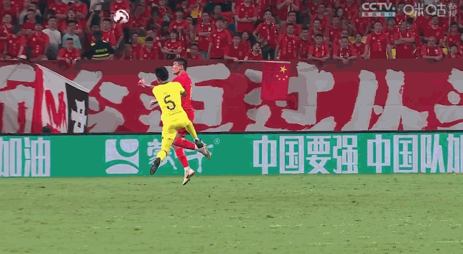
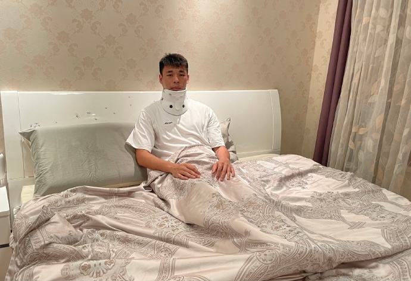

# 海港公布国足队员李帅伤情：诊断为脑震荡 上场对马来西亚比赛受伤

_李帅在和对手争顶头球时受伤。_

9月9日，在国足对阵马来西亚的比赛中，国脚李帅在一次头球争顶时同对方队员发生激烈碰撞，随即倒地不起，长时间失去意识后，被救护车直接送离赛场。

 _李帅受伤，救护车直接进场。_

12日上午，李帅所效力的上海海港俱乐部发表官方公告——
**经当地医院核磁共振检查后，初步诊断李帅的伤情为脑震荡、颈椎受伤以及多颗牙齿受到严重的牙根损伤。**

_李帅正在接受治疗。_

鉴于李帅此次的受伤情况不容乐观，在谨慎考虑并与球员充分交换意见之后，海港俱乐部做出决定，安排李帅于11日傍晚返回上海，全面接受专家会诊并将结合实际情况为其制定最佳的治疗和康复方案。

