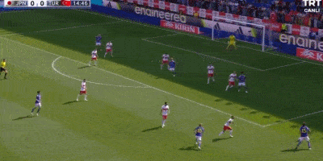
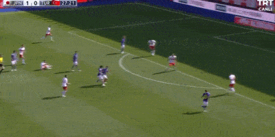
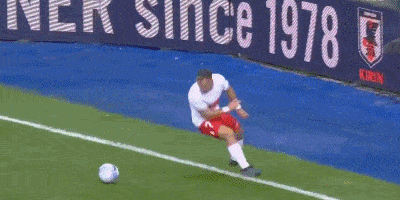
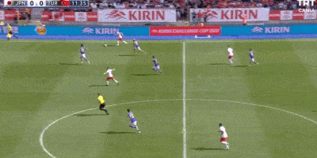

# 热身赛：日本4-2土耳其获4连胜 轮换10人仍22分钟内轰3球+2中柱

在北京时间9月12日晚结束的一场国际足球热身赛中中，日本男足在首发轮换10人的情况下，依旧以4-2的比分，完胜世界排名第41位的土耳其男足。上半场，伊藤敦树破门，中村敬斗梅开二度，土耳其卡巴克破门。下半场，贝尔图再帮助土耳其追回1球，伊东纯也造点后亲自主罚命中锁定胜局。此役获胜后，日本男足热身赛豪取4连胜，分别6-0、4-1、4-1和4-2击败了秘鲁、萨尔瓦多、德国和土耳其。

【关键焦点】

第14分钟，伊藤敦树禁区外世界波破门，帮助日本队取得梦幻开局！

第28分钟，久保建英远射被扑，中村敬斗补射破门扩大比分至2-0。

第36分钟，日本队断球反击，中村敬斗轻松推射破门梅开二度，日本3-0土耳其！

第43分钟，土耳其利用定位球机会，依靠卡巴克头球补射破门扳回一城，土耳其1-3日本！

第60分钟，土耳其边路横传到禁区，后卫前点一挡，门前贝尔图左脚破门，日本3-2土耳其。

第77分钟，伊东纯也突破被土耳其球员拉倒，裁判判罚点球。伊东纯也亲自主罚破门。日本4-2土耳其。

**【精彩回放】**

第12分钟，贝尔图接队友直塞，反击小角度推远角打偏。

第20分钟，每熊晟矢精准直塞，古桥亨梧单刀处理稍慢被解围出界。

第26分钟，萨里抢断反击弧顶突施冷箭，角度过正被没收。

第38分钟，贝鲁特左路传中，萨里凌空抽射踢呲稍稍偏出。

半场补时第2分钟，中村航辅出击扑救肩膀受伤，丹尼尔-施密特替补登场。

第56分钟，久保建英小禁区混乱下射门，击中左侧立柱弹出。

第63分钟，前田大然传中，古桥亨梧门前抢点再次击中立柱。

【技术统计】

【出场阵容】

日本首发：1-中村航辅（45+3' 23-施密特）、3-谷口彰悟、21-伊藤洋辉、15-伊藤敦树（84' 6-远藤航）、22-町田浩树（79'
16-富安健洋）、26-每熊晟矢（46' 25-前田大然）、10-堂安律（46' 19-桥冈大树）、17-田中碧、20-久保建英、13-中村敬斗（46'
14-伊东纯也）、11-古桥亨梧

替补未出场：12-大迫敬介、2-菅原由势、4-板仓滉、5-守田英正、7-三笘薰、8-镰田大地、、18-浅野拓磨、24-森下龙矢

土耳其首发：23-恰基尔（46' 12-阿勒泰）、4-瑟云聚（46' 3-德米拉尔）、21-穆尔杜、15-卡巴克、18-贝鲁特、5-厄兹詹（46'
16-伊斯梅尔）、6-科克库（46' 10-恰尔汉奥卢）、7-优素福-萨里、8-卡维奇（83' 11-詹卡特）、20-乌坎（46'
17-云德尔）、19-贝尔图

替补未出场：9-德威索格鲁、1-古诺克、13-卡其姆坎、2-切利克、22-奥兹卡卡

