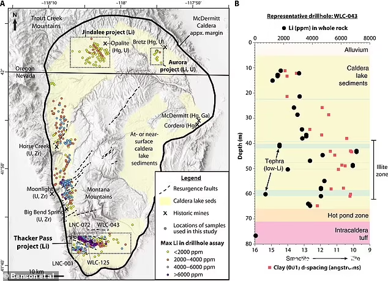
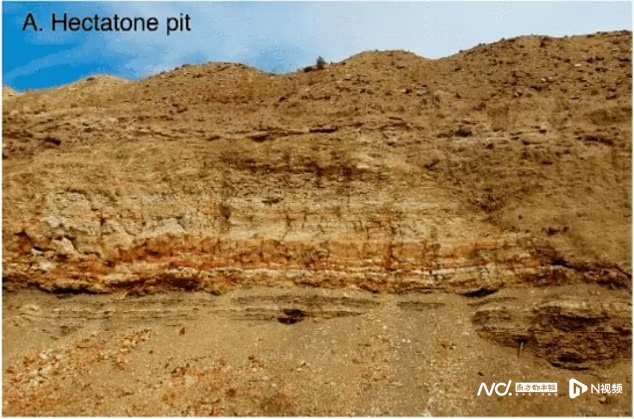

# 美国内华达州火山口发现世界最大锂矿，价值1.48万亿美元

据最新一期《科学进展》（Science
Advances）刊发的研究报告，地质学家在美国内华达州与俄勒冈州交界处的一座古老的超级火山中发现了他们认为可能是世界上最大的锂矿。在长达45公里的麦克德米特火山口发现了含有多达4000万吨贵金属的黏土。截至2022年，电池级碳酸锂的平均价格为每公吨3.7万美元，这意味着火山可能蕴藏着价值1.48万亿美元的贵金属。

在长达45公里的麦克德米特火山口发现了含有多达4000万吨贵金属的黏土。

据报道，在长达45公里的麦克德米特火山口（McDermitt Caldera）发现了含有多达4000万吨贵金属的黏土，几乎是在玻利维亚盐滩发现的黏土的两倍。

麦克德米特火山口据信形成于大约1900万年前，最后一次喷发是在1600万年前。地质学家认为，火山爆发将地下的矿物质推向地表，留下了富含锂的泥晶石黏土。

火山喷发还形成了断层和裂缝，为锂上升到火山口表面提供了途径。

最后一次喷发后，火山口内形成了一个湖，研究小组对沉积物进行了分析，发现湖中锂的浓度很高。

研究小组从麦克德里米特火山口手工挑选了黏土岩样本，发现它们的锂浓度也很高。

研究报告称，研究小组从麦克德里米特火山口手工挑选了黏土岩样本，发现它们的锂浓度也很高。

此前在位于附近的塔克帕斯（Thacker Pass）进行的钻探发现了1370万吨的碳酸锂当量，该矿床曾被称为美国最大的锂矿。

截至2022年，电池级碳酸锂的平均价格为每公吨3.7万美元，这意味着麦克德米特火山可能蕴藏着价值1.48万亿美元的贵金属。

锂是电池的重要组成部分，从智能手机到电动汽车和太阳能电池板，中国几十年来一直主导着市场，因为开采的金属有90%是在中国提炼的。

鲁汶工程大学的地质学家阿努克·博斯特（Anouk Borst）表示，从价格、供应安全和地缘政治的角度来看，麦克德米特火山的锂矿可能会改变全球锂的动态。

总部位于加拿大的美洲锂业公司计划最早于2026年开始开采，在未来40年内开采该地区，然后回填矿坑。

美国锂业公司和哥伦比亚大学的汤姆·本森（Tom Benson）表示，该项目的第一阶段目标是每年开采4万吨，年收入160万美元。

美国每年进口数以亿计的锂离子电池，而且数量还在不断增加。

根据联合国商品贸易数据库（UN Comtrade
Database）的数据，中国是去年美国进口电池最多的国家，贸易总额达93亿美元。韩国和日本也是热门来源国，2022年分别进口了价值13
亿美元和10亿美元的电池。

自2020年以来，锂离子电池的进口总值增长了近两倍，去年达到139亿美元。

数据显示，到2040年，全球需要约100万公吨锂才能满足需求，比2022年的全球总产量增加了八倍。

研究报告指出，要发展可持续的多样化供应链，以实现低碳能源和国家安全目标，就必须以最低的浪费（矿石剥离比低）开采最高品位的国内锂资源，从而最大限度地减少从地球上开采的材料数量。

火山沉积锂资源有可能满足这一要求，因为它们往往是浅层、高吨位矿床。

文/南都记者 陈林

**相关报道：**

[“世界最大锂矿”位于美国原住民“圣地”，开采计划遭遇反击 ](https://new.qq.com/rain/a/20230912A04S2I00)

