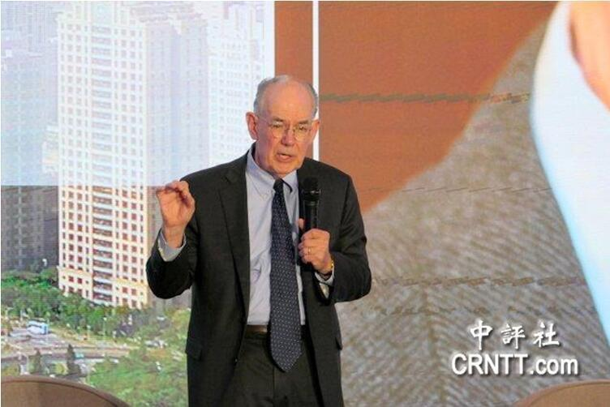

# 美知名学者在台警告：若台偏执地想要宣布“独立”，台海可能走向冲突

【环球网综合报道 记者
徐嘉莅】综合台湾“中时新闻网”、中评社12日报道，由台湾民间机构“东南亚影响力联盟”主办的“2023地缘政治高峰论坛”11日在台北香格里拉远东饭店举行，美国芝加哥大学政治学教授约翰•米尔斯海默在论坛中发言称，如果台湾偏执地想要宣布“独立”，台海就可能走向冲突。

_11日，美国芝加哥大学政治学教授约翰•米尔斯海默在“2023地缘政治高峰论坛”发言 图自中评社_

中评社报道提到，米尔斯海默称，很多时候战争的发生，是政治必要性大于军事考量，乌克兰战争能让台湾学到的教训就是，如果能避免谈“台独”，就能维持现在很不错的情况。但如果急着要宣布“独立”，就可能像当年日本偷袭珍珠港的事件后果，不会有人想再一次发生这些事。

“中时新闻网”称，米尔斯海默认为，从政治层面来说，可能促成中国大陆动武的情境，就是台湾宣布“独立”，这是中国无法接受的，许多美国政治领导人对此也有所知悉。

此外，美国哈佛大学国际关系学教授斯蒂芬•沃尔特也在论坛上发言，他声称两岸关系的和平符合美国利益，美国应该要警告台湾不要“独立”。“中时新闻网”报道称，沃尔特在论坛中发言称，许多人也认为美国不应该背离“一中政策”，美国应该要警告台湾不要“独立”，要避免冲突、增进对话。沃尔特还补充称，美国必须谨慎调整干涉台海的程度。

对于台湾问题，中国外交部发言人毛宁9月11日主持例行记者会时表示，台湾是中国人的台湾，台湾问题是中国内政，解决台湾问题是中国人自己的事情，要由中国人来决定，不容任何外部干涉。

