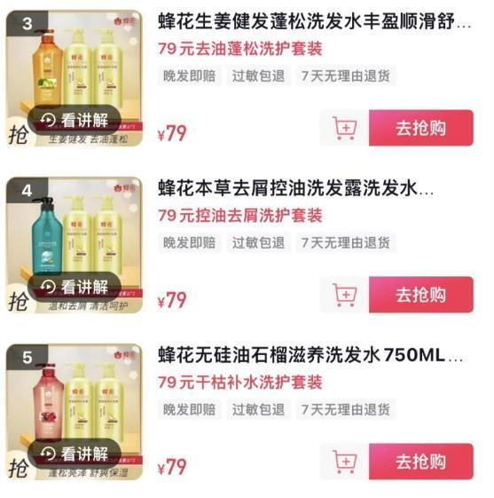
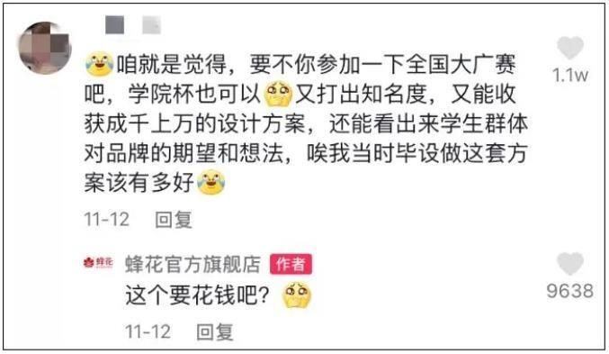
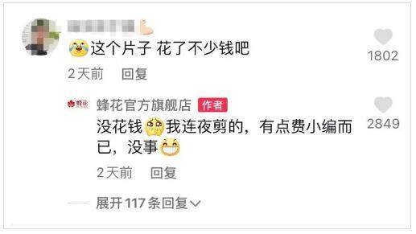
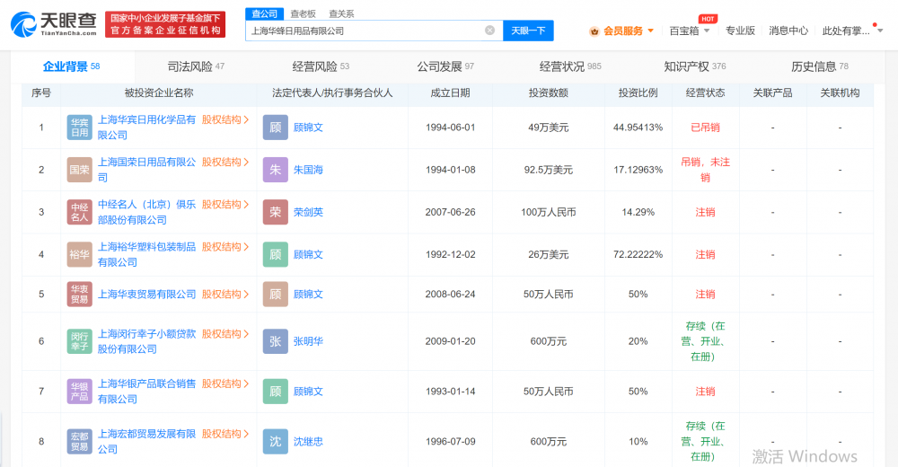
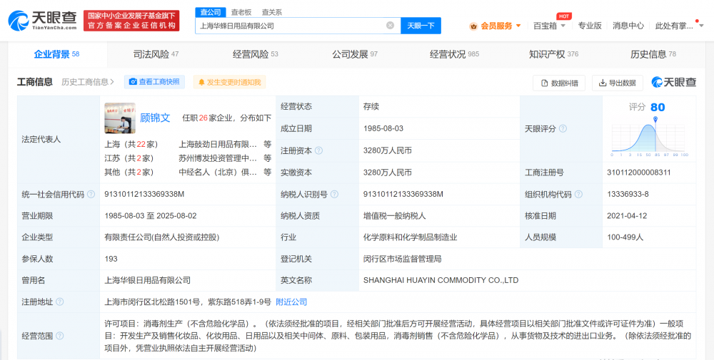
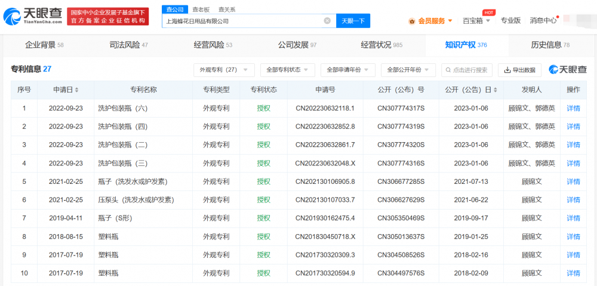
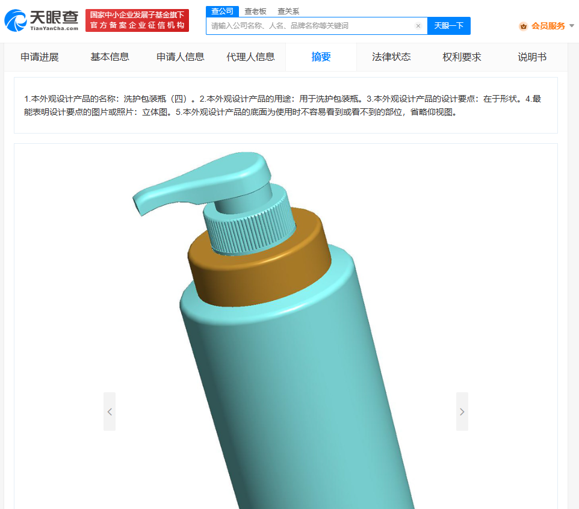
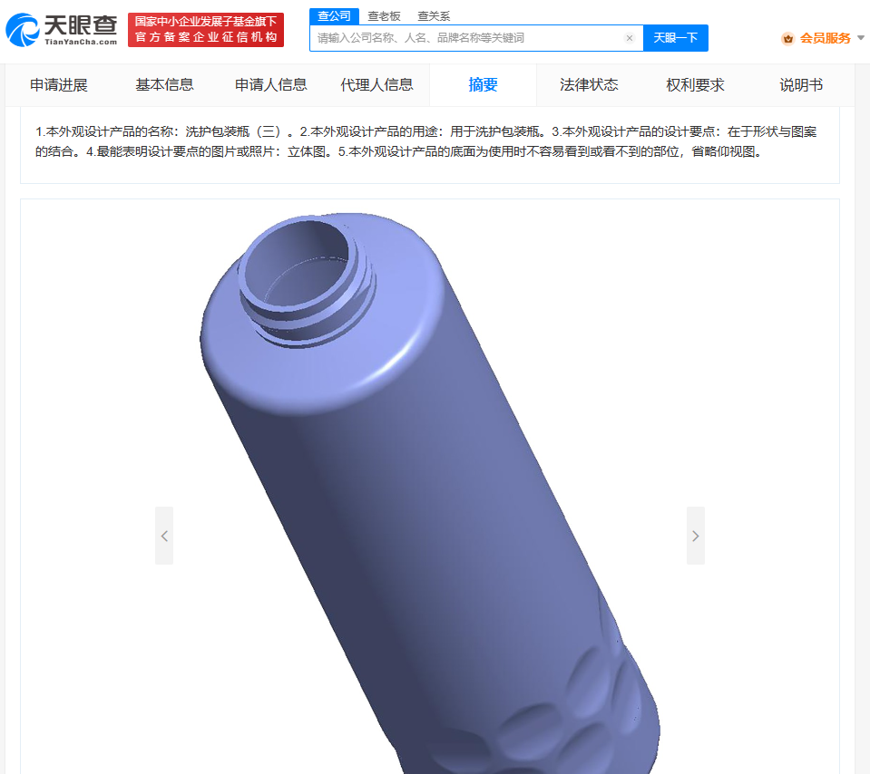
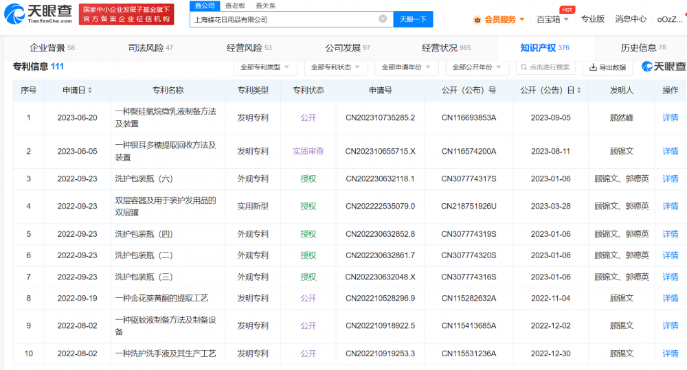

# 蜂花“捡箱子”发货引热议，仅20余条外观专利申请、多数洗护共用包装

中国经济周刊—经济网讯
近日，李佳琦与花西子相关话题引发热议。网友发现蜂花连夜上了三个79元的洗护套餐，足足五斤半的洗护品，网友称其为“朴实无华的商战”，相关话题也登上热搜第一。9月12日，蜂花公司有关人士回应媒体称，79元套餐是一直都在的。

此外，对网友传闻“蜂花到处捡箱子发货”，蜂花方面则回应称是因为去年箱子不够，现在已有自己的快递箱。“蜂花捡箱子”一梗也登上热搜。此前，蜂花曾因哭穷等多次登上热搜。

据《中国经济周刊》此前报道，蜂花曾“自我检讨”包装太土，在视频平台上发布了新包装却越改越土。网友担心不依靠产品设计和广告营销的蜂花会倒闭，于是帮其出各种主意。有网友提议：“要不参加全国大广赛吧。”而蜂花回复“这个要花钱吧”“我们本来就很廉价”让不少网友心疼。还有网友亲自操刀为蜂花设计新包装。

之后，蜂花又接受了网友的建议录制了“潮流”短视频做宣传。网友调侃视频画风梦回千禧年。有网友称：保持住，也是一种独特风格。也有网友调侃，这个片子花了不少钱吧？小编调皮的回应称，没花钱，自己连夜剪的。

天眼查App显示，蜂花关联公司上海蜂花日用品有限公司成立于1985年8月，法定代表人为顾锦文，注册资本3280万人民币，由顾锦文与顾然峰分别持股90%、10%。对外投资信息显示，该公司持股的8家企业中2家为存续状态，分别为上海闵行幸子小额贷款股份有限公司和上海宏都贸易发展有限公司。

蜂花关联公司还包括上海华蜂日用品有限公司、上海蜂花化妆品集团有限公司，两公司分别成立于2000年5月、2017年11月，注册资本分别为500万人民币、3000万人民币，前者由顾锦文和顾然峰分别持股95%、5%，后者由顾锦文100%持股。对外投资信息显示，两公司分别持股6家公司、2家公司。

知识产权信息显示，蜂花公司目前共有110余项专利申请信息，发明人多为创始人顾锦文，专利内容多与产品研发有关，如“一种含轻质油的无硅免洗护发素及其制备方法”专利用轻质油替代硅油，可使免洗护发素使用后清爽、舒适、无油腻感且使头发具有明显的光泽感；“一种含有当归提取物的中药养发生发液及其制备方法”专利则可用于治疗男性脂溢性脱发、斑秃、全秃等，安全无刺激。

另外，从专利类型来看，蜂花公司专利申请多为实用专利与发明专利，外观专利仅20余项。值得一提的是，这些外观专利申请多数起名“洗护包装瓶”“塑料瓶”“瓶子”，且多数是洗发水和护发素共用包装，专利申请中的图片也都无过多装饰，朴实无华。

值得注意的是，已成立38年的这家公司，目前无一条行政处罚信息。

新媒体编辑：崔晓萌

一审：崔晓萌 二审：何颖曦 三审：周琦

