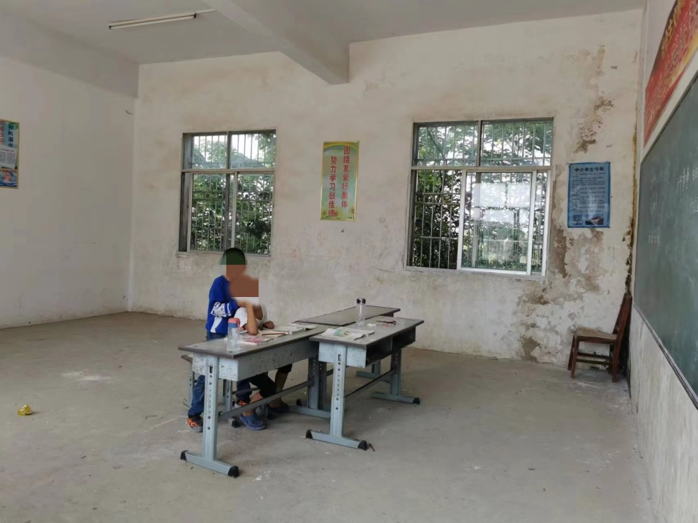
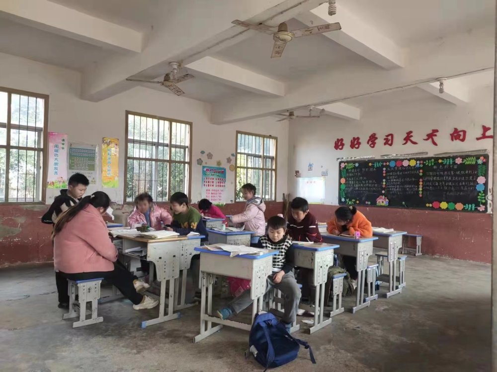
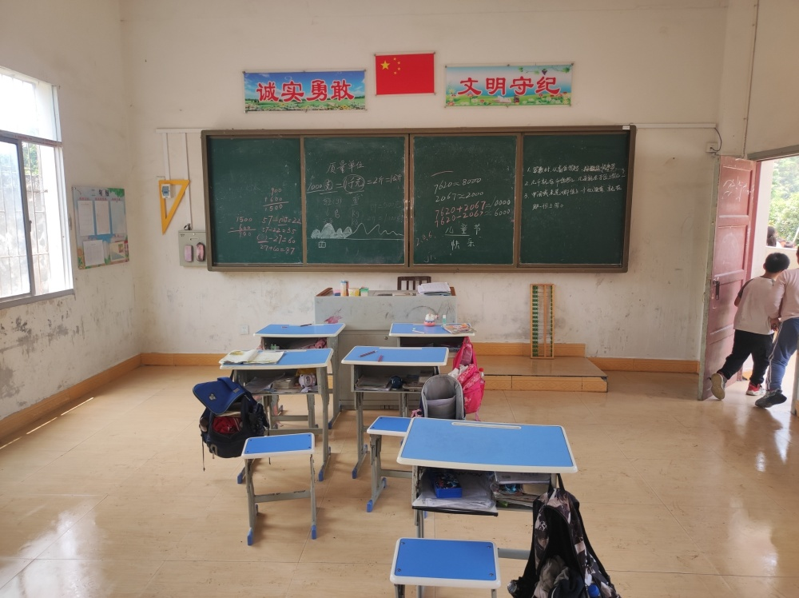

# 5个学生的“村小”，配了4个老师，中年女老师：感觉自己只是帮村民看孩子

核心要点：

  * _1_ 在我们调研的乡镇共有12所村小，8所学校学生人数在5人以下。这些仅有个位数学生的小规模学校，大部分学生或本身有身体/智力残障，或因父母残障/去世等原因家庭较为贫困，或因父母离异而由爷爷奶奶照看。
  * _2_ 她非常清晰地和我说了家庭情况：妈妈身体不好在家休养，爸爸疫情之后便未出去打工，每天在家钓鱼打麻将，两个哥哥都在县城职校读书，奶奶去世，爷爷在县城当保安。小女孩甚至平静地告诉我，其实她还有一个妹妹，但是家里养不起，送人了。
  * _3_ 在一些地方，由于项目申请及建设需要一定的时间，等项目审批成功后，一些小规模学校已经由于生源全部流失而不得不关闭，但专项资金下达后，地方政府不得不按照项目要求进行建设，这导致有一些地方小规模学校刚修缮好却已经没有了学生。
  * _4_ 政策不能阻止地方政府“经营县城”的冲动，2012年之后，城镇化速度加快，房地产市场火爆，地方政府通过以教育等公共服务资源向县城集中等措施来推动农民进城购房，在城区兴建大量优质公办与民办学校，许多县域教育城镇化步伐大大加快。

一、小规模学校的师与生

在河南G县，当乡镇干部开车载着我们到一所教学点时，教学点的校长已经将学校里里外外打扫的干干净净等着我们。在我们去调研的前一年，这所教学点原本坑坑洼洼的地全部硬化，两层八间的教学楼也翻新了一下，打扫起来方便了很多，也更加亮堂。然而，2021年，这个教学点只剩下五位学生，一年级2人，三年级3人，学生实际上只占用了一楼的两个房间，另外还有一个教师办公室，其他教室虽然也都配备了全套的多媒体教学设备，但都空着。在小学现有的五位学生中，有一位患有精神残障，两位学生是贫困户，另一位学生来自离异家庭，父母离婚后皆外出务工，极少回家。

学校虽然只有五位学生，但却配备了四位老师。我们去调研时，学校除了校长在之外，还有一位中年女老师在办公室在电脑上观看名师教学视频。也许是我们突然来访让她感到很紧张，和这位老师交流过程中她很少说话，我们问及一些关于学生情况的问题，老师也只是回答说她不知道，具体情况需要问校长。当我们问及她在这里的教学感受时，她只是淡淡说：没什么感受，时常感觉自己只是在帮村民看孩子。说这话的时候，老师的目光瞥向了扒在办公室门框上向里面张望的两位三年级学生。当我们继续问她自己的未来规划时，这位老师没有接话，只是继续看着电脑上的视频。

在G县，这个小规模教学点并非特例、孤例。据统计，2020年G县小规模学校（学生数在100人以下）共192所，学生共5606人，教师共1462人。平均每所小学不足30名学生。在我们调研的乡镇共有12所村小，其中仅有1所村小有114名学生，其余11所学校学生人数皆不足15人，8所学校学生人数在5人以下。与我所调研的那所小规模学校相似，这些仅有个位数学生的小规模学校，大部分学生或本身有身体/智力残障，或因父母残障/去世等原因家庭较为贫困，或因父母离异而由爷爷奶奶照看。从师生比来看，这些小规模学校师生比非常低。在G县，小规模学校占全县小学总数的69.3%，其教师占全县小学教师的34.8%。小规模学校1:3.83的师生比远超河南省1:19的标准。

从全国范围来看，据教育部官方统计数据显示，2022年全国小学教学点共有83万余所，学生300多万人，教师35万多人，平均每个教学点36位学生，4位老师，师生比约1：9。作为人口流出大省，河南省的形势显然更严峻一些。也无怪在和一位乡镇干部交流时，他调侃着问我硕博期间我的导师分别带几个学生，笑着说他们的许多小规模教学点老师比得上大学老师了，带的学生比硕博导师还要少。

与河南省同样在大力推进义务教育优质均衡的江西省，存在着相似的情况。在江西省Y市，当我们未经有关部门引荐前便往一所教学点A小学试图进行调研访谈时，正遇上学生在校园内追逐玩耍，上课铃声响起并没有让这群活泼的孩子立即涌入教室，一直到几分钟之后，老师到外面吆喝他们进教室，这些学生才陆陆续续进入教室。这所教学点一共有16名学生，1年级5名，2年级6名，3年级5名，一共有三位老师，两位有编制的老师都到了临近退休的年纪，一位1998年出生的代课老师教数学和语文。由于当天一位老师家中有事临时请假，一二年级只能在一个教室一起自习。访谈中校长同样告诉我们，在这里上学的学生绝大多数都是家庭条件不太好的学生，由爷爷奶奶在家照料。

学生自习期间，我们征得老师同意进入班级与三年级的学生交流，观察了解他们的学习状态，或许是把我们当成了老师，大部分学生都埋头认真写作业，但当我们凑近观察时，发现即使是语文作业，他们也只能靠翻开书本照着课文原文查找填写，一旦遇到非原文默写题目，他们就基本不会写了。之后在乡镇中心小学的调研证实了我们的观察：从教学点升入中心小学的学生，绝大多数成绩都比较差，特别是数学，很少有人能及格。不过，在与我们聊天时他们并不胆怯，当我问及一位女孩子的家庭情况是，她非常清晰地和我说了家庭情况：妈妈身体不好在家休养，爸爸疫情之后便未出去打工，每天在家钓鱼打麻将，两个哥哥都在县城职校读书，奶奶去世，爷爷在县城当保安。小女孩甚至平静地告诉我，其实她还有一个妹妹，但是家里养不起，送人了。

在另一所教学点B小学，我们访谈了2018年从A小学调过来的小学校长，B小学2018年共有学生130人，从学前班到五年级，每个年级20人左右，是乡镇第三大学校，但到了2021年，四年级及以上集中到中心小学后，该校仅剩19名学生，其中学前班8人、一年级3人、二年级2人，三年级6人。现在学校有5位老师，其中3名有编制，2名代课老师，另外学校还聘了一位食堂师傅。访谈中校长向我们直言，现在的村小无论是在编还是代课的年轻老师都一心想着怎么调走，想调走的原因无非有三个：第一，自己的孩子在县城上学，需要照料；第二，个人职业发展规划；第三，在村小解决不了个人婚恋大事。当然，乡村单调枯燥的生活也是让他们想要尽快调走的一个原因。

在地处西部山区的湘西S县，撤乡并镇后在原来的部分乡还保留中心校，这些学校人数一般在几百人不等，在这些中心校下面也保留着一些村小教学点，不过，相比于河南与江西等中部省份，在湘西村小教学点反而不多。在我们调研的S县某镇某乡中心校只下辖一所村小，从学前班至六年级共有56名学生，8位老师。在湘西山区，一些年轻人或未婚生育或早婚早育，生育之后许多年轻妈妈外出务工便不再回来，与家庭失去联系，有一些年轻男性在离婚后也常年外出务工很少回家，甚至很少与孩子联系。也很少给照看孙辈的爷爷奶奶抚养费，教学点的许多孩子都是这样的家庭情况。不过，在湘西山区教学点，有一点不同的是，教学点的老师大多是本乡本土人，中专或高中毕业后即返乡任教，做了很多年的代课老师，一直坚守在这里。

从上述对中西部三个省份小规模学校情况、师生状态的描摹我们可以看到，绝大部分小规模学校学生在不断减少，且大部分学生或个人精神/身体残障，或来自于特殊家庭/贫困家庭，父母教育缺失，这导致小规模教学点难以形成正常的教学秩序，学生同辈群体之间难以形成正常的交往与互动结构，教师特别是中青年教师面对这样的学生，再怎么富有情怀与热情也会被慢慢消磨光，也就遑论教学质量了。小规模学校成为了服务极少数农民家庭的、具有兜底性质与福利性质的“托育机构”。

不仅如此，小规模学校的教师尤其是年轻教师自身的教学能力也难以得到有效提升，教学积极性难以保持。并且，小规模学校的大量存在还造成了极其有限的乡村师资的错配。在许多县域，从师生比总体数据来看，乡校师资比较充足且各学科教师数量配置适当，但是，由于小规模学校占用了大量师资，导致乡镇中心校师资紧张且学科教师配置问题较大，有些科任教师被调到小规模教学点，导致乡镇中心校科任教师空缺。也就是说，小规模学校的存在一定程度上造成了乡村学校整体性的师资错配，进而导致乡村学校整体性的教学质量下滑，进一步加剧了乡校生源向县城流失，形成恶性循环。

在教师资源的不合理配置之外，财政资源的浪费也是一个严重问题，在这些小规模学校，国家投入了大量的财政资源对学校基础设施进行建设与修缮、对学校教学设备进行更新迭代。特别是在乡村振兴、资源下乡背景之下，大量的中央与地方财政资源投放到乡村教育领域。但是，往往在国家项目资源大量投入后，学生却不断流失，造成了财政资源的极大浪费。甚至在一些地方，由于项目申请及建设需要一定的时间，等项目审批成功后，一些小规模学校已经由于生源全部流失而不得不关闭，但专项资金下达后，地方政府不得不按照项目要求进行建设，这导致有一些地方小规模学校刚修缮好却已经没有了学生。

二、小规模学校为何难撤并？

为何已难以发挥正常教学功能、造成财政资源与教师资源大量浪费、形成底层集聚与底层再生产的小规模教学点难以得到有效撤并？

深入分析其缘由，可以发现其中涉及到多方主体观念与利益之间的张力乃至对立。在对此进行分析之前，首先需要厘清的一个事实是：

在未来较长的一段时间内，随着城镇化、少子化的发展，在全国特别是中西部许多县域，将会持续不断有大量乡村学校随着生源地减少而变成小规模学校。在生源持续减少的情况下，将会有越来越多的小规模学校像河南G县等地那样，学生数量减少至30人以下。并且，与乡镇中心学校不一样，小规模学校学生持续减少与教学质量下滑形成恶性循环，基本没有扭转的可能，这导致小规模学校很容易形成底层集聚与底层再生产，偏离了国家保留小规模学校的初衷。

因此，合理撤并难以形成正常教学秩序、造成财政资源与教师资源大量浪费的小规模学校势在必行。对小规模学校为何难以有序撤并的研究分析也就十分有必要。

**小规模学校之所以难以撤并，首先，是央（政策制订者）与地（政策实践者）之间存在的张力所致。**

2012年，为遏止地方政府大规模撤并学校的行为，国务院出台《国务院办公厅关于规范农村义务教育学校布局调整的意见》，要求科学制定农村义务教育学校布局规划，严格规范学校撤并程序和行为，要求撤并学校必须经过民主程序征得学生家长、学校师生、村民自治组织和乡镇人民政府的同意。撤并方案要逐级上报省级人民政府审批。中央出台严格的“撤点并校”限制政策意在扭转2000年以来在全国许多地方掀起的大规模乡村学校撤并浪潮，在政策的严格限制以及中央生均公用经费与相关政策的配套支持下，这一意见的出台确实遏制了地方盲目撤点并校之风。

**但是，这一政策却不能阻止地方政府“经营县城”的冲动，**
2012年之后，城镇化速度加快，房地产市场火爆，地方政府通过以教育等公共服务资源向县城集中等措施来推动农民进城购房，在城区兴建大量优质公办与民办学校，许多县域教育城镇化步伐大大加快，叠加上少子化、农村儿童随迁进入父母务工地城市就读等因素，导致没有撤并的村小和教学点人数越来越少，难以形成正常的教学秩序，但限于严格的撤并程序以及受惠于充足的中央教育财政经费支撑，地方政府不再有强烈的撤点并校冲动。

换句话说，地方政府的“工作重心”不再是通过撤点并校“推”着农民家庭子女到城镇就读，而是通过各种教育城镇化措施让有一定能力的农民家庭千方百计送子女进城读书。这导致政策制定的初衷在政策实践过程中并没有实现，小规模学校虽按政策规定保留下来，甚至投入了大量资源，但却没有实质上保障农民家庭的教育需求。

**其次，围绕中央的生均公用经费及相关政策措施形成了地方分利秩序。**

2012年出台的《意见》提出对学生规模不足100人的村小学和教学点按100人核定公用经费。2018年出台《国务院办公厅关于进一步调整优化结构提高教育经费使用效益的意见》继续坚持了这一政策，并强调确保经费落实到学校（教学点）。然而，在实践过程中，由于小规模学校一般在财务与人事方面都由乡镇中心校统管，在生均经费使用上也由中心校统筹。在经费拨付过程中具有一定的操作空间。

例如，江西省Y市B小学的校长告诉我们，国家给小学拨付的年生均公用经费为600元，按100人计算每年有6万元公用经费。B小学由中心小学统筹管理，每年获得经费在2.19万左右，其中包括生均经费40元，按100人计算，每年0.4万元，教师伙食补贴每年0.15万元，食堂师傅工资补贴每年0.2万元，学前班学费由B小学自主支配，每年0.96万元，学前班人数不足20人的，中心校另外按12人的名额补贴200元每人每学期，共计0.48万元（项目名称为薄弱学校补贴，校长认为，这部分资金中心校也进行了截留）。在B学校，食堂师傅工资0.5万元一年，学校电费、教师吃饭买菜、小型办公物品购置需要学校自主开支，2.19万元的经费仅能勉力维持学校运转，之前学校购置抽油烟机和餐桌，是校长自己找村里的老板赞助了1万元。

在围绕生均公用经费而形成的地方分利秩序之外，教师流动、职称晋升以及工资补贴也会形成隐性的分利秩序。

2012年出台的《意见》要求职称晋升和绩效工资分配向村小学和教学点专任教师倾斜，鼓励各地采取在绩效工资中设立岗位津贴等有效政策措施支持优秀教师到村小学和教学点工作。然而，在地方政府政策实践过程中，一些地方强制规定教师若想要职称晋升必须到乡村学校任教一定期限，但是，许多教师实际上并不会到小规模学校驻校任教，仅是在政策要求之下不得不在小规模学校挂点。由于小规模学校有各类专项补贴及岗位津贴，往往是一些在原单位不受领导欢迎的老教师被动员到小规模教学点任教，
**“权当是来乡下享受一下乡村生活了”。**
而年轻教师一旦被分配到小规模教学点，则会想方设法向城区学校或机关事业单位外调，小规模学校成为培养年轻教师的“跑马场”。此外，在一些地方，小规模教学点教师轻松的教学任务与岗位津贴以及各类专项补贴也使之成为安置一些临近退休乡村老教师的腾挪空间。

**第三，少部分村民与村干部的心态影响了小规模学校撤并。**

在小规模学校，部分儿童存在精神/智力残障问题，家长无论从心态上还是经济支出考虑上都不愿意把孩子送到特殊教育学校，更愿意让小孩就近获得免费的“托管服务”。对于一些由祖辈隔代照料、父母事实上没有承担照料责任的农民家庭而言，一方面，祖辈一般较为贫困，无力负担乡镇或县城就读教育相关支出，而在小规模学校就读，基本不需要教育与生活开支；另一方面，祖辈更多的只是承担照料责任，在教育方面不太重视。

而一些较为贫困的农民家庭，一般存在两种情况，一类是家庭主要劳动力生病、去世或有精神/智力残障，这类家庭亦无力照顾以及负担子女在县城或乡镇读书；另一类是村庄“懒汉”，不愿意务工，也不重视子女教育，甚至不愿意承担养育责任。这些家庭往往反对小规模学校的撤并。对于一些村干部而言，他们则不想成为“末代皇帝”，害怕受到群众议论指责，不愿意辖区内小规模学校在自己任职期间被撤并。

**最后但非常重要的一点是，一些学者与教育政策制订者“理念先行”，误导了政策的制定与实施。**

在他们的理念设想中，乡村小规模学校承载了“乡土文化”，是乡土教育、人文教育、自然教育最为理想的载体，在乡村小规模学校能够实现最本真的教育，能够让儿童得到最整全的成长。当然，也能让儿童在乡土熟人社会、亲属网络、家庭与同辈群体的包裹中获得健康成长，同时还能降低农民家庭的教育负担，避免乡城迁移与寄宿生活对儿童造成的戕害。

2017年，马云在一场对媒体开放的午餐会分享了其团队在全国各地采集的乡村孩子上学的照片，其中也包括网上广为流传的那张“冰花男孩”。马云认为，“这些孩子根本就不应该（读）走读制（学校），”“中国必须大力推动寄宿制（学校）。”“从我的经验来讲，100人以下的学校是办不好的。学校人数过少，一方面不能吸引优秀师资，另一方面学生也不能接受良好教学。”马云呼吁，学生规模在100人以内的乡村学校“原则上都应该裁撤合并”。（王筱，2018）

马云的观点引发了众多争议，其中，表示明确反对的便有一众所谓的“教育研究者”，反对者对马云所提的寄宿制学校与校车接送制度的成本及效果不置可否，认为寄宿不符合儿童身心发展规律，学校与老师代替不了家庭与父母，或许，在这些学者眼中更重要的还是，乡村小规模学校的撤并意味着乡土文化的断裂，不利于实施生活化、乡土化、社区化的教育。甚至有学者认为，“如果再撤校，家长都进城了，谁来种地？国家提出的乡村振兴战略怎么实现？”（转引自王筱，2018）

然而，这些学者与政策制订者却无视城镇化快速发展的经验事实，随着少子化与城镇化的快速发展，大量农村小规模学校人数将降至几十人以下将是不可避免的事实，更重要的是，这些农村小规模学校造成了底层集聚这一严重问题。

教育承担的两个重要的基础功能是培育现代公民以及促进社会流动，然而，当小规模学校形成底层集聚，学校难以形成正常的教学结构与秩序，这些底层家庭也难以承担养育与教育责任时，这两个基础功能都很难实现，遑论所谓的人文教育、自然教育了。“文章合为时而著”，这些秉持着美好教育理念的学者长期脱离经验之后，无视社会变迁对于乡村小规模学校生源结构的冲击，无视大量小规模学校学生的实际学习情况、农民家庭的底层集聚、乡村师资的不合理配置、教育财政资源的低效利用等问题，为自己的美好理念与底层农民家庭鼓与呼，影响了教育政策的制定，最终却对这些底层农民家庭子女的成长发展产生了负面影响。

三、如何有序撤并小规模学校？

研究者与政策制订者必须直面“惨淡的现实”：

首先，随着少子化与城镇化的发展，农村新生儿童的减少是一个不可逆的趋势，即使中央政府再出台相关政策严格限制地方政府“经营县城”特别是以教育撬动城镇化的行为，也难以从根本上逆转这个趋势。

其次，随着经济社会的发展，社会流动速率的放缓，教育成为农民家庭实现社会流动的核心乃至唯一渠道，农民家庭也就不可避免地被卷入到教育竞争之中，将子女送往教育质量更好的乡镇中心校、县城或城市学校，这使得教学质量处于低位的小规模学校形成“底层集聚”的教育结构难以避免，底层集聚使得小规模学校难以形成正常的教育秩序，巧妇难为无米之炊，无论中央与地方如何加大财政资源的投入以及教师资源的倾斜投放，都难以扭转这一趋势。

因此，小规模学校的有序撤并势在必行。保留具有一定规模的乡村学校，动态有序撤并学生数量下降到一定数值以下的小规模学校，将有限的财政资源向乡镇学校倾斜投入，振兴乡校，应是县域义务教育布局的合理道路。反过来讲，振兴乡校也是保证小规模学校有序撤并的可行方式：振兴镇域教育有助于相对集中配置教育资源，避免教育财政资源的无效或低效利用。并且，生源的相对集中有助于师资的相对集中与高效利用，从而有利于形成完整的乡村教育结构与正常的教育生态，为提升乡校教育质量奠定生源与师资基础。并将节约下来的教育财政资源用于完善中大规模学校的寄宿制度建设、完善校车接送制度、增强贫困生专项扶持支持乡镇就学以及设置特殊儿童保障制度。特别是在中西部一些地势相对平缓的县域，随着近年来道路等基础设施的建设完善，校车接送方便快捷。其次，振兴镇域教育有助于抑制激进教育城镇化，减轻农民家庭教育成本与教育风险，避免农民家庭仅仅只有村-
城两个选择，也避免农民家庭子女的底层集聚问题。

至于一些学者与政策制订者担忧的寄宿生活对儿童的负面影响、儿童成长与乡土社会脱钩等问题，解决这些问题的关键点不在于保留小规模学校，而在于确立乡校的主体性、明确其目标定位，建设低成本、高质量的乡镇教育体系。

在调研中，一些农村家长和我们说，去县城或乡镇中心学校读书都要租房陪读，乡镇中心学校教育质量那么差，那还不如直接去县城陪读。反过来讲，如果乡镇中心学校能够提升教育质量，在乡镇陪读租房成本与生活成本实际上远低于县城，特别是隔代陪读，祖辈可以边陪读边从事农业生产。并且，如果乡镇中心学校教育质量提升且寄宿与校车接送制度较为完善，乡镇仍是一个相对封闭的半熟人社会，农村儿童可以在具有公共性的半熟人社会体系展开同辈群体交往，在相对封闭的公共空间中获得保护与支持，避免进入县城后教育的去社区化、去公共化以及在班级中的结构性边缘位置，也避免在小规模学校中的底层集聚问题。

总之，一方面，小规模学校承载不了基础的教育功能以及“理想”中的教育目标，反而造成了农村弱势家庭子女底层再生产的命运，这与国家保留并大力支持小规模学校的目标背道而驰。另一方面，振兴乡校能够解决小规模学校存在的问题，以及，通过各种保障性政策措施的推行，可以解决“想象中的问题”，即所谓的寄宿生活对农村儿童身心造成的戕害、造成了他们与乡土文化的断裂、造成了农民家庭教育负担的增大。更为核心的是，相比于小规模学校，乡校可以提供提成本、高质量的教育体系，阻断农民家庭的底层再生产命运。

因此，要回答“小规模学校怎么有序撤并”这一问题，首先要明确振兴乡镇中心校的发展思路，在这一政策思路之下，放宽对于小规模学校有序撤并的程序性要求。在实践过程中探索具体的入学保障政策，降低底层农民家庭的教育负担，获得这些农民家庭对于撤并小规模学校的支持。完善乡校教育体系，建立多元学生评价体系，促进乡校儿童健康的社会化成长。
**（文中图片由作者提供）**

