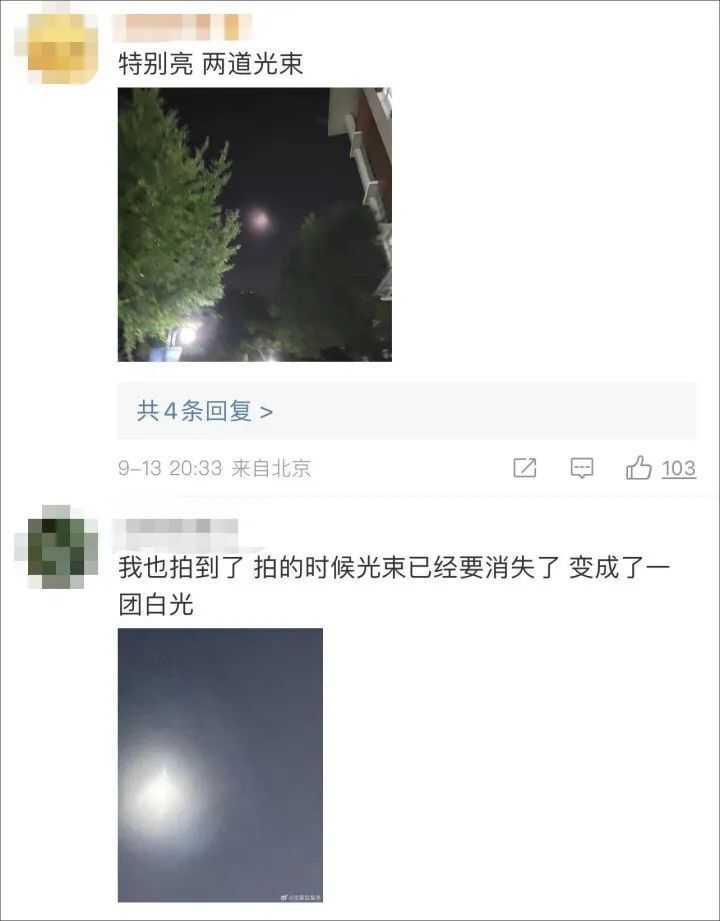
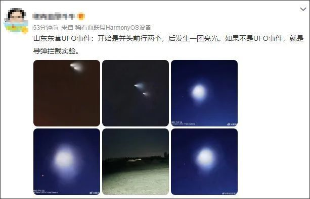

# “UFO”冲上热搜第一！多地网友称看到“不明飞行物”，拍下视频和照片

今晚， **“UFO”** 冲上微博热搜第一。

微博网友“小禧遇”发视频称： **“有谁知道曹县往西北方向天空上两道光是什么吗？UFO？录视频的时候光柱消失了，就剩下这些烟雾。”**

视频/网友“小禧遇”

不少网友在评论区说 **也看到了同款不明飞行物，坐标涉及北京、江苏、山东、天津等多地，并晒出照片。**

这个不明飞行物到底是什么？引发网友热议。发微博的网友说：“两条火焰和火箭助推器一样。”

有网友猜测： **“会不会是导弹拦截实验？”**

有网友分析：“ **火箭夜光云**
，从山东到宁夏的广大北方地区都有发现。这是发射了什么能飞行到平流层或更高的航空航天器，而高空还没完全天黑尚有余光，就照亮了燃料燃烧后冷凝的尾迹云。也由于它高度较高，因而能被很广阔的地区发现。”

还有网友猜测： **“会不会是天舟五号？”**

据中国载人航天工程办公室消息，北京时间2023年9月11日16时46分，已完成全部既定任务的天舟五号货运飞船，顺利撤离空间站组合体，转入独立飞行，
**将按计划于9月12日受控再入大气层，货运飞船绝大部分器件将在再入大气层过程中烧蚀销毁，少量残骸将落入南太平洋预定安全海域。**

今晚，你看见这个不明飞行物了吗？你觉得它是什么？

橙柿互动·都市快报记者 罗祎

