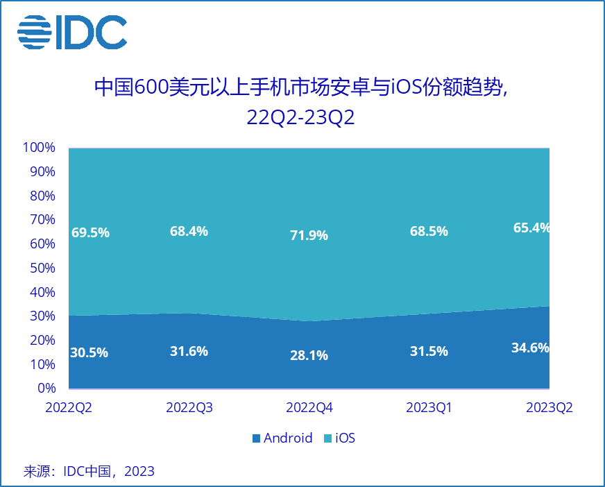

# 一线｜华为回归，机构调低iPhone15出货量，苹果的高端市场正在失守

**腾讯新闻《一线》 作者 风清扬**

9月12日、13日华为、苹果的两场发布会，可以看作是中国高端手机市场变局的一个分水岭。

北京时间9月13日凌晨1点，苹果在美国总部举办了新品发布会，被质疑能有多少新意的iPhone 15系列终于亮相。

之前，特斯拉CEO马斯克曾吐槽苹果换代缺乏新意，说“不确定自己现在使用的iPhone与以前的版本之间有什么区别”。

对于iPhone 15手机，国际数据公司IDC中国高级分析师郭天翔分析道：新一代iPhone
15系列在外观和硬件配置上进行了近几年最大幅度的升级。第一次配备潜望式镜头，第一次采用Type-
C接口，第一次使用3nm制程的手机芯片，第一次搭配钛合金边框……虽然有着诸多“第一次”的提升，但随着安卓厂商在旗舰产品上的投入不断加大，iPhone
15系列无疑将面临更大挑战，极有可能改变过去几年苹果在中国高端手机市场（单价600美元以上，不含税基准）一骑绝尘的局面。

瑞银证券最新的报告也指出，由于面临华为新机等风险，将苹果iPhone15系列新机出货量由8000-9000万支下调至7800万支。

苹果在中国市场面临最大的竞争对手和变量就是华为。

9月12日，曾被定为华为mate60的发布日期，但是“手机发布会”并没有如期举行。当日的发布会变成了“汽车发布会”—— AITO问界新M7上市。

可能的原因是，mate60已经没有必要再举行一场发布会了。发布会是仪式上的广而告之。

8月29日中午，华为商城在毫无征兆的情况下，突然上线Mate 60 Pro，搭载麒麟芯片9000s，所引发的震动已经像给市场投了一枚炸弹。

Mate60的发布之所以冲击力如此之强，它不但意味着华为从没有放弃过智能手机高端市场，还被上升到，对中国自主研发芯片国际封锁的突围。

没有华为Mate60之前，有机构对iPhone15销量的预期是1亿支。华为Mate60面世之后，机构对iPhone销量预期变成了7800万支。预期苹果未来要丢掉22%的市场份额。由此，苹果未来的估值恐怕也会大受影响。

9月10日，华为Mate 60 Pro和华为Mate
60再次开启全款销售，几秒钟即告售罄。无论从品牌影响力、用户口碑、产品性能上，都能看到华为在高端手机市场上的竞争力。

IDC中国高级分析师郭天翔认为，芯片的升级、静音拨片的改变以及新的配色等其它升级，使得今年的iPhone 15系列显然比去年的iPhone
14系列更具吸引力。

但由于过去几年国内安卓厂商依然坚持高端化发展方向，不断加大研发投入，加强与供应链的深度合作，推出更多定制化和差异化的解决方案，持续提升产品竞争力。因此，苹果在中国高端手机市场上的份额呈现不断收窄的趋势。

以下的图示可以看到目前高端手机市场的份额现状：

定价是消费者最为敏感的一环。

关于定价策略，上一代iPhone 14系列是大存储容量版本，售价相比上一代有所提升。由于消费者对于大存储需求的提升，以及iPhone 14 Pro&Pro
Max更受消费者青睐，苹果的产品均价从去年第四季度明显提升，超过1,000美元，环比增长12.0%。但是由于整体中国手机市场的低迷和消费者需求的疲软，使得苹果也不得不从2023年3月开始进行降价促销，至今年第二季度整体均价已回落至971美元，环比下降11.4%。

今年iPhone 15
系列的人民币定价依然坚持这个策略，预计新品上市初期受产能影响，供货将有不足，所以市场价格难有任何优惠。在中国整体经济大环境尚未明显改善，消费者在消费电子类产品购买预算依然紧缩的情况下，更高的产品价格可能会影响消费者的选择倾向。如果未来新品销售情况低于预期，苹果很有可能仍会采取降价促销的方式来吸引消费者。

郭天翔认为，虽然近年来苹果手机的升级变化并不明显，而国内安卓厂商依靠持续的技术创新与品牌形象建设在中国高端手机市场获得了一定的进展，但苹果依然具有较为明显的优势。未来，随着华为的回归以及其它国内安卓厂商努力建立属于自己的高端产品节奏和高端品牌形象，苹果在中国高端手机市场将会遭遇更大的挑战。

**附：iPhone 15系列变化的小贴士（来源：IDC中国）**

**本次iPhone 15系列主要在以下几方面做出了升级：**

**外观：全系搭配“灵动岛”设计。** iPhone
15&Plus也采用“灵动岛”设计，刘海屏成为历史。对于大部分消费者而言，手机外形或外观的改变更容易引起他们的注意，激发换机欲望。去年iPhone
14的销售情况低于预期，很大一部分原因在于外观无任何改变，导致直观上感觉不到手机的更换。所以今年iPhone
15全系搭配“灵动岛”设计和全新配色，且iPhone 15 Pro&Pro
Max使用钛合金中框和极窄屏幕边框，整机重量减轻，直接从外观上增加对于消费者的吸引力。

**影像：像素提升和潜望镜头的使用。** iPhone 15&Plus 升级到4,800万像素摄像头，且iPhone 15 Pro
Max独占潜望式长焦镜头。安卓旗舰手机的摄像头像素大多在5,000万以上，而潜望镜头更是在4、5年前就开始使用，今年已经下放到中端产品线。虽然只是追平或补齐与安卓手机在影像硬件上的差距，但凭借软硬件协同以及算法调校上的优势，今年苹果在影像上的提升仍令人期待。

**全面切换Type-C接口。** iPhone 15&Plus 为USB 2接口，传输速度较慢，iPhone 15 Pro&Pro Max的USB
3传输速度最快可达USB 2的20倍。接口的统一和数据传输速度的明显提升，将有效拓展iPhone的生产力场景，更便于与iPad
Pro和MacBook等其它设备互传数据，视频影像的输出也会更便利。

