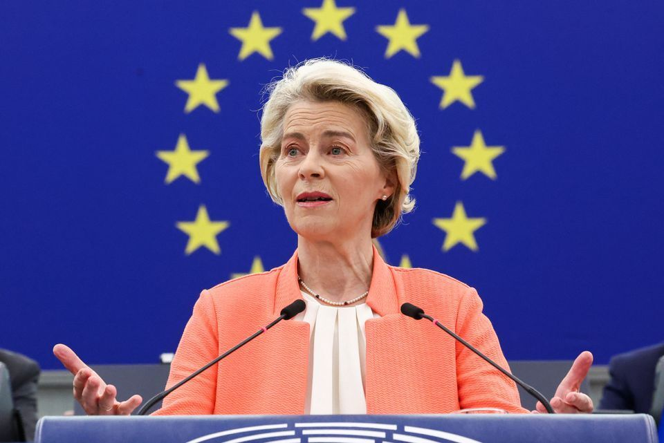

# 不顾德国等国反对，冯德莱恩仍执意宣布对中国电动汽车启动反补贴调查

【文/观察者网
熊超然】近段时间以来，中国汽车行业的崛起，在欧洲等市场刮起一股旋风。在欧盟内部，法国政府不断撺掇欧盟对中国电动汽车挥动“贸易大棒”，而以传统汽车强国德国为首的许多国家，则极力反对任何这样的惩罚性举措，认为任何贸易战都会带来巨大损失。

在此多方激辩的背景下，当地时间9月13日，欧盟委员会主席冯德莱恩在向欧洲议会发表年度“盟情咨文”时，仍旧宣布欧盟委员会将对中国电动汽车启动反补贴调查（anti-
subsidy investigation），声称以此保护自身免受受益于国家补贴的中国电动车生产商的影响。

据路透社、“政客新闻网”欧洲版报道，冯德莱恩当天这样宣称：“全球市场现在充斥着便宜的中国电动汽车，由于国家的巨额补贴，它们的价格被人为地压低了，这正在扭曲我们的市场。”

“因此，我今天可以宣布，欧盟委员会将对来自中国的电动汽车展开反补贴调查。欧洲对竞争持开放态度，而不是为了逐底竞争。”同时，冯德莱恩还强调了电动汽车对欧盟雄心勃勃的环境目标的重要性。

 _欧盟委员会主席冯德莱恩当地时间9月13日发表欧盟年度“盟情咨文” 图自路透社_

“政客新闻网”欧洲版指出，这类调查可能为欧洲对中国汽车征收额外关税铺平道路，欧洲认为中国汽车以不公平的低价销售，打压了欧洲竞争对手。更广泛地说，这标志着欧洲在去全球化时代，从全球最大的自由贸易集团转向建立贸易壁垒的又一步。

报道提到，中欧经贸高层对话暂定于9月25日在北京举行，此次反补贴调查很可能成为这一对话活动的首要议题。此外，今年晚些时候，中欧双方还将举行双边峰会。

冯德莱恩在演讲中声称，尽管欧洲需要保护自己免受所谓“不公平贸易行为”的侵害，但与中国保持对话同样至关重要。“降低风险，而不是脱钩——这将是我对中国的态度。”她这样声称道。

报道认为，冯德莱恩宣布启动的反补贴调查，也有回应法国方面对于中国电动汽车进口激增而想要实施反击的想法。此前数月，法国政府及其工业界代表连同欧盟委员会一直在施压，要求对中国电动汽车制造商展开调查。

事实上，在中国新能源汽车加速驶向全球之际，欧盟成员国之间对于是否向中国电动汽车行业发动“贸易战”已经产生了分歧。

根据此前报道，法国向欧盟委员会主席冯德莱恩施压，要求其在年度“盟情咨文”中宣布针对中国电动汽车启动反倾销调查。法国方面声称，冯德莱恩如果能在“盟情咨文”中提一嘴反倾销调查，可能会为推动这一进程带来新的动力。

_蔚来汽车在安徽合肥的装配线 图自《纽约时报》_

然而，这一提议遭到了欧洲最大汽车制造国德国以及欧盟行业官员的反对，欧盟多数成员国也表现出担忧，他们质疑此举会作茧自缚，伤及欧洲汽车产业，并害怕招致中国的对等反击。

三名欧盟贸易外交官员表示，他们非常怀疑反倾销调查成功实施的可能性，其中一人直言，“这根本不可能成功”。“法国无事生非，”一位汽车行业官员表示，“这只是一种姿态，因为没人愿意和中国打一场针锋相对的贸易战，这将导致大众汽车破产。”

此外，在本月慕尼黑车展期间，汽车企业高管和政界人士明确表示，任何关税升级都将适得其反。美国和欧洲的汽车制造商都有大型工厂设在中国，从中国出口的电动汽车中也有很大一部分是西方品牌。

除了德国明确反对，欧盟多数成员国也担心反倾销调查会引发与中国的全面贸易冲突。欧盟内部目前试图在减少对华依赖的同时，继续与中国方面进行贸易往来。

欧洲汽车制造商协会（ACEA）负责人西格丽德·德弗里斯呼吁对中国电动汽车的所谓“威胁”采取一种“更平衡的方式”，多关注“强有力的产业战略”，以支持欧洲汽车制造商。

_比亚迪等中国车企在慕尼黑车展亮相 图自《纽约时报》_

当地时间9月5日，世界最大规模的车展之一——本年度慕尼黑车展拉开帷幕，中国参展商占据了半壁河山，让欧洲业界人士重新审视中国电池技术的飞速发展。

综合英国路透社、美国《纽约时报》和德媒报道，相较于雄心勃勃、“抢尽风头”的中国车企，德国等欧洲车企意识到危机感：在他们致力于在中国市场“收复失地”时，中国车企已发起对欧洲市场的攻势。法国《世界报》则刊文称，“只需几年时间，中国车企就能成为全球汽车业的领头羊”。

德媒此前介绍称，此次前来慕尼黑参展的厂家中，有41%来自中国。现场图片显示，在9月4日媒体开放日上，比亚迪、小鹏汽车、零跑汽车等中国汽车展台周围围满了参观者。

车展期间，大众、雷诺、宝马等车企负责人纷纷直言，在电动汽车领域，“中国已经领先我们一代人”，欧洲必须在制造成本、生态系统等各个方面努力追赶，并与之合作。

当地时间9月6日，《纽约时报》也以“中国的汽车正席卷全球”（China Is Flooding the World With
Cars）为题，关注当前全球汽车市场以及销售情况。在报道中，《纽约时报》援引数据指出，中国汽车行业的出口在短短三年内翻了两番，今年更是超越了日本，成为全球第一。今年到7月份为止，中国的汽车出口激增了86%。

本文系观察者网独家稿件，未经授权，不得转载。

