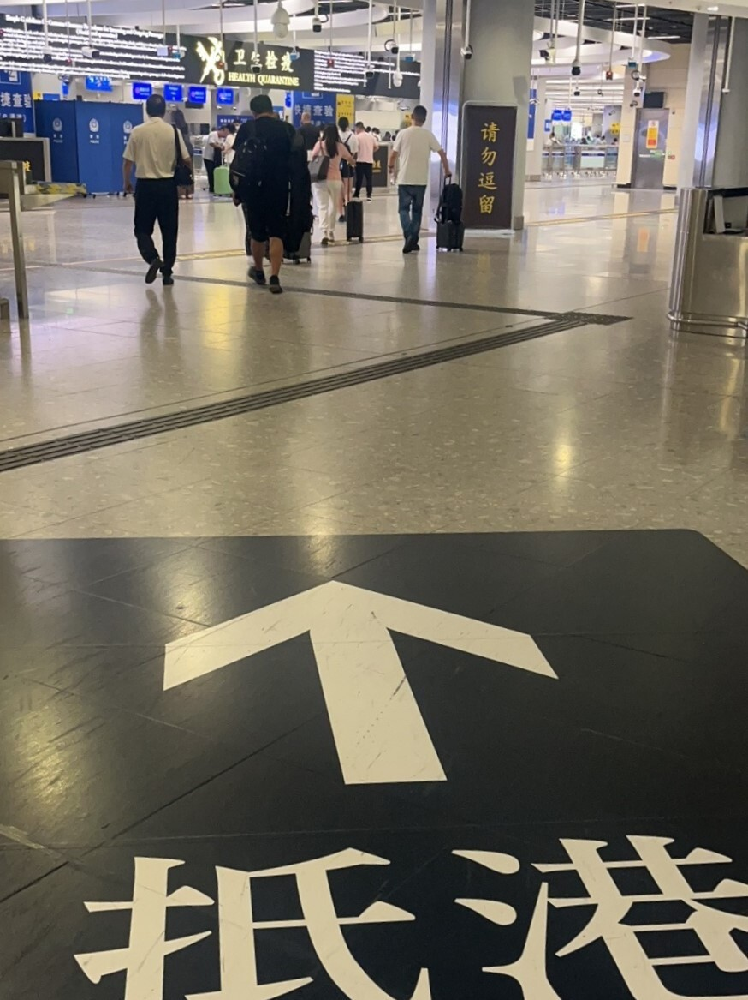
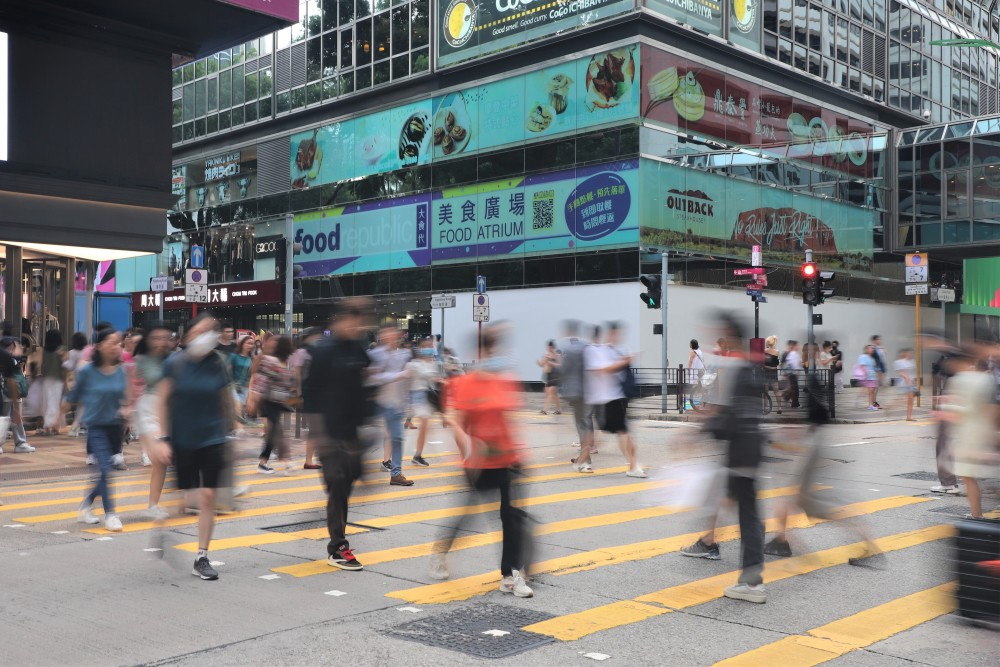
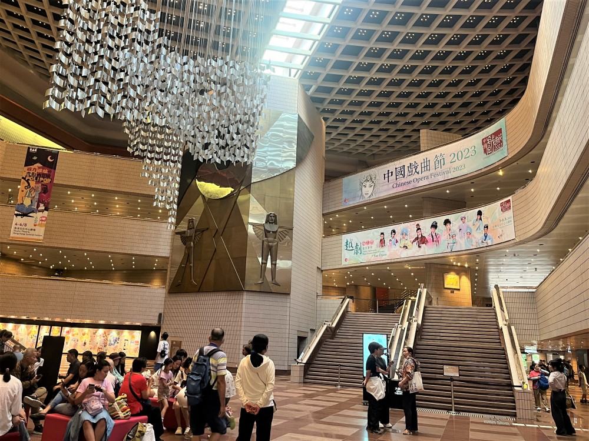
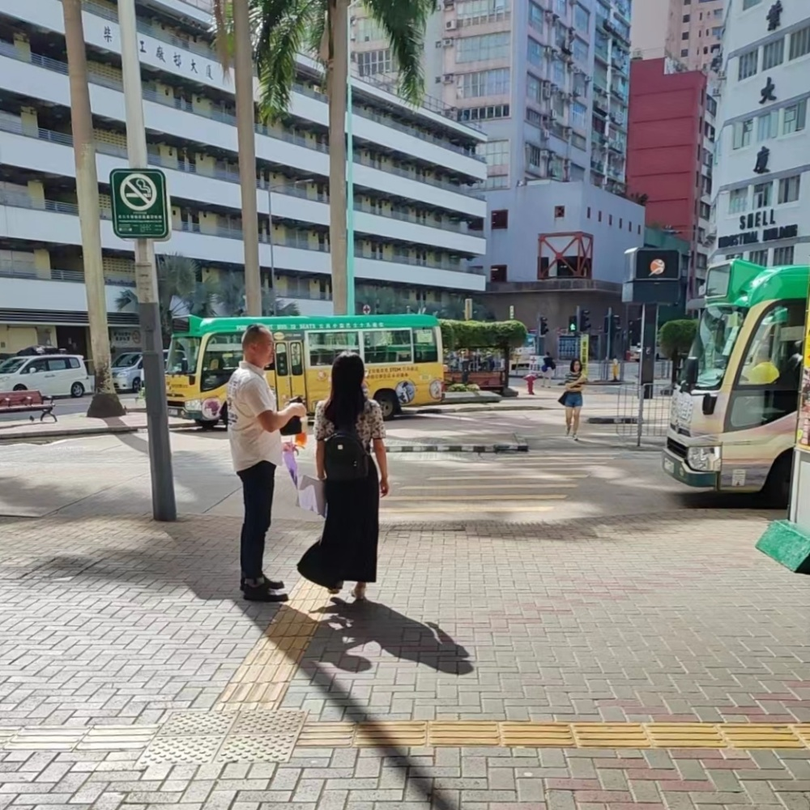

# 内地劳动力涌入香港AB面：中产人才寻找鸡娃新出路，劳工要赚疫后第一桶金

界面新闻记者 | 张熹珑

界面新闻编辑 | 林腾

在香港定居三个月后，Adam已经深谙这座城市的“法则”：茶餐厅用“走”“飞”作为点餐暗语，在展不开拳脚的狭窄租屋里用晾衣杆弥补没有阳台的缺陷；工作上，人们更习惯用邮件来往，而非社交平台私聊，哪怕跟对方很熟络。

“香港是一个基于规则运作的社会。”这种逻辑还体现在加班需要经过审批。Adam形容自己是个“不会说体面话、不会搞关系”的人，新环境则让他如鱼得水。

Adam是内地居民移居香港的缩影之一。中环、湾仔、尖沙咀、铜锣湾，每一个响当当的名字都勾勒出国际大都市的轮廓。这里再现的人流如织，不仅有个人游客、商务客，还有试图来发展的求职者、带娃港漂和低技术劳工。

8月15日，香港政府统计处发布2023年年中人口临时数字为749.81万人，一扭过去三年的人口跌势，按年增加15.2万人，升幅为2.1%。港府发言人指出，除了返回的香港居民，亦有一些内地及海外人士透过各项计划移入香港，使上半年录得大量居民净移入。

“东方之珠”依然有着巨大的吸引力——不管是被90后钟情的“加班要打申请”职场文化，还是80后向往的国际化教育环境，亦或是70后看重的高薪水。

“移民城市”从不缺移民。但更明显的变化在于，香港对内地人才的需求达到了历史巅峰。从各类人才计划，到外劳输入方案，香港从未如此迫切需要新活力的注入。在尖沙咀广东道，时常可以看到有人举着牌子，写着“身份规划”、“移民”。

来自不同行业、不同阶层的人们，用各自的方式丈量香港。每个涌向香港的内地移民，也为这座城市的鸿篇乐章贡献了起承转合。

**拿到高才通只是一个开始**

刚刚过去的5月，黎舞“喜提”人生中的第一个母亲节。陪娃午睡的间隙，她在百度搜索框输入“香港国际学校”。她的电脑里，excel表格已经把香港各国际学校做了个排名，家长口碑和IB成绩、年级设置、是否包括幼儿园、学费和申请截止时间等信息应有尽有。这是她浏览了各社交平台、学校官网，还问了好几家中介后得出的成果。

母亲节前的1个月，黎舞收到了高才通获批的邮件，她是B类申请者。她戏称，“孩子还没学会讲话，妈妈就开始考虑在哪读书了。”申请高才通的最主要原因，是打算带孩子去香港读书。

黎舞身处深圳，其学位紧张程度在一二线城市中位于前列。数据显示，2022年深圳公办普高录取率达53%——只有约一半的学生有机会进入公办普高。她曾计划将孩子送去国际学校，但比较后发现香港国际学校费用甚至更便宜。恰逢高才通政策出台，对比下来，“孩子去香港读七年还能拿到香港身份。”

截至7月底，“高才通”计划已接获超过4万宗申请，批出超过3万宗申请。相当一部分申请者是为了“鸡娃”。相比大多数将高才通作为加强版通行证的申请者，以黎舞为代表的母亲们决心非常坚定。

来自武汉的方萍也在3月底申请了高才通，在6月通过。迈入2023年，方萍已经34岁了，但她仍选择“裸辞”。教育问题同样是趋势她申请高才通的关键。

_时隔十几年后，方萍再次来到香港 图片来源：受访者供图_

方萍的儿子正上四年级。她明显感觉到，自从进入三年级后，孩子便进入了“不得不卷”的状况，伴随家庭作业和各种考试，“小孩子的活力好像一点点埋没在里面。”

“所以在孩子的教育上，我在寻求转向。”虽然自己毕业于985院校，但方萍形容为只是“凭借一点点天赋和自觉”：“放到现在，要去竞争一个双一流院校，可能是百里挑一或千里挑一。”

她盘算着，如果孩子能在香港读书，上港八大或内地双一流的机会将大大增加。加上香港学校在语言方面和国际接轨，也增加了上名校的概率。

现在，黎舞开始忧虑住哪里——是当辛苦的深圳跨境学童、每年省下几十万，还是投入大部分积蓄，只为在寸金寸土的香港谋一个容身之所？香港国际学校就像个过滤器，对于拼命踮起脚尖才能够得着的她来说，拿到高才通签证只是一个开始。

**“在这里，加班还要打申请”**

比起决心要拿到香港永久身份的80后母亲，90后的态度则弹性得多。

Adam在今年5月通过专才计划来到香港，从事IT岗位。4月之前，他在广州一家国际学校工作。他的托福有112分，“但在这里语言优势和头脑派不上用场，想趁着年轻出去闯一闯，谋一份出路。”

翰德是香港领先的人才解决方案提供商之一。翰德大中华区副总裁兼中国香港地区负责人Sid
Sibal在香港生活了12年，他观察到越来越多来自内地的候选人向香港企业提交了职位申请。他认为主要受到以下因素的激励：更多的工作机会及更多与高级管理层接触的机会（许多企业的区域总部和大中华区总部都设在香港）；更宽广的国际视野（将遇到来自不同国家的人）；有竞争力的报酬。

国际化是香港职场最重要的“卖点”。除此之外，其职场文化亦受到年轻人的认同。Adam这样形容自己与公司的关系：“公司没把我当家人，也希望我不要把公司当家，到了下班点就赶紧收工。”

在香港读书后通过IANG签证留下、从事金融业的白嘉也提到，可以在6点后跟工作划清界限，“我们公司加班还要打申请——为什么要加班，什么部门提出加班。”

_香港尖沙咀 拍摄：张熹珑_

采访过程中，Adam反复说起“我不是一个典型的例子，我感觉跟他们不一样”。他口中的“他们”，是指以永居身份为最终目标的一批人。在此前就职的国际学校中，他就接触到不少“双非”香港学生。

“对我自己来说，拿不拿永居其实没什么分别，这取决于以后是否有小朋友。”Adam认为，香港对他的意义更在于，是一个更适合发展的平台。

除了“鸡娃”，方萍也在“鸡自己”。毕业后，她在一家传统媒体待了11年，面临上升瓶颈期。她计划转行市场或者公关，“香港挺打动我的是没有35岁年龄歧视。”

**等待新活力的东方之珠**

香港对内地人士的需求，达到了历史巅峰。

2020至2022年，香港累计流失人口约19万人。香港特首李家超在2022年10月发布的首份《施政报告》明确指出，必须更积极和进取地“抢人才”。

这个需求并非一蹴而就。Sid认为：“香港公司雇佣内地员工的趋势是在过去十多年中逐步形成的，在2019年香港社会事件之后的四年加速增长。许多企业将亚太总部迁至新加坡等地，这导致了更多以香港为基地的办事处将业务重点放在大中华区市场上，而不是整个亚太市场。因此，流利的普通话以及理解如何与内地做生意成为了企业对内地员工需求量大的主要驱动因素。”

通关之后，内地客源再次成为香港市场的“金主”之一。8月底，香港龙头航司国泰航空开启了首次在内地的招聘。“随着在内地业务的扩大，内地顾客越来越多，团队很需要由内地人员组成的空乘。”国泰集团行政总裁林绍波告诉界面大湾区，预计内地人才招聘在2025年超过4000人，将是继香港员工后的第二大组成部分，包括见习飞行员、空乘、资讯科技人员、客服、后勤等。

富卫、友邦、保诚等保险公司也纷纷向高才通人才抛出橄榄枝，定制专门的招聘计划。富卫保险相关负责人Monica向界面大湾区表示，目前内地订单大概占40%，“公司以前主要面向本地高端市场，现在有意扩大内地市场。”她对比过，内地客户的保单金额普遍高于本地客户，“每年的保费可能有10-20万。”

在保险圈，“熟人经济”的特征非常明显。Monica提及，内地员工有很大的内地朋友圈，这是其优势，也是公司增加内地员工的目的所在。

_香港艺术中心 图片来源：受访者供图_

Sid观察到，金融服务（包括银行、证券、资产管理）、奢侈品、保险和科技，是排名前四的对内地员工需求量较大的行业：“对于销售职位，雇主更期待候选人拥有自己的业务网络并从中获得机会。技术职位的需求主要源于本地市场的人才短缺，而来自内地的候选人能填补例如开发人员或基础设施职位的空缺。”

另一个推动因素在于，随着大湾区联通程度的提高，过去部分阻力（例如香港过高的住房成本）正在减小。根据香港机管局规定，获聘的内地员工在与香港机场通勤小于90分钟的情况下，可居住于大湾区内。来自西安的彭程是国泰航空内地招聘第一批“吃螃蟹的人”，他告诉记者，以香港生活成本来看，空乘的薪酬并不算很高，“但是如果能住在珠海，吸引力会大很多。”

决定在香港生活的黎舞亦认为，内地生活不会受到太大影响：“有高铁后往返很方便，进可攻退可守，不用非要抉择哪个城市。”

**从“抽彩票”到“香港之梦”**

头部行业的员工输入，形成一场香港市场和内地人士的“双向奔赴”。

事实上，这样的“奔赴”不仅存在于头部行业，也存在于劳动力密集型行业。

6月13日，香港发布输入劳工方案，计划面向建造业和运输业吸引2万名外来劳工。相比2019年同期，今年2-4月，香港低技术劳动人口减少了约16万人。

运输业尤为明显。香港岛一家小巴公司的负责人李斌向记者透露，这个行业“香港没有人接手，年纪都比较大。同行有的在10年前已经出现人手短缺”。

白嘉在6月开始发展起一门“副业”——外劳中介。她最初想为亲戚谋一份香港护理员的工作，这一过程中发现不少人存在这个需求。她索性建了个群，以成本价收费帮申请人撰写、投递简历，并安排面试。建了不到三个月，群里已经超过300人。

大量内地劳工前往香港寻找机会，首先从蹭蹭上涨的中介费反映出来。白嘉发觉，今年中介人数大量增加，“很多中介收费达到5万或以上。”

相比计划留在香港的人才，寄望于外劳输入方案的人们目的简单得多——除了赚钱还是赚钱。根据港府公布的“建造业输入劳工计划”，潜水员（建造工作）、机械操作设备工（塔式起重机）及打桩工等工资中位数均超过4万港元。

来找白嘉办理申请的人士大多在40-50岁之间，“破产”、“欠债”、“失业”是她频频听到的关键词，香港为他们赚取疫后第一桶金提供了机会。白嘉认识一对夫妻，女方有大学文凭，以前是会计，疫情期间失业了；男方在这几年做生意把钱亏完了，面临债主登门，“他们一上来就跟我说，真的很需要这份外劳工作，要努力工作还清债务，不怕累，哪个行业都可以。”

_白嘉跟雇主对接 图片来源：受访者供图_

只是无论对于雇主还是准雇员，这仍是一场未知的博弈。李斌最近刚刚面试了一批来自内地的员工，大家基本能听懂粤语。但实际能留下多少人，他自己心里也没数。一方面，公司现在还在申请名额；另一方面，首次以这种形式聘请员工，运输署还没有标准框架，食宿、培训、考证，一环扣一环，他自己也在摸索一套流程。

白嘉把外劳申请形容为“千军万马过独木桥”：能进面试的是少数人，面试又筛去了一批人，通过后能否考到牌照也是未知数。甚至雇主也在等待外劳名额，谁都不能保证没有变数。

她曾将群名改为“抽彩票”，但没多久又改成了“香港之梦”：“这过程接触到的是一个个鲜活的人，相比我主业面对的是一些数字、公司数据，有很大不同。”

十多年前，方萍曾跟团到香港旅游。那个时候，港澳通行证还是一个小本。维多利亚港璀璨的夜景、拔地而起的钢铁森林，十多年过去，“东方之珠”似乎没有改变，但又变了许多。发达的金融业、多语言并存的环境，吸引了大批人前后奔赴；但曾经的购物天堂，似乎也随着旅客游览方式的改变，地位在下滑。与此同时，香港服务业也等待着新的生力军。

“大家都是走一步看一步的阶段，都在观望。但能确定的是，香港跟内地的联系会越来越紧密。”白嘉说，她现在只期待一个成功的案例。

（文中除了Sid Sibal、林绍波，其他均为化名）

