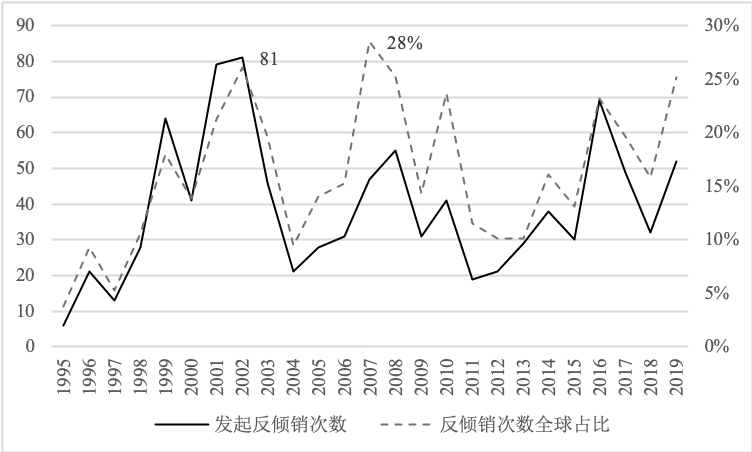

# 印度决定继续对中国钢产品征收反倾销税，为期5年

（观察者网讯）综合《经济时报》、《印度时报》等印媒12日报道，当地时间周一，印度财政部税收局发布通报宣布，决定对原产于或进口自中国的平底钢轮（Flat
Base Steel Wheels）征收的反倾销税继续延长5年，税额为每吨613美元，涉案产品为公称直径16”～20”的平底钢轮。

印媒称，这些反倾销税是根据印度商工部下设贸易救济总局（DGTR）的“建议”实施的。其声称，随着“低于市价”的中国产品涌入市场，印度中小型企业制造的钢材滞销，导致其国内产业遭受“实质性损害”，因此敦促政府采取措施保护当地产业。

_资料图_

平底钢轮是制造汽车轮毂的重要材料。据中国贸易救济信息网消息，印度商工部自2006年5月起对原产于中国的平底钢轮进行反倾销调查，次年年底宣布对中国公司生产或出口的平底车轮征收反倾销税，此后分别在2012年、2018年、2023年发起多轮复审后一直持续征收。

今年6月12日，印度商工部发布公告，对原产于或进口自中国的平底钢轮作出第三次反倾销日落复审肯定性终裁。印度《铸币报》报道称，该产品市场价格为613美元/吨，而中国企业的报价仅为513美元/吨，因此当局认定该产品存在倾销，建议惩罚性征收613美元/吨关税，为期5年。

就类似情况，2016年中国商务部贸易救济调查局负责人曾对印度滥用贸易救济对华进行反倾销调查提出批评。其指出，中印钢铁产业之间存在互补性，有广阔的合作空间，希望两国产业能够通过贸易、投资、技术合作等多种形式谋求共同发展，妥善处理贸易摩擦。印度下游产业及用户也受益于品质优良、价格合理的中国钢铁产品，希望印度政府从整体利益出发，审慎、克制使用贸易救济措施，并严格按照世贸组织规则进行公正透明的调查。

《新印度快报》报道称，印度一再对中国钢产品征反倾销税，旨在减少从中国进口的钢铁。而印度“moneycontrol”网站则分析称，因为印度依赖中国的关键原材料，该国很难减少从中国的进口。

2021年2月，为降低国内工业生产成本，促进国内经济的恢复，印度暂时取消了部分针对中国钢产品的反倾销税与反补贴税。路透社指出，其中一些关税起征于2020年6月，当时中印在边境地区发生了对峙。

此后，中印钢铁贸易在短期内迎来大幅增长。2023年以来，印度不断加大对中国钢材的进口量。

据印度政府披露的数据，今年4月至7月期间，中国是印度第二大钢铁出口国，仅次于韩国，出口量为60万吨，比去年同期增长62%，主要出口产品为冷轧卷或钢板产品。在此期间，印度总共进口了200万吨成品钢，为2020年以来的最高水平，较去年同期增长23%。

9月4日，印度钢铁部长纳根德拉（Nagendra Nath Sinha）表示，在钢铁行业对中国卖家的潜在倾销行为表示担忧后，新德里正在关注钢铁进口形势。

值得注意的是，一些印媒特意强调，印度采取反倾销措施，是为了确保“公平贸易”，为国内产业提供“公平竞争的环境”，并“保护本土产业”。报道中他们大多引用了印财政部通报中的一句话，“印度市场存在良性竞争，继续征收关税不会剥夺国内产业的任何需求。”

但事实上，新华社瞭望智库曾介绍，印度可谓是“世界第一反倾销大户”。自1995年1月1日修订“反倾销法”到2019年，印度一共发起972次反倾销调查，位居全球榜首。其中，针对中国232次，在印度反倾销调查名单上“独占鳌头”。

 _印度反倾销次数及全球占比折线图（1995-2019）_

这一情况的根本原因是，两国在发展阶段上具有相似性，印度对华贸易逆差居高不下，将中国视为最大“威胁”。2021年4月至9月，印度对华出口额为122.6亿美元，进口总额为423.3亿美元，贸易逆差达300.7亿美元。

而由于印度的工业产品难以与大多数国家竞争，只好诉诸“反倾销”等披着法律外衣的保护主义手段，给中国企业扣上“倾销”的大帽子。

瞭望智库指出，随着嵌入国际产业链的程度加深，作为发展中国家的一员，印度对反倾销的运用可能不降反增，将严重影响亚太区域合作、金砖国家间合作。这两者恰恰是印度发挥其国际政治、经济影响力的主要依托。

此外，印度这种高频率的贸易保护手段，短期内确实能解决一些“肘腋之疾”，然而从长远发展考虑无异于给自己留下“心腹大患”。

**本文系观察者网独家稿件，未经授权，不得转载。**

