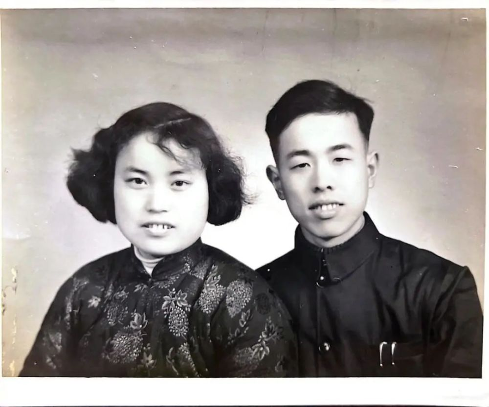
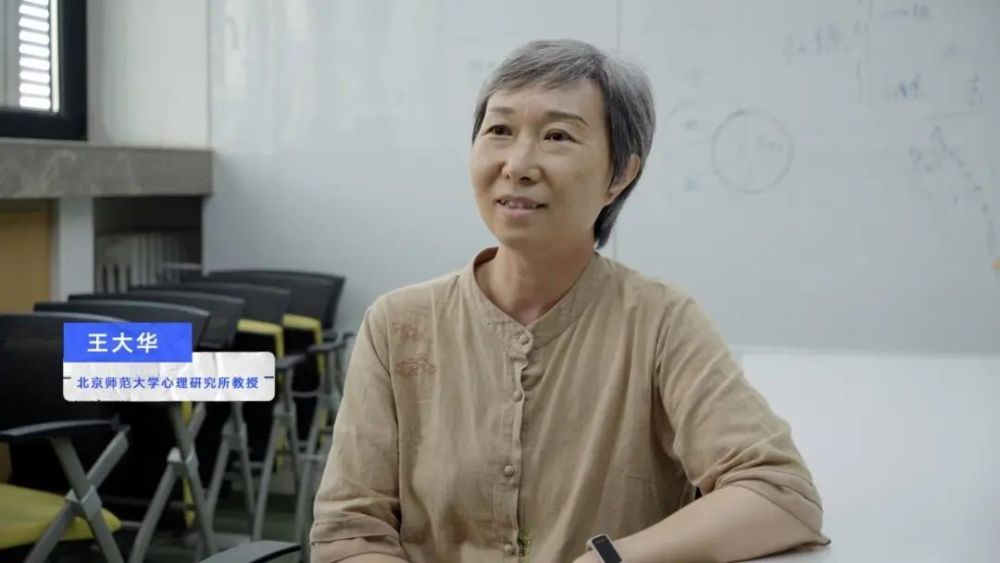

# 奶奶为何坚定独居18年？孙女深度跟拍7天，意外发现奶奶的另一面

大家好，我是本期节目的导演滴滴，你眼前这位在我心中与英国女王神似的老太太，就是我90岁的奶奶，秀宝。

爷爷过世后，奶奶已经独自居住了18年。每当我回到老家看望奶奶，她常常一面坚持，“独居是我自己的选择！”，一面又感叹，“每天每天我只能一个人打麻将啊，可怜啊，一个人的日子不知道怎么过啊……”

据《第四次中国城乡老年人生活状况抽样调查成果》显示，2020年我国空巢和独居老年人已达到1.18亿。而贝壳研究院发布的《2021社区居家养老现状与未来趋势报告》显示，现有独立居住（一人居住或与配偶同住）老年人占比已达65.5%；即使是80岁以上高龄老人，其独立居住占比仍达48%。

这些数字显示，在当下，老后独居或许正在成为一种趋势。

我的奶奶就是其中之一。

奶奶的独居生活到底过的好不好？既然这么孤单，她为什么要下决心自己住呢？有没有什么办法，可以让奶奶不那么孤单？——我心中有这样一串疑问。

带着这些问题，我回家拍摄了奶奶的故事，这是在外求学工作15年后，我第一次有机会和奶奶长时间贴身相处。这宝贵的7天，让我逐渐理解了奶奶的决心，也对这些问题有了新的认知。

在和奶奶的日夜相处中，与她密集交谈、听她回溯人生时，我重新发现了奶奶的故事。这些故事如同奶奶内心的线索，一点一点串联在一起，构成了奶奶独居的决心。

回到奶奶家第一件事，我想知道的是奶奶独自生活，每天都如何度过时间。

“早上念念佛，下午玩麻将牌，炒股。”

“哦！你麻将玩的肯定很好”

“那没有你爷爷好。”

“哈？是你教爷爷的吧？”

“没有！是他教的我。那时候他知道他自己活不久了，就教我玩麻将——‘你以后会麻将，一个人不会太孤单。’”

_奶奶每天下午的消遣是和自己打麻将。_

奶奶以前是厉害的会计，爱好麻将在我看来是理所当然。爷爷是拿笔杆子的报社编辑，在我的刻板印象中，在打麻将这件事情上，拿笔杆子的怎么能胜过打算盘的呢。

这一次我才知道，奶奶一直工作到67岁，每天忙着上班，没有太多爱好。打麻将其实是爷爷退休后的诸多兴趣点之一——爷爷的老后生活很精彩，包括参加街道的老年合唱队、去老年大学学习推拿、游山玩水等，甚至连家门口老年活动室的钥匙，都由爷爷保管。

_退休后游山玩水的爷爷。_

奶奶69岁时，爷爷被查出患有肺癌晚期。从那时起，他开始手把手教奶奶打麻将，给她借来麻将书，教她认识每一只牌。化疗后，他的身体恢复了一些，就带着奶奶去老年活动室的麻将桌上实战演练，认识左邻右舍的牌友，直到她一点一点学会麻将。

_奶奶总是看着爷爷照片陷入回忆。_

“他知道自己活不久了，害怕我这个老太婆以后太孤单，想着我以后能有一个去处……”

3年后，爷爷因为癌症而过世。从那时起，奶奶每天下午都会去老年活动室里打麻将，就这样度过了这段最难捱的时光。

_爷爷奶奶结婚时合影。_

在爷爷过世之前，他和奶奶做了一个约定。

当年，奶奶的妈妈依照传统住在儿子家里，被安置在一个狭小的房间里，闹得很不愉快。作为女婿的爷爷陪奶奶回老家调解，虽然最终让丈母娘搬到了大房间，但家人之间的关系却再难修复如初。

爷爷因此意识到，在新的社会中，如果继续按照孝道的传统，两代人住在一起，子女与其说是尽孝，倒不如说是不情不愿地尽着责任。

日本社会家上野千鹤子将这种由子女发起的两代人同住的邀约称为“甜蜜的谎言”，她认为，身为父母，在有条件的情况下，真正明智之举是识破它，断然拒绝，坚定选择独居。

正因此，爷爷和奶奶早早约定好，让她未来一定要拒绝子女同住的邀请，坚持一个人住。爷爷离世后，奶奶始终遵守着这个约定。

为了能够自立，在85岁那年，奶奶让医生把骨水泥注入自己的脊柱，这次手术进行了5个小时，巨烈的疼痛几乎撕裂了奶奶，但她挺了下来。此后，奶奶的行走能力恢复了大半，照旧独居生活。“又能走路了，我太高兴了！为了独立，吃这点苦头算什么！”奶奶这样说。

_新冠感染痊愈后的奶奶。_

从72岁到现在的90岁，这18年里，只有当奶奶腿疼到无法站立时，她才会住到姑姑家，但只要病情稍好一些，她又会马上回到自己的家里。

一个人住的奶奶享受着随心所欲地安排自己的生活起居，也和孩子们保持着和睦的关系。后来，奶奶家还装上了AI隐形护理员，一旦她摔倒，它会第一时间给每个家人的手机发送警报。奶奶看病就医、生活所需的方方面面，得到了下一代全方位的支持和照护。

这也许正是爷爷的先见之明。

 _我时常通过AI隐形护理员观察奶奶。_

在爷爷的计划中，奶奶的晚年生活，虽然没有了他，但依然有每天可以见面的麻友们，陪伴她度过往后的日子。但他没想到，在他过世后的第三年，老家被拆迁，家门口的老年活动室也关闭了，奶奶和友邻们不得不四散。

搬走后，奶奶依然和几个过去常常一起打麻将的老头子保持联络，约定每周在某人的家里相聚。每当那一天，他们从各自家里“摸着摸着出发”，早晨打一圈，中午出去搓一顿，下午再打一圈，然后各自回家。奶奶回忆起这样的一天时，笑得像孩子一样快乐。

后来，他们都过了80岁，腿脚越来越坏，毛病越来越多，见面的次数也越来越少。

接近90岁后，老头子们一个接一个“没了”。奶奶说，每打一次电话，就会听到悲伤的消息，后来她就再不敢打电话给他们了。唯独剩下一个老陈，也已经两年没有了他的消息了。

这就是为何现在我只能看到一个人孤零零打着麻将的奶奶。

如何理解奶奶的孤独？

我向北京师范大学老年心理学专家王大华教授提出困惑，她告诉我独居老人的孤独感通常由两种孤独混合。

第一种常见于独居老人身上的孤独，叫做情感孤独。

人们常说道的“我身边都是人，但我还是觉得孤独”即为此。它是人的一种内在感受，“感觉自己很孤独、很可怜、没人陪”。这种孤独感需要由与家人和挚友的深度连接才能够满足。

第二种孤独叫做存在性孤独，它是一种“只有我自己来面对”的孤独。

这种孤独与身边是否有人陪伴无关，无论年长年幼，每个人都会有这种孤独，但对于老年人而言，存在性孤独会更频繁地浮现出来，掺杂在情感孤独中。尤其是当死亡似乎越来越接近时，老人尤其会感受到一种无力感。

那么，怎样才能为奶奶缓解她的孤独呢？王教授认为“建立深度连接”是关键所在，如果家里有独居的长辈，大家可以尝试这样去做。

在这次拍摄奶奶独居生活的过程中，我尝试使用了tips中的几种，效果可喜，在此不剧透，就请大家去视频中感受吧。

希望大家能从奶奶的故事中获得爱与勇气。

撰文 | 滴 滴

策划 | 孙阿濛

运营 | 何 城

设计 | 胡志惠

排版 | 林秋彤

监制 | 传 举

