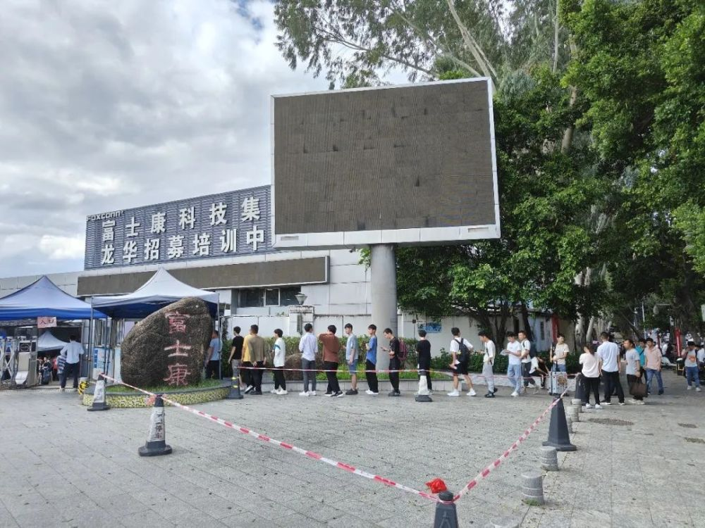
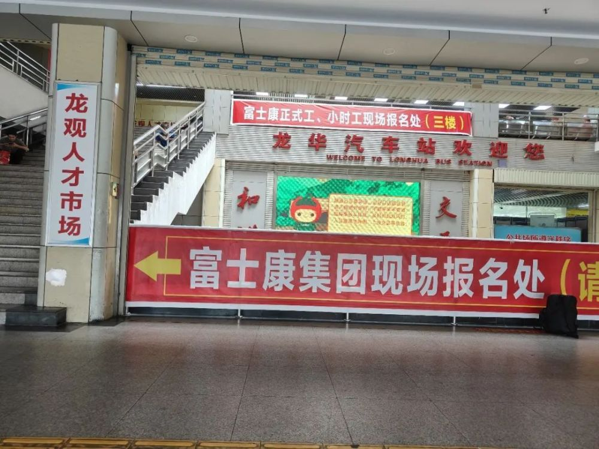
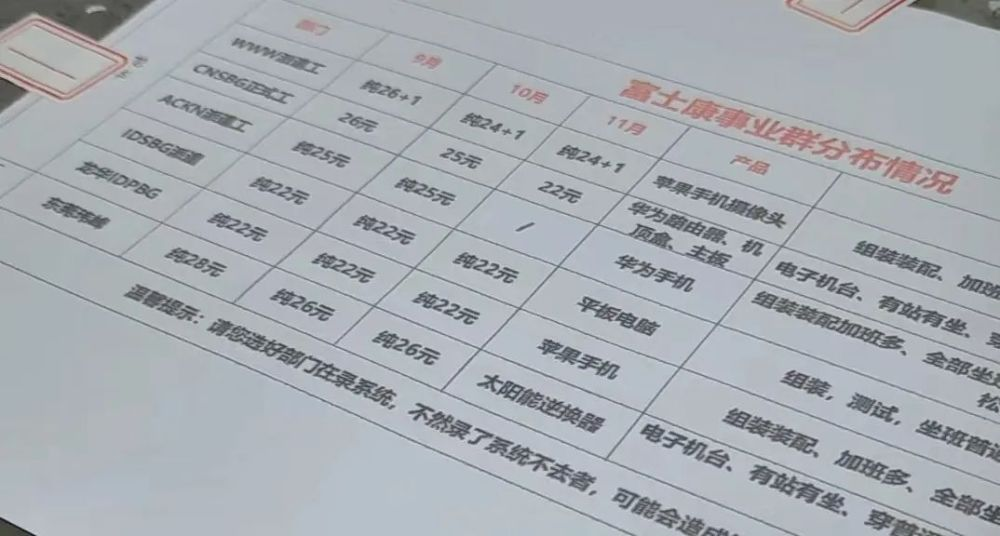
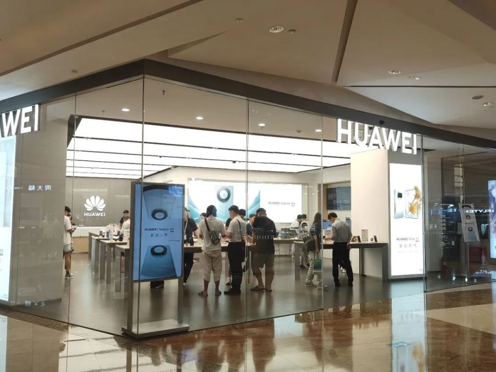
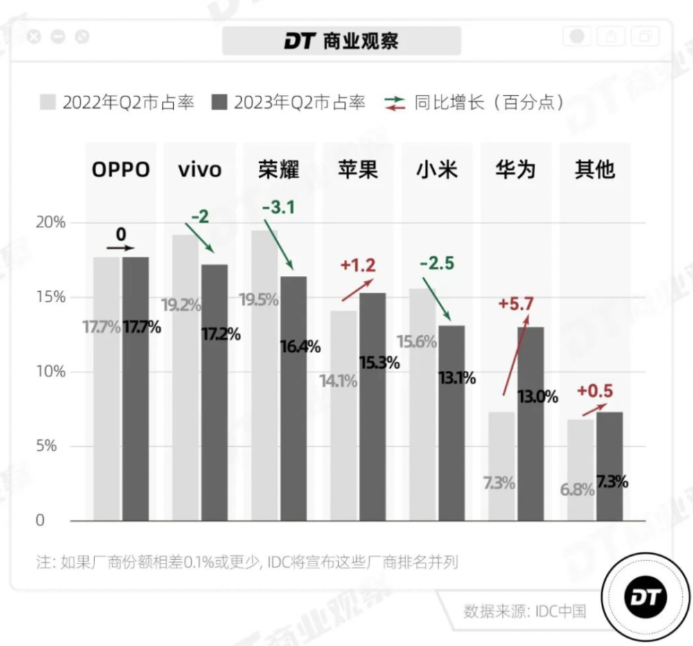

# 富士康手机生产进入排单旺季！华为小时工工价超苹果

北京时间9月13日凌晨，苹果发布iPhone
15系列，业界还在观望华为新机是否冲击苹果高端手机市场份额的时候，记者从多名为龙华富士康招聘派遣工的中介了解到，主要做华为等手机产品的部门，小时工工价已超过做苹果手机的部门。

9月12日，第一财经记者在深圳龙华富士康厂区和龙华汽车站见到多名人力中介招揽求职者。多名中介人员对记者表示，苹果手机相关部门持续招聘后人数基本已满。虽然富士康龙华招聘公众号显示主要做苹果手机的iDPBG部门还在招小时工，时薪21元，但部分中介近两日已未接到招工需求。

从郑州富工联招聘公众号看，郑州富士康负责iPhone组装等业务的iDPBG也停招小时工和返费工。有媒体近日报道称，虽然8月底郑州富士康还给出高工价招工，但毗邻员工生活区的沃金商业广场日渐冷清。

 _富士康科技集团龙华招募培训中心_

与此同时，记者从多名人力中介了解到，富士康龙华做华为等手机品牌订单的富士康ACKN部门（现为FIH部门）还在高价招人，9月12日公布的小时工时薪26元。除做手机摄像头、需穿防尘服的WWW事业群外，这是富士康龙华目前最高薪招人的部门。

招工需求一定程度反映生产需求。终端销售上，苹果和华为也在贴身肉搏。第一财经记者走访深圳多个手机门店了解到，苹果新机样机还待发售日上架，华为新机样机则已进入门店，吸引众多消费者看机并付订金。

富士康进入排单旺季

深圳龙华富士康经过招聘高峰，近期招聘人数也有所下降。记者以求职者身份咨询龙华富士康招聘相关人员得知，前几日招募中心每天有上千人报到，但目前人数有所下降。9月12日下午3点左右，记者在龙华富士康招募培训中心看到，有数十人排队或在旁聚集。

_深圳龙观人才市场中的富士康招募信息_

“一天一般工作10小时，国庆假期可能会休息3天左右，其余时间上班。”多名中介人员向记者表达了类似信息。据介绍，华为和苹果手机相关部门国庆都有可能放假，具体上班时间未敲定。

多名中介称，今年10月仍是手机生产旺季，随后应逐渐平稳并转入淡季。

第一财经记者在走访中还了解到，在富士康龙华整体招聘需求有所下降情况下，目前包含华为等手机业务的ACKN部门需求仍较高，目前时薪偏高。多名中介称，华为手机是ACKN部门主要产品。有中介招聘海报显示，若以时薪25元计算，月综合收入6500~8000元，高于iDSBG等部门。

_中介招募表中显示的小时工情况_

在龙华汽车站的人才市场，多名中介以时薪偏高且工作相对轻松为由推荐富士康ACKN部门。有中介介绍，以短工计算，ACKN部门时薪高于主要生产苹果产品的iDPBG，虽然11月份该部门时薪将小幅下调，但以短时工作计算，收入还是比苹果相关部门更高。iDPBG的优点则在于订单长期相对稳定，且工作强度相对不大。

苹果华为正面对决

华为产线发力招工的同时，终端销售市场也在争抢消费者。第一财经记者从多个深圳苹果门店了解到，iPhone
15样机还有待发售日上架。而还未召开发布会但已发售或预售新机的华为，门店则已摆上样机，吸引颇多消费者。

在深圳某商场，华为门店与苹果门店对面，9月12日傍晚，前者有六七名消费者观看样机并询问预订适宜，后者生意冷淡。在另一家苹果旗舰店，店内消费者有数十名，但人流分散，不少消费者在看平板、电脑等产品，一名苹果店员表示，店内iPhone
14 Pro已有一些型号售完且无新货到店，不排除后续iPhone 14降价或停售的可能。

此外，第一财经记者近日在北京一家苹果专卖店走访时看到，多数消费者是前往维修苹果产品，少数进行新品选购，据店员介绍，因新品可能涨价及旧机型可能不再生产、无降价优惠，不少消费者是在iPhone
15上市前来选购iPhone 14系列手机，还有部分消费者前来以旧换新，以选购或换新为iPhone 14为主。

在深圳的华为门店，消费者选购手机热情明显高涨。一个门店店员表示，店里已预定了几百台Mate 60 Pro和一两百台折叠屏X5。另一门店的店员称，Mate
60 pro和Mate 60
Pro+店里都预定了几十台，店员还劝消费者不要在到货时间确定前预定，但一些消费者认为先交订金可以优先拿货。还有一个门店的店员称，近期华为发布的新机很受欢迎，店里一共10名店员，目前每个人手上都预定了40多台。目前不同门店预定费用不同，有的机型0元订购，有的需交100元订金。

第一财经记者注意到，不少消费者均关心华为新机到店时间，店员则解释称，华为还未召开发布会介绍手机具体配置，Mate 60
Pro+和X5的价格还未确定，新机到店时间也不确定。

有店员称，消费者预订后要拿到新机可能需等到下个月。还有店员介绍，若预定Mate 60
Pro+并选用约1000元的care+服务，缴纳共2000元订金，货到店了可优先提，店面还可同其他门店调货。

高端市场变数

“华为跌倒，苹果吃饱”一度成为过去三年高端市场的真实写照，在今年秋季过后，手机市场的格局是否会因华为旗舰手机的全面归来而发生变化？

“此前华为新品发布对中国市场、全球市场来说都是非常震惊的，但拉长时间线来看，供货是否顺畅也是重要影响因素。”Counterpoint
Research高级分析师Ivan
Lam对第一财经记者表示，在保证量的供应正常情况下，销量情况可能会比去年好一些，但也很难在四季度有出彩表现，只是在销量与排名上会有所提升。

多个机构预计，随着华为新机发售，今年出货量将增大。Counterpoint分析师Lam预测，如果供应不出问题，Mate 60 Pro销量至少会超700万台。

有媒体引援产业链人士消息称，今年华为将手机出货目标上调至4000万部。天风国际证券分析师郭明錤更新的预估则认为，2024年，华为手机出货量有望达到6000万部。不过，与2019年华为智能手机出货量超2亿台相比，短时间内华为距出货巅峰仍有较长距离。

目前，华为供应问题仍存在。记者从华为门店了解到，折叠屏X5的前一代X3，仍在缺货阶段，消费者需预定后等发货。此前，X3还曾缺货溢价上千元，有店员称，X3是近期才恢复原本售价，大概率不会因X5上市便降价，X3供货或在今年下半年或明年逐渐增多。

一家广东县级市场的经销商对记者表示，目前华为的多款机型供不应求，但是华为放得也很少。“都是几台几台的放，利润空间大概在12%，和过往差不多，加上溢价，抢到就是赚到。”

香港信息科技商会荣誉会长方保侨则对记者表示，苹果的销售的高峰将从下周开启，从此次苹果的定价来看，也说明感受到了压力。“香港的手机渠道商目前在全力准备圣诞节前的这波旺季到来，苹果对资金链的占用比较高，但是也会留出空间给华为。”

而对于其他安卓手机市场的影响，方保侨表示，目前苹果和三星在全球高端市场的占有率依然非常高，荣耀和小米也在海外市场向高端品牌进军。总体而言，市场格局的变化还需要时间观望。

“厮杀”600美元以上市场

2020年上半年，华为在中国高端手机市场（600美元以上）中，份额一度超过苹果，达到了44.1%。两年后的2022年第二季度，据IDC数据，中国高端手机市场中，苹果吃掉了约77%的份额。

综合今年上半年，苹果在国内600美元以上手机市场份额占67%。IDC数据显示，华为占比约为15.6%，OPPO、小米、荣耀、vivo分别占4.2%、3.7%、3.2%和3%。不难看出，苹果和华为之外的其他厂商，仍在高端化建设过程，而在下半年手机市场消费旺季，多个厂商均押注高端机，华为手机回归或让形势变得更加复杂。

其中从市场覆盖人群来看，小米、荣耀或是最有危机感的品牌。

8月14日，小米发布折叠屏旗舰MIX Fold 3，雷军在当日年度演讲中强调高端是小米的必由之路；8月29日，OPPO发布折叠屏Find N3
Flip，该机一定程度上被当日发售的华为Mate 60 Pro抢了风头；vivo高端机X90于去年11月发布，不出意外新系列于今年年末也将面世。

Ivan表示，尽管小米在高端领域非常努力，但是拼杀出来的几率并不大，目前还在艰难前行。展望后市，今年四季度，小米手机表现预计相对弱一点，目前小米手机在高端市场乃至整个中国市场高端领域均难以争夺更多份额。

此外，安卓品牌中，经过三年竞争，荣耀获取了最多的华为市场份额。早2021年成立初期，荣耀市场份额为3%，但目前攀升至16%。但由于渠道、供应链以及品牌基因的相似，外界认为荣耀也将因华为的回归受到影响。对此，荣耀CEO赵明对记者表示，“如果期待对手很多，只会讲自己变成弱者，市场将会因为华为的回归而充满更多可能性。”

目前，荣耀正在寻求更多的市场空间以及资源加持，除了向海外市场进军外，也在资本市场动作频频。有消息称，荣耀最快将于明年上市。

Ivan表示，从行业情况来看，600美元至800美元范围内，预估苹果占比约30%-40%，华为占比20%-40%，剩下份额由其他手机厂商平分。

而800美元以上范围区间，Ivan判断，苹果手机占比60%-70%，华为占比10%左右，其他厂商再分剩余份额。到2024年，预计中国品牌在600美元价位的高端手机市场中，份额会缓慢上涨，但是上涨空间不会太大。

Ivan表示，目前手机厂商主要在硬件实力、销售能力、品牌运营等方面博弈，而在这些方面，苹果长期以来坚持对品质与用户体验服务，积累下更具优势的用户体验。虽然目前行业与消费者群体对苹果手机新品持有失望情绪，但这方面影响不太大，国内变数主要是由华为带来，但不会剧烈波动。

IDC中国高级分析师郭天翔则向记者表示，虽然近年来苹果手机的升级变化不明显，国内安卓厂商依靠技术创新与品牌形象建设在国内高端手机市场获得一定进展，但苹果仍具明显优势。未来，随着华为回归以及其它国内安卓厂商建立高端产品节奏和品牌形象，苹果在中国高端手机市场将会遭遇更大挑战。

