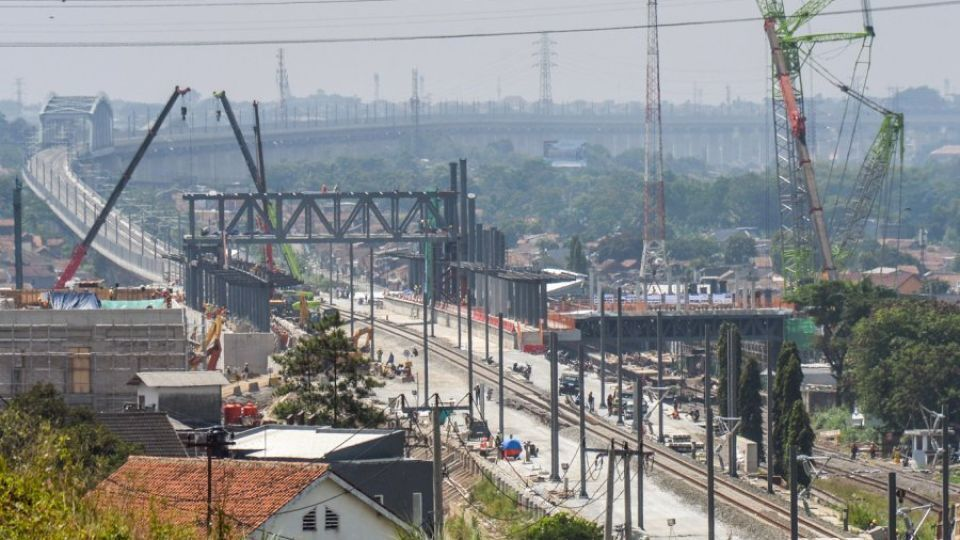
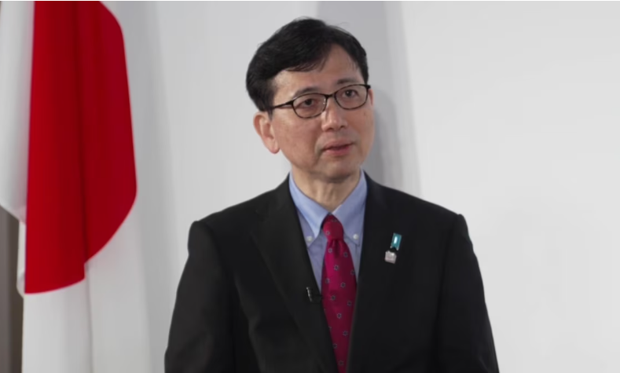
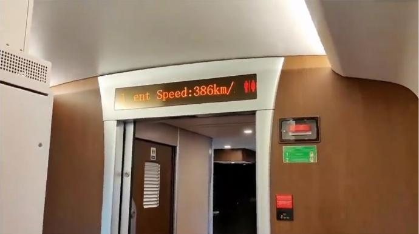

# 对参与雅万高铁延长线“没兴趣”，日官员忧混用中日技术伤害日本品牌

（观察者网讯）印度尼西亚《雅加达邮报》12日报道称，在十几年前与中国围绕印尼雅万高速铁路项目展开激烈竞争的日本，如今似乎对这个东南亚首条高铁的延伸段项目表现出“兴致乏乏”。

在接受该媒体采访时，日本外交官、内阁广报官四方敬之对此解释称，不同国家的技术难以兼容，而且日方担心，混用技术的项目一旦出现问题，“日本品牌”的口碑会被牵连“受到损害”。

值得一提的是，早在雅万高铁6月实现时速首次达到350公里的“新突破”，就有对日本高铁技术怒其不争的日媒直言，雅万高铁显示出中日两国在高铁技术上已经形成了“难以逾越的实力差距”，日本既不愿支持本土企业赴海外争夺订单，也不愿为本国铁路建设投入更多资金，已然无法与中国竞争。

 _3月7日，建设中的印尼雅万高铁 图自《雅加达邮报》_

当地时间9月7日，中国和印度尼西亚合作建设的雅加达至万隆高速铁路开通运行，两地间最快旅行时间由3.5小时压缩至40分钟。10月初，将正式售票开始商业运营。这标志着印尼迈入高铁时代，中印尼共建"一带一路"取得重大标志性成果。

13日上午，印尼总统佐科前往雅加达的哈利姆高铁车站，首次乘坐雅万高铁。印尼政府早前还多次表示，考虑将雅万高铁延长到印尼第二大城市泗水。

《雅加达邮报》12日报道称，佐科计划让日本加入，但曾积极竞争雅万高铁项目的日本似乎对这条延伸线“兴趣不高”。

近日接受该媒体采访时，日本外交官、内阁广报官四方敬之解释称，印尼是日本“重要的朋友”，日方自然希望可以支持雅万高铁延长线项目，但其认为不同国家的技术混用会产生兼容问题，也会导致工程项目复杂化。

“如果混合使用两种技术，我不知道效果会不会很好。例如，我们不会对中国方面承建的高铁段负责，尤其是在出现问题的时候。如果我们合作，就有发生这种情况的可能性。”他说。

四方敬之还说，日本对雅万高铁列车的组成和铁路系统一无所知，因此必须谨慎探讨合作的可能性，以免对“日本品牌”造成损害。

他还提到，如果日本参与这一项目，必须包括私营企业的参与，才能确保其商业上的可行性。

_四方敬之 资料图_

遥想当初，围绕雅万高铁项目的竞争相当激烈，它不仅是中国高铁的海外“第一单”，更是中国首次在海外铁路项目中打败“世界公认”的“铁路强国”日本。

时任中国驻印尼大使谢锋曾介绍道，日本早在2008年就开始跟踪雅万高铁项目，先后做了3次可行性研究报告，但印尼政府始终没有做决定。在中国和印尼有关方面签署了关于就雅万高铁开展合作的谅解备忘录和框架安排后，日本更是一年4次派特使到印尼陈情游说。

经过几轮“厮杀”，中日竞争趋于白热化，2015年印尼选择将“绣球”抛给了中国。作为中日在海外高铁争夺战中，“中国方案”首次获胜，雅万高铁也曾引发日本媒体的高度关注。

今年6月22日，雅万高铁联调联试综合检测列车运行时速首次达到350公里，最高检测速度达到385公里/小时，标志着雅万高铁已达到设计速度标准，实现了联调联试阶段性任务目标。

这引来日本交通运输产业媒体“Merkmal”的惊呼：雅万高铁显示出，日本与中国在高铁技术上已经形成了“难以逾越的实力差距”。

_雅万高铁在最高营运速度行驶时，竖立在车窗边缘的印尼盾硬币都不会倒下_

“Merkmal”对此深度分析称，与中国国企背靠政府，通力合作高效建设不同，日本在承接海外订单时不仅要经过复杂的招标设计过程，各承建企业还会相互倾轧、层层分包外包，大大拖慢整体建设进度，而且日本国内的设备制造商也屈指可数。

“与虚假的‘全日本’相反，这是真正的‘全中国’。”Merkmal指出，中国从政府到承建企业“集中力量办大事”的上下通力合作是项目成功的关键，日本企业在海外订单竞争中面对的并不是某一家具体的企业，而是“全中国”。

日媒还特别注意到，雅万高铁与其他中企海外承建高铁项目部分采用了与中国国内相同的标准和设备，如此既能在出现故障时迅速从中国国内调用设备，建成后这些设备也可以继续应用到其他海外项目，这一点是“他国无法模仿的”。

文章最终批评日本政府连“保护本国铁路业发展的勇气都没有”，指其既不愿为铁路建设投入更多资金，也不愿支持本土企业赴海外争夺订单。“只要中国继续投入巨额国家资金建设铁路，中国铁路基础设施建设的实力就不会动摇。在这种情况下，日本要如何与邻近的铁路大国竞争？”

**本文系观察者网独家稿件，未经授权，不得转载。**

