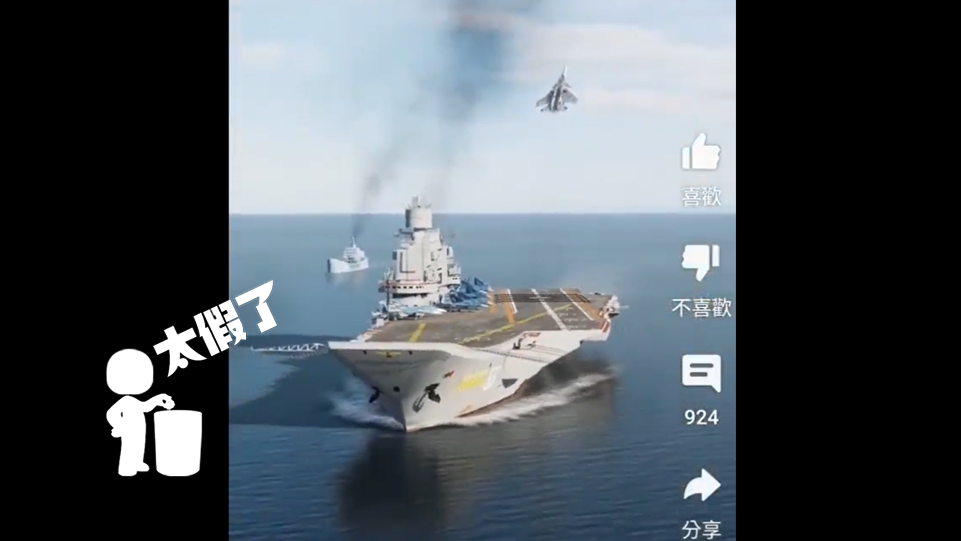
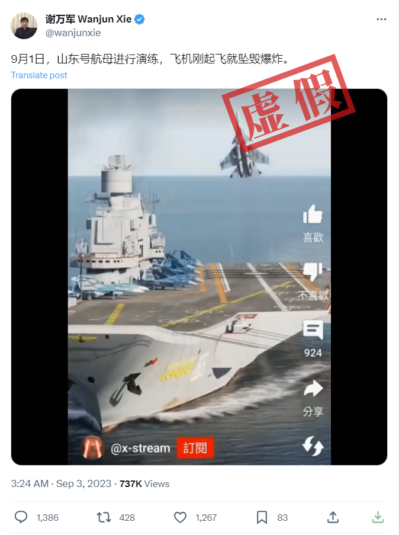
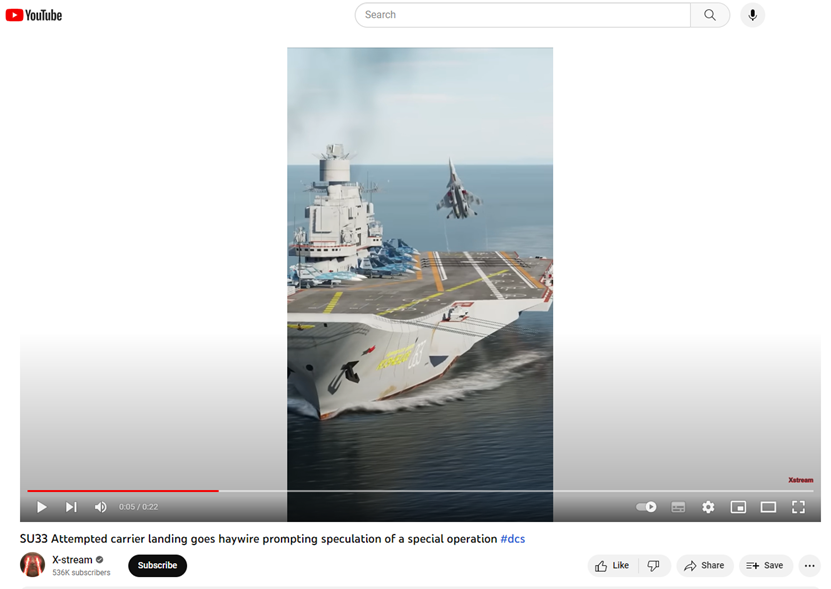
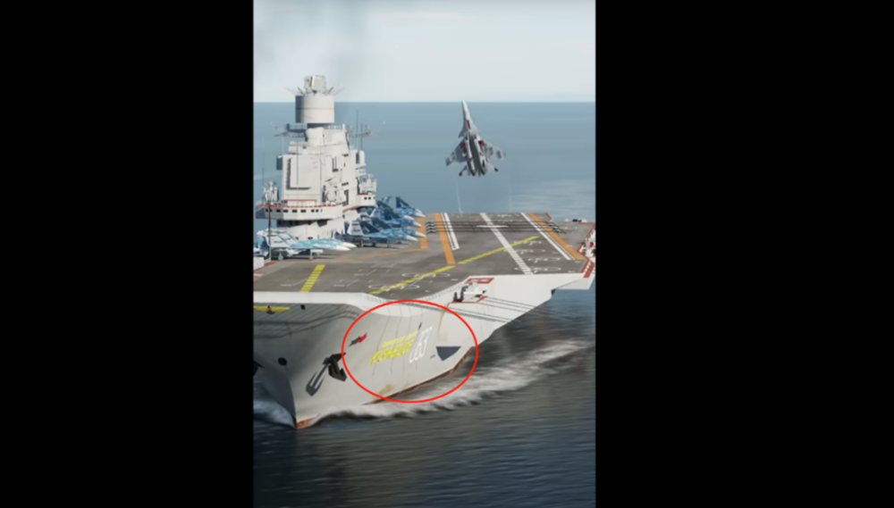

# 山东舰演练中有飞机坠毁？假！实为游戏模拟俄战机着陆航母画面

速览

\- 网传说法不属实。相关视频来自YouTube用户@x-stream。视频展示的是模拟空战类游戏《数字战斗模拟世界》中的画面。

事件背景

9月3日，推特账号@wanjunxie发布视频称：“9月1日，山东号航母进行演练，飞机刚起飞就坠毁爆炸。”

视频中，一架灰色战斗机在离开航母甲板上后，在空中上下颠倒飞行了一段距离，随后坠海起火。

截至9月12日，该视频的播放量已超过73万次。

_网传说法截图_

明查

网传视频左下角显示有@x-stream标记，在YouTube视频平台上可找到头像相同的同名账号。

根据账号描述，@x-stream是一个集视频游戏、航空、摄影、遥控飞机和用户真实生活为一体的综合内容频道，频道中会分享与军用战斗机、航空博物馆、飞行员培训和数字战斗模拟世界（DCS）等电子游戏相关的内容。

_YouTube账号@x-stream_

2023年2月8日，@x-stream在YouTube平台上上传了一段22秒的视频，该视频的后19秒内容与@wanjunxie上传的视频内容无异，网传视频则将前3秒战斗机着陆的画面删去了。

_@x-stream上传的视频截图_

但据视频描述，这段视频展示的是苏联/俄罗斯海军一型单座双发舰载战斗机苏-33航母着陆失败的画面。画面内容来自模拟空战类游戏《数字战斗模拟世界》，并非真实世界。@x-stream还在视频说明中详细罗列了其录制该游戏画面时使用的各项装备及相应参数。

@x-stream在视频说明中详细罗列了其录制该游戏画面时使用的各项装备及相应参数。

此外，仔细观察视频画面可以发现，相关视频中出现的航空母舰一侧标识有“063”的数字和一串俄语文字。据此查询舷号为“063”的航空母舰，可以确认游戏视频中展示的是苏联/俄罗斯第三代航母“库兹涅佐夫”号（Кузнецов），而非山东舰。

视频中的航母一侧标识有“063”的数字和一串俄语文字（红圈内）。

据《环球时报》报道，台湾防务部门11日发布消息显示，解放军航母山东舰当日航经台岛东南方，赴西太平洋开展本年度第二次远海训练。

截至9月12日，除@wanjunxie的说法外，没有信息显示山东舰演练中有飞机坠海。

综上所述，网传说法并不属实。相关视频来自YouTube用户@x-stream，视频展示的是模拟空战类游戏《数字战斗模拟世界》中的画面。

