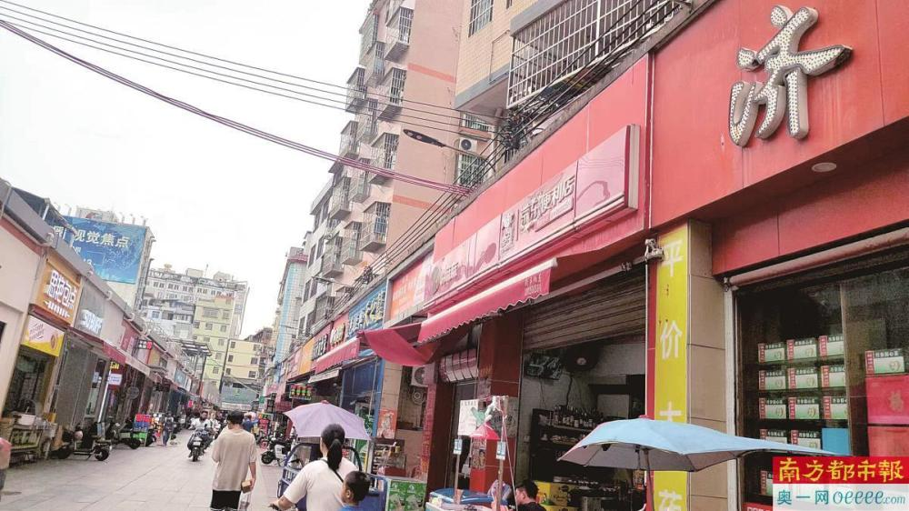

# 条例施行4月多，广州城中村“电费刺客”仍凶猛

_广州一城中村。_

 _海女士房租水电缴费单据。_

高额水电费问题一直是广州城中村租户的“痛点”。今年以来，“城中村水电刺客”话题频上热搜。2023年5月1日，《广州市供用电条例》正式施行。条例中指出“任何单位和个人不得违反国家电价政策加价或者变相加价收取电费”。条例施行至今已4月有余，城中村水电收费贵、收费乱的问题，是否真正得到了解决?

近日，记者实地走访了广州市内多个城中村，与多名房东和租客对话，了解到仍有不少城中村水电费保持水5元/吨、电1.5元/度的价格，也有租客反馈房东通过收取管理费、公摊费、损耗费或加租的方式来补上电费下调的“差额”。与此同时，不少房东向记者表示，当前“民水民电”仍难实现。

**典型案例**

**一盏灯、一个冰箱一个月电费1085元**

为治理城中村高电价问题，5月17日，广州市市场监督管理局发布关于贯彻执行《广州市供用电条例》规范电费收费行为的提醒告知书，提醒各电费收费主体立即开展自查自纠，并于6月30日前全面纠正自身存在的不规范收费行为。

如今已过去两个多月，广州城中村租客期待的按目录电价收费是否已经实现?

**遇到了“电费黑洞”?**

“电是1.5元/度，水是5元/吨。房东说1.5元/度的电费里还包含了所谓的公摊损耗，还说现在的城中村普遍都是这个价。”在广州市海珠区大塘南华大街，租客海女士向奥一新闻记者报料，自己遇到了“电费黑洞”——6月份刚交了700多元的电费，没想到7月份居然又“吹”出1085元的新高，“现在改用风扇了，希望费用能降下来”。

据海女士介绍，她租住的是一房一厅，面积大约50平方米，平常自己白天出门工作，晚上才回到出租屋休息。“啥都不干，就开一盏灯、一个冰箱，我一个人在这里用出1085元的电费，实在不可思议。”海女士如此质问房东，而房东以“电表的问题我也不懂”为由，要求海女士继续按照电表上的数据缴费。

缴费单上可见，海女士7月共用了723度电。独居上班族如此用电量是否属于正常情况?

同样住在城中村的独居租客小杨告诉记者，她在每晚都会开空调睡觉的情况下，夏季平均每月用电在250度左右，使用电器包括电水壶、冰箱、洗衣机、电风扇及空调等。一对城中村情侣住户则告诉记者，7月他们共使用了354度电，6月是240度电。

而独居的海女士用电量却是他们的两倍有余，这让海女士对电表转动的速度产生了怀疑。“之前不开空调的时候，电费也要每个月三四百元，我也疑惑是不是电表有问题。”因此，事情发生后，她向房东提出了质疑。房东则表示，“根据电表显示，你就是用了这么多(度电)，用多少就交多少，大家都是这样的。”

在海女士的坚持下，房东为其安装了新的电表，“希望这个月的电费能有所下降。”海女士表示，除此之外，自己也没有更好的办法了。

**电表是否存在猫腻?**

值得注意的是，海女士的房子使用的“独立电表”并不是由广州供电局安装的，而是房东给每个租户自行分装的电表。

这是为何?记者此前曾采访广州城中村房东获悉，供电公司暂时没有办法在城中村里推广电表入户。而据供电部门回应，一般情况下，城中村的出租屋是一个地块一栋楼提供一个独立产权，而出租屋内部再次分割的单间是无法独立确权的，因此出租屋内部单间无法单独开展用电报装。

记者走访发现，在广州的城中村许多出租屋都属于“多户一表”，即多户人家共用一个总表。即便有些地方称可以“一户一表”，也是由房东自行安装的分表。

有家电维修人员向记者反映，“如果独立电表走向非常不正常的话，那么可能存在猫腻。”他表示自己也曾遇到过有二房东私自将电表调快了的情况。“如果是手动校表的电能表，只需要改变校表的点，就能使表走慢或者走快。如果加快了电表走表的速度，这样可以收取更多的电费。”

**记者走访**

**房东设法“拆解”政策 电费1.5元/度仍是标配**

无论是水表还是电表，当前广州城中村大多没法做到一户一表安装。记者近日走访广州多个城中村发现，由于一个产权证、相同用电性质的电表只能安装一个，因此房东无法真正做到租户的“一户一表”。有些地方实际上是“一楼一表”，每个租户只有房东自设的分电表。这给“城中村电费加价”提供了空间。

**将线路损耗、公摊等一并列入**

有的房东为计费方便，将出租屋线路损耗、电费公摊等也一并列入电费中收取，且长期以来形成惯例。房东按1.5元/度向租客收取电费几乎成了一些城中村出租屋的“标配”。而按广州现行电价规定，居民电价分为夏季和非夏季两种标准，并实施三档阶梯计费。其中，夏季每户每月用电量在260度以内的计费为0.59元/度，261-600度的计费为0.64元/度，601度以上的计费为0.89元/度。

租住在海珠区大塘村的海女士表示，其水电费价格仍保持此前的标准(水5元/吨、电1.5元/度)，并且房东告诉她，1.5元/度的电费里包含了公摊损耗，“她说现在的城中村普遍都是这个价。”

住在天河车陂村逾5年的广漂小林告诉记者，她在车陂先后租住过3个房子，一直都是默认水5元/吨、电1.5元/度的收费标准。而在她的了解里，这个收费标准几乎是全广州城中村的统一标准，而现在也没有多大变化。

记者来到白云区京溪村，这里随处可见张贴着的租房广告，单间、一房一厅、两房一厅比比皆是。记者以租客的身份随机联系了一位房东，被其带着去看了一间两房一厅的出租屋。当记者提出1.5元/度的电费太贵时，该房东表示，这里的房子都是一样的收费，随后他表示若确定要租可给予一点优惠，“夏季电价给你们1元/度，其他月份1.5元/度。”

随后，记者又联系了两位房东，得到的回答均是:水5元/吨、电1.5元/度。

可见《广州市供用电条例》施行后，仍有不少房东并未下调收费标准。

**有的电费降了但加收其他费用**

同时记者在走访中了解到，有部分房东降低了电费的单价，但通过加收其他项目费用来维持“总价”。

番禺大石的租客小陈告诉记者，自电费下调政策出来后，房东确实将电费下调到了0.75元/度，是此前的一半，但加收了管理费。“有时候管理费收100多，有时候收200多，我也不懂这个收费标准。”小陈计算了一下，发现这样收费后，缴费总额和此前基本维持同一水平，“只是将差额摊到了其他费用上。”

也有城中村租客表示自己遇到了“良心房东”。白云江夏的小王告诉记者，今年6月份房东将电费从1.5元/度下调至0.88元/度，但表示需要加收100元的电力设备维护费和损耗费。然而半个月后，房东再次通知电费保持0.88元/度，并且不再收取上述维护费和损耗费。

**问题症结**

**“一户一表”不达成 “民水民电”难实现**

公摊费、劳务费这些额外费用是否合理?这些收费又将用作何处?

有租客认为这是强买强卖的行为，违反了消费者权益保护法。也有租客表示，加收管理费、损耗费可以理解，但这些费用是否有收费标准?是否可以公布实际用途?“只要是合理的价格、合理的收费我都可以接受，如果只是房东为了应付电费下调政策而编出来的收费项目，那根本没有意义。”

站在房东的角度，因为“历史遗留问题”而使得无法实现“一户一表”，因此用电用水过程中产生的损耗则需要由租客们共同分摊。如按照“民水民电”价格收费，房东需要自己倒贴这些费用。

不少房东表示，城中村都是多户一表，即一栋楼只有一个总表，在用电用水的过程中会产生损耗，这笔费用需要由租客们共同分摊。另外，雇人上门抄表收费、打扫楼道所产生的劳务费、卫生费，也理应由租客们承担。“你们交这些钱，其实就相当于服务费。比方说设施的维护、房间里所有东西的损耗，最后都是我们承担。”岗顶的一位房东这样告诉记者。

据了解，城中村出租屋一般是一栋楼对应一个房产证，只能安装一个总电表，供电局根据相应的产权抄表到户(栋)。供电局与租户之间没有供用电关系，供电局不负责与租户进行阶梯电价结算，而是按总表向房东收取电费。若能“一户一表”，租客是否就能直接与供电局结算电费，按照阶梯电价计费?

记者询问了长湴村、京溪村的几位房东，他们都肯定了在“一户一表”的前提下，租客是有可能用上“民水民电”的，但都认为单靠租客自己几乎很难申请到一户一表。长湴的一位房东表示，申请需要先得到业主(即房东本人)的同意，“房东还要花上好几千块钱，租客如果不是长租的话，划不来”。

城中村电费争议的根源背后牵涉了房屋产权、用电性质、用电数量等一系列问题。有专家指出，要想从根本上解决居民用电问题，关键是推进城中村“一户一表”电网及老旧管网的改造。但推进城中村居民用电问题的解决并非一朝一夕之事，而是要长期治理。除了要解决历史问题以外，还要在房东、租客之间找到利益平衡点，让整个市场规范有序、健康发展。

**聚焦**

**广州市市场监督管理局:**

**通过处罚执法 带动收费监管**

城中村电费加价乱象如何破解?对此，广州市市场监督管理局曾回复奥一新闻称，会协同有关部门共同推动解决城中村用电问题。据了解，当前该局已经开始对消费者的加收电费投诉进行收集分类，对房东恶性加价、恶意加价、屡次拒绝自查自纠的行为要动真格进行处罚。

**历史遗留问题复杂**

此前，广州市市场监管局曾回应奥一新闻称，广州城中村出租屋水电气收费问题，历史遗留问题复杂，涉及部门较多。

该局进一步解释，以电费为例，从司法实践看，各地法院判决大多都认为出租屋电费属民事主体双方通过合同约定一致认可的事项，未认定超标准收费属违法行为，亦不支持退还多收电费的诉讼请求。同时，亦有法院判决认定，居民出租屋双方约定的“电价”，不属于电力法所规定的“电价”。此类事项在司法层面更多被认定为是租赁双方的民事经济纠纷。

但此前，由于对出租屋业主个人超标准收取水电气费的行为，还没有明确的执法依据，市市场监管部门只能立足职能，开展供水、供电、供气等公用事业服务行业价格专项检查。同时，组织各区市场监管部门通过宣传引导、提醒告诫、行政指导等方式配合属地街道、相关行业主管部门深入推进城中村综合治理。

**已经印发执法指引**

而针对法律的“缺位”，今年5月广州已在立法上进行了突破与完善。《广州市供用电条例》第43条规定了市场监管部门对出租屋房东个人加收电费的行为进行处罚。

当前条例执行得如何?近日，广州市市场监管局价监竞争处处长、一级调研员曾庆鹏在广东“民声热线”节目上回应称，目前已向全社会公众包括出租屋房东进行相关政策宣贯，同时要求基层市场监管部门，包括每一个市场监管所要联合发动属地的镇街村居，还有来穗人员管理部门、出租屋管理部门以及供电部门到每一个出租屋进行宣贯，并建立台账。

“我们近期已经开始对群众、消费者的投诉举报收集分类，正对其中一些确实是恶性加价、恶意加价、屡次拒绝自查自纠的进行处理，接下来要动真格进行处罚。”曾庆鹏表示，目前市市场监管局已经印发了执法指引，接下来将继续加大宣贯力度，对恶意收费行为进行调查取证，通过处罚执法来带动监管。

总第055期 统筹:管玉慧

采写:南都·奥一新闻记者 管玉慧 林思思 实习生 辛豫

南都·奥一网出品

