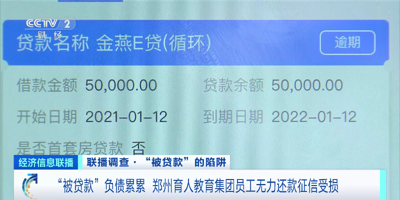
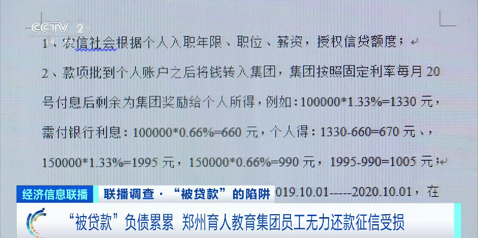

# 河南一企业让员工贷款上千万养公司，涉事企业、银行、监管部门回应

据央广网微信公众号：近日，河南一企业让员工连续多年以个人名义贷款养企业的事情引发广泛关注。9月12日，涉事企业、银行以及监管部门对此进行了回应。

据相关媒体报道，郑州育人教育集团（以下简称：育人集团）从2019年至今，一直让员工向郑州农商银行贷款供企业使用，2021年1月，育人集团有181人共贷款2000余万元。

**企业发展陷入困难**

**让员工贷款过难关**

育人集团董事长刘亚敏回应央广网记者，2017年，育人集团港区校区建设逐步完成，需要装修，为奔波的员工改善住房条件。2020年，集团下辖各校区以全新的条件迎接新生、服务老生，却连续三年遭受打击，从幼儿园到高中重创，尤其是中小学阶段，关停了两所学校和两所幼儿园，只有转向中职合作、培训等业务。

据每日经济新闻报道，2019年底，育人集团召开动员会，鼓动员工和老师贷款给集团用，帮助集团渡过难关。每人可以“装修贷”名目贷款10万-15万元。

育人集团每月将利息随工资发放给员工，员工再将利息还给银行。原本贷款期限是一年，到期后，集团帮助员工做了三年续贷。

员工帮集团贷到钱后转给集团，集团每个月给员工利息让员工还息，承诺不仅会按期还本金，每月还会多给员工一部分利息作为员工奖励。

郑州农商银行工作人员表示，他们对该事件中贷款的老师进行第一轮贷款的时候利率是7点多，第二轮利率是5点多，但是他们从网上获悉，学校给员工的利息付到了年化率16%。

北京乾成律师事务所律师李贺表示，如果员工具有转贷牟利的目的，套取银行信贷资金高利转贷给单位，并且违法所得数额较大的，涉嫌构成《刑法》第175条的高利转贷罪。如果单位在员工不知情的情况下以欺骗手段取得银行贷款，并且给银行造成重大损失的，单位可能涉嫌构成《刑法》规定的骗取贷款罪。

**员工权益受损**

**企业遭遇投诉**

据每日经济新闻报道，2021年11月，该育人集团声称资金没有回款，让员工垫付贷款利息，之后会补发，但是至今未补给员工，已有人因贷款逾期影响个人征信。

9月12日，育人集团董事长刘亚敏向央广网记者表示，“员工权益受损，是我们个别离职员工，当时签了借款协议，他们现在出来投诉，可能是因为东区项目停办，产生的不信任和担心。我们发给了大家自救的招生方案，无人响应，成为问题。现在，希望努力争取化解。”

“当年我们的员工人数在1200人左右，实际上贷款的人现在只有50多人。大部分是员工自己买了房，自己装修使用，少部分人是离职员工，我们正在想办法帮他们解决问题。”

记者致电郑州市人力资源和社会保障电话咨询服务热线12333，热线工作人员认为公司要求员工使用身份信息进行贷款的行为表示不合规，依据是：《劳动合同法》第九条的规定，用人单位不得扣押劳动者的居民身份证和其他证件，也不得要求劳动者提供担保或者以其他名义向劳动者收取财物。如果发生争议可以找仲裁部门反映。

**银行与涉事企业**

**是否存在违规贷款情况？**

据红星新闻报道，员工谢丽丽说：“当时，董事长刘亚敏向员工表示，集团已经与郑州农商银行金水支行协商，可帮助员工办理装修贷，贷到的钱借给集团。集团在郑州航空港有校舍和土地，可提供给银行做担保。大家不用担心，不需要大家提供抵押物，希望大家以个人名义担保贷款。”

针对该媒体报道的情况，育人集团董事长刘亚敏向央广网记者表示，当时郑州农商银行有产品，需要的人可以去贷，集团就通知了所有的员工，自愿报名。集团给予介绍银行产品方式，让员工们有优惠的利息和适当的住房补贴。

据了解，本次所涉及的银行贷款产品名称为“金燕E贷”，是以个人信用为基础，以河南省农村信用社互联网金融平台为载体，实现自助贷款申请、自助签约放款、自助还款结息等功能，为符合条件的个人客户提供的小额贷款。

那么作为贷款审批方的银行是否清楚该小额贷款的实际用途呢？

**银行回应**

**对于贷款实际用途**

**他们事先并不清楚**

郑州农商银行工作人员回应央广网记者，这是企业与员工之间的行为，贷款所注明的用途是消费贷，而非相关媒体所说的“装修贷”。对于员工贷款的实际用途，他们事先并不清楚。在对育人学校的报道中，他们看到育人集团与员工签订了贷款使用协议，协议中写道“本协议为内部保密协议，双方均不得对外公开。”如果双方决定对这笔贷款的使用进行保密，银行就更无法洞悉这笔资金的使用情况，这是学校和员工之间的事情。

郑州农商银行工作人员为记者详细介绍了他们在涉及此次事件的贷款产品，他表示，该产品（金燕E贷），是一款线下提交资料，银行授信的产品，适用于有稳定收入的客户。该事件中所有贷款申请都经过了面谈面签，客户签署了相关文件，其中包括资金用途承诺书，其中就有保证不用于权益性的投资款项。工作人员还向记者展示了员工签署贷款文件时的照片，强调所有文件均为客户自己签署。

当记者提出银行是否对此事件中的消费贷进行了监管，郑州农商银行工作人员解释说，这款贷款产品经银行授信后，客户可以选择不使用贷款；如果使用，他们可以在手机银行上自行提款至借记卡，当客户将这笔资金转到他行银行卡上时，银行无法对资金流向进行监管。

据了解，中国银保监会于2022年7月发布了《关于加强商业银行互联网贷款业务管理
提升金融服务质效的通知》，明确商业银行应当主动加强贷款资金管理，并采取有效措施对贷款用途进行监测，确保贷款资金安全。

对于此事件，郑州农商银行工作人员表示，这一事件引发了广泛的关注，不仅仅是银行内部，监管部门也高度重视。目前，银行内部已经开始进行自查，同时监管部门也在同步进行核查。

9月11日，国家金融监督管理总局河南监管局表示，已经关注到此事件，如发现违法违规行为，将依法依规严肃处理，目前正在处于核查阶段。

对于此事的后续进展央广网记者将持续跟进。

**此前报道：**

[公司为用钱让员工贷款，超期未还致逾期，董事长：涉1000多万](https://new.qq.com/rain/a/20230828A04WCI00)

