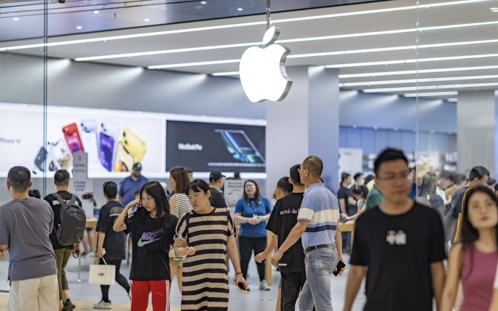
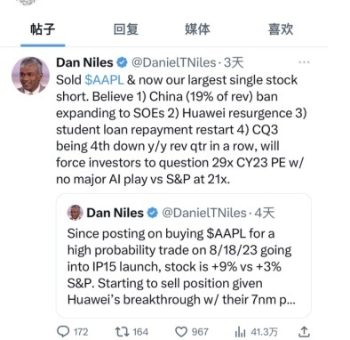
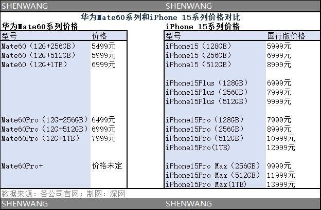
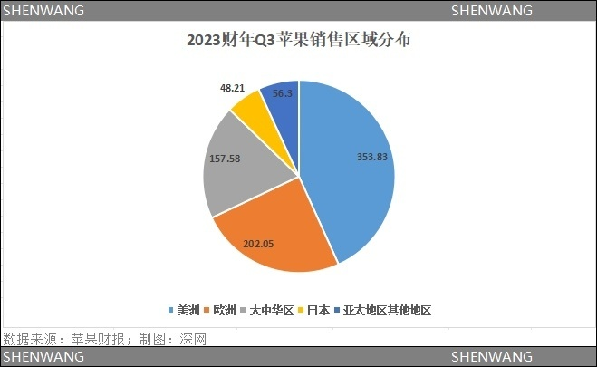

# 涨价、禁令、做空、华为狙击，苹果这次危险了

作者｜张睿

编辑｜康晓

出品｜深网·小满工作室

北京时间9月13日凌晨1 点，苹果举办了主题为“好奇心上头”的秋季新品发布会。

从此次发布会亮点上看，主要包括全球首款3nm芯片、USB Type-C充电接口、全系支持灵动岛、Pro max的潜望式镜头、以及手表的双击手势操作等。

发布会上，苹果CEO库克首先介绍了6月份在WWDC2023上推出的MacBook和首款头显Apple Vision Pro，并表示， **Vision
Pro有望于明年初开始发货** 。此后，库克介绍了这次发布会的主角Apple Watch Series 9和iPhone 15系列。

在芯片方面，Apple Watch Series 9搭载S9芯片；iPhone 15及iPhone
15Plus搭载与iPhone14pro相同的A16仿生芯片； **iPhone 15Pro系列则采用3纳米制程的A17 Pro芯片。**

在充电接口方面，iPhone 15个更换配备USB Type-C充电接口，可以为Mac、iPad、iPhone和第二代AirPods Pro充电。

**与去年秋季发布会相比，苹果此次发布会花了很大的篇幅介绍新品在减碳、环保等方面的努力。** 其中，Watch Series
9是苹果首款碳中和产品，其电池使用了100%可回收的钴。苹果宣布Apple Watch的表带将不再使用任何皮革产品。
**库克在现场承诺，到2030年苹果会让所有业务实现碳中和。**

在价格方面，Apple Watch Series 9起售价为399美元；Apple Watch Ultra
2起售价为799美元；新款苹果手表今天开始销售，于9月22日发货。

iPhone 15起售价799美元，iPhone 15 Plus起售价899美元；iPhone 15 Pro起售价999美元，iPhone
15ProMax起售价1199美元。对比iPhone 14系列，仅iPhone 15 Pro Max的起售价涨了100美元，其他美版iPhone
15均未涨价。

**国行版iPhone 15涨价，苹果遭遇做空**

据苹果官网显示，iPhone 15国行版起售价为5999元，iPhone 15 Plus国行版起售价为6999元，iPhone 15
Pro国行版起售价为7999元，iPhone 15 Pro Max国行版起售价为9999元。9月15日晚8点接受预购，于9月22日发售。

**对比iPhone 14国行版，除128GB配置没涨价外，iPhone
15系列的其他版本的都有所涨价。其中256GB配置的各个版本涨价100元，512GB配置的涨价300元，IT配置的涨价500元。**

国行版iPhone 15价格上涨可能会抑制国内用户购买新版苹果手机的需求。

苹果供应商也将面临业绩压力。天风证券分析师郭明錤此前曾预测，iPhone 15系列的需求将低于今年的iPhone
14系列。他指出，2022年第四季度虽出货下滑，但大部分的零组件出货计划在2022年第四季度并没有显着变化，除非iPhone
15发售后需求优于市场预期，否则大部分的供应商会因iPhone 15需求低于iPhone 14故基本面在下半年面临成长压力。

需要指出的是，就在苹果发布iPhone 15的前一周，对冲基金Satori Fund创始人兼投资组合经理丹·尼尔斯（Dan
Niles）在推特表示，“已经出售苹果股票，苹果公司现在是他们最大的单一股票空头头寸。”

_对冲基金Satori Fund创始人兼投资组合经理丹·尼尔斯（Dan Niles）9月7日的推特截屏_

对于做空苹果的原因，丹·尼尔斯给出了4个理由：一是中国（营收占19%）禁令扩大到国有企业；二是华为复苏；三是学生贷款偿还重启；四是CQ3连续第四年同比下降。

受华为复苏及被资本机构做空等多重因素的影响，苹果市值曾一周跌去近2000亿美元的市值。9月1日美股收盘，苹果总市值为29621亿美元；9月7日苹果总市值27760亿美元，一周蒸发了1861亿美元。

发布会期间，苹果股价一直处于下跌状态，盘中跌幅一度扩大至2%。截至美股9月12日收盘，苹果股价报176.3美元/股，跌幅1.71%，总市值27563亿美元，与前一日28042亿美元的总市值相比，一天市值蒸发了479亿美元。

**苹果和华为重启王者对决**

纵观苹果的这场发布会，除钛合金属边框设计、可定制操作的Action按键与“STANDBY”息屏显示等功能外，iPhone 15 Pro系列并没有太多的惊喜。

在通讯方面，苹果宣布和美国汽车协会（AAA）合作，扩充卫星SOS服务。美国地区用户购买并激活新的iPhone 14和iPhone
15系列机型，可以免费获得为期2年的紧急SOS和道路救援服务。

而华为8月29日线上发布的Mate 60 Pro支持天通卫星通话，是首款支持卫星通话的大众消费级智能手机。

在价格方面，苹果iPhone 15 各个配置的价格都比华为Mate 60系列高。例如，256GB版本、512GB、1TB的Pro系列，iPhone 15
比Mate 60分别贵2500元、4000元、5000元。

华为Mate 60系列带着5G速度回归，苹果手机的销售必然受到冲击。毕竟，在华为“战略性后退”的两年中，苹果蚕食了华为大部分高端手机市场份额。

据IDC数据显示，2020年上半年，在中国600美元以上价位段的智能机市场中，华为以44.1%的份额位居榜首，苹果以44%的占比紧随其后，而一年后的2021年第四季度，苹果就占据了70%以上的高端手机市场。

华为的复苏对苹果的影响主要表现在国内市场和海外市场两方面。

在国内市场方面，大中华区是苹果公司前三大销售区域之一。据苹果2023财年Q3财报（对应2023自然年第二季度）数据显示，这一季度，苹果在大中华区的销售额157.58亿美元，销售占比约为19.26%。

据供应链获悉消息称，Mate 60
Pro已加单至1500万-1700万台。而据IDC数据显示，2023年第二季度，苹果在中国智能手机市场出货量约为1005万台。

在智能手机存量竞争时代，华为Mate
60系列率先发布势必会抢占苹果在中国的市场份额。市调机构TrendForce集邦咨询此前预估，市场景气不佳，加上华为的强势回归，可能冲击今年苹果iPhone整体销量，因此预估iPhone全年生产总数约落在2.2—2.25亿，同比减少约5%。

**华为之外，缺位折叠手机的苹果还要面对OPPO、vivo、荣耀等推出折叠手机的竞争。今年下半年，荣耀（Magic V2）和OPPO（Find N3
Flip）都发布了新款折叠手机。此外，荣耀还将于9月19日发布首款外折屏手机V Purse。**

在荣耀CEO赵明看来，荣耀折叠屏手机会打破直板和折叠旗舰的边界，真正的竞争对手只有iPhone14以及刚刚发布的iPhone15。

**印度市场难成苹果的“救命稻草”**

除国内市场外，苹果在海外市场也会遭遇华为、荣耀等手机品牌的“阻击”。

据《财经》报道，华为已经启动全球手机市场的通盘计划。今年5月，华为P60 Pro、折叠屏 Mate X3
以及一系列全场景生态产品已在德国、阿联酋、马来西亚和墨西哥发布。

不过，与国内市场相比，华为想在海外市场重回巅峰，会面临不少阻力。据counterpoint分析师透露，“在欧洲市场，5G和Google移动服务（GMS）等因素对智能手机市场至关重要。由于在欧洲市场没有5G技术或GMS的支持，2023年上半年华为的智能手机在欧洲市场销售额将非常有限，不到0.1%。”

华为手机短时间内无法撼动苹果在欧洲市场的地位，但重回欧洲市场的荣耀也对欧洲市场虎视眈眈。赵明曾公开表态希望荣耀能成为下一个“欧洲市场的华为”。

大中华区面临和华为的直接竞争，欧洲市场又有荣耀等厂商抢占份额，背腹受敌的苹果开始向印度市场要增量。

在苹果2023财年Q3业绩会上，苹果首席财务官Luca Maestri特别提到印度市场，并表示“iPhone在印度创造了有史以来的最高收入记录”。

从财报上看，苹果并未透露其在印度市场的具体销售额，而是将印度市场销售额合并在亚太等其他地区中。2023财年Q3，苹果在亚太等其他地区销售额为56.3亿美元，与大中华区157.58亿美元的销售额相比，目前印度市场难以拯救iPhone销量下滑的状态。

此外，印度手机市场一直是性价比手机天下。据IDC数据显示，2022年第三季度，印度市场的平均售价为226美元，要让对手机价格敏感的印度用户购买700多美元的iPhone本身就是挑战。

