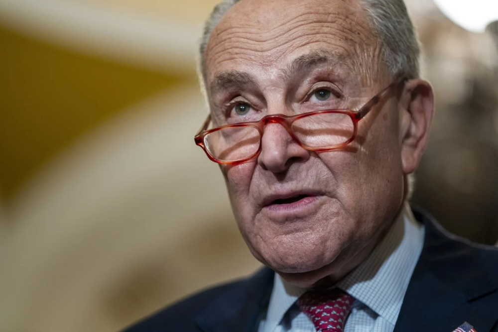

# 美参议院多数党领袖被曝将来华：曾多次敦促美政府对华采取更强硬立场

（观察者网讯）据路透社和彭博社报道，当地时间9月12日，美国会参议院多数党（民主党）领袖舒默（Chuck
Schumer）的助手证实，舒默计划率领一个跨党派国会代表团，对中国、日本和韩国进行访问。

报道称，美媒“Punchbowl News”最早报道了这次计划中的访问，并表示访问可能在10月份进行。

美国国会共和党籍参议员麦克·克拉波（Mike Crapo）办公室证实，克拉波是这次访问的共和党代表之一。民主党籍众议员吉姆·海姆斯（Jim
Himes）此前曾向彭博社说，他希望与其他议员一起前往中国，以增进中美两国之间的了解。

路透社和彭博社提到，舒默曾多次敦促美国政府对华采取更强硬立场，一直是“对华最强硬”的参议员之一，曾推动了美国《芯片法案》、《通胀削减法案》的出台。今年5月，舒默又试图推动一项新法案，以提高美国在技术、安全、涉台等问题上应对中国的能力。

_美国国会参议院多数党（民主党）领袖舒默，图自美媒_

2023年开年至今，美国政客搞出了不少闹剧，从“气球事件”到炒作涉台问题和南海问题，无不激化中美紧张关系。此前多家美媒报道称，中美紧张局势持续之际，拜登政府仍希望恢复两国间高层沟通。

近一段时间，两国高层进行了一系列接触。美国国务卿布林肯6月访华，并在印尼东盟外长会议期间与王毅会面。此后，美国财政部长耶伦、商务部长雷蒙多也相继访华。美国国务院发言人9月11日称，美方始终“期待”王毅在今年年底前访美，美方已发出正式邀请，但没有透露中方是否接受了邀请。

但值得注意的是，在与华接触的同时，拜登政府又对华动作不断。8月9日，美国总统拜登签署行政命令，限制在半导体、量子计算和人工智能（AI）等敏感技术领域的对华新投资，并要求美企就其他科技领域的在华投资情况向美政府进行通报。

关于中美接触，中方此前已多次表态。我外交部发言人曾表示，中美之间保持着沟通。关键是美方不能一方面讲沟通，一方面却不断对中国打压遏制，不能说一套做一套。我们敦促美方端正对华认知，尊重中方的底线红线，停止损害中国的主权、安全、发展利益，同中方相向而行，推动中美关系重回健康稳定发展正轨。

时任中央外办主任王毅7月13日会见布林肯时强调，美方需反思导致中美关系陷入严重困难的症结所在，需把两国元首巴厘岛会晤共识真正转化为具体行动，更需把拜登总统多次作出的一系列承诺切实落到实处。

王毅表示，双方要从具体事情做起，坚决阻止“灰犀牛”，妥善处理“黑天鹅”，彻底搬掉“拦路虎”，为中美关系的稳定积累条件、排除干扰。美方应采取理性务实态度，同中方相向而行，推进中美关系指导原则磋商，拓展外交安全沟通渠道，提升沟通实效，畅通人文交往。

**本文系观察者网独家稿件，未经授权，不得转载。**

