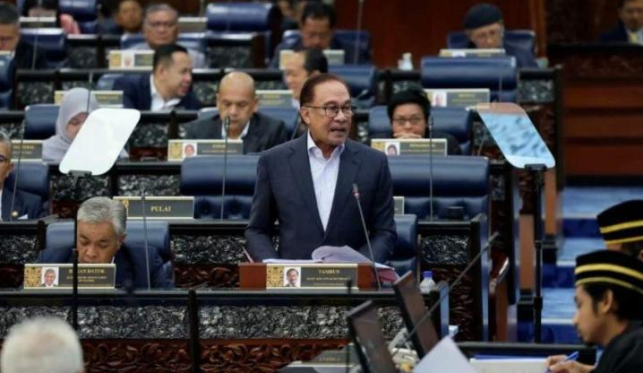

# 马来西亚将禁止稀土出口，分析人士：可能对中企潜在投资有负面影响

【环球时报特约记者 任重】马来西亚总理安瓦尔11日宣布，该国政府将制定禁止稀土原材料出口的新政策，避免这类战略资源因无限制的开采和出口而流失。

 _马来西亚首相指出，稀土行业预料将在2025年为马国国内生产总值贡献95亿令吉 图源
马来西亚媒体_

“此举将促进我国的原材料加工行业，给国家带来额外的收入。”安瓦尔表示，到2025年，稀土行业预计将为马来西亚国内生产总值（GDP）贡献95亿令吉（约合148.12亿元人民币），并创造7000个就业机会。安瓦尔在讲话中提到，政府将制定全国稀土元素资源详细测绘图和推动发展上中下游一体化的综合商业模式，以维持稀土价值链。不过，安瓦尔并未透露何时开始禁止稀土原料出口。

Project
Blue分析师大卫·梅里曼对英国路透社表示，由于缺乏细节，马来西亚禁令的影响尚不清楚，但可能会影响在马来西亚经营的其他国家的企业。他说：“该举措可能对中国企业在马来西亚的潜在投资产生一些负面影响，中国企业一直寻求在其他亚洲国家采购未加工或混合的稀土化合物作为中国南方（稀土）加工设施的原材料。”

《雅加达邮报》报道称，马来西亚稀土矿储量为3万吨，仅占世界供应量的一小部分。多家媒体提到，中国是最大的稀土产地，储量约为4400万吨。中国海关数据显示，今年1月至7月，中国从马来西亚进口的稀土约占中国稀土进口总量的8%。“德国之声”分析称，中国在全球稀土行业占有垄断地位，拥有多个世界第一:
储量第一、产量第一和销量第一。中国稀土产业在全球竞争中优势明显，而西方稀土冶炼分离产能有限，且资本开支和运营成本均高于中国。2021年时，中国拥有的稀土技术专利数量就超过了美国和世界其他国家专利数量之和。

《雅加达邮报》称，除了马来西亚，其他一些亚洲国家也采取或者宣布类似限制措施。印尼自2020年起禁止镍矿出口，目的是通过镍矿的下游加工来实现收入最大化。另一个主要镍生产国菲律宾今年1月考虑对镍矿出口征税，以鼓励对该国下游行业的投资。缅甸克钦邦的邦古瓦地区是该国最大的稀土产地，自9月4日以来，该地区的矿山关闭接受检查。

