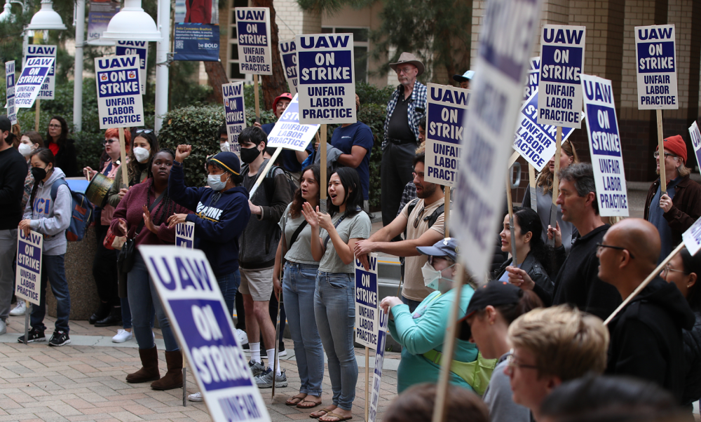
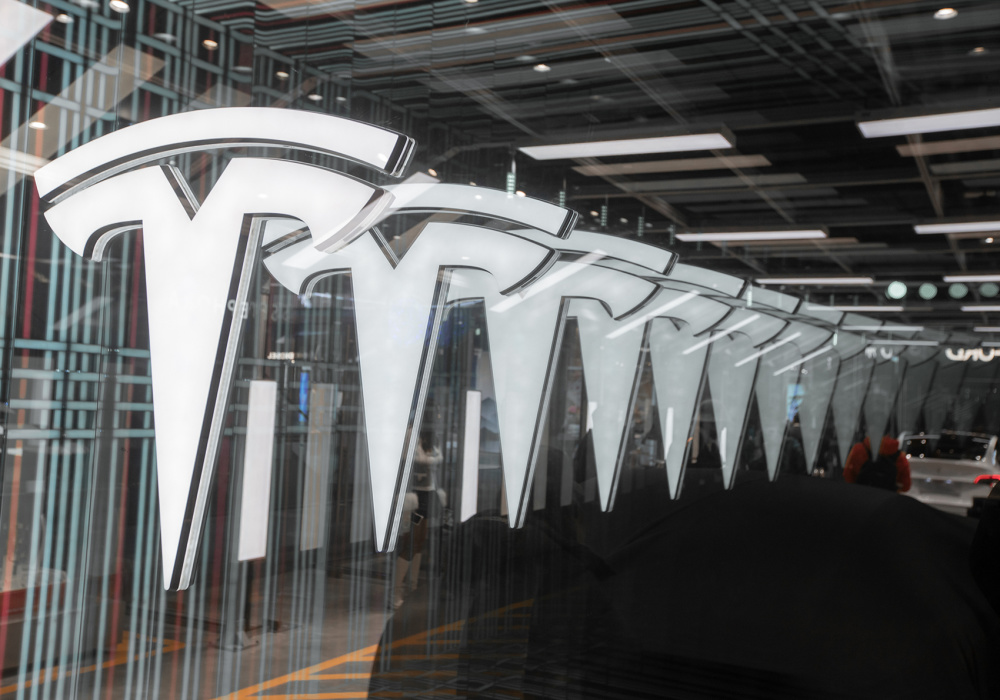

# 15万人涨薪未果，今夜大罢工！或损失50亿美元，特斯拉成最大赢家？

每经编辑：李泽东

全球最猛烈的罢工潮，即将席卷美国汽车行业。

当地时间9月14日午夜，美国汽车工人联合会（UAW）大约15万名会员与汽车三巨头（通用、福特和Stellantis）的劳资合同即将到期。

但由于UAW与三巨头在薪酬提案、工作保障和养老金福利等方面未达成一致，目前双方仍未签署新协议。 **已经有超过97%的UAW会员投票同意罢工。**

**午夜11:59分一过，UAW将历史上首次同时对三家车企发动罢工。**

 _图片来源：视觉中国 VCG31N1245439205_

汽车工人要求加薪40%以上、固定福利养老金

据央视网此前报道，近日，美国汽车工人联合工会（United Automobile
Workers，以下简称UAW）与三大车企——通用汽车、福特汽车和Stellantis集团进行合同谈判，寻求汽车工人的大幅加薪及其他权益。如果工会和车企无法就新的劳动合同达成协议，那么在当地时间9月14日现有合同到期后，可能出现大规模罢工。

根据上述报道，目前已有高达97%的工会成员同意授权罢工。此前，UAW工会主席肖恩·费恩（Shawn
Fain）公开批评上述车企采取双重标准：管理层福利待遇好，而工人权益却没有得到保障；大多数工会成员至今还没有养老金，医保水平也不达标。

报道中称，受经济不景气等因素影响，美国出现大规模罢工的次数有所增加。康奈尔大学的统计数据显示，去年9月1日至今年8月31日间，人数超过100人、持续时间在1周以上的罢工一共出现70次，较此前一年增加了40%。

公开资料显示，UAW为美国最大的工人协会之一，其在“底特律汽车三巨头”——通用、福特、Stellantis集团吸收的成员高达14.6万人，约占美国汽车制造业全部工人数量的56%。

据路透社此前报道，UAW在此次与福特、通用和Stellantis的谈判中，
**寻求为其成员加薪40%以上和固定福利养老金。若满足上述条件，“底特律汽车三巨头”的劳动力成本每年将增加450亿至800亿美元（约合人民币3290亿~5849亿元），并威胁到它们未来的生存能力。**

据官方数据，今年上半年，福特汽车、通用汽车和Stellantis集团分别盈利约37亿美元、50亿美元和119亿美元。康奈尔大学劳资关系教授Harry
Katz表示，“三巨头”丰厚的利润表现增强了UAW的底气。

“三巨头”若同意，无异于自断生路

有观点认为，美国汽车行业当前正处于电动汽车转型的阵痛期，且面临日益激烈的市场竞争和高企的成本。 **“三巨头”若同意UAW的要求无异于自断生路。**

以福特汽车为例，今年二季度，其聚焦电动汽车和创新技术的Ford Model
e业务单元虽然实现39％的营收增长，但总额仅为18亿美元，而同期经营亏损高达10.9亿美元；今年上半年，福特电动车业务亏损达18亿美元。受电动车定价环境、对下一代产品和产能的投资及其他成本支出的影响，福特预计今年电动车业务的亏损扩大到45亿美元，较此前预期高出50%。

也正是基于此，“三巨头”与UAW的谈判仍有较大分歧。Stellantis北美首席运营官Mark
Stewart表示，UAW的要求“非常离谱”，可能会导致工人失业。Stellantis方面同时威胁称，要将旗下部分车型的生产，从美国底特律转移至墨西哥。

福特汽车在近期发布的一份声明中提出加薪9%，并可以一次性付款，此方案将使工人的收入在四年合同期内增加15%，但与UAW提出的要求相差甚远。Shawn
Fain表示，一次性付款对于解决工人的短期困难有所帮助，但长期看来很难提高工人的收入。

 _每日经济新闻 刘国梅 摄_

目前，UAW已向美国国家劳资关系委员会(National Labor Relations Board)提起诉讼，指控通用和Stellantis没有诚意谈判。

“2023年新合同谈判已经于7月开始，但由于现实因素以及UAW新任主席为‘鹰派’，谈判并不顺利。”中信证券方面认为，UAW最终选择罢工的概率不低，该事件或将成为北美汽车行业潜在的“黑天鹅”事件。

摩根士丹利调查显示，绝大多数受访者 (96%)
预计罢工将持续一周以上，超过三分之一（34%）的人预计罢工将持续一个月以上。另据安德森经济集团（AEG）的分析，通用、福特和
Stellantis的近15万名UAW成员罢工，将在10天后造成高达56亿美元的经济损失。

“考虑UAW罢工经费充足，此次罢工烈度或不低于2019年，被罢工整车厂的罢工损失也将较大。即便通过罢工，双方均做出一定妥协，新薪资协议下北美三大整车厂的未来四年人力成本预计也将较目前大幅度上涨。”中信证券方面认为，应持续关注在北美有相关供应链敞口风险的公司的边际变动。整车厂中，通用汽车为首的北美三大主机厂风险较大，如果整车厂长时间罢工停产，相关零部件企业也将面临没有需求而受到连带停产风险。

值得注意的是，8月时，美国总统拜登曾出手调停UAW和企业之间的矛盾。当地时间8月14日，拜登在一份声明中敦促工会与汽车商之间达成公平的协议，他强调向清洁能源经济的转型，需要为汽车制造商和工会工人提供双赢的机会。拜登呼吁三大公司采取一切可能的措施，避免传统汽车工厂的关闭，并在需要工作过渡时，考虑在公司内部进行重组、重建和重新聘用员工，优先为现有员工提供岗位补缺的机会。

罢工或带来50亿美元经济损失，特斯拉“躺赢”？

若罢工真的发生，会造成什么结果？

首当其冲的就是三家车企自身。针对罢工，近日美国咨询机构安德森经济集团(Anderson Economic Group，AEG)在官方网站发布了一份报告。

**报告显示，如果UAW针对三巨头的罢工持续10个工作日，三家企业合计将损失近10亿美元。其中通用汽车将损失3.8亿美元，福特和Stellantis将分别损失3.25亿美元和2.85亿美元，这还不包括企业的商誉损失。对于正处于电动化转型关键时期的传统车企，这显然不是什么好消息。**

但受影响的绝不仅仅是这三家车企。AEG的报告指出，从整体经济的角度来看，合计经济损失将达到50亿美元。AEG表示，这50亿元中包括了三大汽车制造商的盈利损失，汽车经销商在短期和长期遭受的损失，汽车零部件供应商的损失等等。

消费者也会受到罢工的牵连。AEG认为，一般来说短时间罢工不会对消费者和经销商造成太大影响。但是目前汽车库存仅够维持55天左右，这一库存水平仅有2019年的五分之一。因此本次罢工可能会很快波及经销商和消费者。

_每经记者 张建 摄_

此外，可以参考的是，2019年UAW针对通用汽车罢工为期六周，涉及50多家工厂的4.8万名工人，通用汽车损失高达36亿美元，密歇根州经历了单季度经济衰退。本次针对三巨头的罢工，可能会涉及更多工人、工厂。

**鹬蚌相争，渔翁得利。不同于可能大伤元气的三巨头，美国电动汽车品牌特斯拉有希望成为该起事件的赢家。**

分析人士认为，在传统车企积极地向电动汽车转型的关键时刻，这场可能到来的罢工或将对特斯拉构成利好。Wedbush分析师丹·艾夫斯在一份研究报告中表示，如果发生罢工，那么美国汽车产量将受影响，而特斯拉将有机会受益于竞争对手的任何停产。

有意思的是，特斯拉CEO埃隆·马斯克长期以来直言不讳地反对工会组织，他认为工会组织会拖垮企业效率，这也导致特斯拉与UAW之间一直剑拔弩张。

每日经济新闻综合央视网、澎湃新闻、每日经济新闻（记者 董天意）

每日经济新闻

