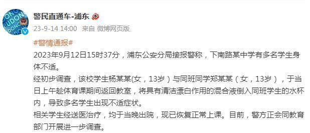

# 上海浦东警方通报一中学有多名学生身体不适

#警情通报#

2023年9月12日15时37分，浦东公安分局接报警称，下南路某中学有多名学生身体不适。

经初步调查，该校学生杨某某(女，13岁）与同班同学郑某某（女，13岁），于当日上午趁体育课期间返回教室，将具有清洁漂白作用的混合液倒入同班学生的水杯内，导致多名学生出现不适症状。

相关学生经送医治疗，均于当晚出院，现已恢复正常上课。目前，警方正会同教育部门开展进一步调查。

