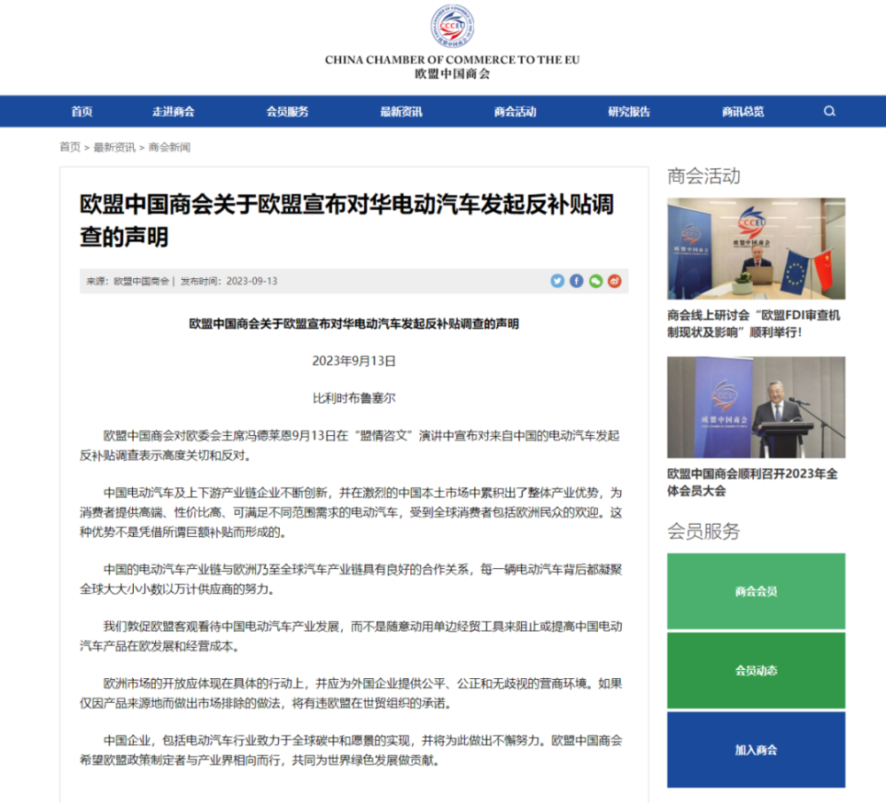

# 中国电动汽车太畅销，欧盟急眼了？欧委会主席：拟发起反补贴调查

每经记者：董天意 每经编辑：王月龙,裴健如

高速发展的中国电动汽车产业“刺痛”了欧洲的“神经”。

据上证报9月13日报道，欧盟委员会官网披露消息，欧盟委员会主席冯德莱恩（von der Leyen）在欧洲议会发表第四次“盟情咨文”时表示，
**欧盟委员会将启动一项针对从中国进口的电动汽车的反补贴调查。**

据彭博社报道，冯德莱恩演讲时称，“全球电动车市场充斥着平价的中国汽车，它们的价格之所以低，是因为获得了巨额的国家补贴，而这正在扭曲我们的市场。”同时，冯德莱恩还强调，“我们必须对我们面临的风险保持清醒的头脑。”

报道中称，冯德莱恩还在讲话中提到了电动汽车对欧盟雄心勃勃的环境目标的重要性。
**“电动汽车关系到我们的环保经济，在欧洲有着巨大的潜力。因此，欧洲对电动车竞争持开放态度，但不接受‘向下竞争’。”** 冯德莱恩表示。

或受此消息影响，港股市场尾盘，多只汽车股出现短线下挫走势。其中，比亚迪股份(1211.HK)股价收跌2.75%，理想汽车（2015.HK）股价跌0.13%，蔚来（9866.HK）股价跌0.86%，小鹏汽车（9868.HK）股价跌2.47%。

**将在13个月内实施措施**

**欧盟中国商会表示反对**

**欧盟中国商会随即对欧委会决定表示高度关切和反对，敦促欧方客观看待中国电动汽车产业发展。**
中国电动汽车及上下游产业链企业不断创新，并在激烈的中国本土市场中累积出了整体产业优势，为消费者提供高端、性价比高、可满足不同范围需求的电动汽车，受到全球消费者包括欧洲民众的欢迎，这种优势不是凭借所谓的巨额补贴而形成的。欧盟中国商会表示，中国的电动汽车产业链与欧洲乃至全球汽车产业链具有良好的合作关系，每一辆电动汽车背后都凝聚全球大大小小数以万计供应商的努力。

欧盟应客观看待中国电动汽车产业发展，而不是随意动用单边经贸工具来阻止或提高中国电动汽车产品在欧发展和经营成本。欧洲市场的开放应体现在具体的行动上并应为外国企业提供公平、公正和无歧视的营商环境。如果仅因产品来源地而做出市场排除的做法，将有违欧盟在世贸组织的承诺。欧盟中国商会最后强调，包括电动汽车行业在内的中国企业致力于全球碳中和愿景的实现，并将为此做出不懈努力。欧盟中国商会希望欧盟政策制定者与产业界相向而行，共同为世界绿色发展做贡献。

事实上，此前就有关于欧盟将对中国电动汽车进口施加压力的传闻。在2023中国汽车流通行业大会上，中国汽车工业协会副秘书长陈士华就曾表示：“我国汽车出口市场一定要高度重视，但不要盲目乐观，我们最担心的是国外对我国汽车出口的‘反倾销’，前两年传出消息了，欧盟下一步可能对我们会采取一定的措施。”

中国汽车工业协会副总工程师兼产业研究部部长许海东也曾表示：“从国际政治经济形势来看，我们担心一些国家强制实施供应链脱钩，这种逆全球化的做法将会影响中国品牌开拓国际市场。此外，中国汽车产品出口还面临各种市场限制、加征关税等风险。”

据公开资料，所谓“反倾销”和“反补贴”调查，是当进口产品以倾销价格或在接受出口国政府补贴的情况下低价进入国内市场，并对生产同类产品的国内产业造成实质损害或实质损害威胁的情况下，世界贸易组织（WTO）允许成员方使用反倾销和反补贴等贸易救济措施，而
**反倾销的措施是对倾销产品征收反倾销税或进行价格承诺，** **反补贴的措施则是限制进口或征收反补贴税。**

据彭博社援引欧盟委员会表示， **反补贴调查必须在启动后的13个月内实施措施。**
临时措施必须在不迟于9个月内实施，如果法律允许，在随后的4个月内将实施最终措施。

有观点认为，欧盟之所以考虑对中国电动汽车实施“双反”调查，与中国电动车出口量激增有关。海关总署发布的数据显示，今年一季度，我国超过日本成为全球第一大汽车出口国，出口量达107万辆，同比增长58.1%。其中，新能源汽车出口24.8万辆，同比增长1.1倍；今年1~7月，中国汽车已出口277.8万辆，同比增长74%，出口额达到552亿美元，增长103.6%。

而欧洲更是成为中国汽车，尤其是中国新能源汽车出海的主要目的地。据中国汽车流通协会副秘书长王都介绍，
**2021年中国新能源汽车出口总量的49%是出口到欧洲市场。**
陈士华也在2022年10月时公开表示，彼时的中国电动汽车已经占到欧洲电动汽车总销量的10%。

在刚刚落下帷幕的2023慕尼黑车展上，中国企业的参展数量是2021年时的近两倍，包括MG、比亚迪、阿维塔、赛力斯、零跑等中国汽车品牌均携新产品、技术集体亮相。而中国车企在2023慕尼黑车展上的“反客为主”，或令欧盟下定决心。

**欧盟内部或仍存分歧**

值得一提的是，欧盟重要成员国法国的态度，或对整个事件的发展产生了深远影响。据彭博社报道，法国财政部长勒梅尔（Bruno Le
Maire）表示，对中国电动车展开调查将有助于提振本土产电动车，避免用法国的公共资金资助外国产电动车。勒梅尔还敦促德国一起采取更严厉的措施来保护欧洲工业。
**“我们现在需要一个更主动、更创新、更能保护我们工业利益的欧洲工业战略。一天也不能耽搁了。”** 勒梅尔称。

今年6月，政治新闻网站Politico发表的名为《法国向欧盟施压威胁对华贸易战》的文章中提到，
**法国官员和法国汽车行业认为其电动汽车产品面临来自中国竞品的直接竞争，** 因此长期以来一直主张对他们所认为的“不公平竞争”采取更严格的限制。

值得一提的是，欧盟内部或对如何应对中国进口电动汽车仍存分歧。据上述报道，德国官员警告称，如果中国采取反制措施可能会损害（欧盟）对中国的出口，并导致在中国进行大笔投资的欧洲企业的日子更加艰难。一位不愿透露姓名的德国汽车行业高管则表示：“（我们）宁愿不要（限制措施），这可能会给欧盟国家与中国市场的贸易关系带来不必要的后果。”

有观点认为，德国、法国的不同态度，或与其本土车企的主销市场有关。汽车分析师Matthias Schmidt认为，法国汽车制造商高度依赖其本国市场，
**“如果新的中国品牌削弱了法国市场在国内的主导地位，那些法国汽车制造商将陷入巨大的麻烦，法国经济也是如此。”**

“ **不受限制地进入中国汽车市场对德国品牌至关重要，**
但对雷诺（Renault）和Stellantis等法国竞争对手来说，情况就不同了，因为它们在中国不那么活跃，且对低成本电动汽车生产商更加敏感。”报道中称。

**我国汽车出口向500万辆进军**

据海关数据，今年1~7月，中国汽车已出口277.8万辆，同比增长74%，出口额达到552亿美元，增长103.6%。同时，乘联会数据显示，今年上半年，中国对欧洲汽车出口量占中国整车出口总量的比重从2018年的5.7%升至39.1%。

“今年我国汽车出口总量非常有希望突破400万辆，向500万辆进军。其中，新能源汽车贡献了重要出口增量，已销往160多个国家和地区。”商务部对外贸易司二级巡视员刘晓光在2023中国汽车产业发展（泰达）国际论坛上表示，目前，我国汽车出口已进入快速发展期。

实际上，无论欧盟如何对中国电动汽车出口施加压力，加速高质量出海进程，都是中国自主汽车工业未来发展的主旋律之一。“中国GDP目前占全球的比重约18%，但是中国的制造业占比是30%，这意味着仅依靠内需消化或出现大面积生产过剩，所以
**中国出口要稳住，汽车行业尤为如此。** ”国务院发展研究中心原副主任、研究员、博士生导师刘世锦在2023中国汽车流通行业大会上表示。

此外，政策的东风也在不断为我国汽车出口“保驾护航”。据央视网报道，今年4月，国务院办公厅发布的《关于推动外贸稳规模优结构的意见》中明确，培育汽车出口优势，各地方、商协会组织汽车企业与航运企业进行直客对接，引导汽车企业与航运企业签订中长期协议。

央视网消息称，商务部新闻发言人束珏婷表示，下一步，商务部将会同相关部门重点做好以下三方面工作：一是加强运输保障，促进汽车企业与航运企业开展中长期战略合作，鼓励航运公司加快建设滚装船队，扩大汽车出口运力；二是鼓励汽车企业与国内外金融机构合作，在依法合规、风险可控的前提下，创新金融产品与服务，更好满足企业需要；三是支持汽车企业完善国际营销和售后服务体系，提升在海外开展品牌宣传、展示销售、售后服务方面的能力，树立良好品牌形象。

中银证券在相关研究报告中预测，受益于我国汽车制造比较优势延续，叠加海外替代需求增长，2023年以来汽车出口高景气度有望延续。

**记者** |董天意

**编辑** **|** 王月龙 裴健如 杜恒峰

**校对|** 孙志成

**｜每日经济新闻 nbdnews 原创文章｜**

未经许可禁止转载、摘编、复制及镜像等使用

每日经济新闻

