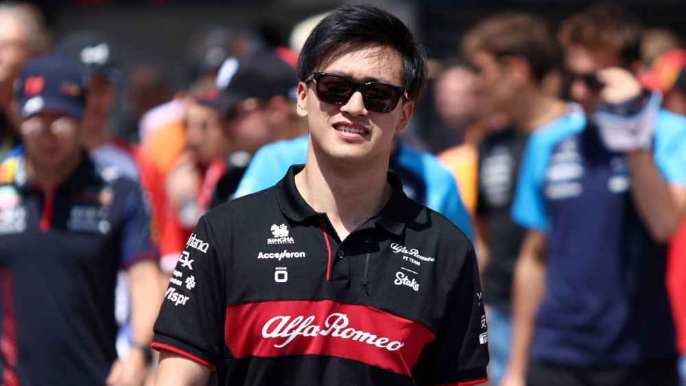

# 中国车手周冠宇与阿尔法罗密欧车队续约，继续出战下赛季F1

北京时间2023年9月14日下午，阿尔法·罗密欧车队官宣与周冠宇续约至2024赛季结束。他将与队友瓦尔特里·博塔斯一起留在阿尔法·罗密欧车队参加2024年F1比赛。

虽然周冠宇在2023年，也就是他在阿尔法·罗密欧车队的第二个赛季和一级方程式比赛中给人留下了深刻印象，但他在车队中的地位受到了严重威胁，其中包括小索伯和二级方程式冠军争夺者波谢尔。

周冠宇现在可以放心了，因为他知道自己的未来在2024年是安全的，车队选择将他留在博塔斯身边，以保持不变的车手阵容。

更多消息，稍后带来。

