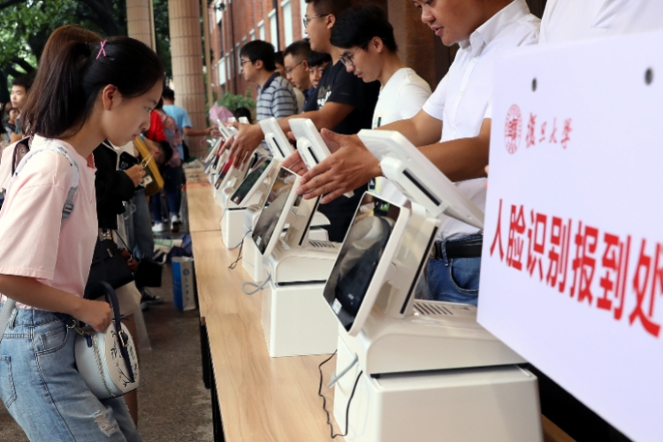

# 人脸识别进校园收每人100元？媒体：除了收费 未成年人信息安全更要紧

日前，广东梅州市梅江区联合中学在校内安装“智能人脸识别系统”，每名学生每年收费100元，引发关注。9月13日，梅州市梅江区教育局通报称，该校学生无论是否交费购买服务均可正常进出校园、宿舍，不存在无法进出的情况，已责令涉事学校全额退费、排查整顿。

学校新增什么收费项目引来家长议论和外界围观，然后就鸣金收兵，不是什么新鲜事儿。但教育局通报所透露出的诸多信息，却让人得以看到围绕“人脸识别”技术的进校园问题，各方可能存在不同程度的误解，而这比那每人100块的收费要重要得多。

首先，学校为加强校园安全管理，委托第三方开发“智慧校园”平台，并由第三方公司拟定并印制措辞很成问题、“内容表述不清”的《致家长的一封信》，由学校代发给学生家长，而且前述信件亦明示，此番缴费回执“由班主任统一收齐”。

且不说，学校在人脸识别系统向家长收费问题上究竟扮演了一个什么角色，是否真如校方所言的那么超然。
**通过“班主任统一收齐”方式加持后的企业行为，家长的这个自愿又还能留几分意思自治的味道？**
况且，就算是一对一地征求监护人同意，如果也由班主任出面完成，监护人能否顺畅表达真实意愿也还存有疑问。

值得注意的一个细节是，涉事学校与第三方合作的人脸识别系统，收费的项目不是人脸识别，而是“短信通知和线上相关服务”，后因为惹来一身骚而被责令全额退费的表述中所说的“充分沟通、尊重家长意愿”，指的也是收费、退费问题。对于人脸识别技术在未成年人身上的使用问题，事实上至今都没有一个明确的认识。

人脸识别，越来越兹事体大。不光是民法典明确处理个人信息应当遵循合法、正当、必要原则，征得该自然人或者其监护人同意；2021年7月，最高人民法院对使用人脸识别技术处理个人信息，进一步将“同意”细化为“单独同意”，信息处理者不得未单独征求用户同意就强制刷脸。在此之前，教育部就曾联合多部委印发文件，引导规范教育移动互联网应用有序健康发展，不仅要求收集使用个人信息“应当明示收集使用信息的目的、方式和范围，并经用户同意”，而且对收集使用未成年人信息明示“应当取得监护人同意、授权”，禁止以默认、捆绑、停止安装使用等手段变相强迫用户授权。

人脸识别技术的相关衍生服务，要不要收费、收多少钱以及有没有“充分沟通、尊重家长意愿”是一回事，人脸识别技术本身的使用，有没有事前征得未成年人监护人同意、授权，则是非常重要的另一回事。而到现在为止，可能不仅是涉事学校、主管教育部门未理清相关法定程序，包括对“人脸识别”收费问题颇有微词、私下议论的家长也需要更加认真地对待这一个人信息安全保护问题。

“人脸识别”的衍生产品、服务收费引发争议，可以全额退费，但这并不代表全程免费的“人脸识别”技术使用和配套服务就必然合法合规。教育部文件禁止默认、捆绑相关技术使用的要求，也必须得到校方、地方教育主管部门的完整理解和执行。
**AI换脸冒用身份的案例已经层出不穷，跟孩子的这一核心生物识别信息相比，百八十块的衍生费用争议有点喧宾夺主了。**

互联网时代的校园安全，已经不光是学生几点入校、几点放学的人身安全，也包括 **作为互联网原住民的一代人，从一开始就必须好好守护的个人信息安全。**
从代学校拟订公开信的企业行为看，其措辞模糊、假借学校权威强推收费服务的意图非常明显，家长和学校对涉事企业大量获取未成年人面部特征这一核心个人信息，有必要经过特别的资质审定。事实上，对学生个人信息安全的合力守护、锱铢必较，也可以是一堂极好的公民信息安全课。

**相关报道：**

[广东一中学安装“智能人脸识别系统”每人每年收费100元，教育局：缴费必须家长自愿
](https://new.qq.com/rain/a/20230912A07LQ100)

