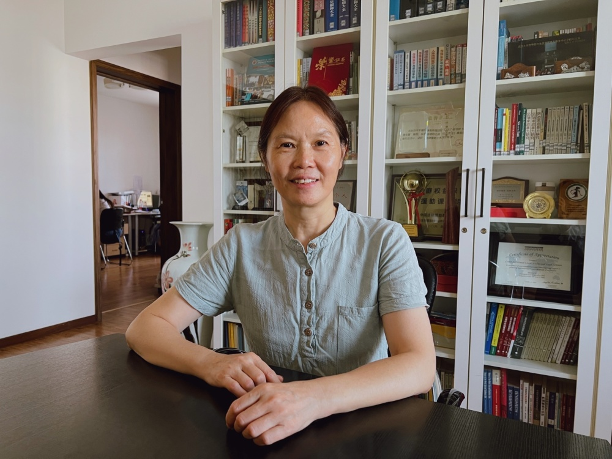

# 农村“外嫁女”如何失去土地失去家园：女性没有家，在哪里都是外人

核心速览：

  * _1_ “外嫁女”土地权益受损这种现象自上世纪80年代以来就一直存在。经济越发达的地方，土地越值钱，对女性权益的剥夺也越狠，对她们的歧视和排斥也更严重。
  * _2_ 社会越发展，我们越应注重保护个人的权利。娘家更富裕，女性结婚后选择留下，不可以吗？向富流动、追求更好的生活是人的本能，无可厚非，为什么只限制女性？这显然是不公平的。
  * _3_ “集体经济组织成员”应该由法律来认定，而不是交给“村民自治”，对于这个问题立法已缺位太久了。今年1月全国人大公布了《农村集体经济组织法（草案）》，但是该草案仍将“成员确认”的权力授权给了“成员大会”，即授权给了村集体。已经有一些文化程度较高的农村年轻女性对自己这种处境感到很绝望，她们说早知道是这样自己就不结婚不生孩子了，因为无论是结婚、离婚、丧偶，她们都不能被当作一个独立的人对待，没有独立的身份权和财产权，出嫁前只能依附于父母，出嫁后则必须依附于婆家，而事实上无论在娘家或婆家，她们都被当作是外人。
  * _4_ 从我们二十多年的实践经验以及一些地方政府和法院的成功做法来看，我们认为以“户口”作为成员资格认定的主要条件是可行的，也是可操作的，但是“落户”要具有一定的法定事由.
  * _5_ 法律怎样才能做到公平并且在实践中可操作？这就需要立法者一定要有性别平等视角，因为女性的权益在现实中往往更容易受到侵害，立法时应充分考虑到女性在现实生活中的某些特殊情况，并通过对法条的精心设置来回应她们的这些现实需求。

这是《一起来学法》推出的全新对话系列《她·法》，旨在关心法律与妇女权益保护问题。

本期我们关注农村妇女土地权益议题。长期以来，“嫁出去的女儿泼出去的水”都不是一句戏言，农村女性一旦婚嫁或者大龄未婚，面临的是真金白银的损失，她们可能失去房屋、失去土地、失去家园，她们也被称为“外嫁女”。

我们请来了关注农村妇女土地权益20多年的北京市千千律师事务所项目主管林丽霞，一起探讨“外嫁女”的问题，也欢迎大家关注微信公号“北京千千律师事务所”。

_林丽霞_

**一起来学法：“外嫁女”群体到底包括哪些人？**

林丽霞：农村女性结婚，只要丈夫不是同一个村民小组的，哪怕是一个村的，就会被视为“外嫁女”。

按照《民法典》的规定，男女结婚后可以自主选择从夫居成为夫家的成员，或者从妻居成为妻家的成员。但在农村，变成了一种强制性的“从夫居”，女性必须把户口迁走。有的地方规定结婚以后三个月之内必须把户口迁走，如果不迁就视为“空挂户”。

所以大部分情况下，
**农村女性只要结婚，无论是外嫁还是招上门女婿，无论人是否还在村里生活，户口是否还登记在村里，村集体已经认为你不属于我这个村，不是村集体经济组织成员，所以不分或者少分土地利益。**
河北保定白沟村的村民规约规定：出嫁女自出嫁之日起不给予福利待遇。而嫁过去之后，很可能在婆家也因为种种原因没有分到土地。还有一种情况是集体利益股权化了，很多女性出嫁后，村里强制她们把股权转让或者集体收回去，但婆家那边可能股权已经核定完了，嫁进去也没有资格再分配，这就造成了她们股权利益“两头空”。

婚姻状况发生变化是农村女性土地权益受损的另一个原因，一些离婚、丧偶、再婚的农村妇女，她们的土地权益难以得到保障。如果她家里没有男丁了，按传统做法，村里就会把她家的土地完全收回，这个传统很吃人。

**甚至有一部分女性并没有结婚，到了一定年龄也会被视为“外嫁女”，无法享受到村组待遇。湖南湘潭子金组的村规民约（2015）规定：凡年满28周岁的正常未婚女性不参加任何分配。为什么会这样？传统上认为养儿防老，儿子可以传承姓氏和血脉。所以很多村规民约会把男性称为世居村民，世居就是你世世代代都是居住在这个地方，相当于他们的根，但农村女性就是“嫁出去的女儿泼出去的水”，是外人。**

**一起来学法：“外嫁女”的哪些权益受损了？范围有多大？这个现象一直存在吗？**

林丽霞：主要是她们的承包地被收回、分不到征地补偿款、分不到拆迁安置房及补偿等。具体受损的范围，每个地方不太一样。有的地方外嫁女及其子女、配偶都没有；有的地方可能外嫁女有，但子女没有，比如浙江省义乌市某街道股份经济合作社旧村改造实施细则规定：在册外嫁女子女不论户口是否在本股份经济合作社均不享受安置面积
。

广东惠州大亚湾区，几位“外嫁女”婚后一直居住在自己的村子里，户口也从未迁出过，和其他村民一样履行了所有村民义务。但2003年全村搬迁，村里的男性村民及其儿子，每人可分到一份宅基地及地上一层(自己可在上面加盖)，而外嫁女家无论几口人全家只能分得一份宅基地及地上一层。2006
年，村小组利用征地补偿款成立了股份合作经营社，村小组成员每人每月可分得1000多元红利，但外嫁女及其子女没有分到一分钱。当年，村集体以每家都有的名义给外嫁女发放5000元补助，她们后来才知道这5000元补助是村里给她们的一次性补偿，外嫁女群体相当于被诓骗了。

**无论是沿海还是内地，这种现象一直存在。经济越发达的地方，土地越值钱，对女性权益的剥夺也越狠，对她们的歧视和排斥也更严重。**

**一起来学法：
除了有和没有的区别，实际的土地权益分配，是不是也男女有别？之前有媒体报道，萧山的村规民约规定“2儿子可以分三个人口的面积，2女儿只能分两个人口的面积”**

林丽霞：是的。一般来说，如果一家有两个儿子的话，每个儿子成年或达到婚龄以后都可以分户独立申请宅基地，父母有自己的宅基地；如果只有两个女儿的话，一个女儿可以留在家招上门女婿为父母养老，她可以单独立户申请宅基地，另一个女儿则必须嫁出，所以未婚前只能跟着父母共享宅基地，不能单独立户。

浙江东阳泉塘村的任雪萍就是类似的情况。《东阳市土地管理实施细则》规定，年龄为22虚岁以上的儿子可以单独立户，申请100平米的宅基地（人均33平米）；没有儿子的家庭当中，只能允许一个女儿申请；父母单独立户的，也就是家里的儿子已单独立户的，女儿不计为建房人口。任雪萍有个弟弟，弟弟当时去外地发展了，她就招了上门女婿，结果弟弟最后回来了，没房子住，家里人都劝任雪萍给弟弟腾地方。任雪萍想重新申请宅基地另外立户，但村里不同意。理由就是“有儿子的家庭，女儿不计为建房人口”。

**一起来学法：看来“外嫁女”权益受损的关键在于不被认定为“集体经济组织成员”，这是由谁决定的？法律有相关规定吗？**

林丽霞：对于集体成员资格问题，目前法律还没有具体规定，但是妇女权益保障法、土地承包法等法律法规有关于保障农村妇女土地权益的相关规定，比如男女在土地及其利益分配方面享有平等的权利
**。**
在成员资格的法律未出台之前，为解决现实问题，实践中有三种方式对成员资格进行认定：一种是由地方政府出台相关指导意见，或通过行政决定书的形式进行认定；第二种是由法院制定相关办法或通过审理的方式进行认定；第三种就是通过村民自治的方式决定，这种方式是最普遍的。由村民自治来决定成员资格是否合理是否公平呢？我们都知道，村民自治决定就是通过村民投票表决，也就是按照少数服从多数的原则来决定
**。**
在农村，大多数女性结婚还是遵从“男娶女嫁”习俗从夫居生活，“外嫁女”选择的则是从妻居生活模式，她们这个群体无疑是少数，所以她们在表决当中永远都是吃亏的。这样的表决结果显然是不合理的，也是不公平的。

**一起来学法：“集体经济组织成员”应该由谁来认定？能否由村民自治决定？**

林丽霞：我认为应该由法律来认定。对于这个问题立法已缺位太久了，可喜的是，今年1月全国人大公布了《农村集体经济组织法（草案）》（以下简称“草案”）并公开征求意见，我们非常关注，并就其中涉及到集体成员资格权和男女平等相关条款的完善提出了修改建议，尤其是草案的第十二条第一款“成员的确认”，我们尤为关注。

关于农村集体经济组织成员资格认定及权利享有问题，现行草案第八条规定了男女享有平等的成员权益，第十一条规定了成员的定义，第十二条规定了成员的确认，之后的条款还分别规定了成员的加入退出、成员身份的丧失不丧失的情形，其中最核心的条款就是第十二条第一款“成员的确认”，而该款将确认“成员”的权力交给了“成员大会”，也就是交给了村民自治。这是否符合法律规定呢？

是不符合的。因为集体经济组织成员身份权或资格权是一种民事权利，根据我国《立法法》第十一条的规定，涉及民事制度的事项应由法律作出规定，因此，认定“集体经济组织成员”的权力不在村集体，而应由法律作出规定。同时第十二条还规定，对于尚未制定法律的事项，即使全国人大要授权也是授权给国务院，而非地方政府，更不是“村民自治”。

所以我对草案的这条规定有不同看法，同时因最近山东东营发生的案例，东营市政府在信访复核时直接引用草案该条款，将对村里“外甥”成员资格的认定权交给了村集体。我们认为该条款对“外嫁女”群体产生了不利影响，极大地阻碍了她们获得公平公正的权利。为此，我们针对该条款再次向立法部门提出了修改建议。
**现行草案“第十二条第一款”规定：农村集体经济组织成员大会按照尊重历史、兼顾现实、程序规范、群众认可，统筹考虑户籍关系、农村土地承包关系、生产生活情况、基本生活保障来源、对集体积累的贡献等因素，依法确认本集体经济组织成员。**
也就是说立法部门将“成员确认”的权力授权给了“成员大会”，即授权给了村集体。这样规定将架空草案中关于成员的定义、成员身份的保留、丧失以及男女平等的条款，也将架空地方行政权和司法权对违法村民自治的依法干预权，更会导致“外嫁女”的维权陷入死循环。已经有一些文化程度较高的农村年轻女性对自己这种处境感到很绝望，她们说早知道是这样自己就不结婚不生孩子了，因为无论是结婚、离婚、丧偶，她们都不能被当作一个独立的人对待，没有独立的身份权和财产权，出嫁前只能依附于父母，出嫁后则必须依附于婆家，而事实上无论在娘家或婆家，她们都被当作是外人。

**社会越发展，我们越应注重保护个人的权利。娘家更富裕，女性结婚后选择留下，不可以吗？向富流动、追求更好的生活是人的本能，无可厚非，为什么只限制女性？这显然是不公平的，是与我们的男女平等国策相悖的，也不符合我们的核心价值观。**

**法律怎样才能做到公平并且在实践中可操作？这就需要立法者一定要有性别平等视角，因为女性的权益在现实中往往更容易受到侵害，立法时应充分考虑到女性在现实生活中的某些特殊情况，并通过对法条的精心设置来回应她们的这些现实需求。例如，关于农村妇女土地权益问题，立法者应充分考虑到农村“男娶女嫁”的习俗使女性是随着婚嫁在流动的，所以在制定土地承包法时就应允许村集体预留一部分机动地，使婚入女性在夫家也能分到一份承包地。但我们现在的土地承包政策是三十年不变，以后还可能长久不变，这个不变的政策就没有考虑到农村女性因婚嫁习俗而受到的不利影响，这样的政策或法律看似中立，其实缺乏性别视角，不能满足农村女性的现实需求。**

**一起来学法： “集体经济组织成员”具体应该如何认定？有什么样的条件和标准？**

林丽霞：从我们二十多年的实践经验以及一些地方政府和法院的成功做法来看， **我们认为以“户口”作为成员资格认定的主要条件是可行的，也是可操作的**
，但是“落户”要具有一定的法定事由，而且还要排除一些有户口但已享有国家体制内保障的人员或原始的非农人员。成员资格的取得可以有三种取得方式，即初始取得、法定取得和申请取得。

比如原农业生产队或生产大队的成员，且户口一直保留在本集体经济组织所在地的，原始取得成员资格。法定取得包括（1）因出生时父母双方或一方（含单亲母亲）是或曾经是本集体经济组织成员且户口登记在本集体经济组织所在地的人员；（2）因合法的婚姻、收养关系、继子女关系，并将户口迁入本集体经济组织所在地的人员；（3）因离异、丧偶或再婚，户口仍保留在本集体经济组织所在地的人员；（4）因离异、丧偶或再婚，户口迁回到本集体经济组织所在地的人员；（五）因国家建设或其他政策性原因，将户口迁入本集体经济组织所在地的人员；（六）其它符合法律法规规定，且户口一直保留在本集体经济组织所在地的。这两种取得方式之外的，属于申请取得的情形。

这样规定几乎涵盖了实践中的种种情形。之所以将离异、丧偶或再婚人员单独列出，是因为实践中这几类人的权益很容易因他们婚姻状况的改变而受到影响。

以户口为核心要素的好处是这样做相对公平、合理，也容易操作，容易证明，更重要的是可以避免“两头得”或“两头空”的情况发生。

**一起来学法：很多学者或者立法者认为，在认定成员资格时，不能简单以户口作为标准，而应综合考虑是否履行义务、是否长期居住生活在本集体、是否以土地收益作为基本生活保障、是否对集体有贡献等因素。这样考虑对不对呢？**

林丽霞：我认为，从法理上说，这样考虑是没有问题的，我以前也是这么想的。但随着我们对越来越多案例的了解，与“外嫁女”群体沟通的深入，在办案中与地方政府和法院互动的增加，我越来越发现，即使很多女性满足了上述各种条件，但仍然享受不到成员权益。于是我就开始对这个问题进行重新思考，并查阅了一些法条和研究性文章，终于发现，上述的种种条件其实都不是认定成员资格的必要条件。例如：“是否履行义务”能否作为一个认定条件？我国民法的价格取向是以权利为本位的，即先享有权利，之后才履行与所享权利相适应的义务，而非必须先履行义务才能享受权利，就像一个人，自出生就享有公民权一样，甚至胎儿未出生前就享有一定的财产权，并不需要事先履行任何义务。集体成员身份权的享有也同理。另外，“是否以土地收益作为生活保障”应如何理解？能否将其作为认定条件之一？如果一位村民主要靠打工或做生意为生，是否就判定他或她不是以土地收益作为生活保障了呢？如果他或她失去了打工挣钱的能力又将如何生存呢？现在农村有多少人不是靠外出务工而只靠种地为生的？土地是否是国家给每位农民的一个基本生活保障？答案不言而喻。而湖南湘潭一位“外嫁女”因未分到征地补偿款提起诉讼，一审、二审、再审、抗诉都以她家“是做粮油生意为生，不以土地收益作为基本生活保障”为由，驳回了她的诉讼请求。这显然是不公平的。“是否长期居住生活在本集体”、“是否对集体有贡献”这些条件又如何衡量？如果没法衡量又怎么能作为成员资格的认定标准呢？男性村民如果长期在外打工，在外购房居住，也不一定对集体有贡献，他们的成员资格和待遇是否也被取消了呢？并没有。那就说明这些条件在实践中并不是作为认定成员资格的必要条件。

**一起来学法：我们担心农村女性“两头空”，但很多人担心农村女性“两头占”，拿了夫家的还想争娘家村里分的钱？这种现象现实存在吗？**

林丽霞：现实会有的，因为关于成员资格认定，目前全国没有统一的标准，所以“两头空”和“两头占”现象同时存在。比如四川一些村子，只要户口在这个地方，就能享受到土地权益，如果这个村的女性结婚后仍留在村里生活，也未迁出户口，她在娘家村能享受到待遇。如果她婆家村的分配规则是娶进来的媳妇都可以享受权益，无论户口迁没迁，人是否长期生活在那里，则她在婆家村也能享受到待遇，这样她就会“两头占”。但如果她婆家的村要求必须有户口且必须长期居住生活在那里才能享受待遇，则她在婆家村就享受不到待遇，如果娘家村又以她是“外嫁女”或“空挂户”为由取消她的待遇，她就是“两头空”。或者如果女性嫁入婆家之后，错过了土地分配或股权核定的时机，她在婆家村则分不到土地或股权，如果娘家村又取消她原有的待遇，她也会“两头空”。但如果以“户口”作为最核心的认定要素，就可以避免“两头占”“两头空”的情况发生。

**一起来学法：一些“村规民约”明显违反国法，伤害女性权益，为什么还能持续存在？**

林丽霞：因为这个问题不仅仅是一个法律问题，还涉及到社会稳定、传统习俗和男女平等之间的冲突，当然也存在能否对法律条文正确理解和适用的问题。但关键的问题还是在于我们是否重视个体的权利保护，哪怕是少数的个体，是否重视女性平等权益的保护。

比如，关于成员资格权相关法律的缺失，村民自治权边界规定得不清晰等，这是法律存在的问题。其次，跟多数男性村民及其家庭成员相比，“外嫁女”这个群体是少数。一些地方政府为了维护当地的稳定，更多考虑的是大多数人的利益，而舍弃了少数个体的利益。

还有就是强制“从夫居”的传统习俗。一些村集体通常是借着传统观念、传统婚嫁习俗这个借口排斥妇女的权益，其本质还是利益的冲突，认为“外嫁女”摊薄了集体中其他人的利益。

另外，能否正确理解和适用法律也很重要。比如《村民委员会组织法》第二十四条规定，涉及村民利益的下列事项，经村民会议讨论决定方可办理，其中第七项是“征地补偿费的使用、分配方案”，这里所指的必须经村民会议讨论决定的征地补偿费的使用、分配方案是什么？其实是指村集体是否将所收到的征地补偿费全部分掉还是只拿出一定比例出来分配，拿出多少比例来分配，多少比例留在村集体用做公共事务开支，而并不是讨论决定谁能分，谁不能分，谁分多少。但在实践中，很多人都错误地理解成村民会议有权讨论决定成员资格权和成员待遇的分配权。一些地方政府和法院将“外嫁女”的成员待遇纠纷推给村民自治，也是基于这一条的规定。

我们发现，在实践中，如果地方政府或法院能适用《妇女权益保障法》的相关条款，或适用《村民委员会组织法》第二十七条关于村里的决定不得与法律法规相冲突的规定，一般都是支持“外嫁女”诉求的。

**一起来学法：我记得妇女村民代表应当占村民代表会议组成人员的1/3，女性也有议事的权利，为什么在明显违法的“村规民约”中，好像没有起到制衡的作用？**

林丽霞：女性在村民委员会或村民代表中占比还远远不够，不足以起到制衡作用。

新修订的《妇女权益保障法》第十四条第三款只是规定“居民委员会、村民委员会成员中，应当保证有适当数量的妇女成员。”《中国妇女发展纲要
（2021—2030年）》提出的参政指标相对要高一些，如要求“村委会成员中女性比例达到30%以上”“社区居委会成员中女性比例保持在50%左右，社区居委会主任中女性比例达到40%以上”。
现实中，大多数地方妇女在村委会成员或村民代表中的比例只占10%，远没有达到30%，有少数地方超过30%。

**一般来说，女性参政比例与女性权利保障成正相关。如安徽长丰县的安费塘村，村支书是位年轻女性，村里女性代表的比例超过了45%甚至达到一半，所以这个村男女平等国策落实得很好，没有出现过任何关于“外嫁女”权益纠纷方面的问题。**

**一起来学法：有没有主动修改歧视女性的“村规民约”的？**

林丽霞：有的。如云南玉溪华宁县的城关社区，社区书记从2016年就开始在酝酿村规民约的修订。城关社区原来是一个城中村，属于村改社区，因为经济条件较好，在利益分配中对“外嫁女”也是排斥的，导致一些“外嫁女”不断上访，耗去了村干部大量的精力。于是，村书记下定决心要改变这种局面，他想到了组织全体村民来修改村里的老规矩——集体收益分配规则。这个过种当然非常艰难，他们先做通党员和村干部的工作，再做小组长和村民的工作。村书记说：“谁能保证自己世世代代都生儿子？”在这个过程中，有些村民就生了女儿，村书记抓住这样的事例进一步做工作，他说，“女儿同样是我们的血脉，是我们的传承人”。就这样一步一步地摆事实、讲道理，通过近60次大大小小的会议，历时近两年，最后终于达成共识，制定了男女平等的村规民约。

**一起来学法：司法机关是如何处理“外嫁女”土地权益受损案件的？**

林丽霞：我们从2004年开始接到类似的投诉，选择代理了一些案件，但是发现这些案件很难胜诉。我们选择代理的200多起案件中，接近九成遭遇了败诉或是不予受理（理由几乎都是土地及其权益分配属于村民自治的范畴，不属于法院的受案范围）。

我们的当事人中，有些“外嫁女”为争取土地权或集体收益分配权信访了二、三十年，穷尽了现行法律框架内所能采取的一切可能的救济措施，最后仍被推回到原点——由村民自治决定。

从上世纪九十年代开始就已经有类似的纠纷，一些法院对是否受理此类案件有疑虑，最高人民法院针对一些地方发生的案例曾先后作过“不予受理”和“应当受理”的批复。所以，不同的时期，法院处理的态度也不一样。

一些地方法院为了解决“外嫁女”权益纠纷，制定了相关内部审理意见。陕西是比较早受理此类案件的省份。2004
年，西安市中级人民法院发布实施了《关于审理农村集体经济收益分配纠纷案件的意见》，规定了已婚、离婚、丧偶女性及其子女要求其原户籍所在地给予同等分配收益权，对于此类诉讼，人民法院应予支持。2010年，河北省邢台市中级人民法院也出台了类似意见。西安和邢台中院的法官在一些研讨会中都谈到，他们的意见实施以后，“外嫁女”的上访量在第一年都下降了60%。2008年和2012年，海南省高院先后两次发布了《关于处理“外嫁女”请求分配农村集体经济组织征地补偿款纠纷案件若干问题的意见》，里面提到关于“外嫁女”农村集体经济组织成员资格的认定，要从户籍、实际生产生活在何处、基本生活保障是否仍在原集体经济组织等方面综合把握。

还有其它一些省市的政府或法院也制定了类似规定。我们发现，凡是有这种规定的地区，“外嫁女”的纠纷相对较少，来北京上访的就更少或没有。

**一起来学法：有没有支持“外嫁女”的案例？**

林丽霞：有。如2005年我们代理的安徽桐城韩某等五位出嫁女的案件，2006年代理的呼和浩特市赛罕区聂某、徐某等28位出嫁女的案件就胜诉了。今年我们在山东菏泽郓城县代理的案件也胜诉了，不过目前还没有执行到位。从裁判文书网上也可以查到很多“外嫁女”胜诉的判例。

**一起来学法：有学者担心，由法律来明文规定村集体成员的资格认定，是没办法回应各地的差异化需求的，很可能有负面后果？**

林丽霞：我理解他们的担心，不过从我们的经验来看，这种顾虑是多余的。没错，
**各地的文化、经济条件是有差异，但在对待“外嫁女”权益的问题上，全国其实是惊人的相似。因为在农村基本上都遵循“男娶女嫁”从夫居的婚姻习俗，女性结婚前从父居，结婚后从夫居，由此导致女性的财产权往往也是依附于“父”或“夫”，无论是在家庭财产还是村集体的财产分配上均如此，只是每个地方表现出来的程度可能不太一样。**
我们咨询和代理的案件来自全国不同地方，我们也在不同省份做过调研和试点，所了解到的这类纠纷案件无论是产生的原因、表现形式、受害群体、处理的方式等基本上都是相同的，村规民约的表述基本上也一样，其实质都是利益的分配问题，村集体采取的方式往往是以婚嫁习俗、婚姻状况变化为由排斥女性（其子女和丈夫往往是受牵连人群）、把女性的财产权依附于其家庭，不重视女性个人权利的保障。这显然跟我们时代的发展是不和拍的，
**我们应该想办法把这些传统观念里的糟粕给纠正过来。比如通过立法更好地保障农村妇女的成员权益，因为法律有正向引导和纠偏的作用。如果没有相关法律的规定，地方法院和政府在处理这些问题时没有依据，只能靠村民自治，但这些“外嫁女”和村民之间本身又存在利益冲突，怎么能让村民投票来决定她们的权利呢？利益越大，纠纷越严重，如果没有村外力量的干预，
“外嫁女”的问题可能永远都解决不了。**

我们在很多村调研时，有些村书记也认为，国家能统一制定关于成员资格认定的相关法律是最好的，这样可以减少他们的压力，“因为村民都是为自己的利益着想，都想着自己能多分，哪会考虑别人的权利。如果国家有统一的法律规定，我们执行起来相对要容易得多”。我也相信，有了法律，就相当于有了方向，地方政府和法院也才有了依据，对村民的引导教育也才有了基础，唯有如此，村民观念和行为的改变也才有了可能。

关于“外嫁女”土地权益问题，如想进一步了解，欢迎大家阅读和观看：

关于《农村集体经济组织法（草案）》第十二条的修改建议——基于该条款在现实中对“外嫁女”群体造成的实际不利影响

https://mp.weixin.qq.com/s/abiwKS4mz6467fBYfdJcOg

当这些失去土地的妇女站出来维权时，她们往往会变成一个家庭、一个村庄的敌人 | 林丽霞

http://www.woman-legalaid.org.cn/news/1719.html

