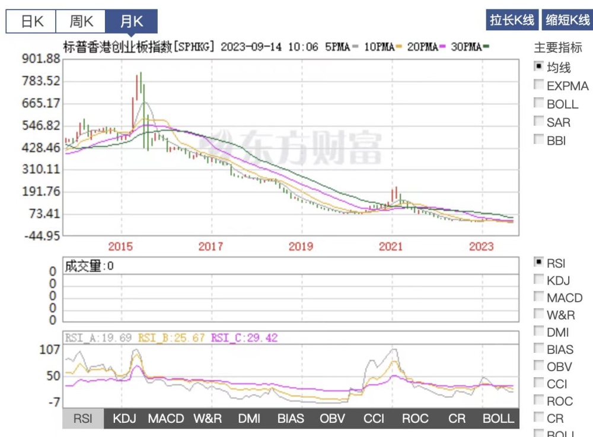
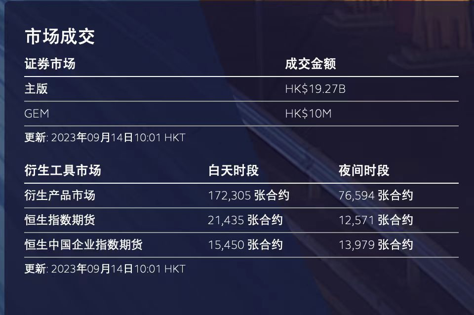

# 到底发生了什么？香港创业板指数即将归“0”

**财联社9月14日讯（记者 成孟琦）** 一只指数从历史高点1824点跌震荡下跌，如今只剩25点，不少吃瓜群众表示此指数“即将清零”。

这只指数就是标普香港创业板指数。9月13日，标普香港创业板指数收报25.60点，年内跌幅达近30%；距离2007年标普香港创业板指数1823.74点的历史高位，更是几乎“抹零”。

对此，不少业内人士认为，香港创业板交投冷淡，近期更有沦为“仙股”“庄股”基地倾向。不过，港股主要还是看主板。

**香港创业板已近3年无新股上市**

被遗忘的香港创业板，除了指数下跌至几乎“抹零”外，更是已有32个月没有任何新股上市。

最近一次有新股在创业板上市还是2021年1月，新股名为裕程物流。

这只创业板“最后的新股”，今日和此前多数日子一样，成交额为0，拉出月K线来看，股价自上市后第二个月触及历史高位1.43港元，之后一路下泄，如今只剩0.224港元，对应市值6720万港元。

和这只“最后的新股”类似，股价低于1元的仙股，已经成为香港创业板的主力，创业板因此“仙气飘飘”。

截至9月13日收盘，香港创业板超310只股票股价低于1港元，占比超过94%；112只股票股价低于0.1港元，占比超过三分之一；最便宜的个股只有0.01港元。同时，19只股票股价高于1港元，7只股票股价高于2港元，其中股价最高的为讯智海，9月13日收盘价为4.09港元。

成交额来看，创业板的日均成交额更是“凄凄惨惨戚戚”。据港交所2023年8月数据，334只创业板个股中，只有7只月成交总额超亿元，分别是惠陶集团、维亮控股、纳尼亚集团、耀星科技、大唐潼金、传承教育和中国有赞。而整个8月，有不少创业板个股的成交额上赫然印着“0”。

**香港创业板的前世今生**

虽然如今创业板面临着新股数量、成交额和指数的“三杀”，但最初香港创业板也曾被誉为香港版“纳斯达克”。

根据港交所官网介绍，香港创业板为中小型企业而设，服务对象是希望通过上市集资进一步发展业务的中小型发行人，其上市要求低于主板，但持续责任与主板类似。

成立之后，香港创业板在2007年金融危机泡沫破裂后一度大跌超74%；2008年，港交所简化转往主板的程序，创业板变相成为转主板踏脚石；2009年，该指数再度大涨超过75%；但自2015年后震荡下跌，如今仅仅只剩25点；再加上香港创业板一直存在着“唱高散货”这样的骗局，让许多散户投资者丧失了信心，从创业板撤出。

一直被证监会痛批的“唱高散货”，一般为通过各种手段推高股价，然后利用社交媒体平台散播“内幕消息”，误导投资者买入流动性低的股票，再将股票抛售套利离场。

**必须先解决投资者需求和流动性问题**

香港证监会行政总裁梁凤仪此前表示，香港证监会过去数年持续打击“造壳”和唱高散货活动，已让市场向更公平、更透明的方向发展，港股市场如果要继续为中小企业发挥集资功能，就必须进行改革，重拾为优质企业建立初级市场板块的初衷。

尽管正受调查的“唱高散货”个案所涉及的小型股只占市场的小部分，但这些骗局已令投资者蒙受巨额的财务损失，同时亦可能动摇投资者的信心。俗语有云：“一朝被蛇咬，十年怕井绳”。投资者一旦损失，便可能不会再踏足市场，因而可能会损害市场的流动性和估值，尤其是小型股板块。

此外，香港创业板还是吸引了不少借壳上市投资者，为打击炒壳，港交所曾两度改革创业板，包括取消转板的简易程序和调高新股上市要求。今年，香港财政预算案中有一项安排与创业板改革有关，港交所将很快就此展开公众咨询。

梁凤仪称，现在是时候重新整备部署，重新聚焦于吸纳优质的小型股公司，推动相关板块可持续增长。不论对创业板采取任何改革举措，应配合发展蓬勃的小型股生态系统的愿景和路线图，借此支持小型股在创业板以至主板市场的流动性。另外，也必须先解决投资者需求和流动性的问题，因为在投资者欠缺兴趣进而导致股票流动性偏低的情况下，即使有更多公司加入，亦不大可能提升香港IPO市场。

（财联社记者 成孟琦）

