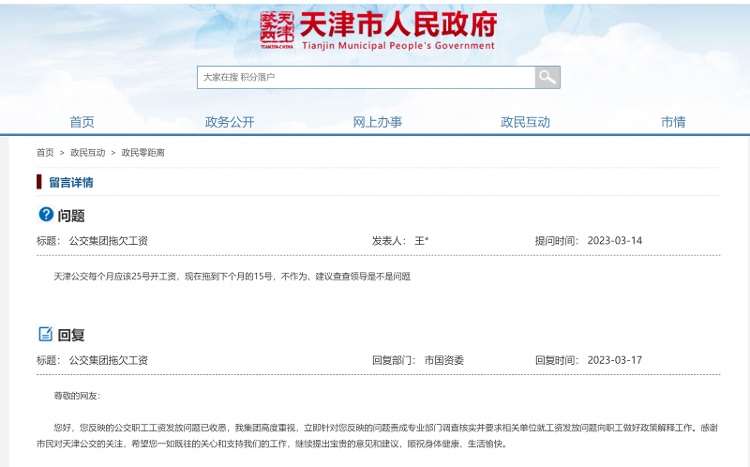
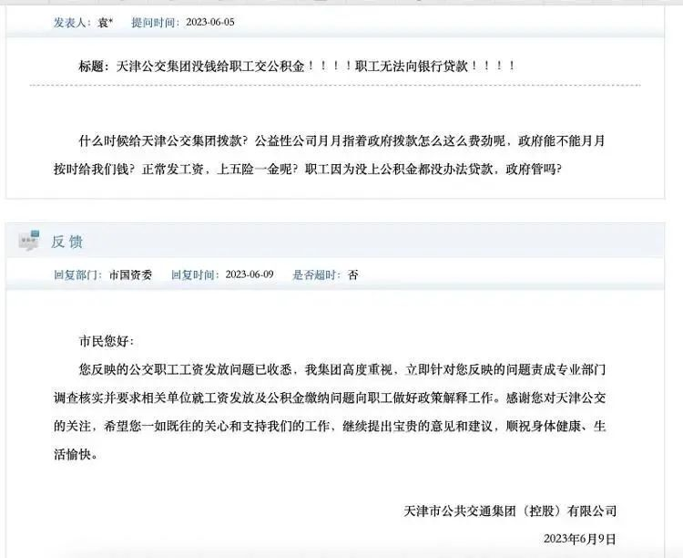
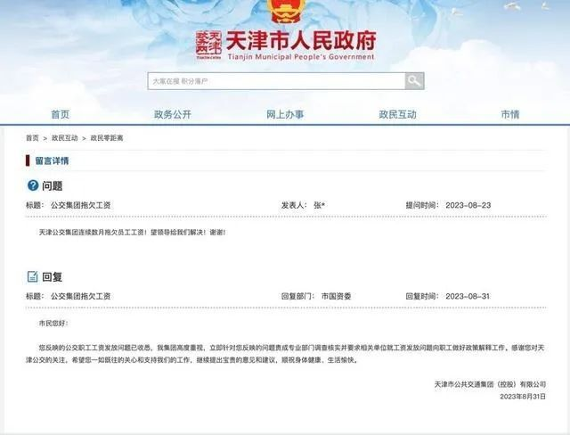

# 天津公交拖欠员工工资？曾多次回复“高度重视”，去年净亏损近7亿元

近日，网传天津市公交集团拖欠员工工资、停缴保险一事持续发酵。有网友发文反映，从今年6月份开始到现在没有发放一分钱工资，并且保险也停了。天津公交集团现有职工1.83万人。

近年来多个城市曝出公交运营问题，但此次发生在直辖市天津，尤其令人关注。

**曾回复“高度重视”**

天津市公共交通集团（控股）有限公司（以下简称“天津公交”）是一家具有多年历史的国有企业，始建于1904年，也是中国内地第一家从事现代城市公共交通的企业。天津公交旗下共有直属各级全资、控股、参股企业43家，直属事业单位1家。截至2022年，该集团有员工1.87万人，运营线路548条，运营车辆6541部。

自今年3月份起，天津公交拖欠工资的内容开始在问政平台上出现。在天津市人民政府政民互动板块上，3月14日有留言称，“天津公交每个月应该25号开工资，现在拖到下个月的15号”。天津市国资委对此回复：反映的公交职工工资发放问题已收悉，集团高度重视，立即针对您反映的问题责成专业部门调查核实并要求相关单位就工资发放问题向职工做好政策解释工作。

今年6月5日和8月23日，问政平台上仍有人反映，天津公交拖欠员工工资，没给职工缴纳公积金，导致职工无法办理房贷。天津公交集团作了同样的回复。

据大皖新闻报道，一名天津公交客服人员称，不仅是公交车司机，包括他们客服在内，整个集团很多员工工资都被拖欠。该客服表示，今年是她在天津公交上班的第十个年头，最近两年工资经常被拖欠。

针对拖欠工资一事，天津公交客服人员对界面新闻表示，不清楚具体情况，无法接受采访。工作人员提供给界面新闻的天津公交宣传部的电话，一直无法接通。

据海报新闻报道，天津公交集团表示不清楚此事；天津市国资委工作人员表示，从未接到公交集团职工投诉拖欠工资的问题。

据界面新闻报道，一位天津公交司机表示，“9月12日刚发了一个月的，还压着两个月工资，到本月20日就又相当于压了3个月，并且今年夏天防暑降温补贴也没发。”一位天津公交司机的家属证实，“从今年六月份到现在一直都没发工资，医保也停缴了，去年8月份那个月的社保也没缴。”该家属称，曾多次拨打过公交公司电话询问工资发放时间，但是工作人员一直回复不知道。

9月13日，齐鲁晚报记者采访天津市公交集团、天津市12345政务服务热线、天津市国资委等多个部门，没有得到明确答复。

今年4月，A股上市公司松芝股份（002454.SZ）发布了《对外提供财务资助的公告》。公告表示，天津公交向松芝股份借款2000万元人民币，用于补充流动资金，资助期限为提供资金之日起12个月，年利率为6%，于借款到期日一次性支付。公告中还披露了天津公交近两年的财务状况。公告显示，天津公交2021年和2022年的营收分别为9.37亿元、5.9亿元，归属于母公司所有者的净利润分别亏损6.89亿元、6.94亿元。

松芝股份与天津公交集团并无股权上的关系。天津公交集团的全资股东为天津市国有资产监督管理委员会。松芝股份主要从事汽车、轨道交通及冷链物流等领域热管理相关产品的研发、生产和销售，产品包括汽车空调等。对于向天津公交集团提供财务资助，松芝股份称“为了有效提高资金使用效率，与重要客户建立长期战略合作关系”。

4月14日，松芝股份在回复中证中小投资者服务中心的《股东质询函》中对天津公交财务状况进一步披露。其中提及，天津公交主要还款资金来源为财政拨款补贴。天津公交作为天津市的主要公共交通运营企业，为国有独资企业，其业务具有一定的公益性质，每年天津市级财政及区级财政均有较大金额的财政拨款补贴。

数据显示，2020年-2022年，天津公交共获得的天津市级财政和区级财政财政拨款补贴总额分别为22.6亿元、32.5亿元和32.9亿元。今年一季度，天津公交获得市级财政和区级财政补贴8.3亿元。

**城市公交运营困境频现**

地方公交公司陷入困境的现象并不罕见。

今年2月23日上午，河南商丘市公共交通有限公司（下称“商丘公交公司”）发布公告称，3月1日起暂停运营商丘市市区公交线路。公告称，受疫情冲击、
**国家新能源补贴政策调整、财政补贴不到位等多种因素叠加影响，公司亏损十分严重**
，经营异常困难，员工工资、社保金拖欠，无力支付，车辆充电电费、车辆保险等无资金购买，已经无法继续承担老百姓出行的公益性事业和民生工程。

通告发出后社会反响强烈。商丘公交公司很快删除这一公告，并发布一则新的公告称，将克服困难，确保公交不停运，不影响公众出行，此前发布的公告对社会造成的不良影响，深表歉意。

商丘市人民政府发布的情况说明显示，商丘公交公司是由2006年改制的民营公司，负责运营商丘市市区公共交通，市财政一直按约定予以补贴。受疫情影响，该公司经营确实遇到困难，市政府工作组已进驻，将依法依规查明情况，进一步纾困解难，确保市区公共交通正常运营。

商丘公交停运事件也不是个例。

由于具有公益属性，公交票价一直维持在较低水平。目前大部分城市的公交票价为2元，难以覆盖成本，民营化后的公交公司仍然对政府补贴极度依赖。只要政府补贴不到位，就容易面临亏损。而公交作为基础公共交通服务，又不能取消，由此陷入两难境地。而在多位公交行业从业者看来，“电池故障”恶化了经营之困——
**新能源补贴不再、亏损加剧、乘客流失、车辆亟待更新……续航焦虑可能成为压垮民营公交企业的“最后一根稻草”。**

今年8月，湖北民营公交公司公交车现电池等质量问题，引起市场广泛关注。

8月10日，每日经济新闻记者曾实地探访了黄石市鸿泰公共巴士有限公司。记者在该公司的停车场看到，烈日之下，数十辆停止运营的公交车旁边荒草丛生，车内积满了灰尘。

据黄石鸿泰工作人员向记者介绍，2016年-2017年，黄石鸿泰分两批共向亚星客车购买了142辆纯电动公交车，目前有46台完全不能用，加上电池有问题影响使用的车辆，运营困难的车大概有70辆。

有公交司机表示，还有75%电，车就瘫了，司机40度的天不敢开空调。

今年7月，河北保定公交停运事件也曾掀起一阵舆论风波。根据上游新闻报道，保定公交公司2015年购置的首批纯电动车因电池问题陆续下线，截至今年7月初运力不及高峰期的四分之一。

电动公交的成本很大一部分来自于电池，但电池在使用过程中存在衰减，制约了公交车的使用年限。而如果要更换电池或者直接更换车辆，公交公司目前普遍无力负担。

**编辑|** 卢祥勇 杜波

**校对|** 汤亚文

每日经济新闻综合自界面新闻、齐鲁晚报、海报新闻、大皖新闻、每经App

**此前报道：**

[天津公交集团拖欠员工工资？宣传部工作人员：不清楚此事，不方便回答
](https://new.qq.com/rain/a/20230911A07RJD00)

