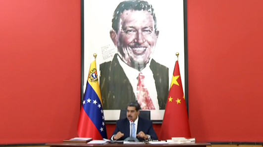

# 委内瑞拉总统：要经由中国航天器，把首个委内瑞拉航天员送上月球

（观察者网讯）14日，美国《华盛顿邮报》、法新社等多家外媒报道称，委内瑞拉总统马杜罗13日在华进行国事访问期间表示，作为两国新升级的全天候战略伙伴关系的一部分，他要经由中国的航天器，将“首位委内瑞拉男性或女性送上月球”。

马杜罗说，中委两国同意加强在石油、贸易、金融、采矿和太空探索等多个领域的合作。

“很快，委内瑞拉的年轻人就将来到中国的学校，为成为航天员做准备。”他称，这是中委合作“新纪元”的一部分。

2021年3月，中国和俄罗斯正式启动国际月球科研站项目的合作，标志着两国在航天领域的合作迈入新阶段。据新华社报道，今年4月25日，在2023年“中国航天日”第一届深空探测（天都）国际会议上，中国工程院院士、深空探测实验室主任吴伟仁就国际月球科研站建设作主旨报告，并向世界各国发出合作倡议。

4月，委内瑞拉外交部长伊万·希尔在社交媒体上宣布，中国已邀请该国参加国际月球科研站相关项目，还强调委内瑞拉是首个受到中方邀请的国家。

7月18日，委内瑞拉部长理事会副主席、科技部部长加布里埃拉·希门尼斯在社交媒体上宣布，委内瑞拉玻利瓦尔航天局（ABAE）与中国国家航天局签署了一项联合声明，委内瑞拉将正式加入国际月球科研站计划，也是首个加入的美洲国家。

9月初，中国驻南非大使馆陈晓东代表中国国家航天局，与南非国家航天局穆道局长签署相关谅解备忘录，标志着南非正式加入国际月球科研站计划。

应中方邀请，委内瑞拉总统马杜罗9月8日至14日对中国进行国事访问。这是马杜罗以总统身份第五次访华，也是他自2018年以来首次访问中国。马杜罗行前在委首都加拉加斯接受新华社专访时说，委中关系建立在真诚互信的兄弟关系和成果丰硕的共同发展基础上，是21世纪国与国之间关系的典范，委内瑞拉愿与中国一起推动构建人类命运共同体。

9月13日下午，中委两国元首宣布，将中委关系提升为全天候战略伙伴关系。

两国《关于建立全天候战略伙伴关系的联合声明》写道，“双方忆及在‘委星一号’通信卫星、‘委遥一号’和‘委遥二号’遥感卫星项目中取得的成就，同意进一步深化航天领域合作，在联合国外空委等平台加强协调，促进公正、合理的外空全球治理。中方欢迎委方加入国际月球科研站合作，双方高度赞赏关于航天领域合作的框架协定的签署，愿通力协作，共同推动通信和遥感卫星、月球与深空探测等领域合作项目进展，促进两国航天能力提升和国民经济发展。”

_9月14日，马杜罗完成了为期一周的访华行程，在北京召开新闻发布会。视频截图_

9月14日外交部例行记者会上，外交部发言人毛宁介绍，委内瑞拉总统马杜罗此次访问取得了丰硕成果，双方发表了《中华人民共和国和委内瑞拉玻利瓦尔共和国关于建立全天候战略伙伴关系的联合声明》，签署了数十项合作协议，就共建“一带一路”，加强在经贸、文化、旅游、航天、民航、科技、媒体等各领域的合作达成了共识。

毛宁表示，中方将一如既往地支持委内瑞拉方面维护国家主权、社会稳定的努力，也支持委内瑞拉方面反对外部干涉的正义事业。我们相信这次访问将有力地推动两国关系和两国各领域合作，实现更高水平、更宽领域的发展，也为两国人民带来更多的福祉。

**本文系观察者网独家稿件，未经授权，不得转载。**

