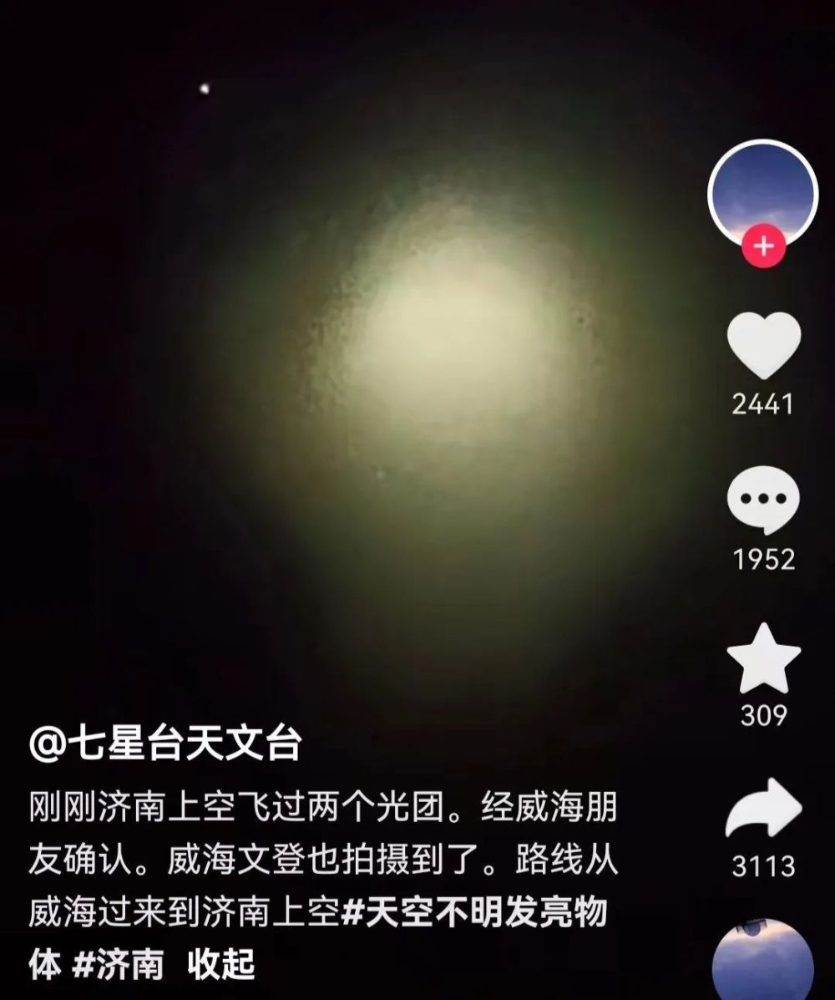
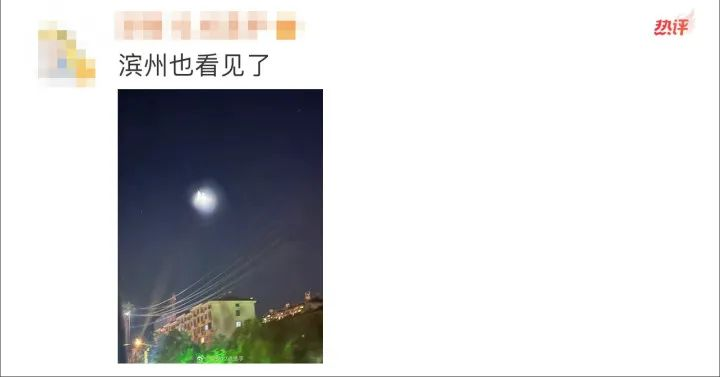
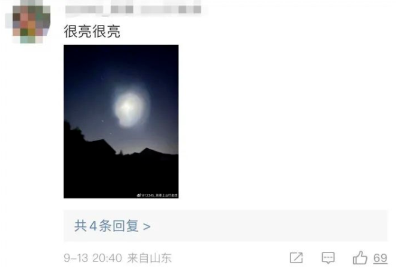
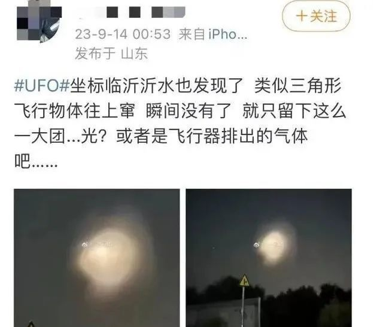

# 山东多地网友拍到“UFO”，专家推测：不排除是我们国家的反导试验

山东商报·速豹新闻网记者 郑芷南 任为

9月13日晚上8点8分，山东多地有网友发出拍到空中不明飞行物体的画面，各地网友也在评论区下分享出自己同时间段内拍摄到的相同画面。

此前，山东省济南市七星天文台6天3次拍到不明飞行物的话题引起网友的讨论。

天体物理博士刘博洋告诉记者，每次有导弹试验被网友看到都会被称为UFO，成为家常便饭。

9月13日晚上8点8分，一山东网友在网上分享出他刚拍摄到疑似不明飞行物的画面。拍摄者描述，
**开始天空中是漆黑一片，后来逐渐出现两个亮点，并且越来越大。接着又成手电筒状向下照射出两团光线，随之变为一团迷雾**
，消失在黑夜中。拍摄者说这一现象发生在几秒钟内，很快消失。接着，山东各地网友评论，同时间也在其他地方看到，有网友晒出自己用手机拍到的类似画面。

9月14日，记者再次连线济南七星天文台6天3次拍到不明飞行物事件的解读专家，天体物理博士刘博洋。
**刘博洋对此做出解释，网友看到的明显的两个锥形发光物体，这是典型的火箭发动机在大气层外工作，喷出的燃烧产物中有水，水在高空运动结晶，结晶之后就可以反射光线，就会成为这种锥形**
。

因为高空中没有阻力，所以火箭发射中喷射的尾气可以迅速扩散至很大的范围，所以这个现象看起来就很壮观。因为它（火箭）很高，所以很大范围的民众都可以看到。“至于为什么是两个，不排除我们国家的反导试验一个发射一个拦截这种，具体是什么，因为涉密，我也不知道。”刘博洋说，“这个经常看到，每次有导弹发射形成火箭云，被网友看到都会被成为UFO，这都是家常便饭了。”

山东商报·速豹新闻网编辑 李瑞琪

