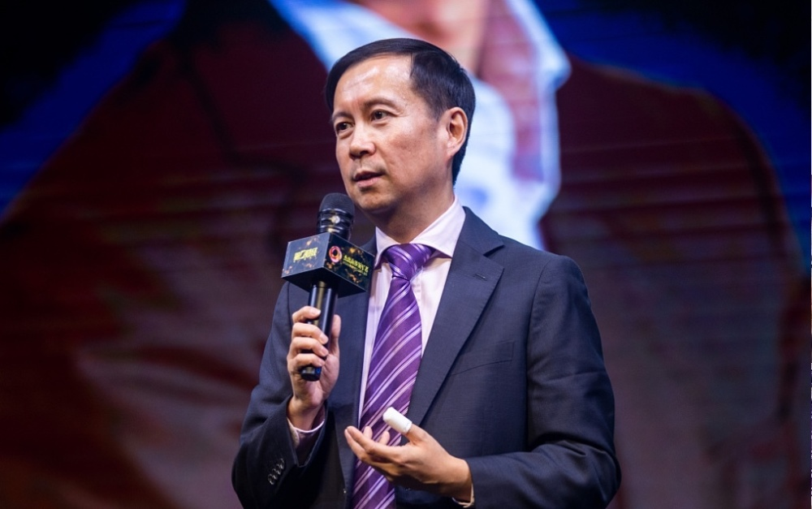

# 张勇裸退、老臣回归，阿里重构权力中枢

特约作者｜苏沪

编辑｜陈弗也

出品｜棱镜·腾讯小满工作室

如何评价张勇执掌阿里巴巴权柄的四年时光？或许要跨越更长的时间维度才能得到一个满意的答案。

至少事实摆在眼前，2019年那个闷热的权力交接之夜，马云给张勇留下了一家被冠以“伟大”之称的公司。它包括了一整套成熟的价值观、美好的人才输送体系、数亿用户、完善的商业闭环以及高达4000亿美元的市值，这个市值甚至是这家公司最不重要的部分。

媒体习惯用八个字来形容此时的阿里巴巴，良将如云、如日中天。

四年后，张勇倒是“事了拂衣去”，留下被拆成六大商业体以及N个环路公司的阿里巴巴，市值距巅峰时跌去七成、仅仅一年半的时间内员工就减少了三万人。

曾经良将如云变成了老臣回归，曾经如日中天变成了在多个领域的贴身缠斗。

最新公布的全员信里，阿里巴巴新任掌门人、阿里巴巴集团CEO兼阿里云智能集团CEO吴泳铭称，未来“我们必须更加开放”，“包括传统意义上有竞争关系的公司”；针对管理团队未来规划，吴泳铭表示，“4年内，要让85后、90后作为主力管理者”，“创造让更多年轻的阿里人成为阿里的核心力量的机制和文化环境”。

用户为先、AI驱动，吴泳铭将阿里巴巴未来的目标又定义在了八个字。但更多的问号依然围绕在这支庞大船队身边，真如外界宣称的那样，未来阿里人将在港交所敲钟敲到手软？要知道，此时距离张勇雄心勃勃宣称all
in阿里云、计划一年内上市的誓言，仅仅过去了三个月时光。

将一艘超级巨舰拆成大大小小的船队各自迎敌，真的能解决问题？阿里巴巴前员工杨高明已经观察前东家多年，在他看来张勇掌权后阿里的所有调整都过于被动，“组织架构调整在这家公司历史上并不少见，但马云时代绝大多数调整都是从上至下的主动调整，而近几年天猫淘宝合并以及一拆六都是由于外部受到强烈挑战而不得不连续变动。”

遥想张勇赴任时，“面向未来，和大家一起让阿里因我而不同。”

但当四年过去，曾经力推的“商业操作系统”基本停滞，引发惊呼的犀牛智造最终悄无声息。遗憾的是，在这四年时光里，阿里巴巴并未真的有所不同。

不断试验，却未找到对手

2019年教师节之夜，阿里巴巴二十周年，等待了一年的张勇彻底接过马云手中的权柄。当张勇开始演讲时，场内光线忽然变得暗淡，并非灯光师的失误，而是因为举起手机录像的人正在变少。

这并没有影响张勇的好心情，在随后的几个月里，他享受了难得的逍遥时光。

第一个彻底没有马云的双十一，天猫交出了2684亿的不俗数字。逍遥子张勇乐得逍遥，将最后的高光时刻留给了当时的手下头号人物，时任天猫淘宝总裁蒋凡。

一个月后，张勇再次享受马云时代的余晖，阿里巴巴赴港二次上市，站在聚光灯的中间，张勇说：“香港，我们回来了。”

随后张勇雄心勃勃试图大展拳脚，赴港二次上市几天后，他开始推进“商业操作系统”。一位阿里巴巴内部人士当时曾对作者表示，张勇期待着能通过“商业操作系统”打造属于自己的“中供铁军”，“大润发、饿了么等线下公司收购都是张勇推动，未来阿里巴巴将把在线上积累的全部技术能力在线下进行输出，通过这种方式在线下重塑一个阿里巴巴。”

为此，张勇将权力进一步下放，在当时的组织架构调整中，蒋凡和戴珊成为中间层。后来这个层级放宽到四人，即外界所称的0.5层。蒋凡主抓淘宝天猫以及阿里妈妈事业群，戴珊则负责B2B业务以及由盒马延伸出的农村相关业务。

此时的张勇已经将主要精力放在了线下业务，有内部消息显示，当时张勇每周至少分配一天时间给该业务。来自盒马的消息显示，很多被认为张勇派系的高管、实力派中层都被派去支援本地生活业务。

但张勇的雄心终究败给了现实。

全球范围内猝然爆发的新冠疫情让阿里巴巴的核心零售业务受到了前所未有的冲击，竞争对手也越来越多，越来越强：如拼多多、京东、抖音、快手、小红书、美团……

而在海外市场，发力很早的阿里巴巴始终不温不火，Temu仅用了几个月就在美国异军突起并以此为根据地进军欧洲；TikTok、SHEIN，甚至Shopee都能在东南亚压住阿里旗下的Lazada。

本应成为张勇主要战绩的商业操作系统，因为一场猝然爆发的疑似性侵事件戛然而止。张勇在线下业务中最得力的手下李永和不得不引咎辞职，而此时的李已经成为同城零售事业群总裁、阿里本地生活公司CEO。

最麻烦的是，张勇不断试验，却始终没有找到自己的竞争对手。

去年上半年，离开阿里巴巴的中层孔天宇如此对作者描述：“阿里内部有人认为头号对手是拼多多，但也有人觉得最重要的对手是美团。”在孔天宇看来，阿里巴巴不清楚自己对手背后的原因，“是张勇还没有马老师的影响力，所以各个业务线都觉得自己有重要的竞争对手，集团没有产生足够的向心力。”

故事回到四年前张勇的那场演讲，“我们希望通过5年的努力，能服务全球超过10亿消费者，创造超过10万亿人民币以上的消费规模。”

今年9月8日，张勇以阿里云智能集团董事长兼CEO身份出席杭州第十九届亚运会火炬传递现场，他一身运动服，摆出弯弓射箭姿势。

两天后，他挥手彻底告别，甚至都没有待满5年。

手扯木偶，马云逍遥四载

2007年8月加入阿里巴巴时，张勇并不算是重要角色。

和阿里巴巴高管们身上浓郁的江湖气不同，张勇展现出来的永远是中规中矩的形象：头发一丝不乱，穿着似乎一成不变的衬衣、西服、皮鞋。在杨高明看来，张勇是一个没有故事的人，“马云、蔡崇信、彭蕾，略显木讷的陆兆禧，沉迷技术的蔡景现，甚至已经离开阿里巴巴的卫哲、孙彤宇，都有各种各样的故事，只有张勇，仿佛是一个传闻绝缘体。”

资料显示，张勇毕业于上海财经大学，1995年至2005年，先后在安达信、普华永道两大会计师事务所工作；2005年加盟盛大，历任财务总监、副总裁兼CFO；2007年8月辞去盛大CFO一职，同年加入淘宝网。

2009年，张勇出任淘宝商城（天猫前身）CEO；2011年短暂离开调任集团负责投资后，2012年张勇又再次回到天猫，随后张勇升任阿里巴巴集团COO。

直到此时，张勇尚未展现出能在未来成为马云接班人的潜质。这个榜单上，领先者是历经阿里巴巴三大支柱业务B2B、淘宝、支付宝的陆兆禧。

2013年淘宝十周年庆典，马云单膝下跪宣布卸任阿里巴巴集团CEO，将这个职务交给陆兆禧，“我以后不回来了。要回也不回来。因为我回来了也没什么用，你们会做得更好。”

陆兆禧并未在这个位置坐久，因为移动端布局他和马云产生了严重分歧。陆兆禧倾向用来往与微信直接竞争，效果不令人满意。随着阿里巴巴赴美上市，不擅资本运作的陆兆禧在阿里巴巴体系内更是逐渐边缘化，仅能在协同方面起作用，突破工作并不优秀。

当时被认为能够接下陆兆禧业务的有三个名字：“阿里十八罗汉”之一、“支付宝女王”、“马云最信任的女人”彭蕾，被外界称为阿里“太子”的俞永福以及双十一缔造者张勇。

最终，做成陆兆禧没有做成移动业务的张勇成为了胜出者。

2018年到2019年的考核期内，张勇主导了饿了么与口碑合并组建阿里本地生活服务公司；进行了五次架构调整升级，“商业操作系统”首次浮出水面；20亿美元收购网易考拉，7亿美元投资网易云音乐。

阿里巴巴投资ofo时，马云自称并不知情，“我们投资了ofo吗？那可能金额不多吧，这种事张勇可能会比较清楚。我从2012年就讲过，我要学会怎么当董事长，我不该去干涉这些事儿。”

有了陆兆禧的前车之鉴，马云很难真正“以后不回来了”。得益于阿里巴巴独特的“返聘”（合伙人）制度，马云可以退休不离岗，继续隐身幕后掌控庞大的阿里帝国。更重要的是，在阿里巴巴历史上几次重要的转折点上，马云依靠个人魅力拉来的或内或外的帮手帮助这艘大船稳住方向，冲过了惊涛骇浪。

四年后，隐身幕后的马云回到国内，阿里巴巴从此变了天。

一号位更换，分拆上市的标杆开始飘摇

9月10日晚间，蔡崇信首次以阿里巴巴董事会主席身份发出全员信，信中称已按计划完成集团管理职务交接，吴泳铭出任集团CEO。

阿里巴巴集团靴子落地，但对于阿里云员工来说，动荡才刚刚开始，因为他们又换了一片天。

今年6月，张勇以内部信形式宣布卸任阿里巴巴控股集团相关职务，并表示会全职做好阿里云智能集团工作，“目前云智能集团的完全分拆工作已经开始启动，正处于最关键时刻，要求必须全身心投入其中。”

两个月后，阿里云宣布通义千问开源且免费可商用，成为加入大模型开源行列的大型科技企业之一。

不过，对于阿里云来说，大模型最多只是奶油蛋糕顶端的樱桃，核心依然是提升云业务的增长速度以及引入国有资本。

连续两个季度营收负增长后，直到本季度才重归正值4%；而在募资方面，最新消息是云智能考虑赴港上市前由国企进行一轮私募融资，潜在的投资者包括电信从业者，但阿里云并未对此消息作出过公开回应。

从历史履历来看，张勇当然是最好选择。2011年6月发生的“十月围城”事件彻底改变了天猫运营模式，帮助阿里电商帝国奠定盈利基础；一手打造的双十一购物节，也改变中国电商促销形态。

在最后一次以阿里巴巴一号位身份出席的阿里巴巴的财报电话会上，张勇依然说到了阿里云的分拆和上市，“我将在一片新天地里与大家交流”。

没人想到，仅仅十几天之后，“全身心投入其中”的张勇拂袖而去，带着10亿美元前往“一片新天地”，阿里云冲刺资本市场的任务则交给了同时担任阿里巴巴集团CEO的吴泳铭。

根据蔡崇信发布的全员信，阿里巴巴集团决定投资10亿美金支持逍遥子设立面向未来的科技基金，协助阿里对未来的科技布局打造更好的生态环境。

值得关注的是，曾由张勇推动的云钉一体战略，也在近日传出解体消息。有钉钉相关人士对作者确认，未来钉钉不排除独立融资上市的可能性，“钉钉正寻求最广泛的合作伙伴，目前和阿里云主要是共用销售渠道。”

吴泳铭赴任后先对上市问题作出回应，“阿里云智能集团依然要完全分拆并探索独立上市。”随后阿里云宣布通义千问大模型已首批通过备案，并正式向公众开放。

无论如何，上市途中紧急更换一号位，对任何公司来说都绝非正常现象。更麻烦的是，阿里巴巴集团本来想将云智能集团打造成分拆上市的标杆，但现在这杆大旗正因为张勇的离任变得扑朔迷离。

对于其他计划上市的阿里巴巴子公司们，他们依然要面临三大问题：

首先，外部投资人对互联网行业的估值已经产生了变化。有投资人对作者表示：“现在投资更看重利润，而不是单纯为商业模式买单，阿里巴巴的子业务里能够自己造血的公司太少。”

其次，投资人的钱袋子也不像阿里巴巴赴美上市时那么充沛。其史上最知名投资人孙正义近年来连续抛售阿里巴巴股票，持股从超30%下降到不足4%，核心原因就是投资的公司持续爆雷导致软银连年巨亏。

最后的麻烦则来自监管和关联交易。此前京东系公司几次上市，外界都不断提出相关质疑。阿里巴巴在蚂蚁事件中亦有先例，新的上市公司们也不会逃脱这一命运。

最新的消息来自和阿里云、菜鸟等站在上市第一线的盒马，有消息称盒马因募资不顺正推迟港交所的上市计划，不过盒马并未对此消息作出公开回应。

老臣回归，阿里动荡未完结

随着张勇放手阿里云，吴泳铭接任，阿里巴巴六大子业务一号位名单变成了吴泳铭、淘天集团负责人戴珊、国际数字商业集团负责人蒋凡、菜鸟负责人万霖、大文娱负责人樊路远以及本地生活业务负责人俞永福，加上阿里巴巴集团董事局主席蔡崇信，这份名单就是现在这个商业帝国最核心的管理团队。

七人中，蔡崇信、戴珊、吴泳铭均为阿里十八罗汉，万霖、樊路远以及俞永福都已加入阿里巴巴多年，即便是最年轻的蒋凡也在阿里巴巴的移动之战中贡献良多。

如此比例的老臣掌舵，马云想做什么？答案或许很简单，适逢动荡之秋，马云需要更强悍的执行力以及上下一心。这一点，除了马云亲至，或许只有“十八罗汉”可以压住阿里巴巴的山头林立、复杂派系，而蔡吴二人或许正是十八罗汉中能力最强的两人。

蔡崇信是马云之外唯一的“永久合伙人”，被称为阿里巴巴的“财神爷”。软银、雅虎等阿里巴巴历史所有重要的融资，均为蔡崇信一手推动；港交所、纽交所上市，背后也不乏蔡崇信的身影。

马云甚至曾经公开表示：“我能取得今天的成就，最感谢四个人，孙正义、杨志远、金庸、蔡崇信。如果非得选一个最感谢的，那就是蔡崇信。”

和蔡崇信相比，吴泳铭名声不显，但他是阿里巴巴的第一位程序员，004号员工，淘宝网、支付宝、手机淘宝最初的技术团队负责人，被阿里人昵称为“吴妈”。2015年，吴泳铭创立元璟资本，专注硬核科技、工业智造、产业数智化、医疗科技、跨境出海等领域，总管理规模超100亿元人民币，投资企业包括理想汽车、涂鸦智能、佑驾创新等。

张勇留给蔡崇信和吴泳铭的最后一份财报相对亮眼，收入同比增长14%、净利润更是增长51%，全面超出预期；淘天集团重回两位数增长，MAU达8.87亿；阿里大文娱首次季度盈利，阿里云重新盈利。

但阿里巴巴四年来盈利能力下滑明显，在最近五个财年中阿里巴巴分别实现营收3768.44亿元、5097.11亿元、7172.89亿元、8530.62亿元、8686.87亿元；同期净利润分别为802.34亿元、1403.50亿元、1432.84亿元、470.79亿元、655.73亿元。

更麻烦的或许是权力中枢的重构。

此前阿里巴巴权力以通过任命董事会形式掌控在合伙人手中：每年合伙人都可以选举新合伙人候选人，核心要求是在阿里巴巴或关联公司工作五年以上；合伙人可以提名不少于半数的董事会候选人，且有权指定过渡董事填补空缺。

这种“元老院”式的权力正被下放，未来“6+N”模式的公司或集团实行CEO负责制，无论是人事任免、财政收支还是发展战略，都相对独立，仅需向此次财报中公布的子公司董事会汇报。

值得注意的是，张勇离去后的三天，阿里巴巴美股港股双重暴跌，阿里巴巴两位新任掌门人开局不利。

陆兆禧、张勇，守成有余、进取不足，蔡崇信、吴泳铭能给出不一样的答案吗？

（孔天宇、杨高明为化名）

