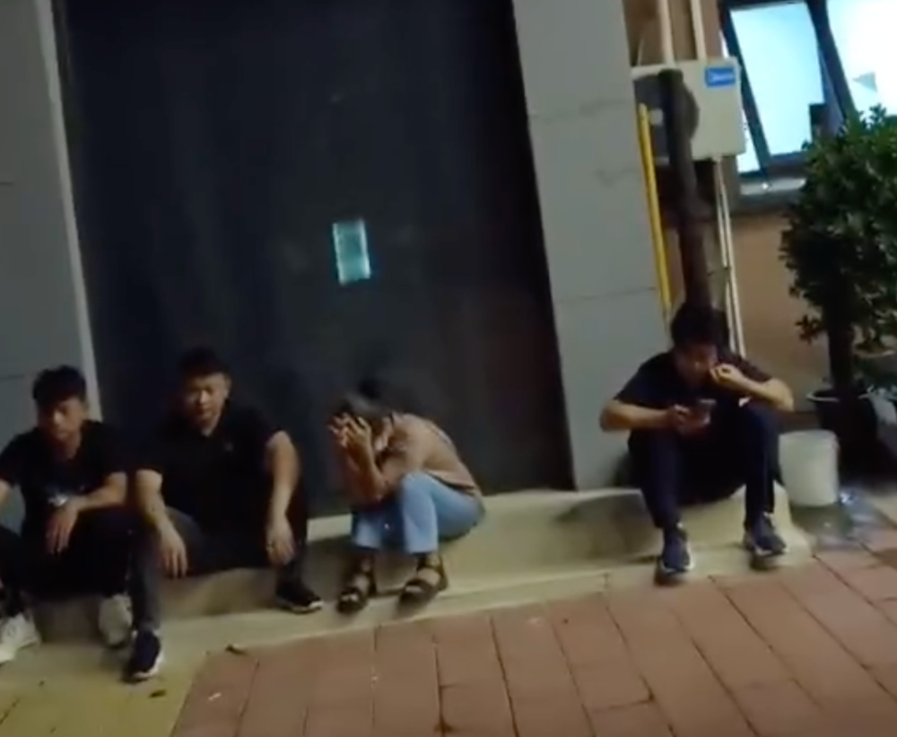
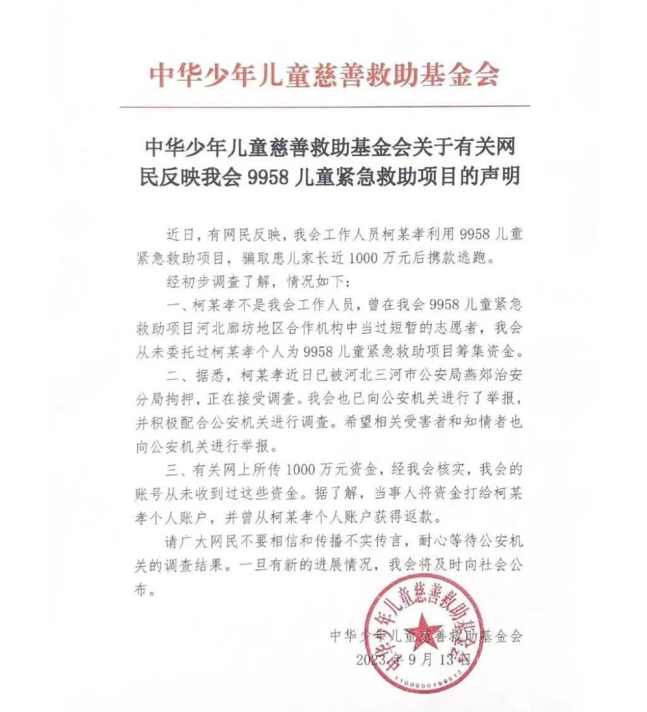

# 患儿上千万元救命钱被儿慈会卷走：涉事人曾是负责人，捐款用来投理财

一家筹款能力超强的慈善组织，何以至此？

_部分家长在河北省石家庄儿慈会办公大楼外。_

近日，中华少年儿童慈善救助基金会“9958儿童紧急救助”项目爆出惊人的消息：廊坊团队负责人柯善孝诈骗大病患儿家长，卷走上千万元善款。

中华少年儿童慈善救助基金会（以下简称“儿慈会”）是民政部主管的全国性公募基金会，于2009年9月10日获国务院批准，2010年1月12日成立，2016年9月1日荣获民政部颁发的首批《基金会法人登记证书（慈善组织）》和《慈善组织公开募捐资格证书》。中华儿慈会9958儿童大病紧急救助项目（以下简称9958）是该会旗下的明星项目，服务于0岁至18岁的困境儿童群体。

截至目前，光是9958项目的募捐收入就已超过16亿元，全部来自互联网募捐。

作为一家筹款能力超强的慈善组织，为何会出现如此匪夷所思的案件？

**柯善孝是谁？**

针对“柯善孝骗取患儿家长近1000万元后携款逃跑”一事，儿慈会13日发布声明，否认柯善孝是其工作人员，表示柯善孝只是在9958儿童紧急救助项目河北廊坊地区合作机构当过短暂的志愿者，未委托其个人为9958儿童紧急救助项目筹集资金。

声明还表示，儿慈会账号从未收到过“网传的1000万元资金”，柯善孝已被河北三河市公安局燕郊治安分局拘押，正在接受调查。

_中华少年儿童慈善救助基金会关于此事件的声明。_

但这则声明并没有平息质疑——柯善孝究竟是不是儿慈会的工作人员？

《中国慈善家》检索发现，今年2月24日，“9958儿童紧急救助”微信公众号发布的内容中，柯善孝为“中华儿慈会项目四部9958廊坊团队主任”，并获得“中华儿慈会2022年度最佳领导力奖”，由中华儿慈会理事长王林为其颁奖。

“9958作为公益领域的一个慈善标杆，可以说是一直被模仿，从未被超越，截至目前9958的总筹款已超过16个亿。在去年那样一个困难的时期，9958依旧超额完成了筹款任务，所以我希望在未来9958能继续发展，再创佳绩，继续发挥在公益领域中领头羊的作用。”王林在颁奖仪式上说。

不过，上述文章已于2023年9月7日被编辑，柯善孝的名字被删除，但其合照与奖杯的照片仍留在文章中。

一位9958前工作人员告诉《中国慈善家》，柯善孝原来也是患儿家长，后来申请成为中华儿慈会项目四部9958廊坊团队主任。

“9958在地方上是加盟形式，谁有筹款能力，一申请就很容易成为其分支机构负责人。一些分支机构是由患儿家长组成的，他们知道病友的痛点，知道如何在病友中间筹钱。”上述人士说，“一些患儿家长因为长期和救助机构联系，就有了‘资源’，收了病友的钱装进自己口袋，回头向救助机构为病友申请相应的费用。”

9月14日，《中国慈善家》多次拨打儿慈会及负责人的电话，均无人接听。

**违规操作“配捐”**

王先生的孩子2岁时患上急性淋巴细胞白血病，常年靠服药维持生命，巨大的医疗支出已致家徒四壁。他告诉《中国慈善家》，今年6月，柯善孝联系多位患儿家长，表示“有配捐活动”，是否愿意参与？”

实际上，所谓的“配捐活动”就是家属自筹款项，打到慈善组织的捐款链接中，再获得一定比例的配捐。患儿家属有时候还需要把钱汇到“爱心人士”的个人账户，再进行相关操作。在患者家属群体中，这样的操作常年存在。

因为急需用钱，王先生没有犹豫，给柯善孝的个人账户分两次转了9.6万元。随后，他收到柯善孝的两笔5万元“回款”，其中多出来的4000元就是“配捐”。

多位患儿家长告诉记者，因为孩子患有白血病、神经母细胞瘤等重疾，他们家庭背负着重压，无法支付巨额的医疗费用，只能依赖于社会捐赠。

不过，其他人没有王先生那么幸运，他们汇给柯善孝个人账户的钱至今一去不返。另一名患儿家长熊先生告诉《中国慈善家》，他统计了一下，光是自己身边的病友直接打到柯善孝私人账户的钱就至少有400万元，而这些钱大部分都是家属四处借来的。还有家属统计，打到柯善孝个人账户至今没有反馈的钱超过1000万元。

这并非个案。有爆料人向《中国慈善家》提供的转账记录显示，9958某地负责人张某也曾多次以“配捐活动”为名，接受患儿家长的转账。

在一个300余人的“成人配捐”微信群中，管理员鼓励大家自筹资金获得“配捐”，不过所获得“配捐”的20%，要作为“管理费”上缴。

_2023年2月，柯善孝（左）参加中华儿慈会项目四部网络团队2023筹款任务签约仪式。图/儿慈会官方微信公众号_

9月6日，柯善孝突然失踪后，受骗家长向儿慈会讨要说法。儿慈会让他们去公安机关报案，其他未作解释。

那么，王先生曾经获得的4000元“配捐”从何而来？有分析认为，王先生获得的4000元的“配捐”，可能是柯善孝的诱饵，以引诱其他家长往自己的个人账户打钱。

真正的配捐是一些慈善组织及爱心企业，为了鼓励更多公众参与捐赠，在公众捐赠基础上配比增加捐赠的行为。配捐并不是给捐赠人，而是给公益慈善项目，按照项目募捐方案中的执行计划、预算使用善款。

需要明确的是，患儿家长被诱导自筹款项参与配捐活动，属于违规行为，因此被骗的案例并不鲜见。一些患儿家长筹钱心切，不仅往慈善组织项目链接里捐款，还将大笔款项打入介绍配捐的“爱心人士”的私人账户，直到“爱心人士”跑路后才发现上当受骗。

此外，即使求助者将钱打入具有募捐资格的正规慈善组织，然后再获得“配捐”，也属于违规甚至违法行为。

《慈善法》明确规定，捐赠人与慈善组织约定捐赠财产的用途和受益人时，不得指定捐赠人的利害关系人作为受益人。自已捐款再获得配捐，这样就属于明显的指定捐赠人的利害关系人作为受益人。

**善款使用曾受质疑**

《中国慈善家》注意到，9958成立11年以来，其筹款信息遍布各大平台，几乎每个筹款平台上都能看到9958项目。

早在2020年前后，9958就入驻腾讯公益、阿里巴巴公益、蚂蚁金服公益、新浪微公益等13家最早入局的筹款平台。随后，它又入驻字节跳动公益、小米公益、美团公益、滴滴公益等新获批的互联网筹款平台。就连知名度不高的亲青公益、帮帮公益等，也都有入驻。

这些年来，9958的筹款量也从最初的80万元增加到16亿元。

查阅公开信息可见，中华少年儿童慈善救助基金会9958救助项目在腾讯公益平台上，从2017年8月8日至2023年9月12日期间，筹得1350余万元。在其披露的“项目进展”中，笼统表示为“支持超600人次的孩子们进行阶段性治疗”。而拨付给患儿的款项信息极其有限：如，2022年7月25日曾给一位患儿转账9千元；2022年2月9日，曾给一家名为泰安市圆梦公益事业发展中心拨款45.3万元。

《中国慈善家》掌握的另一则信息显示，2019年，9958空中急诊室累计支出善款12万余元，受益人次10余人。而2020年至2021年9月近两年时间里，9958共计转款仅1.6万余元，共计帮助了2名患儿。

实际上，儿慈会的善款使用问题曾经受到质疑。早在2020年年初，贵州“43斤女大学生”吴花燕去世后，有人发现9958救助中心仅将为其募捐到的100万元中的2万元交给了吴花燕的家属，被指“囤积捐款用来理财获益”。对此，9958在情况说明中称，之所以没有转交全部捐款，是因为吴花燕及家属提出了“余下款项希望预留至手术和康复治疗再使用”的要求，而吴花燕一直未能达到手术条件。

除此之外，儿慈会官网上还曾出现为已去世的人募捐的情况——在捐款的介绍栏中已有“患儿去世”的提醒，但项目仍在继续。

目前，腾讯公益平台上，9958的项目已经被暂停筹款。不过，儿慈会作为执行机构的其他募捐项目，依然还在进行中。

_2023年2月23日,中华儿慈会项目四部全国网络平台培训活动,柯某孝获奖项为“中华儿慈会2022年度最佳领导力奖”。图/9958儿童紧急救助公号_

**囤积捐款用来理财获益？**

根据民政部“慈善中国”信息，中华儿慈会9958儿童紧急救助中心项目的起止时间为2019年7月21日至2023年12月31日，用于18岁以下困境大病儿童的医疗资助、心理关怀及生活助困费用。

儿慈会2018年财务报告中显示，短期投资中银行理财产品的账面净值在2018年末达到4.09亿元，与年初数相比，理财收益为4400万元。对此，央视曾在“43斤女孩受捐事件追踪”报道中予以揭露。不过，《中国慈善家》查阅近儿慈会近3年的工作报告发现，该会2022年结余善款中，用于短期投资理财的资金达到6亿元。

2020年至2022年，儿慈会收入分别为8.68亿元、8.65亿元、7.42亿元，在中国慈善组织中较为罕见。其中，2020年至2022年，该会短期投资年初额分别为5.05亿元、5.37亿元、6.0164亿元。

《慈善法》规定，慈善组织的重大投资方案应经决策机构组成人员三分之二以上同意。投资取得的收益应当全部用于慈善目的。民政部出台的《慈善组织保值增值投资活动管理暂行办法》规定，慈善组织可以开展包括直接购买银行等金融机构发行的资产管理产品，但投资活动不能影响慈善财产的足额拨付，不得直接买卖股票，不得以投资为名义向个人、企业提供借款，不得参与可能使本组织承担无限责任的投资等。

不难看出，现行法律对慈善组织的投资行为持肯定态度，慈善组织有较高的自主决定权。但是，这一切应当建立在足额拨付、保证对救助人群及时有效救助的基础上。

“就算这不违法不违规，难道不违背道义和良心吗？”有公益人士提出质疑，既然是社会上筹集的善款，就应该及时足额拨付给需要帮助的人，“面对等着用钱的大病患儿家庭群体，就能眼睁睁看着善款闲置滞留吗？”

作者：温如军

图片编辑：张旭

值班编辑：邱宇

