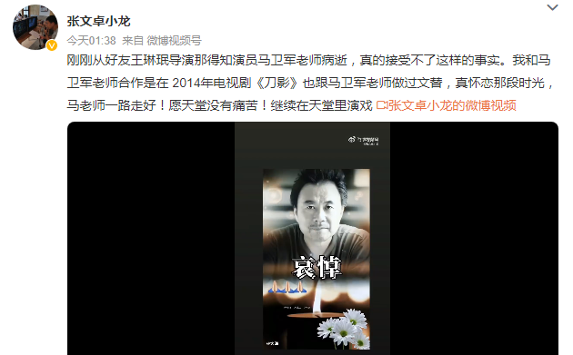
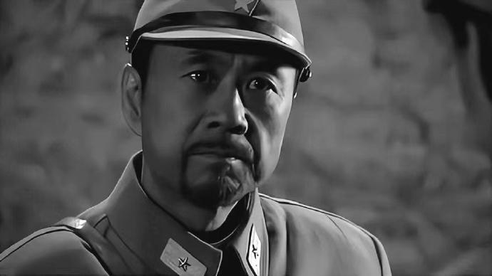

# 演员马卫军去世，曾出演《人世间》《雪豹》《我的兄弟叫顺溜》

据今（14）日多方消息，演员马卫军去世，享年66岁。

今日凌晨一点，导演张文卓发博透露了马卫军去世的噩耗：“刚刚从好友王琳珉导演那得知演员马卫军老师病逝，真的接受不了这样的事实……马老师一路走好！愿天堂没有痛苦！继续在天堂里演戏。”

凌晨三点，演员刘刚（疯石三宝）也发博悼念马卫军：“我们前段时间还在横店相见，没想到……老哥哥一路走好……天堂无病痛！缅怀！”

据公开资料显示，马卫军出生于1956年12月3日，曾参演过多部抗战剧，如《我叫刘传说》《激战》《我的兄弟叫顺溜》《雪豹》等。

在去年播出的电视剧《人世间》中，马卫军出演了丁支书这一角色。在今年播出的电视剧《后浪》中，马卫军出演了邱师这一角色。

编辑 苏静

