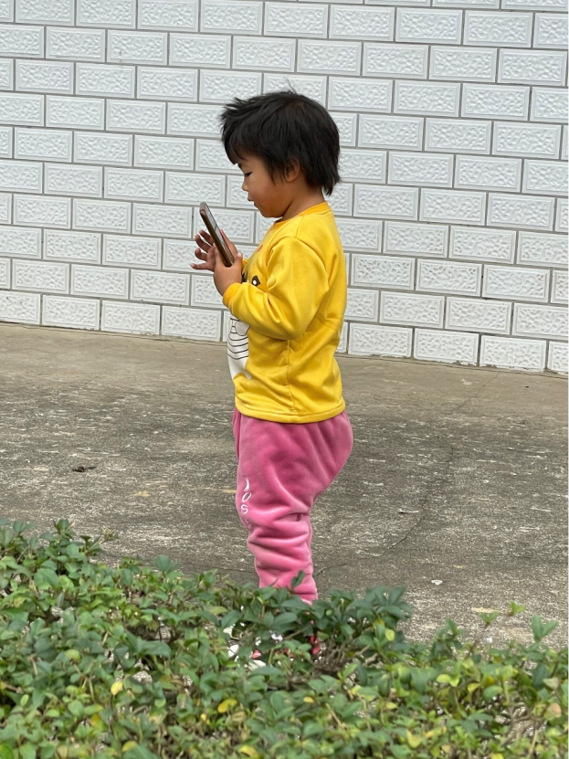
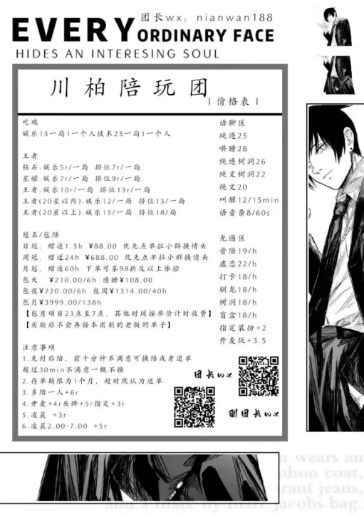
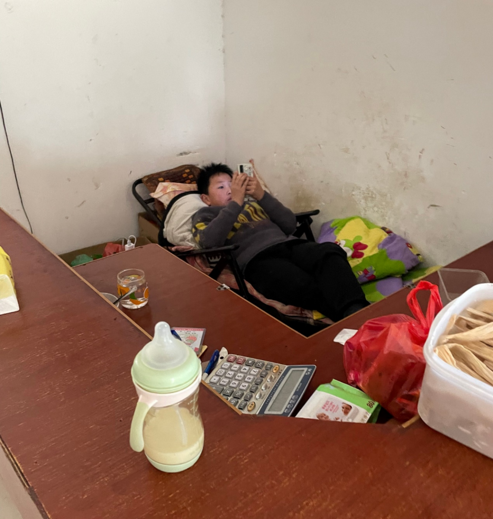
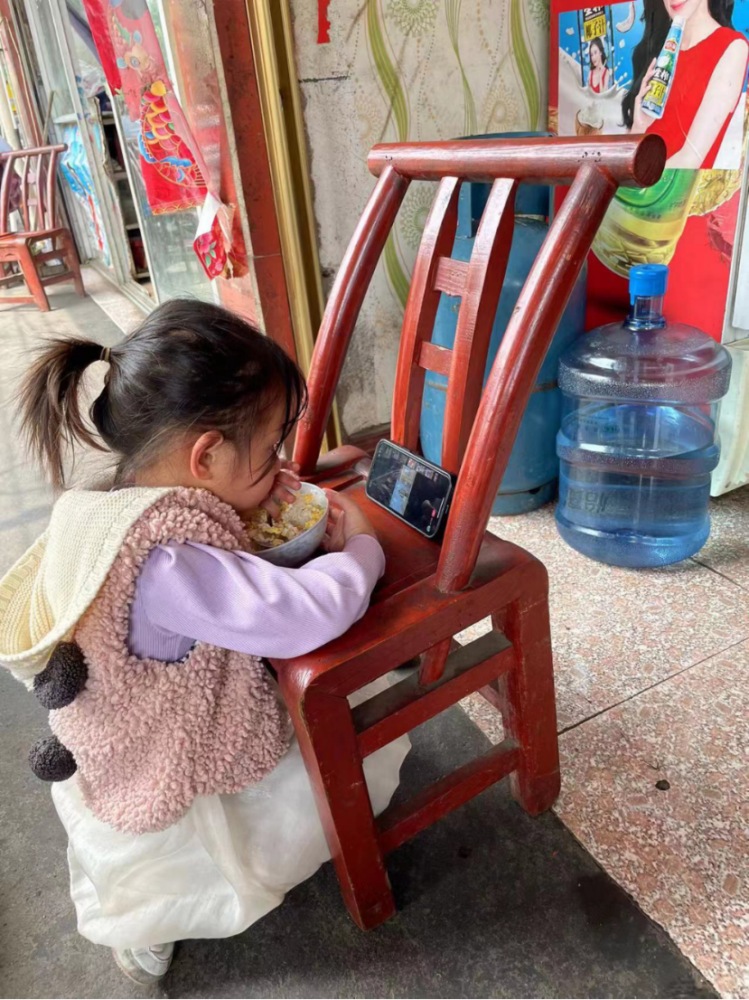

# 留守儿童沉迷手机：短视频刷一夜，周末白天躺着玩，饿了就起来吃泡面

**核心要点：**

  * _1_ 一个人在家里，小兰一般会彻夜玩手机，主要是刷短视频，白天可以睡一整天，躺着玩手机不费体力，所以整个周末只需要起来吃点泡面。有时候周末小兰也会到县城玩，但躺在家玩手机是常态。
  * _2_ 对于大部分留守儿童而言，在青春期成长阶段，他们有着旺盛的社交需求，而智能手机很好的帮助身处乡村的留守儿童跨越时空，与同学亲友交往以及与陌生人交往。并且，网络社交往往是与娱乐与消费活动相关联的。
  * _3_ 手机管理不仅仅是管理手机，而是乡校体系调整改革的系统工程，以下几点是重要且有效的举措：（1）抑制激进教育城镇化、振兴乡校；（2）建立多元学生评价体系；（3）找回“集体”，让学生在集体活动中获得多元成长；（4）以校为主，建立乡校教育主导权，家校社合作开展手机管理工作。

**周新成 武汉大学社会学院博士生**

**成瘾的核心是依赖——过度的依赖，无益而不健康的依赖，瓦解和摧毁的依赖。**

**——山姆·波尔塔罗，转引自《空洞的心：成瘾的真相与疗愈》**

认识小兰是在一次“小组工作”见面会上。W中学老校长内退后，任职学校关工委主任，在其主动请缨下，现任校长从每个班级挑选了几位最为调皮、引发老师与其他同学不满的学生，交由李校长进行管教与“改造”。我们去调研时正赶上老校长开第一次见面会，便被邀请旁听。

初一的小兰是十二位学生中唯一一位女孩子——实际上，一直到后面交流过程中，我才确认这个肤色黢黑、短发、衣着破旧、嗓音粗哑的学生是女孩子。不过，我们都没预料到的是，在此后为期约半个月的时间里，小兰会成为我们的调研“向导”，在周末带着我们访谈了许多学生与家长，小兰自己也成为我们的一位深度访谈对象。与小兰的深度接触引发了我思考一个问题：
**对于一位农村留守儿童来说，手机意味着什么？**

一、农村留守儿童用手机做什么？

抛开农村留守儿童利用手机等数字媒介获取信息资源与知识这一点不谈，农村留守儿童玩手机有四重“境界”，一是娱乐，二是消费，三是社交，四是组织与生产。

对许多农村留守儿童来说，手机更多的是一个娱乐休闲工具，打发一下无聊的时间。对小兰来说，手机最基本的功能也是娱乐。

小兰的父亲已经六十二岁，在县城里面做建筑工，有时候工作太忙晚上就住在县城里，小兰的妈妈在四十多岁时因心脏病就去世了。小兰的两个哥哥、两个姐姐都已经成年，在外地工作。爸爸周末若不回家，小兰只能一个人住在村里面。

有一天晚上，小兰和我们在一起待到了天黑，我们不放心她一个人回家，便借了辆电动车载她回去。从乡镇到小兰家，骑电动车大概要半个小时。骑行在乡间小道上，路旁密集的树遮住了月光，只有电动车微弱的光照亮坑洼的道路和道路两旁半隐半现的坟头。摸黑到了村里，整个村庄中只有几户人家亮着灯光，其他人家大多搬到了县城当中。

一个人在家里，小兰一般会彻夜玩手机，主要是刷短视频，白天可以睡一整天，躺着玩手机不费体力，所以整个周末只需要起来吃点泡面。有时候周末小兰也会到县城玩，但躺在家玩手机是常态。

_对小兰来说，手机最基本的功能也是娱乐。_

随着物流业的发展，手机购物越来越方便。农村家庭虽然总体收入不高，但在外务工的家长出于亏欠心理，往往宁愿自己辛苦，也要让留守在家的孩子吃好喝好。在前智能手机时代，家长的钱一般会给到祖辈，但随着移动支付的普及，留守儿童可以在手机上直接接收家长的转账用于消费。

小兰的爸爸在县城工作，一周只给小兰十元零花钱，但她在外打工的三哥每周会给小兰转一百元零花钱。因为寄宿在学校不准带手机，小兰在学校小卖部买东西一般会记账，周末再给老板转账。剩下的钱便可用于网上购物或充值消费。小兰的一些同学还会攒零花钱偷偷去买手机，有的学生把手机带到学校被老师没收只能等到期末归还，便在网上重新购买手机。

不过，家长给的零花钱更多的还是被用来游戏充值，特别是对于许多男生而言，W中学九年级一位男生甚至告诉我们他的一位同学在某游戏里充了两三万元。喜欢打游戏的小兰也攒了几个月的钱在游戏里充值了七百多元，而这在她认识的同龄人中已经算是少的了。

对于大部分留守儿童而言，在青春期成长阶段，他们有着旺盛的社交需求，而智能手机很好的帮助身处乡村的留守儿童跨越时空，与同学亲友交往以及与陌生人交往。并且，网络社交往往是与娱乐与消费活动相关联的。

幼年丧母的小兰因缺乏父母管束、缺少亲子沟通，很早便开始利用手机进行社交。三年级时小兰开始使用TT语音软件，在TT语音上认识了一位贵州人，据小兰介绍，这位贵州人17岁，已经工作，通过打游戏、语音聊天俩人认识。后来，小兰在TT语音上认识了武汉的一位13岁学生，又通过他认识了另一位男孩。从小兰及她的同学口中我们得知，小兰和贵州那位男生分手后，目前正在和这位男孩网恋。在网上社交，小兰一直使用变音电话和修图软件。

六年级时小兰开始玩快手，当时会把手机带到学校，经常玩到凌晨两点多，寝室八个人只有一个人没有手机，当时大家都各玩各的，但是其他同学会蹭小兰的流量，虽然小兰嘴上抱怨当时同学蹭她的流量，但可以看出，实际上小兰对于被同学需要感到很自豪，通过被蹭流量小兰拉近了与同学的关系。大部分时间里，小兰在现实中并不受同学和他们的家长欢迎，同学会嘲笑她的长相和邋遢，同学的家长会怕自己孩子和她混在一起学坏了。不过，在网络世界中，小兰却可以游刃有余，通过打游戏和对自己的包装交到很多朋友。

留守儿童玩手机的最高境界是成为“组织者”或“生产者”，“组织者”主要指的是社群团队的组织，“生产者”主要指的是拍摄、制作短视频，或在打游戏中进行“二创”，并从事游戏相关衍生产业。

小兰还算不上是一个“生产者”，但是，小兰也算是一个团队的组织者了：在打游戏过程中，小兰组织了五人战队，参加过城市联赛、同城比赛。战队由2个女生3个男生组成，最大的16岁，其他的都14、15岁，有三个人都是初三不读了。由16岁的人当队长，小兰当副队长。组战队参加比赛让小兰非常有成就感。不过，由于小兰没有钱也没有闲，客观条件限制了她的发展空间，组队比赛只能成为一个“江湖传说”而“昙花一现”了。相比于小兰，我们后来认识的一位高中生更加深度嵌入到网络内容生产当中，在初中阶段这位高中生即成为陪玩团队的组织者，提供付费陪玩、陪聊等各类服务，对接服务需求者与提供者，从中赚取佣金。

_在初中阶段这位高中生即成为陪玩团队的组织者，提供付费陪玩、陪聊等各类服务_

二、手机对农村留守儿童的多重意义

从小兰及其他留守儿童的故事可以看到，对于大多数留守儿童，特别是像小兰这样缺少父母监管、成绩较差、缺乏现实交往的留守儿童而言，手机发挥了 **休闲娱乐**
的功能。在此之上，对于一些家庭经济条件较好或父母在经济方面给予较多的留守儿童而言， **网络消费**
也逐渐流行起来，特别是手机游戏充值，很容易逃脱家长的监管。此外， **社交**
也是手机发挥的重要功能，促进了留守儿童与现实关系网络的交往，也强化了虚拟现实社会的交往，不同留守儿童的交往面向有着较大的差异。而能成为
**组织者与内容生产者** 的留守儿童少之又少，这需要在时间与精力两个层面深度嵌入到虚拟现实世界当中。

从留守儿童玩手机的四个“境界”可以总结出留守儿童玩手机的三个“层次”：

**第一个“层次”是打发时间**
，很多留守儿童放学后与周末的生活过于无聊，在村庄中缺少同辈群体、缺少公共活动，家长又忙着工作、打麻将等，这些留守儿童除了玩手机、看电视还能干什么呢？如果能躺着玩为什么还要坐起来玩呢？如果能睡在被窝里玩为什么还要起床玩呢？于是，在各地调研我们总能发现一些农村青少年，看起来已经沉迷手机到不能自拔的地步了，但是和他们深入访谈之后会发现，玩手机并没有给他们带来获得感与意义感，更多的是，放下手机之后他们不知道干什么。

_在各地调研我们总能发现一些农村青少年，看起来已经沉迷手机到不能自拔的地步了_

调研发现，大部分留守儿童特别是低年级留守儿童“沉迷手机”只是在这个层次。于是，调研进一步发现，在全国各地，针对留守儿童手机沉迷问题产生了许多应对方法：

有的地方教育部门与学校“闷声做大事”，为了避免学生回家玩手机，依托寄宿制，安排乡镇中小学生上晚自习，让他们在教室里自主学习，这一举措得到了家长的大力支持。

有的地方乡村熟人社会结构相对完整，学生在乡村有较多的同辈群体，即使玩手机，他们也是相约到一起，线下一起玩手机，玩一段时候后再去打球或做其他的事情，公共休闲设施及场所的建设与维护就起到了十分重要的作用。

有的地方乡村学校开展各类受学生欢迎的集体活动，学生的课余时间相对充实，就不会再有太多空闲的时间和精力再沉溺于手机当中。

有的地方还与村社区及社会力量联动，在寒暑假组织留守儿童服务活动，受到留守儿童与家长的欢迎。有的地方妈妈在“再不回来孩子就废掉了”的压力下不得不返乡陪读，对子女尽早进行管束，但是这也造成了农民家庭教育负担的加重。

**第二个层次是需求满足层次，主要指的是娱乐、消费与社交需求满足。**

在“打发时间”层次之上，手机确实满足甚至是刺激了青少年的娱乐、消费与社交需求。手机游戏为缺乏现实游戏互动机会的农村青少年提供了极佳的补充，乃至替代了现实游戏互动的需求。但是，一旦在游戏时间与内容等方面缺乏监管与控制，过度沉迷游戏确实会对青少年身心产生伤害，更不用说游戏充值付费对青少年的及其家庭的负面影响。

在手机游戏等娱乐之外，不可忽视的是短视频的影响，短视频平台的算法设计及庞杂的内容生产，很容易使得留守儿童深陷其中。并且，当前的媒介平台大多将娱乐、消费与社交功能融合在一起，这使得缺乏家庭监管的青少年很容易深度嵌入到各类平台之中。

_短视频平台的算法设计及庞杂的内容生产，很容易使得留守儿童深陷其中。_

**第三个层次是情感满足与价值生产层次。**

在娱乐消费与虚拟社交过程中，留守儿童很容易被“信息茧房”与圈层化社交包裹，在价值层面受到潜移默化的影响。

例如，一些留守儿童在打游戏、观看游戏主播解说视频过程中，很容易受到一些言论的影响，认为学习没有出路，靠打游戏也能轻松的赚更多钱。此外，对于一些在现实社会中缺少同辈群体交往、缺少家庭内部情感沟通、成绩不佳的农村留守儿童而言，他们在家庭、在学校里都难以获得情感需求的满足、找不着人生的意义感与价值感，但是在网络世界中，他们可以成为对自我进行包装，选择适合自己的圈层，成为主导者，乃至组织者与内容生产者，这给他们带来了情感需求的满足以及人生的价值感与意义感，但是这种价值感与意义感又难以与现实社会相对接，从而导致现实世界与虚拟现实世界的割裂。最极端的结果是，青少年在虚拟现实世界生成的价值观与主流价值观完全是相悖的，对其个人发展、家庭和谐乃至社会稳定都产生了负面影响。

三、如何解决留守儿童手机沉迷问题？

从以上的分析可以看到，手机网络对青少年社会化成长的影响主要存在于两个维度， **第一是注意力争夺**
，即手机网络满足甚至是刺激了青少年的娱乐、社交需求，会将青少年的注意力与时间拉向虚拟现实世界。 **第二是价值观影响**
，虚拟现实世界满足甚至是制造了青少年的情感、价值需求，圈层化社交很容易影响青少年的价值观。现实世界与虚拟现实世界像是两个磁铁，青少年即可被现实世界所吸引，其时间与精力主要投入到现实世界的娱乐与社交活动当中，价值观也主要在现实世界被形塑。他们也可能被虚拟现实世界所吸附，其注意力高度投入到虚拟现实世界，价值观的形成过程也因此被虚拟世界深度影响。虚拟现实世界与现实世界可以共同促进青少年的社会化成长，也可能构成互斥的力量，让青少年逃逸出现实世界，遁入虚拟现实世界。

当青少年可以轻松地逃逸进入一个满足其各类需求的手机网络世界当中时，青少年也在逃避社会化成长过程中面临的正常且必要的困难。并更加倾向于放大现实中的问题，更难感知到现实世界的快乐，更加拒斥现实世界的社会接触与交往。这正如由哲学家马蒂亚斯·凯特娜组织的研讨会所得出的结论所说的那样：对数字设备的依赖……会减少移情的能力，使人习惯于身体接触的缺失、离群索居的强大影响力以及对虚拟生活的偏爱。这种依赖会加强人的自恋、以自我为中心的生活方式和多自我的美化。由此而使得青少年更进一步的在网络上获取刺激与满足感，从而形成手机成瘾问题。手机成瘾导致的青少年与现实世界的脱钩以及深度嵌入虚拟现实世界，会进一步造成青少年容易学习主体性缺失、价值意义与成长目标缺失、责任感缺失，出现角色定位与认同危机，形成游戏人生的心态，形塑“去发展的个体化”成长样态。

不过，从全国多地的调研我们发现，当前农村青少年手机沉迷问题更主要是注意力过度投入手机网络问题，只有较少部分青少年因价值性高度嵌入网络而产生社会化危机问题。即使是小兰这样成绩一直比较差、缺少父母监管与亲子情感沟通的农村留守儿童，其手机沉迷更多的只是在前三重“境界”以及第一、二个“层次”。然而，从全国各地的调研来看，近几年来特别是疫情之后，这一问题有加重的发展趋势。

_当前农村青少年手机沉迷问题更主要是注意力过度投入手机网络问题_

因此，在回应农村留守儿童手机沉迷这一问题时，尤为需要注意的是，
**手机网络与虚拟世界本身对青少年而言并非天然地是“洪水猛兽”，单调、枯燥的童年生活才是将青少年推向虚拟现实世界的“洪水猛兽”。**
因此，当前手机管理应主要从“注意力争夺”以及降低“价值性嵌入”两个方向用力，对于中低年级学生而言，“注意力争夺”是主要发力方向。从一些地方的经验来看，手机管理不仅仅是管理手机，而是乡校体系调整改革的系统工程，其中，以下几点是重要且有效的举措：

（1）抑制激进教育城镇化、振兴乡校；（2）建立多元学生评价体系；（3）找回“集体”，让学生在集体活动中获得多元成长；（4）以校为主，建立乡校教育主导权，家校社合作开展手机管理工作。

写到这里我再次想起小兰，在我们第一次访谈她时，没过多长时间她就焦急地问我们什么时候结束访谈，那么长时间不玩手机让她很难受。但是，在之后我们相处了一段时间后，她有时候甚至不愿意一个人回家而更愿和我们待在一起，帮我们联系访谈对象、带我们去找他们。在老校长的“小组工作会”上，小兰表现得也非常积极。

