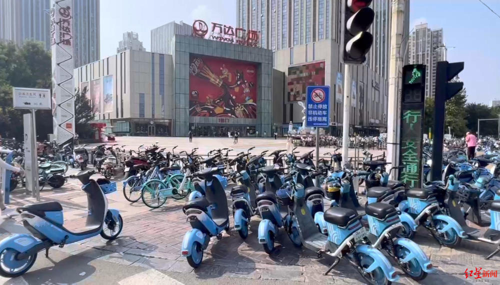
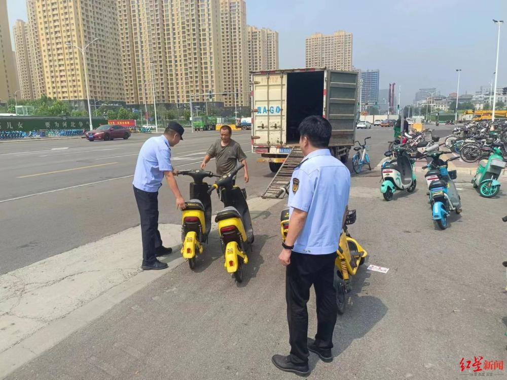
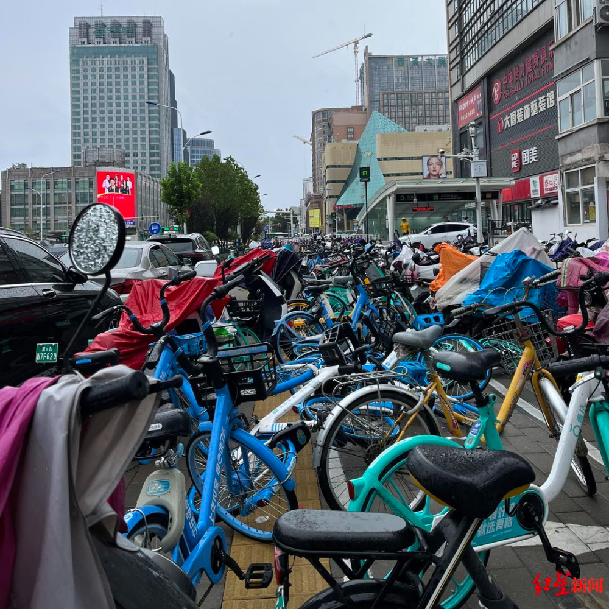

# 石家庄“单车坟场”背后：无牌共享电单车泛滥，1.89亿元准入拍卖废止

_▲被清理的大量单车形成“单车坟场”_

红星新闻记者｜刘木木 实习生｜张娜

编辑｜郭庄 责编｜官莉

京津冀地区重要中心城市之一的石家庄，共享电单车市场陷入一场乱战。

一方面，大量无牌共享电单车奔跑于大街小巷；另一方面，石家庄市交通运输综合行政执法支队加大力度，对此前拍卖未中标企业车辆实施收缴，当地已至少形成4个“单车坟场”。

去年5月，石家庄对共享两轮车“占用公共资源3年有偿使用权”实施拍卖；今年4月，该拍卖被宣布废止。对此，一些拍卖未中标企业认为，这意味着各类市场主体均可“依法平等竞争”石家庄市场。

对各地拍卖城市共享电单车经营权的做法，国家发改委曾两次进行通报批评。国家发改委称，一些地方限制其他共享单车企业进入当地市场开展经营的做法，与市场准入负面清单制度相悖。

石家庄的拍卖“废而不止”，为此遭受一些未中标企业的质疑。眼下，一场围绕着共享电单车准入合法性的拉锯战，在当地“硝烟四起”。

**——野蛮生长——**

**大量无牌共享电单车在运营**

“石家庄现大量无牌共享电单车”话题，日前登上了当地微博热搜榜。

据河北经视今年8月中旬报道，当地除了共享电单车乱停放的问题，还有大量没有悬挂牌照的共享电单车在运营。

近日拍摄于石家庄城区的视频和图片也显示，这些无牌共享电单车涉及哈啰、青桔等品牌。当地市民介绍，在部分人流密集区域“无牌车数量甚至远超有牌车”。

业内人士表示，这反映出各路车企在竞争石家庄市场过程中的“野蛮生长”。

 _▲石家庄街头停放的共享电单车_

蓝色的哈啰、绿色的青桔、黄色的美团和松果……石家庄的共享电单车市场，目前正呈现一种“五颜六色”局面。红星新闻记者统计发现，至少有6个品牌的共享电单车企业，今年先后进军石家庄市场。

石家庄曾对共享电单车实施特许运营管理，但今年4月，相关拍卖宣布废止，一些共享电单车企业再次嗅到了“机会”。4月，此前在石家庄多年运营但拍卖未中标的美团便闻讯而动，再次投放运营；8月，松果出行也瞄准了石家庄，松果电单车陆续出现在大街小巷。

共享业态观察人士唐朝认为，石家庄紧邻北京、天津两大都市，共享电单车的运营前景广阔。

石家庄相关单位部门负责人也观察到了这一现象，其表示，美团、松果的行为引发业界高度关注，另有车企将车辆布局在石家庄周围“伺机而动”。

但松果、美团遇到了挫折。两家企业负责石家庄市场的前端人员告诉红星新闻，他们的车辆被石家庄交通运输局委托第三方，以“未得到合规准入”为由收缴，其中美团被收车辆超3万辆（包括电单车和单车）。两家企业对石家庄交通运输局委托第三方收车的做法存疑。

_▲执法人员清理街面上的松果共享电单车_

相关车企介绍，官方具体负责收车的，是石家庄交通运输局的直属单位石家庄市交通运输综合行政执法支队，该支队的收缴的共享单车已在石家庄至少形成4个“单车坟场”。

正定县是石家庄市的下级县，距石家庄约15里路程。在正定县“日日顺仓库”的停车场内，停放了近万辆美团的单车。临近“正定县河北捷胜建筑实业基地”的一处车场，停放了美团的车约两万辆。红星新闻记者掌握的航拍视频显示，一些共享电单车露天停放，此前覆盖的尼龙薄膜已破漏。

被收车的一家车企相关人士表示，大量装有锂电池的共享电单车长期堆放在一起，具有严重火灾隐患。“这些电池长时间无人维护，部件很容易老化，防水性会明显下降，有可能出现电池进水短路的现象，极易引发火灾。”

**——设置准入——**

**共享两轮车“有偿使用权”拍卖被废止**

业内人士告诉红星新闻记者，据不完全统计，当前全国规模不等的共享电单车品牌超过200家，全行业投放的共享电单车数量约有300万辆。在二线至五线城市，哈啰、美团、滴滴青桔、松果出行等共享电单车品牌竞争激烈。

为加强管理，各地地方政府相继对共享电单车设置准入门槛，有的与共享电单车企业签订独家战略合作协议，限制其他共享电单车企业准入经营。

共享业态观察人士唐朝介绍，美团与松果之所以在石家庄投放，是因为二者认为，石家庄的做法，与国家发改委提倡的“公平竞争”制度及统一大市场建设精神相违背。“国家发改委先后两次发布的违背市场准入负面清单，均提到了多个共享电单车案例，这给美团、松果两家车企在石家庄的投放提供了支持。”唐朝称。

 _▲被清理的大量单车形成“单车坟场”_

去年年底，国家发展改革委办公厅对23个违背市场准入负面清单典型案例（第四批）进行通报，批评了多个地方的做法。通报称：一些地方政府，以招租采购方式变相设置市场准入条件，越权设定共享（电）单车特许经营权，强制收取服务费用，抬高市场准入门槛。这些做法违反了公平竞争制度要求，苗头在全国呈蔓延趋势，亟需引起高度重视。

23个典型中，共享（电）单车的独家垄断经营问题达15起，占比超过65%。今年3月16日，国家发改委发布新一批“违背市场准入负面清单典型案例”，又有6起相同案例被通报。

正是在这种背景下，石家庄的“公共资源有偿使用权”拍卖废止。

2022年5月11日，石家庄市以线上拍卖方式，公开拍卖长安区、桥西区等五城区共享两轮车“占用公共资源3年有偿使用权”。据全国公共资源交易平台产权交易信息，此次拍卖共设5个标的，面向全国的共享两轮车企业，共有11家企业报名，最终有9家企业通过资格审查。

本次拍卖引发外界广泛关注。据《中国新闻周刊》报道，10万辆共享两轮车的分配组合基本在“12000辆共享单车+8000辆共享电单车”这个基准上下浮动，而每个标的的起拍价则设定在340万元上下。

经过长达3小时、共计285轮的激烈竞价，最终由哈啰单车、青桔单车、人民出行、石家庄圣庄交通科技4家企业竞得，5个标的的成交价高达1.89亿元。此前在当地经营多年的美团单车被排除出局。

今年4月3日，石家庄市交通运输局在其官网宣布，河北金正拍卖公司关于《石家庄市互联网租赁自行车及互联网租赁电动自行车占用公共资源市场化配置3年有偿使用权项目拍卖公告》废止。

截至目前，石家庄未明确公开出台新的共享电单车准入文件。

相关车企工作人员介绍，为进入石家庄市场，他们与石家庄相关单位沟通，但遇到障碍，为此他们已经向河北省和国家相关部门投诉反映相关情况。

**——超量投放——**

**有车企补办“数制”号牌时浑水摸鱼**

石家庄市交通运输局相关负责人称，参与竞拍企业均承诺在3年运营服务期内不涨价，且收费标准不高于2022年2月24日石家庄市内的最高收费标准。

在石家庄官方看来，前述拍卖是当地解放思想观念，创新城市管理的一次积极探索，有利于推动城市资源价值发现，促进省会互联网租赁自行车行业规范管理和健康发展。据《河北日报》此前报道，按照《石家庄市互联网租赁自行车运营占用公共资源市场化配置方案（试行）》，为确保市场规范有序运营、无缝衔接，在相关部门和辖区的指导下，未竞得企业将陆续开展车辆清理工作。

 _▲石家庄街头停放的共享单车_

竞拍成功的人民出行总裁胡北寒表示，将严格遵守政府相关要求，按区域定量投放，积极协同政府共管、共治，切实履行服务市民的责任。在停放标准上，将按照“集中停放、摆放有序、朝向一致”的原则，有效解决车辆乱停乱放等问题，助力文明城市建设。

石家庄相关单位负责人介绍，石家庄共享（电）单车数量最多时达55万辆，这些这辆占据小区门口，地铁站口，市民意见大，投诉多。“共享单车乱停乱放、载人等现象是城市通病，我们根据石家庄这座城市的承载量，一直在调节共享单车与共享电单车数量，先是从30万到18万，再是到12万，现在是10万。”

竞拍废止，4家竞得企业怎么办？对此，这名负责人介绍，“拍卖程序是作数的，国家和省里有关的部门进行了调查，但都没定性。我们是在根据市场的反应，摸着石头过河。”

对一些车企“违背公平竞争”“再次设置准入门槛”“阻碍统一大市场建立”等方面的指责，该负责人介绍，当地主要依据《河北省电动自行车管理条例》及《石家庄市城市市容和环境卫生管理条例》来管理共享电动车，“如果我们不管，就是失职，整个市场就会混乱无序”。

红星新闻记者调查发现，石家庄共享电单车乘车人戴头盔现象普遍。该现象被当作城市面貌改进事项，写入了2023年石家庄市政府工作报告，“……开展电动车综合整治行动，车有牌、人戴盔、文明出行，成为我们这座城市的一道靓丽风景线。”

对于诸如无牌车泛滥等乱象，该负责人坦诚，对之前入围的4家车企，当地实施“数制”号牌管理，但该号牌容易被雨水冲坏，在补办过程中确有企业浑水摸鱼进行超数量投放。

“我们正在引进一种嗅探设备对车辆进行管理，其次是新出台办法，对企业的乱停乱放及超投行为进行考核，在总数不变的情况下，谁做得好，就可以增加投放量，做得差，就减少投放量。”这位负责人表示。

对于拍卖公告废止后的石家庄市场是否是开放这一问题，该负责人称，现阶段还不允许其他车企“乘机而入”，否则他们的工作就会倒退并付诸东流，“三年期满后，这一市场将重新洗牌了。”

对集中停放在停车场的共享电单车存在的火灾风险，以及这些电单车究竟如何处理，红星新闻记者致电石家庄市交通运输局办公室，截至发稿尚未获得解释。

