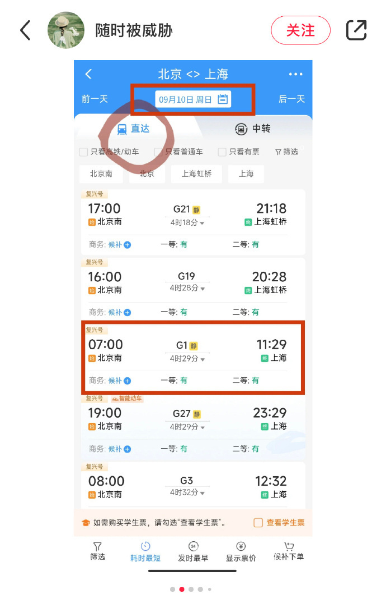

# 网友高呼中秋国庆假期火车票“抢票难” 12306客服：建议立即候补

今天上午， **#12306抢票#** 冲上热搜第一，引发网友围观。

今年中秋节、国庆节假期，9月29日至10月6日连放8天，节前不调休。
**根据铁路客票预售期15天的规定，9月14日起，旅客可以通过12306网站、APP等购买假期前一天（9月28日）的票。**
而明天（9月15日），则可以抢中秋节（9月29日）的火车票。

今天，12306开票后，很多网友表示，后台崩了，抢不到票：

ESHCY ：一直显示有票，我一点进去，信息选好购买就显示没票

镇魂衔 ：0.5秒就没了！

樱桃脂仔：我的后台是有乘车人信息的。结果显示系统繁忙，刷新了3次，才刷出来，然后票也没了，就几秒的时间，我一早上就开始盯着了，其他的甚至还有20张票的，我点进去都说没了？

皮月修: 8点准时开抢，所有北京到郑州全是候补，我真想知道到底都是谁抢到票了

不说都晓得: 我还以为是我网络有问题，一直显示系统忙

syliayn: 我也一样，等着一到点就进去抢，结果就是没票了！

对于这样的抢票难，12306客服表示，余票充足仍需排队是由于同一时间点下订单的用户过多。12306开启售票时间固定，不会针对第三方软件提前售票。
**对于没有买到票的用户，客服表示，今年抢票较往年确实更难些，建议立即加入候补，等待其他用户改签或退票。**
此外，乘客人数较多的情况下，高铁动车也有可能出现由8节车厢改为12节车厢的情况，候补购票可以更快买到票。

对于今年的中秋国庆长假，已经有网友贴心地晒出了抢票攻略：

火车票起售时间如何查询？儿童优惠票怎么买？临时乘车身份证明如何办理？这份购票攻略请查收——

**新闻多看点**

据国铁集团消息， **铁路国庆黄金周运输自9月27日开始，至10月8日结束，为期12天，**
全国铁路预计发送旅客1.9亿人次。铁路12306将于9月13日开始发售国庆黄金周火车票，预计9月15日为售票高峰日，当日开始发售假期第一天的车票。铁路部门预计北京、上海、南京、苏州、天津、广州、深圳、成都、西安等城市都将会成为旅客出发和到达的热门地区。另外，黄金周与亚运会叠加，
**杭州也将成为高铁出行的热门目的地。为应对假期客流高峰，** 铁路部门延长黄金周运输期限， **前后达到12天，运输期限超过历年黄金周。**

为了抢到车票，有不少旅客使用第三方软件或平台进行抢票。但铁路部门提醒，铁路12306从未授权任何第三方平台发售火车票。第三方平台在旅客购票过程中会保留用户信息，不仅有附加费、捆绑销售服务等“陷阱”，还可能存在个人信息泄露风险。请广大旅客一定要通过铁路官方渠道购票。

此外，打算退票的旅客也要注意，开车前8天（含）以上退票的，不收取退票费。

这个8天长假，你准备去哪里玩？

