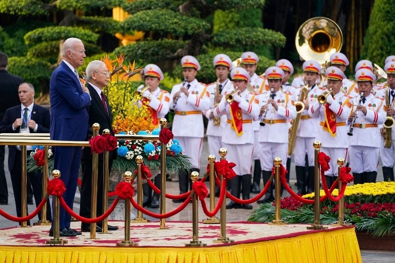
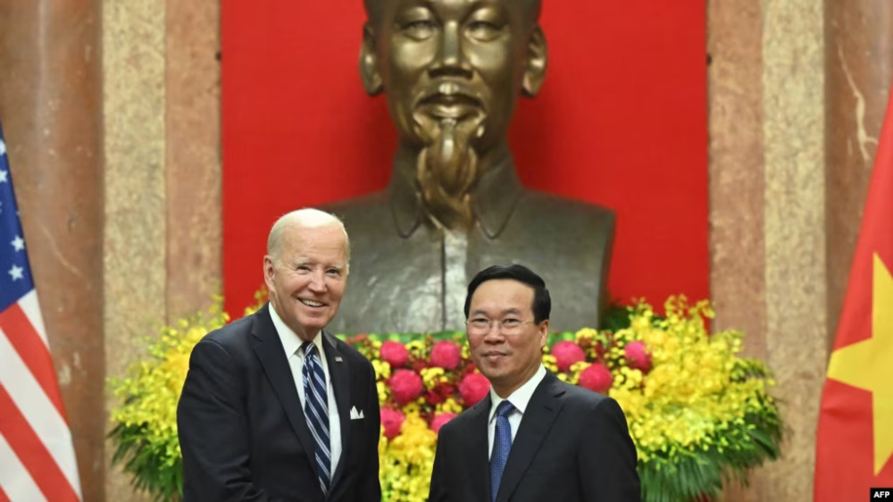
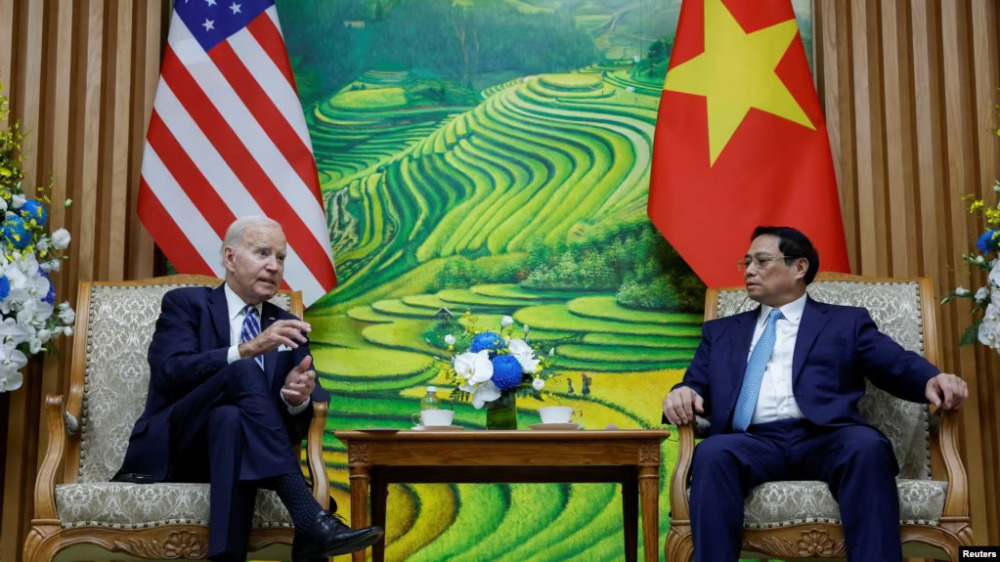
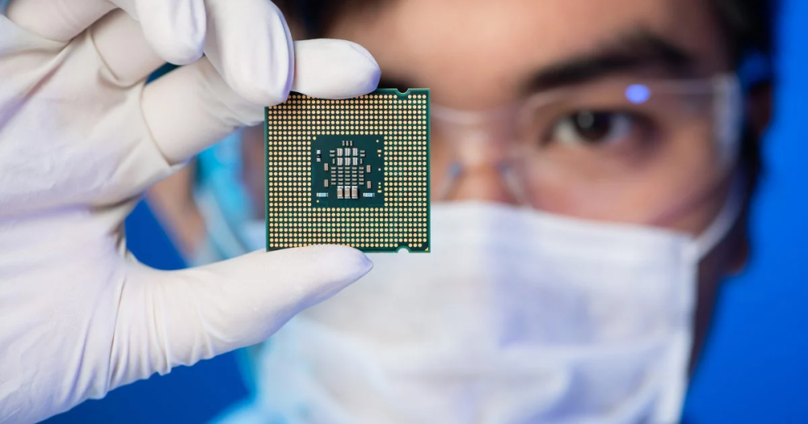
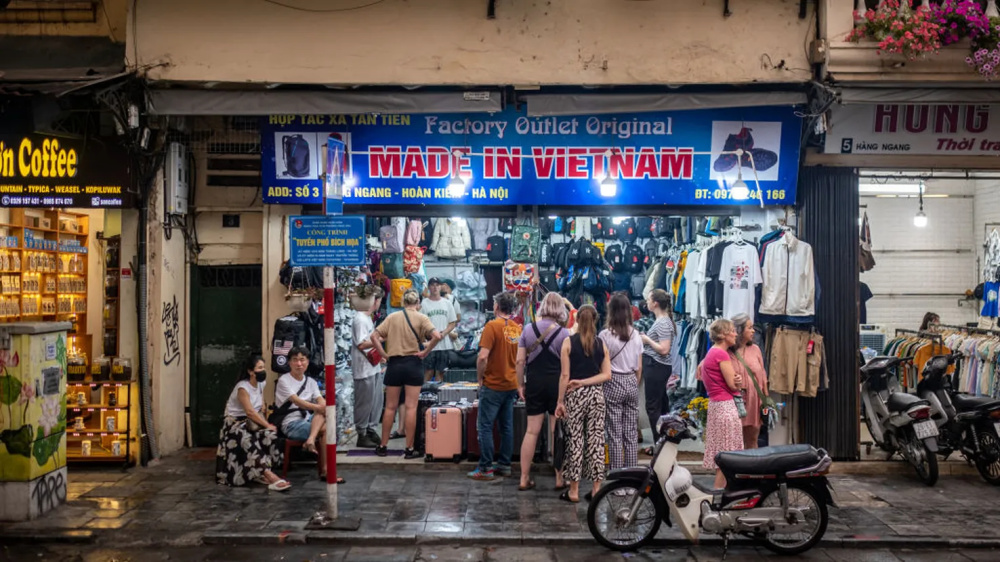
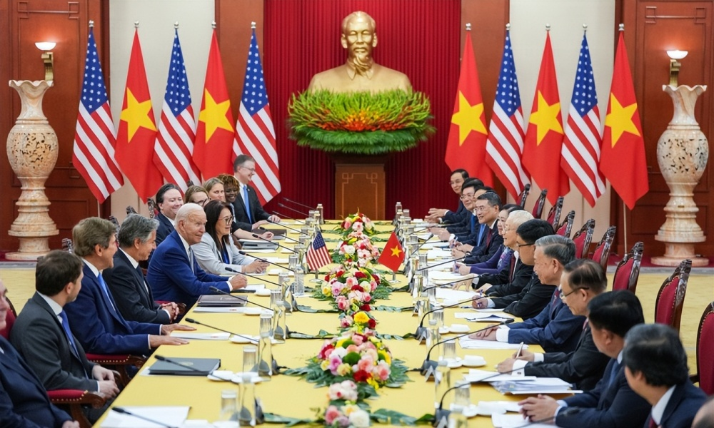

# 美越关系升至最高级，学者：越南不会成为美国遏制中国的帮手

**文/柯明家**

**编辑/漆菲**

美国总统拜登日前访问越南，将美越关系提升为最高级别的全面战略伙伴关系。两个历史宿敌的靠近，引来外界热议。

对越南而言，全面战略伙伴关系是除老挝、柬埔寨的“特殊关系”外最高级别的外交关系，美国从此与中国、俄罗斯、印度、韩国处于同一级别。对经历过越南战争的美国而言，这是与越南双边关系的“历史性突破”。

英国《卫报》形容，美越之间确立全面战略伙伴关系，直到不久前在外界看来仍是一件难以置信的事情。回顾历史，越南战争后，美国直到1994年才结束对越南的禁运，1995年才恢复外交关系。尽管如此，诸如残留于越南的未爆炸弹药等越战遗产，仍是两国均难以忘怀的遗留问题。

_9月10日，越南河内，美国总统拜登参加越共总书记阮富仲主持的欢迎仪式。_

复旦大学国际关系与公共事务学院副研究员贺嘉洁向《凤凰周刊》分析说，将美越关系升级至全面战略伙伴关系是拜登此访的最大亮点，形成了对越南的进一步拉拢。“对越南而言，此次访问可以让越南企业更深入参与美国企业的全球价值链、供应链，尤其在半导体产业方面。”

“对越南民众而言，与美国达成全面战略伙伴关系的主要意义在于，这是经济形势改善的希望所在。越南人民期望看到更多来自美国高科技公司的投资。”越南富布赖特大学国际关系学者阮成忠向《凤凰周刊》坦言，“但同时，越南对美国提供安全保障并没有什么信心，甚至担忧美国的介入会让区域局势复杂化。”

此访是对越南的进一步拉拢

拜登此次访问越南是在参加二十国集团（G20）新德里峰会之后。9月10日至11日的访问期间，拜登与越共中央总书记阮富仲、越南总理范明政等政要举行会谈。跟随拜登访问越南的是一个堪称豪华的企业团，包括谷歌（Google）、安靠（Amkor）、英特尔（Intel）、格罗方德（GlobalFoundries）、美满（Marvell）等美国科技公司。

两国举行了越美创新与投资峰会，越方与会的有许多公司高管，其中包括电动汽车制造商VinFast，该公司今年8月在纳斯达克上市后，估值超过了福特和通用汽车。

阮富仲与拜登在会谈后正式宣布两国确立全面战略伙伴关系，并发布联合声明。联合声明回顾了两国过去10年的交往历程：距离时任越南国家主席张晋创和时任美国总统奥巴马2013年宣布两国全面伙伴关系已过去10年，两国在“增进互相了解、树立互信、促进在全面伙伴框架内各领域的合作”中取得许多重要进展。

越南与美国于1995年7月实现关系正常化，2013年7月升级为全面伙伴关系。2015年7月，越美关系正常化20周年之际，越共中央总书记阮富仲访美与时任美国总统奥巴马会晤，阮富仲由此成为首位访问美国并受到美方高规格接待的越共中央最高领导。2017年，时任美国总统特朗普在访问越南期间，正式提出所谓的“印太战略”。

最新的联合声明提到，美国“支持一个强大、独立、繁荣和有弹性的越南国家”。根据声明，两国领导强调了为越美关系指明方向的基础性原则，包括尊重联合国宪章、国际法，尊重彼此政治制度、独立、主权和领土完整。在政治-
外交关系、经济-贸易和投资合作、数字、科学、技术和创新合作等领域，两国继续深化合作。

贺嘉洁分析称，拜登的此次访问是对越南的进一步拉拢，目标在于抗衡所谓的“中国地区影响力”。据半岛电视台报道，一周之内，拜登参与了于印度和越南举行的外交活动，却缺席了在印尼首都雅加达举行的东盟峰会，此举甚至引起印尼的“震惊”。

_9月11日，拜登在河内与越南国家主席武文赏举行会晤。_

但在越南首都河内，拜登始终强调，自己无意搞“新冷战”，也不针对中国。“我们不希望与中国脱钩……我们不想伤害中国。”拜登称。

9月13日，白宫国安会印太战略主任米拉·拉普-
胡珀在一场线上记者会中进一步表示，美国提升与越南的关系并不是冲着中国而来，“这既非与中国的冷战对抗，也不是在越南与中国之间选边站”。

阮富仲与拜登会谈时亦称，越美关系发展的重要基础是遵守国际关系基本准则，尊重联合国宪章和国际法，彼此尊重主权独立和领土完整，彼此尊重政治体制。他还强调不干涉他国内政的重要性。

2016年5月，时任美国总统奥巴马对越南展开访问并宣布全面解除对越南武器禁运。当时有舆论认为，美国对越南的示好是在试图“制衡中国”，这遭到了奥巴马的否认。迄今，美国已向越南移交了两艘海岸警卫队船只，并计划再移交一艘。越南还表示有兴趣购买F-16战斗机和非武装无人机。

对奉行社会主义制度且一贯担忧“和平演变”的越南而言，与美国深化合作多多少少是一把“双刃剑”。“在世界各地，美国有太多的安全关切。越南在某种意义上是现实的，他们知道在安全方面与美国加强合作可能会让区域局势复杂化。”阮成忠分析道。他认为，越南不会对美国介入领土争端寄予希望，但乐见美国及其盟国在多边主义外交中为越南提供更多支持。

对于拜登访问越南，中国外交部发言人毛宁9月4日在记者会上回应说，美国在处理与亚洲国家关系的时候，应当摒弃零和博弈的冷战思维，应当遵守国际关系基本准则，不针对第三方，不得有损地区的和平稳定与发展繁荣。

 _9月11日，拜登在河内与越南总理范明政举行会晤。_

提高越南在供应链中的地位

联合声明中的大量内容与经贸、创新、科技产业有关。声明提到，两国认识到越南“身为半导体行业主要参与者”的巨大潜力，美国将支持越南半导体生态系统的快速发展，提高越南在全球半导体供应链的地位。美国还重申致力于加大对越南高科技劳动力培训和发展的支持。

阮成忠向《凤凰周刊》分析说，越南希望利用日益激烈的大国竞争，来提升自己在全球供应链的地位，从而证明自身对全球市场的重要性。贺嘉洁也注意到，在半导体、能源、数字经济、人工智能等领域，涉及原材料、零件、设备等环节的越南企业有望更多参与到美国主导的供应链中。

一些美国企业早就有了在越南的半导体投资计划。美国芯片制造巨头美满公司计划在越南建立一个世界级中心。英特尔公司在越南南部设立了其全球生产网络中最大之一的工厂，用于组装、封装和测试芯片，工厂总价值约15亿美元，并有扩建的计划。安靠公司此前宣布，在河内附近兴建了价值16亿美元的芯片工厂，将于今年10月投入运营。

另一项重大交易是，越南公司AMI AC Renewables和美国工业集团霍尼韦尔将启动一个试点项目，在庆和省开发越南第一个电池储能系统。

据《越南快讯》报道，政府数据显示，越南半导体行业每年对美国的出口额超过5亿美元。截至今年2月的过去一年里，越南占全球对美国半导体芯片出口的10%，仅次于马来西亚和中国台湾地区。在此期间，越南芯片行业来自美国市场的收入增长了74.9%，从2022年2月的约3.2亿美元增至2023年2月的约5.6亿美元。

截至今年2月的过去一年，越南占全球对美国半导体芯片出口的10%，仅次于马来西亚和中国台湾地区。

不过，越南的半导体产业主要集中在供应链的后端制造阶段，即组装、封装和芯片的测试。越南政府虽然希望该国半导体产业能提升至设计等中前端阶段，但进度缓慢。

美国-东盟商务理事会越南办事处主任Vu Tu Thanh向路透社表示，越南可用的硬件工程师数量远低于价值数十亿美元的投资计划所需的数量。Vu Tu
Thanh援引数据估计，越南目前只有5000到6000名受训的芯片硬件工程师，但有关需求在5年内将达到2万人，10年内将达到5万人。

工程师的长期短缺对越南半导体行业的发展造成挑战。如果这一问题无法妥善解决，将会受到马来西亚、印度等区域内竞争对手的影响。“越南发展半导体具有人工成本和政策优惠方面的优势，但在工程师规模和劳动力素质等方面具有一定的短板，需要美国企业提供帮助。”上海国际问题研究院外交政策研究所周边外交室主任周士新向《凤凰周刊》分析道。

美越最新联合声明对此问题有所侧重。两国在声明中宣布启动半导体劳动力发展计划，美国政府将连同越南政府、私营部门提供200万美元的初始种子资金。美国承诺在英语教育、STEM人才培养、数字技能提升等领域投入更多资源，帮助越南培养未来的科技和领导精英。

眼下，美国和越南已达成数十亿美元的商业交易。

“越南不会成为美国遏制中国的帮手”

今年3月，拜登政府公布了“美国芯片”(Chips for
America)计划的规则，从而开启对该行业的新一轮联邦拨款热潮。美国商务部计划以直接资助、联邦贷款和贷款担保的形式发放500亿美元，这也是联邦政府几十年来对单一行业的最大投资之一。

外界认为，如果美国为全球半导体供应链提供的资金能有一部分流入越南，越南半导体行业就有望吸引到更多的私人投资。越南的稀土产业也引起美国的兴趣。据估计，越南的稀土储量是全球第二，而这一产业能为芯片提供原材料。

美越近期互动中有关供应链、价值链的动向让人想起美国近年鼓吹的“友岸外包”（offshoring）政策。根据世界经济论坛文章，“友岸外包”是一种日渐兴起的贸易做法，即将供应链网络重点放在政治和经济上的盟国。

_越南河内一家纪念品店里，一名小贩在出售印有拜登总统头像的衬衫。_

周士新指出，“友岸外包”是美国建立‘小院高墙’的工具。“尽管美国没将越南明确纳入到这一政策中，但后者一直得益于美国半导体和科技公司的产业链转移……随着越南加入美国主导的‘印太经济框架’，美越在供应链韧性和能源转型等方面的合作将会更多。”

美国现在是越南最大出口市场和第二大贸易伙伴。2022年，美越贸易额达到1240亿美元，但仍低于中越1760亿美元的贸易额。

周士新认为，如果越南被明确纳入到“友岸外包”政策中，这将说明美国推进这一政策的标准不仅具有价值观和意识形态方面的因素，还存在生产成本和地缘政治的考虑。“这反映了‘友岸外包’的功利性。”

周士新分析称，拜登政府认为，如果越南在南海、湄公河和全球产业链转型等议题上能让中国为难，对美国战略需求将有所助力，这背后有着鲜明的地缘政治诉求。然而，他进一步说，“越南担心自己的内政外交受到美国的影响和牵连，始终在维护自己战略自主权的前提下与美国发展对自己不构成伤害，但同时又能借机促进自己国家利益的关系。”

_在被越南人民尊称为“胡伯伯”的胡志明雕像的注视下，越南与美国举行了会谈。_

拜登与阮富仲的会面也引发了越南国内人权活动人士的反对，有人质疑拜登“将美国的战略利益置于越南的人权之上”。一些活动人士指出，为强化美国在该地区的主导地位，美国政府已将其宣称的在海外促进民主和人权的承诺抛到一边。

“越南的对美政策仍是一种选择性合作，具有其底线，那就是不因与美合作而损害与其他国家特别是中国、俄罗斯以及东盟国家的关系。”周士新说。

也许是为了淡化与美关系的变化，越南表示，它还计划升级与日本、澳大利亚、印度尼西亚和新加坡的关系。

 _2023年6月25日，美国核动力航母“罗纳德･里根”号抵达越南岘港，并停留至6月30日。_

据新华社报道，9月4日至6日，中共中央对外联络部部长刘建超率中共代表团访问越南，会见越共中央总书记阮富仲，同越共中央对外部部长黎怀忠举行中越两党对外部门部长会晤，同越南智库、媒体、友好团体等各界代表座谈交流。双方一致表示，要继续落实好两党最高领导人重要共识，巩固政治互信，加强团结合作，深化交流互鉴，携手应对挑战，推动中越关系朝着构建命运共同体的目标不断迈进，共同为人类和平与进步事业而努力。

贺嘉洁认为，在拜登访问前，越南或许提前向中方透露了一些信息。“越南可能表示，尽管美越关系升级，但中国依然是越南外交中的首要优先方向。越南不会成为美国遏制中国的帮手，美越关系的发展也不会影响中越关系的进一步深入。”

