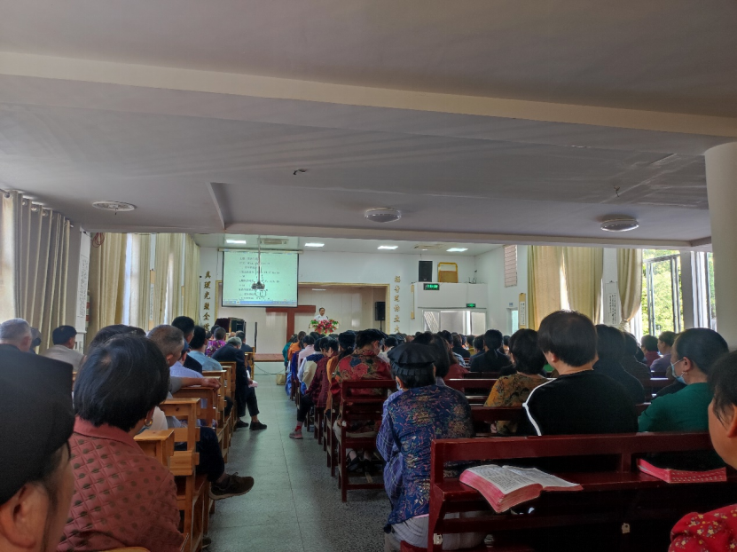
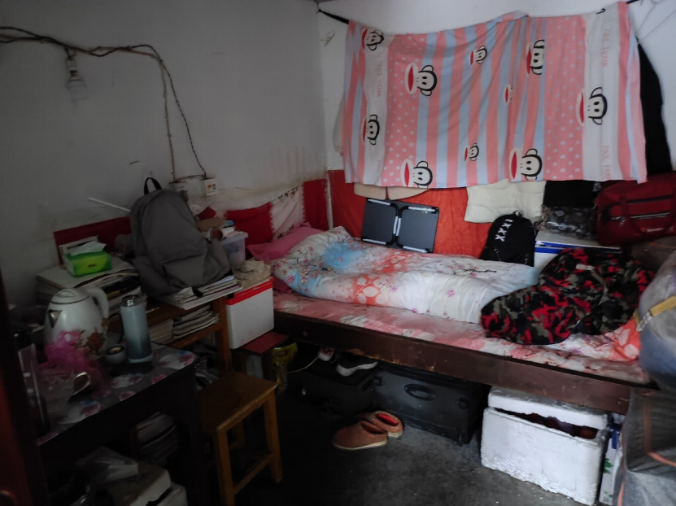
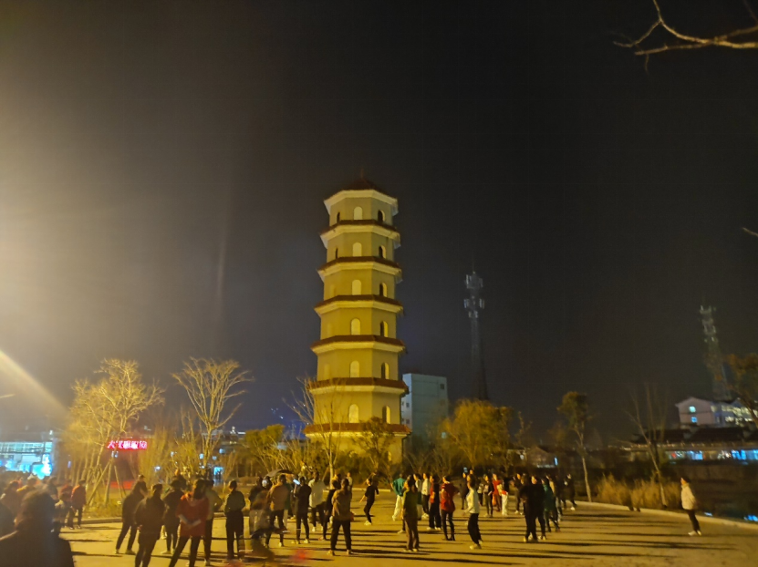
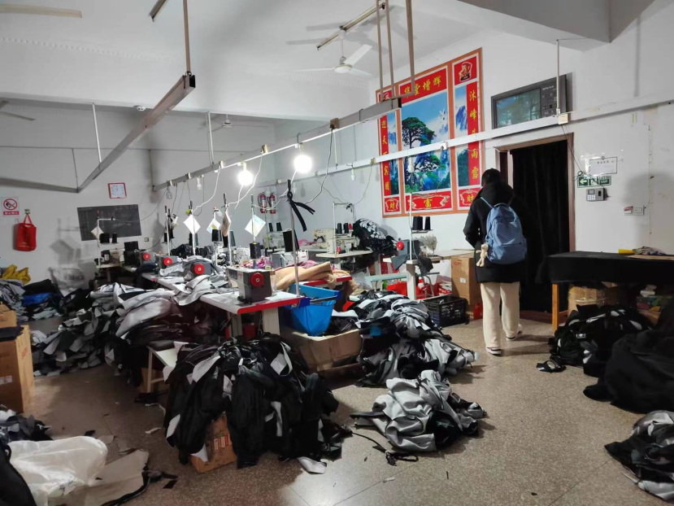

# 被污名化的陪读妈妈：老师让学生劝妈妈别跳广场舞，不然书没读完，妈妈跑了

**核心要点：**

  * _1_ 随着T镇学生规模的扩大，家长也随之增多，一些信教的陪读妈妈在此聚集，组织了这一家庭教会。相比于另一个大型教会，家庭教会的组织体系反而更为完整紧密，信众更加活跃，每周三、周五、周六晚上都会有团契活动。
  * _2_ 在T镇调研过程中，我们不止一次从学校教师、T镇居民、陪读家长乃至学生口中听到关于陪读妈妈热衷于跳广场舞、容易出轨的“八卦”。甚至有家长告诉我们，曾经有老师在课堂上让学生回家劝妈妈不要天天去跳广场舞，否则书还没读完，妈妈跟人跑了怎么办。
  * _3_ T镇镇区范围内分布着大大小小几百家服装加工企业，这些服装加工企业大部分为作坊式企业，机器规模10-20台，工人数量10-20人左右。绝大部分服装作坊采取计件工资制，工资在普遍在每月2000-3000元左右，基本上能够覆盖陪读家庭每月的房租及生活开支。

**周新成 武汉大学社会学院博士生**

在中部地区T乡镇，因其高中及中小学教育质量较高，在多年的发展过程中逐步形成了以高中及中小学为中心空间的陪读家长集聚形态，目前T镇约有陪读家长近2万人，以陪读奶奶、陪读妈妈为主。很少有人能说得清楚近两万多的陪读家长里有多少是奶奶、多少是妈妈，不过，通过调研我们了解到，近年来，妈妈在陪读家长中占比越来越高，且从小学与初中妈妈便开始返乡陪读的现象越来越普遍。

对于陪读奶奶而言，陪读是他们发挥“余热”，甚至是履行“代际伦理责任”，降低子代家庭发展压力、换取子代情感慰藉与养老支持的方式。与陪读奶奶们不同，陪读妈妈返乡陪读或是因为子女到了学业的关键阶段——例如中考前期、高中特别是备考阶段，或是因为“再不回来孩子就废掉了”——爷爷奶奶难以管教孙辈、青少年沉迷手机、学习不认真导致“成人成才”出现问题，或是因为父母十分重视子女教育，“不能让孩子输在起跑线上”。

并且，相较于陪读奶奶，大部分陪读妈妈在返乡陪读之前都是家庭核心劳动力，在东部沿海发达地区务工。返乡陪读意味着家庭核心劳动力退出劳动力市场，损失了一大笔收入，同时，陪读的房租、日常生活以及教育开支大幅增加，对于普通农民家庭而言，这带来了较大的经济压力，当经济压力与子女学业成绩压力以及其他压力相叠加时，会造成她们的精神焦虑。

在这个镇域范围并不大的乡镇上，除了围绕学校转，许多陪读妈妈主要分别嵌入到三类“组织”当中： **家庭教会、广场舞队以及服装作坊**
，这三类“组织”为她们排解焦虑情绪提供了通道。

一、家庭教会里的陪读妈妈群像

T镇不大，但是随着陪读家长的增加，当地形成了两个教会，一个是登记在册的大型教会，一个是未经登记的小型家庭教会。

大教会的布道活动主要在每周末进行。一次周末我去旁听了大型教会的布道活动，大会堂从前到后坐满了人，大概有250-300人，以本地中老年人以及陪读奶奶为主。布道活动流程主要是市里过来的牧师在台上讲解圣经，信众坐在台下听讲。牧师会以陪读家庭为实例来进行布道。例如，牧师讲道，一位陪读妈妈的名字叫“方舟”，牧师和她聊天时，就夸赞她的名字取得很好，会带领家庭往前走，让她对正在高三就读的孩子要有信心。

 _一次周末我去旁听了大型教会的布道活动，大会堂从前到后坐满了人_

与大型教会相比，家庭教会的人数较少，在100-200人之间，陪读妈妈大约占60%-70%，每年新增受洗的陪读妈妈约为30人。随着T镇学生规模的扩大，家长也随之增多，一些信教的陪读妈妈在此聚集，组织了这一家庭教会。相比于另一个大型教会，家庭教会的组织体系反而更为完整紧密，信众更加活跃，每周三、周五、周六晚上都会有团契活动。家庭教会的核心组织者及讲经者绝大多数都是年轻的陪读妈妈，除了个别的“教二代”，这些组织者有着较为共性的特征：
**家庭经济条件一般比较好，夫妻两早年即外出务工、做生意，文化水平不高但学习能力较强。**
由于早婚早育、忙于工作，这些组织者的夫妻关系、亲子关系普遍较为紧张，其中有些组织者的丈夫存在出轨、家暴等问题。

作为一般信众的陪读妈妈也具有一些共性特征：这些陪读妈妈大多来自县域农村普通家庭，家庭经济状况相对较差，一些家庭还存在有家庭成员生病、夫妻关系不和、亲子关系疏离或较为紧张等问题。这些陪读妈妈作为家庭主要劳动力返乡陪读之后家庭收入急剧降低、开支提高，这使得他们更加焦虑不安。许多妈妈在陪读过程中又面临着子女沉迷手机、学习不认真、成绩没有进步等问题。

在T镇，绝大多数陪读家长都是租单间，与子女同住，亲子之间围绕学业成绩展开的高密度互动很容易导致亲子关系的紧张乃至冲突。在陪读过程中，这些焦虑情绪往往难有排解渠道，很少有人可以从丈夫或家庭其他成员那里获得精神支持，相反，由于陪读妈妈退出劳动力市场，从家庭经济贡献者转变为“消费者”，其在家庭中的位置也更加微妙。

_这些陪读妈妈大多来自县域农村普通家庭，家庭经济状况相对较差_

家庭教会为这些陪读妈妈提供了精神上的出路，在家庭教会中，每次团契活动所有信众环绕核心组织者围坐在一起，核心组织者以及讲经者在读解经文过程中，会更加紧密地结合个人经历以及陪读过程中常遇到的问题来进行讲解。例如，当T镇或周边学校发生学生自杀等悲剧事件时，讲经者会结合经文，对陪读家长的焦虑情绪进行纾解。

在讲经过程中，一些组织者还会结合个人经历来讨论如何处理夫妻关系、亲子关系等问题。例如，在一次团契活动中，一位组织者分享了她个人的经历：由于儿子之前极度沉迷手机，自己回来陪读后对其进行严厉管教，造成了亲子间剧烈的冲突，当时，“我的孩子说我不爱他，不理解他，我那么努力赚钱给他最好的生活条件，我完全无法接受”。这样的分享引发了其他陪读妈妈的共鸣，另一位陪读妈妈说：“我儿子拿了手机就完全变了一个人，完全不理我”。

在众人分享完后，组织者结合圣经讲读，指出只有信仰基督教，才能明白“信仰第一，健康第二，学习第三”。通过类似的团契活动，这些精神困顿、焦虑的母亲努力找寻出路。在团契活动之外，这些信众在日常生活中也会相互串门、聊天，形成交往与互助网络。

二、广场舞队里的陪读妈妈群像

T镇有两个相邻的广场被用作跳广场舞，只要不下雨，傍晚这两个广场就会集聚大量的陪读家长，根据舞种与陪读家长年龄大概分为5-6个小广场舞队，每个队伍每天都大约有40-60个人，有些广场舞队以老人为主，有些以陪读妈妈为主，总体上来看，陪读妈妈居多。

不像家庭教会，广场舞作为一个纯娱乐活动，除少数几个核心成员较为固定以外，其他人来去自由。近年来，广场所属社区在T镇政府的指导下，举办了广场舞大赛活动，这一活动在一定程度上增加了广场舞队的组织性，但是，在跳舞之外，这些队员之间的交流并不算多，大部分陪读家长以学校为轴心，分布在不同区域租住，除非以前就认识，不然的话很少在跳舞时间之外串门。

跳广场舞的陪读妈妈也大体可以分为两类，一类家庭经济条件相对较好，有钱有闲，这类家庭一般已在市区买了房，来T镇陪读对她们来说并不会带来太大的经济压力，特别是一些家庭为个体工商户，在陪读时也可以兼顾生意，甚至对于其中一些年轻妈妈而言，陪读生活为她们提供了一段自主安排的时间与相对舒适的生活空间，这些人是广场舞队的核心成员。

还有一些陪读妈妈家庭经济条件相对较差，跳广场舞是她们打发时间、排解焦虑的重要方式。例如，调研期间我们认识的一位陪读妈妈，其家庭条件较差，女儿高三复读，为了节省租金，租了一间由猪栏改造的出租屋，租金为附近单间的三分之一左右。一次访谈中，这位陪读妈妈告诉我们，很多时候自己下午一个人坐在逼仄的房间里，想着女儿的成绩，就会感到心里发慌。只有跳广场舞的两个小时，才感觉到时间完全属于她自己，因为那个时候不会紧张的想起孩子的学习情况。

_T镇有两个相邻的广场被用作跳广场舞_

然而，在T镇调研过程中，我们不止一次从学校教师、T镇居民、陪读家长乃至学生口中听到关于陪读妈妈热衷于跳广场舞、容易出轨的“八卦”。甚至有家长告诉我们，曾经有老师在课堂上让学生回家劝妈妈不要天天去跳广场舞，否则书还没读完，妈妈跟人跑了怎么办。与一些陪读妈妈聊天，也有人对广场舞活动持较为负面的看法，向我们透露了一些“八卦”。从这些口口相传的“八卦”中，我们能够看到对于陪读妈妈的“污名化”，这些“污名化”来源于年轻妈妈返乡陪读后面临着夫妻长期分离、生活单调枯燥等问题，这可能会带来夫妻关系的裂痕，但在社会舆论场中，夫妻的长期分离、枯燥单调的陪读生活是否会造成陪读妈妈逃离家庭，成为大家都十分关注的问题。由此衍生出的“出轨”舆论也形成一种道德压力，抑制了部分陪读妈妈休闲娱乐的想法。

三、服装作坊里的陪读妈妈群像

在T镇，陪读家长的增加使得镇区范围内服装加工企业近些年来大量增加，这些服装加工企业之所以愿意落户T镇，正是看中了T大量的陪读妈妈劳动力。90年代外出务工潮兴起后，T镇及周边农村女性大量涌入江浙地区服装厂务工，在返乡陪读前大量陪读妈妈已是熟练工，在江浙地区的服装厂工资在8000-10000元左右。

目前，T镇镇区范围内分布着大大小小几百家服装加工企业，这些服装加工企业大部分为作坊式企业，机器规模10-20台，工人数量10-20人左右。绝大部分服装作坊采取计件工资制，工资在普遍在每月2000-3000元左右，基本上能够覆盖陪读家庭每月的房租及生活开支。由于劳动力供大于求，这些服装作坊大多只愿意招熟练工，不愿意招以前没有在服装厂工作过的陪读妈妈。

_这些服装加工企业大部分为作坊式企业，机器规模10-20台_

为了适应陪读妈妈的时间安排，这些服装作坊参照学校学生作息时间安排来进行工作时间安排，以满足陪读妈妈照顾子女为主、工作为辅的需求。但是，由于这些服装作坊的工资较低，一些家庭经济条件相对较好的陪读妈妈并不愿意去做，更重要的是，即使这些服装作坊采取弹性工作时间安排，但在一些陪读妈妈特别是高中阶段陪读妈妈看来，仍然会影响她们的陪读安排。例如，在访谈中，一位陪读妈妈非常后悔在儿子高二、高三期间自己去工作，这导致自己对儿子玩手机疏于管教，以至于儿子第一次高考没有考好，只能复读一年。

不仅是这位陪读妈妈，在我们问其他一些陪读妈妈为何不去服装作坊工作时，她们也认为高中阶段陪读时间不长，如果因为赚钱而导致陪读效果不好，反而是“捡了芝麻丢了西瓜”。因此，T镇的服装作坊许多工人是中小学陪读妈妈，她们还有漫长的陪读时间，在服装作坊工作的工资虽然不高，但也很大程度上缓解了家庭的经济压力。

四、陪读妈妈焦虑的心灵何处安放？

如上所述，在T镇，许多陪读妈妈或通过信教，或通过娱乐，或通过进厂，来抚平焦虑的心灵。信教的陪读妈妈的精神困顿不仅来源于子女学业成绩，还来源于亲子关系的紧张、夫妻关系的破碎、家庭发展的压力，教会为他们提供了一剂心灵药物，让他们继续嵌入进破碎的家庭关系当中，为子女的学业、家庭的发展努力奉献自己。

这便是“基督教中国化”的奇妙之处，它没有摧毁中国人对家庭的信仰，相反，它在大变革的时代中强化了这些陪读妈妈对家庭的坚守，即使她们要面对家庭的贫穷、生活的困顿、丈夫的出轨或家暴，亲子关系的疏离乃至紧张等困境。或者可以反过来说，正是因为种种难以排解的精神困顿，这些陪读妈妈被宗教吸引，从而避免自己的心灵秩序被冲击至崩解。

不过，这样的家庭毕竟是少数，大多数陪读妈妈在陪读过程中虽然会因为各种原因感到焦虑，但是，公平的应试教育体系仍然为她们提供了希望。这些陪读妈妈在进入劳动力市场过程中深切感受到了文凭对于工作类型以及工资水平的决定性作用，但同时，进入现代市场经济过程中又并没有激发她们的自我意识，相反，使得她们形成“新家庭主义”价值观念，更加深度地嵌入到家庭发展体系当中。因此，她们可以没有怨言的返乡陪读，托举子代向上流动。在陪读生活中，广场舞等休闲娱乐活动为这群陪读妈妈缓解焦虑提供了很好的通道。

而对于一些陪读妈妈特别是还有漫长陪读生涯的年轻妈妈来说，或许只有通过劳动获得经济收入才是缓解其焦虑的最好方式。哪怕相比于在东部沿海的工厂里，T镇的服装作坊工资少得可怜，但只要有收入，便可缓解她们对于家庭发展的焦虑、缓解她们在陪读生活过程中很容易产生的弥散的焦虑感。

近些年来，在中西部许多县域，年轻母亲返乡陪读现象越来越普遍。在大部分中西部地区，由于优质教育资源向县城集中，绝大多数陪读妈妈都是在县城购房或租房陪读，T镇是一个罕见的例外，T镇之外，是无数个相似的“T县”。只是，T镇作为一个高度聚合的空间，为我们提供了一个具有分析意义的“特例”。陪读妈妈返乡之后，许多人会在县域内找一份工作以贴补陪读开支，工资水平与T镇的服装作坊相近。在县城中，休闲娱乐场所也更多，不似T镇，最主要的休闲活动便是跳广场舞。然而，多元的消费场所意味着家庭开支的增加，这给收入降低、支出增加的农民家庭带来了更大的压力。

 _这些家庭散落在不被看见的角落中_

相较于T镇，在县城里较为罕见的反倒是为少部分陪读妈妈提供精神寄托的家庭教会，在县城中，这些家庭散落在不被看见的角落中，或在多重困境下走向崩解，或在陪读妈妈十年如一日的忍耐下维系着。只是，在这个过程中，受伤的不仅是这些陪读妈妈，还有在学业与家庭之间挣扎的青少年。

陪读妈妈可以将自己的心灵秩序安放在家庭发展的强大信念中，甚至是依靠宗教信仰来维系家庭主义的价值信念，这些走向个体化的青少年又该如何面对破碎的家庭关系、内卷的学业竞争呢？他们又该如何安放自己的心灵秩序呢？此外，支撑着农民家庭卷入教育竞争、返乡陪读的动力在于她们对于教育回报的较高期待。然而，教育本身就是一门“艺术”，高投入不一定带来高回报，一旦教育投入-
回报失衡，陪读妈妈焦虑的心灵还能找到安放的地方吗？

在现代化高歌猛进的历史进程中，中国农民家庭承担了太大的压力，女性在其中分担了极大的工作与家庭抚育压力，特别是在教育竞争压力越来越大的当下，返乡陪读妈妈承载的压力越来越大，“新家庭主义”信念支撑着她们，家庭教会、广场舞队、服装作坊等“组织”为部分陪读妈妈提供了排解焦虑的场所。然而，很多教育竞争压力本不应该由家庭、由母亲承担，如何重构县域教育体系、抑制激进的教育城镇化，降低教育竞争特别是义务教育阶段教育竞争压力，从而减缓农民家庭的教育负担与风险，这是我们需要思考的问题。否则，农民家庭的韧性与危机只有一墙之隔。

