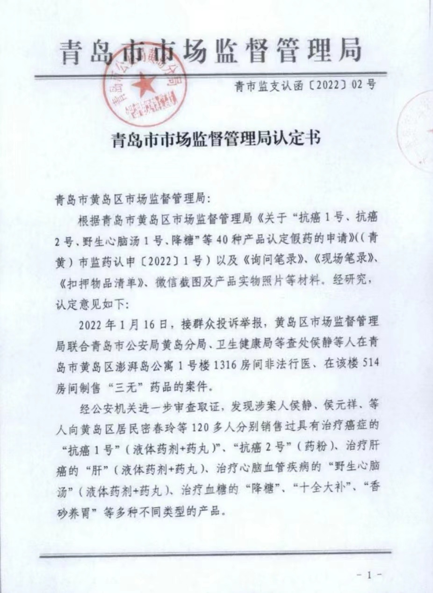
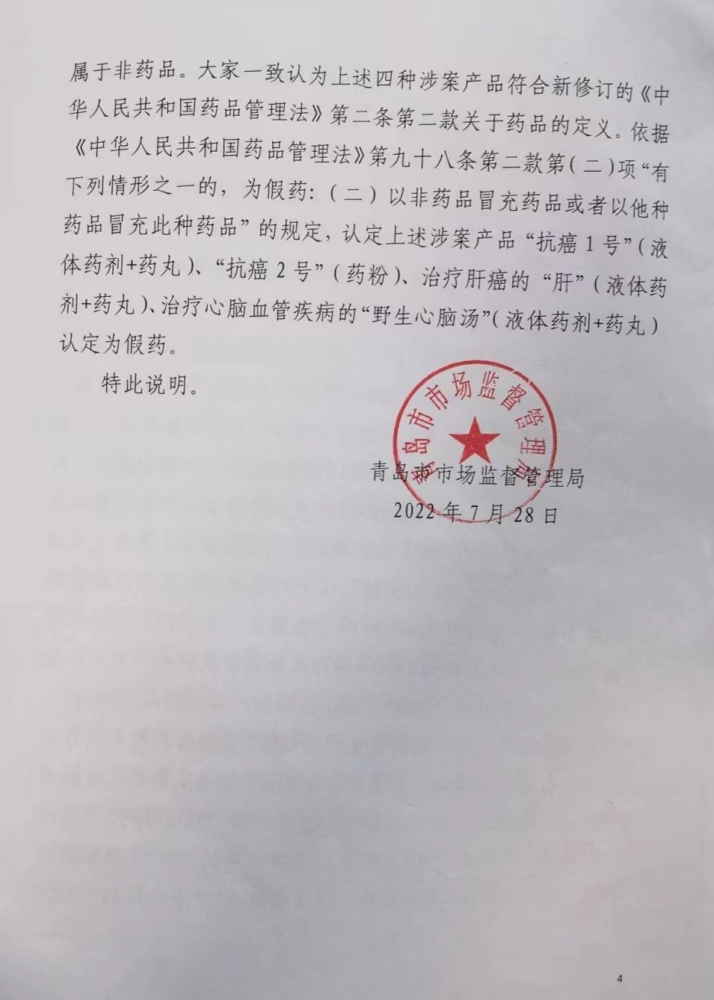

# 青岛中医“假药”案：一家四口被判刑，罚金共2900万，二审发回重审

受到社会关注的青岛中医“假药”案，近日被二审法院撤销原判、发回重审。

_案发前，侯元祥曾在当地号脉问诊。 本文图片均为受访者提供_

因为自制销售“抗癌1号”等中药制剂，今年67岁的侯元祥此前被一审法院以生产、销售假药罪，判处12年有期徒刑并处罚金1200万元。一起被判刑的，还有他的妻子、儿子和女儿，以及前女婿和外甥。

青岛市黄岛区法院审理查明，2011年至2022年初，侯元祥及其女儿侯静等人在未取得药品生产和销售许可的情况下，在山东潍坊、淄博、青岛等地号脉问诊，销售自称抗癌的药物“抗癌1号”“抗癌2号”以及“野生心脑汤”等中药制剂，销售金额1436万余元。

侯元祥一家四口，一审被处罚金共2900万元。

一审宣判后，侯元祥等人提出上诉。2023年8月30日，青岛中院对此案作出二审裁定，认为原审判决认定事实不清、证据不足，撤销一审判决，发回重审。

这起生产、销售假药案，系由市场监管部门移送公安机关侦查。青岛市市场监督管理局将涉案的“抗癌1号”等中药制剂认定为假药。这一认定是此案定性的关键，也成为控辩双方的争议焦点。

青岛市市场监管局曾作出“补充说明”：四种涉案产品无药品注册证号、无医疗机构制剂备案、无药品生产许可证、无医疗机构制剂许可证、无国家药品标准等，被告人却宣称治疗癌症和心脑血管疾病销售给病人治病；涉案产品属于“非药品”，根据药品管理法关于“以非药品冒充药品”的相关条款，认定涉案产品为假药。

**冒充“教授”“主任”，自制销售抗癌等“假药”出售**

侯元祥是山东临沂市沂水县人，曾在当地小学、中学任教，2003年起停薪留职，先后跟随多名老中医学习传统医学。

 _《中医传承协议书》显示，侯元祥曾师从老中医学习传统医学。_

据侯元祥归案后供述，1972年左右，他从“二姥爷”那里知道了一个治疗肿瘤的配方，“这个方子有5种药”。学习研究中医后，他在该“方子”的基础上增加香菇、灵芝、虫草等材料，尝试增加效果。“这个药方就算是我自创的。”侯元祥供称，他从2012年前后开始卖其配制的抗癌中药，“我一直想推广这个药方卖药挣钱。”

而在一审阶段时，侯元祥的辩称有所不同：2019年他才从中医老师那里获得“秘方”，此后才开始熬制。

工商信息显示，2019年，侯元祥联合其他四名股东，成立山东潍州中医医院有限公司，法定代表人为其前女婿付松杰。侯元祥的女儿侯静，毕业于山东中医药大学（函授），2018年在青岛市黄岛区成立颐养康综合门诊部。

_一审判决书（部分）_

2022年1月，青岛市黄岛区市场监督管理局联合公安、卫健等部门，查处侯静等人在黄岛区某公寓非法行医、制售“三无”药品的案件。

此案移送青岛市公安局黄岛分局侦查后，侯静被以涉嫌非法经营罪刑事拘留。

此后，侯元祥及其妻子肖培瑧、儿子侯雷、前女婿付松杰、外甥李帅，均被公安机关抓获。

2022年8月，青岛市黄岛区检察院对此案提起公诉。检方认为，应当以生产、销售假药罪，追究侯元祥、侯静、侯雷、肖培臻、付松杰的刑事责任；而被告人李帅被指控的罪名，则是诈骗罪和窝藏罪。

一审刑事判决书显示，青岛市黄岛区人民法院审理查明：2011年以来，被告人侯元祥、侯静等人，在未取得《药品生产许可证》《药品经营许可证》等证的情况下，通过在网络上投放侯元祥虚假个人简历，在山东潍坊市、淄博市、青岛市黄岛区等地号脉问诊、销售自称抗癌的药物。

2022年2月，侯元祥等人销售的“抗癌1号”“抗癌2号”和“野生心脑汤”等中药，经青岛市市场监督管理局认定为假药。相关审计显示，自2011年5月至2022年1月，侯元祥等人销售涉案假药的金额为14363355.28元。

一审法院还查明，在生产、销售涉案假药的过程中，侯元祥对外称“侯教授”，负责提供配方、诊疗癌症疾病、销售药品；他的女儿侯静负责诊疗癌症以外的疾病，并销售侯元祥的“抗癌药品”和“野生心脑汤”，购进中草药、熬制中药药剂。

法院查明，侯元祥的儿子侯雷在后台冒充负责拿药、退药的医生“李主任”，对外用快递邮寄药品，并对接沂源瑞康医院的销售情况；侯元祥的妻子肖培臻负责收款及帮忙寄送药品快递；侯元祥的前女婿付松杰，2020年协助侯静熬制中药并收取部分销售款项，该时间段假药销售额为236万余元。

**包括一家四口的六人被判刑，总罚金近三千万**

案发后，侯静第一个被警方带走，侯元祥、侯雷等人被网上追逃。

黄岛区法院查明，被告人李帅曾为侯元祥、侯雷提供通信工具及住处，期间还谎称其有关系可为大舅侯元祥等人洗脱罪名，向侯雷等人索要“找关系”的办事费用，侯雷、付松杰分别送给李帅现金50万元、200万元。

在案件审理过程中，公诉机关提供了约50名被害人（患者）的书面陈述及转账明细，证明患者曾从侯元祥、侯静等人处购买“抗癌1号”“抗癌2号”等药品。

被告人侯元祥辩解称，指控罪名不成立，其生产销售的药系“药食同源”，“这些药小孩都可以喝”；女儿侯静、儿子侯雷是给自己打工，“他们无罪”。黄岛区法院认为侯元祥的上述辩解意见与事实不符，不予采纳。

被告人侯静亦对指控事实及罪名提出异议，称其系被刑讯逼供，其所有供述系非法证据。黄岛区法院认为，公诉机关并未宣读出示该证据（侯静供述），“本院也未以该供述作为定案证据。”不过该院认为，多种证据相互印证，侯静辩解其无罪“与事实不符”。

侯元祥的辩护人对青岛市市场监管局的“假药”认定提出异议，认为侯元祥的行为确定为“妨害药品管理罪”更为确切和符合事实；侯静的辩护人提出，出售有疗效的民间传承药方，不能认定为生产、销售假药罪，对涉案“假药”的认定缺乏客观性、科学性；侯雷的辩护人提出，违规生产销售一些有作用的“民间偏方”，是违反药品管理规定的行政违法行为，不能认定为生产、销售假药罪。

对于上述辩护意见，一审判决书显示，黄岛区法院不予采纳，并概括地表述为“与事实不符”或“不符合法律规定”，未进行具体的“释法说理”。

有辩护律师指出，此案的定性可能对我国传统中医产生冲击：民间中医从业人员为患者开具药方或配制中药，其“方子”往往未向监管部门备案，也未经过批准，是否涉及违法犯罪？

澎湃新闻查阅法律条款发现，近年来，我国逐渐完善对传统中医的依法保障。

根据《中医药法》第56条的规定，医疗机构应用传统工艺配制中药制剂应依照规定备案，但该条款规定应向监管部门“备案”的，并非中医医生开具的“方子”，而是中药“制剂”。根据市场监管部门的认定，侯元祥等人自制的“抗癌1号”等液体药剂和药丸，属于应当备案的“制剂”。

最高法、最高检《关于办理危害药品安全刑事案件适用法律若干问题的解释》规定，根据民间传统配方私自加工或销售药品，“数量不大，且未造成他人伤害后果或者延误诊治的”，不应当认定为犯罪。

公诉机关认为侯元祥等人生产、销售假药，有其他特别严重情节。根据相关司法解释，生产销售假药金额为五十万元以上的，属于“其他特别严重情节”。

我国刑法第141条规定，生产、销售假药的，处三年以下有期徒刑或者拘役，并处罚金；有其他严重情节的，刑期为三年以上十年以下；有其他特别严重情节的，处十年以上有期徒刑、无期徒刑或者死刑，并处罚金或者没收财产。

2023年2月，青岛市黄岛区法院作出一审判决。侯元祥一家四口及其前女婿付松，均被以生产、销售假药罪判刑。

其中，侯元祥被判刑12年并处罚金1200万元，侯静被判刑11年并处罚金900万元，侯雷被判刑8年并处罚金500万元，肖培臻被判刑5年并处罚金300万元，付松杰被判刑3年并处罚金50万元。

黄岛区法院认定另一被告人李帅构成诈骗罪、窝藏罪，决定对其执行有期徒刑11年，并处罚金30万元。

**二审法院撤销原判，“假药”认定系争议焦点**

一审宣判后，此案除付松杰外的5名被告人，均提出上诉。

在二审阶段，市场监管部门对涉案“假药”的认定，仍是争议焦点。

_青岛市市场监督管理局作出的《认定书》（首页）_

将涉案产品定性为“假药”，是青岛市市场监督管理局根据黄岛区市场监管局的申请，于2022年2月作出的认定。该《认定书》显示，涉案产品“抗癌1号”为液体药剂和药丸，“抗癌2号”为药粉；治疗肝癌的“肝”药，以及治疗心脑血管疾病的“野生心脑汤”，均为“液体药剂+药丸”。

上述《认定书》认为此案适用《中华人民共和国药品管理法》，涉案产品符合该法第二条“关于药品的定义”。根据药品管理法第98条关于“假药”的条款——“以非药品冒充药品或者以他种药品冒充此种药品”，将“抗癌1号”等涉案产品认定为假药。

青岛市市场监管局作出上述认定五个月后，根据黄岛区检察院《关于商请补充说明的函》，该局对此前的《认定书》进行了“补充说明”。

_青岛市市场监督管理局“补充说明”（尾页）_

在“补充说明”中，青岛市市场监管局表示，根据药品管理法的规定，生产药品应当取得药品注册证书和药品生产许可证，按监管部门核准的生产工艺进行生产；医疗机构配制制剂应当取得制剂许可证。此外，根据《中医药法》第56条规定，医疗机构应用传统工艺配制中药制剂，未依照规定备案或未按备案材料要求配制的，“按生产假药给予处罚”。

青岛市市场监管局认为，“抗癌1号”等四种涉案产品，无药品注册证号、无医疗机构制剂备案、无药品生产许可证、无医疗机构制剂许可证、无国家药品标准等，却生产出宣称治疗癌症和心脑血管疾病的药品销售给病人治病；涉案产品属于“非药品”，根据药品管理法关于“以非药品冒充药品”的相关条款，认定涉案产品为假药。

青岛市市场监管局的上述《认定书》及补充说明，成为此案一审定性为“生产、销售假药”的关键证据。

侯元祥等人上诉后，其二审辩护律师李爱军向法院提交书面意见，认为对涉案产品的“假药”认定，系定性错误。

李爱军认为，青岛市市场监管局在《认定书》补充说明中的论述“自相矛盾”，既认定四种涉案产品属于“非药品”，又认为该产品符合药品管理法第二条“关于药品的定义”，“既然是非药品，怎么能符合药品的定义？”

青岛市市场监管局认定涉案产品的生产未经监管部门批准，也未备案，属于“非药品”。对此，李爱军认为，刑法修正案（十一）颁布后，对于生产销售的“未经批准的药品”，不应“刻舟求剑”地认定为假药，而应当适用“妨害药品管理罪”的条款。

根据我国刑法，妨害药品管理罪比生产、销售假药罪的刑罚较轻。

在“假药”认定材料中，青岛市市场监管局还引用了《中医药法》的规定：应用传统工艺配制中药制剂未备案的，按生产假药给予处罚。对此，李爱军表示，《中医药法》施行时间是2017年，国家药监局发布关于传统工艺配制中药制剂备案管理的公告，是在2018年2月。李爱军由此认为，依据“法不溯及既往”原则，侯元祥、侯静在2018年2月之前的行为不构成生产销售假药罪。

李爱军还指出，没有证据证明涉案产品给患者造成了危害健康的后果，侯元祥等人的行为并没有侵犯生产、销售假药罪所保护的法益。

在书面意见中，李爱军还对涉案金额的审计报告提出了质疑。

_青岛市中级人民法院刑事裁定书（部分）_

侯元祥、侯静等人上诉之后，青岛市中级人民法院组成合议庭对此案进行审理。据李爱军介绍，2023年9月上旬，上诉人陆续收到了刑事裁定书。

二审裁定书显示：“本院认为，原审判决认定事实不清、证据不足。”青岛市中级人民法院作出裁定，撤销黄岛区法院此前作出的一审刑事判决，发回该院重新审判。

