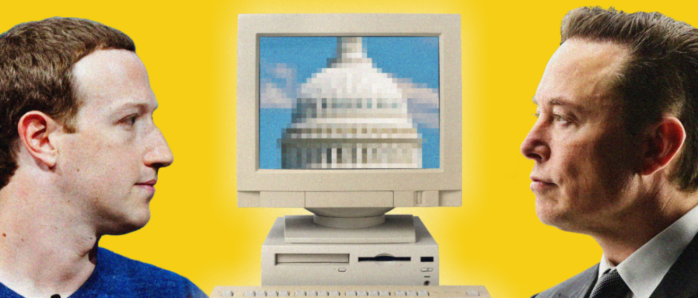
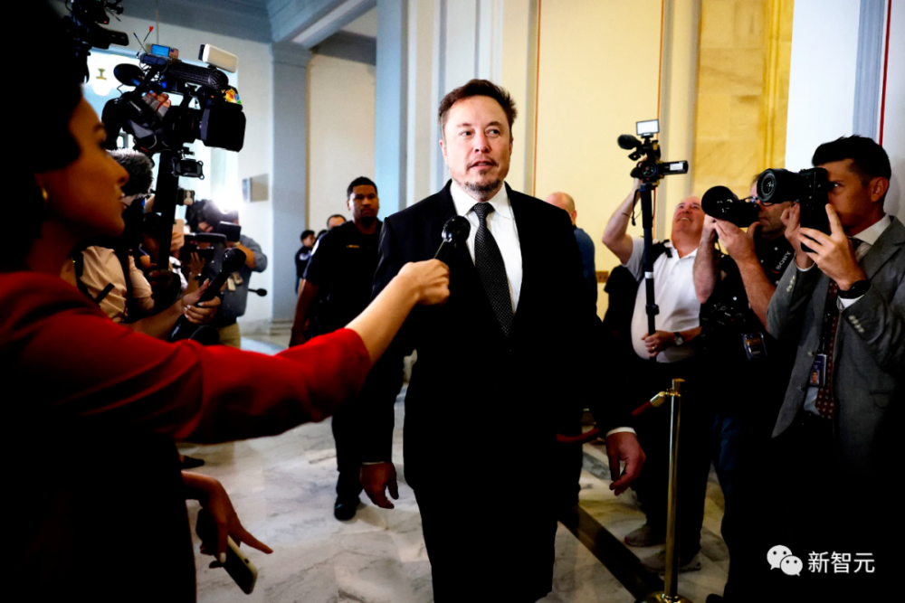
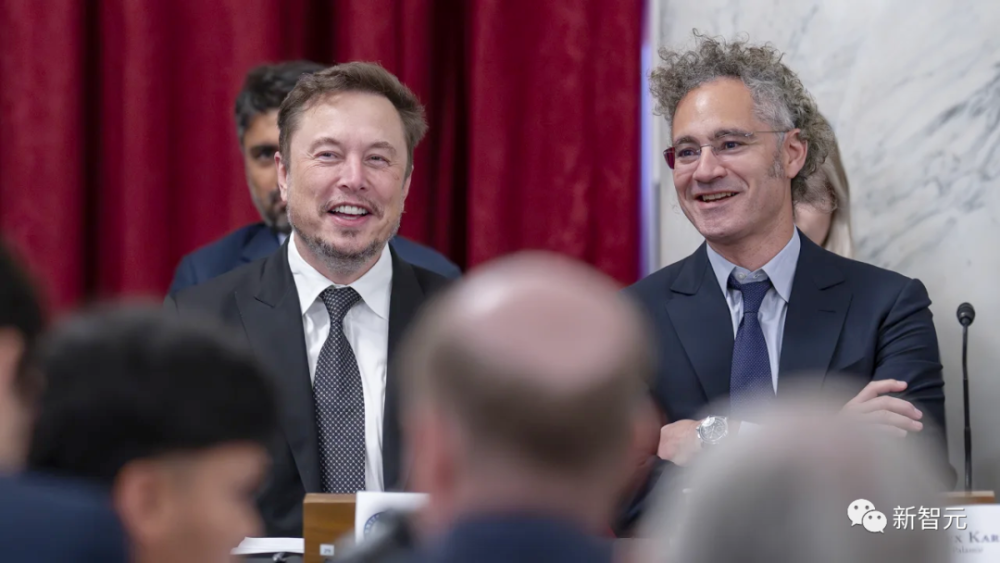
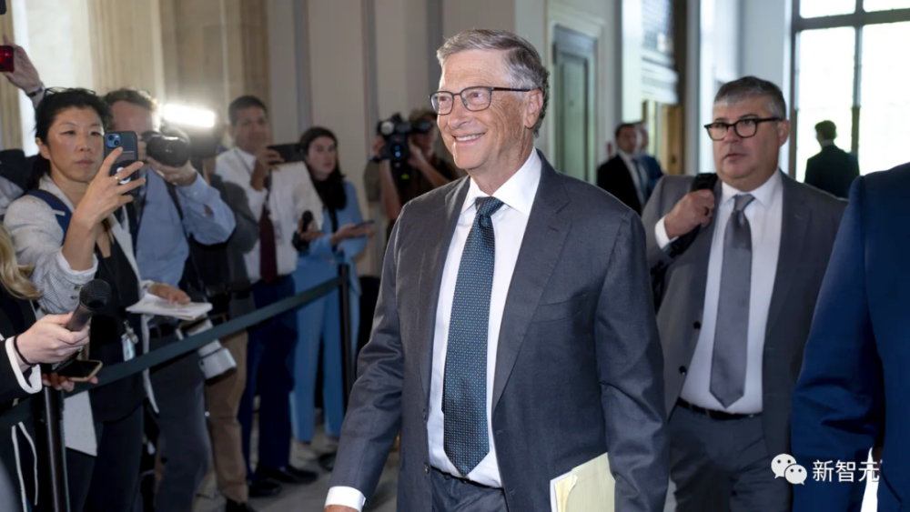
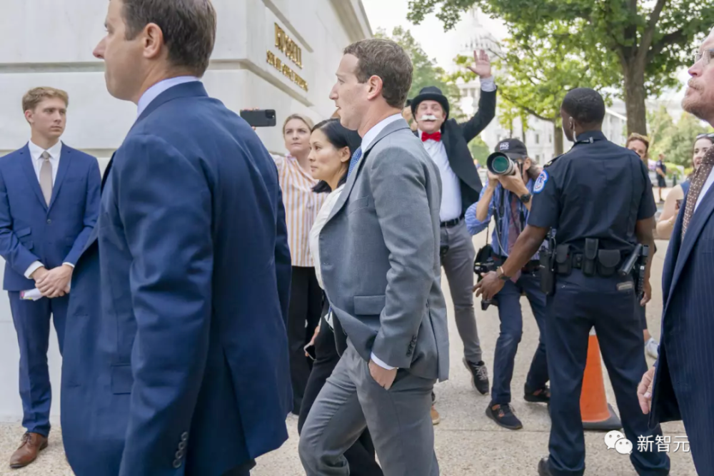

# AI史上最重要闭门会议！马斯克、小扎等大佬齐聚，探讨AI未来

**【新智元导读】** 昨天举行的AI闭门峰会，汇集了AI行业中最具影响力的业界大佬，看看他们都聊了些啥。

昨天，当地时间上午10点，AI行业的大佬们齐聚华盛顿，参加了由参议员舒默主持召开的AI峰会。

Meta CEO小扎和英伟达CEO 老黄在一栋楼门口停下来聊了一会天。

谷歌CEO Pichai与一名参议员站在一起，而X（推特）老板马斯克则迅速向人群挥手致意，快速从大批摄像机镜头前走过。

进到房间里，马斯克与小扎坐在房间的另一端，这可能是自几个月前两人开始互相挑战笼斗以来第一次共处一室。

主持召开峰会的舒默，周二在接受采访时表示，在人工智能方面无所作为是不可接受的。

「人工智能将成为未来几十年影响我们最具变革性的事物。它将影响生活的方方面面。它具有巨大的潜力，可以做一些真正有益的事情：治愈癌症，改善我们的食品供应，帮助我们的教育。它具有做坏事的巨大潜力：允许偏见持续存在，让许多人失业」

「会议可能会成为文明非常重要的历史时刻」

多达60名参议员像小学生一样坐在一个私人简报会议室中——不允许说话或甚至举手。

大约20名硅谷首席执行官、伦理学家、学者对AI会以何种方式颠覆、改善或甚至消除我们熟知的生活方式进行了预言。

「对我们来说，拥有一个裁判是很重要的，这样公司就不会不受控制地运营人工智能产品。」特斯拉、SpaceX和X（Twitter）的老板，CEO马斯克对在简报会外侧和记者们聊到。「（这个会议）可能会成为文明非常重要的历史时刻。」

「我认为大家都一致同意，这是我们需要政府出面来领导的事情，」OpenAI首席执行官Sam
Altman说他相信政策制定者希望「做正确的事」，并对政府围绕该技术制定规则的速度感到惊叹。

整个会议并不是仅仅谈论一些大而空的问题，参与者提出了很多具体的问题。

微软联合创始人比尔·盖茨则专注于解决全球饥饿问题。

马斯克和谷歌前首席执行官施密特提出了人工智能带来的生存风险。

扎克伯格则提出了封闭与「开源」人工智能模型的问题。

IBM首席执行官Arvind Krishna表示反对其他公司希望的需要给大模型发许可证的提案。

会外，谷歌首席执行官劈柴拒绝透露具体细节，但总体上支持政府参与的想法。

（盖茨：就我一个人画风不对？）

小扎在准备好的讲话中表示，“国会应该与人工智能合作，以支持创新和保障措施。” 他说人工智能有两个决定性问题：安全性和可获取性。

Meta
在其生成式人工智能模型中建立了保障措施，并认真考虑如何推出人工智能驱动的产品。但扎克伯格表示，Meta相信强大的人工智能模型“将成为未来日益重要的机遇驱动力”。

小扎表示：「我们认为政策制定者、学术界、民间社会和工业界应该共同努力，最大限度地降低这项新技术的潜在风险，同时最大限度地提高潜在利益。」
「如果你认为这一代人工智能工具是向前迈出的有意义的一步，那么重要的是不要低估它的潜力。」

小扎还称赞Meta对其Llama 2模型进行开源的行为，提供了对于AI技术更多的可用空间。同时他也指出，平衡监管和创新非常重要。

而在所有的报道中，看不到黄老板的任何信息，可能他只想静静地卖自己的「铲子」。

对于闭门论坛不同的声音

虽然与会嘉宾们对于会议产生的影响和作用都做出了高度评价，但是在会议之外，也有一些批评的声音。

一些参议员批评该论坛，称这是科技巨头影响政策的一种方式。「我们需要更多的公开听证会，以便我们对法规的制定方式有更大的透明度。」
「我希望其他论坛也向公众开放。」

卡内基梅隆大学信息系统与公共政策学院院长Ramayya Krishnan告诉媒体，其他人工智能论坛必须是公开的。

随着涉足人工智能的大型科技公司呼吁监管，人们对「监管捕猎」（当一个行业可以决定如何制定法律时）的担忧有所增加，这可能会让小公司处于不利的地位。

「我不知道为什么我们会邀请世界上所有最大的垄断者来，向国会提供如何帮助他们赚更多钱的建议，然后不对公众开放」，有批评者这样向媒体吐槽。

有些本可以参会的人士表示，拒绝参加这个所谓的「大型科技公司的大型鸡尾酒会」。

参考资料：

https://www.wired.com/story/senate-ai-forum-musk-zuckerberg/

