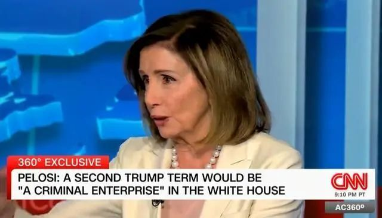
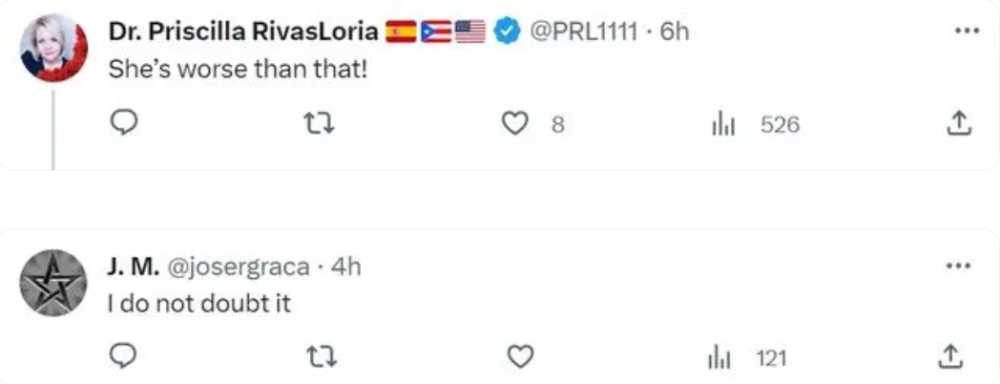
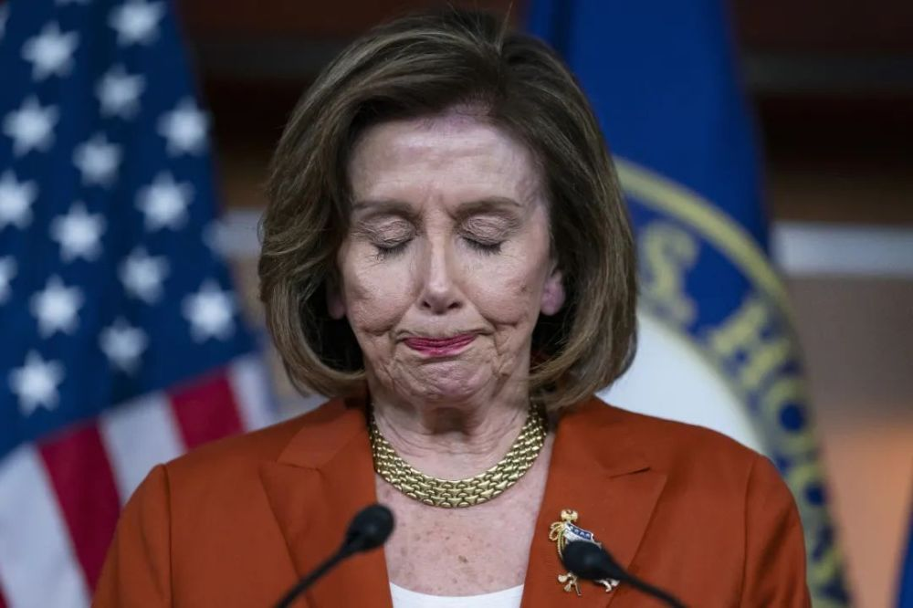
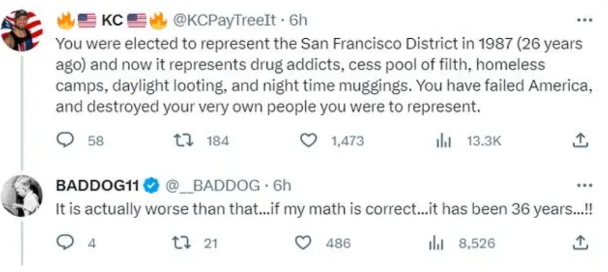

# “我将赢得选举”83岁美国前众议院议长佩洛西：我更像冷血爬行动物

据环球网援引塔斯社9月14日报道，美国前众议院议长佩洛西接受美国有线电视新闻网（CNN）采访时笑称自己是 **“冷血爬行动物”**
。这一言论在社交媒体引发关注，有网友感叹：“（她）终于说了实话”。

近日，美国国会前众议院议长、民主党议员佩洛西正式宣布，她将参加2024年众议员选举。她在社交媒体发文称，“我们国家需要向世界展示自由和正义，这就是我决定再次参选众议员的原因”。据了解，现年83岁的佩洛西领导众议院民主党人20余年，是美国政界最有权势的人物之一。

**佩洛西自称“冷血爬行动物”**

**“我不是一个可怜的宝贝，我更像爬行动物，冷血的那种。我将赢得选举，”**
佩洛西这样说。塔斯社称，接受采访之际，现年83岁的佩洛西本月8日宣布将参加2024年众议员选举。

_佩洛西接受CNN采访 图片来源：视频截图_

对于佩洛西的言论，不少网友在社交媒体X（原推特）上进行评论。有人表示，“哦天哪”“我就知道”。↓

还有网友感叹， **“（她）终于说了实话”“她比那还要糟”“我对此并不怀疑”。**

**83岁佩洛西决定参选**

**2024年众议员**

当地时间9月8日，美国国会前众议院议长、民主党议员佩洛西表示， **她将代表加州再次参加2024年众议员选举，希望再连任4年。**

据央视新闻此前报道，当地时间2022年11月16日晚，据美国多家媒体统计，共和党已经获得众议院超过218个席位，重新掌控美国国会众议院。当地时间11月15日，美国众议院少数党领袖凯文·麦卡锡（Kevin
McCarthy）以199票赢得共和党众议院议长提名。

随着这一结果出炉，意味着时任美国众议院议长、民主党籍的佩洛西“下台”。

尽管佩洛西自今年1月不再担任众议院民主党领袖，但她在民主党中仍具有很大影响力。此外，佩洛西也是众议院民主党人中筹款最多的议员之一。

_图片来源：视觉中国（资料图）_

法新社称，佩洛西当天发表的竞选声明可能会加深美国关于政治阶层老龄化的辩论。

当前，华盛顿政客的年龄问题成为多方关注焦点：同样是民主党人的拜登总统现年80岁，而其共和党竞争对手特朗普也已77岁。美国参议院共和党领袖麦康奈尔现年81岁，最近他两次在记者会上突然僵住，一度无法发言，成为媒体头条新闻。

在佩洛西的一条帖子下面，很多网友留言表示反对和不满。有网友说：“你在1987年被选为旧金山地区的代表，现在这座城市满是吸毒者、遍地垃圾、无家可归者营地、白天打劫和夜间抢劫。你辜负了美国，摧毁了你所代表的人民。”

“事实上更糟……如果我数学对的话，已经36年了！！”

还有人说：“旧金山需要你退休，并且远离他们。”“这是一个玩笑？对吧……？？？”

同时，不少网友贴出各种各种的表情包，表示无语和嘲讽……

**极具权势的**

**女性政治家**

佩洛西自1987年开始担任众议院议员，自2003年起担任众议院民主党领袖，是美国历史上首位也是唯一一位女性众议长。

2007年，她首次当选众议院议长，并一直担任到2011年，当时民主党失去了对众议院的控制。2019年，民主党从共和党手中夺回众议院后，她再次当选议长。

在2018年中期选举后，民主党中有一个虽小但影响力很大的派系最初试图阻挠佩洛西成为下一任议长，但她最终获得了重夺议长宝座所需的选票。在最终投票之前，佩洛西施展了她的交易能力，与一些游说阻止她成为议长的民主党人达成了协议。作为协议的一部分，佩洛西支持一项对党内三位最高领导人实行任期限制的提议。然而，2018年的协议是一项非正式协议，党团会议规则从未改变，对她的任期也未施加任何时间限制。

多年来，她在众议院民主党人中赢得了强大而令人敬畏的领袖的名声，她对自己的党团成员施加了重大影响，并牢牢控制着他们。

她也一直是国会和白宫共和党人的死对头，共和党人把她当成了最主要的目标。

当佩洛西第一次当选众议院议长时，她反思了这一事件的重要性以及它对美国女性的意义。

“这是一个历史性的时刻，”她在接受议长木槌后的演讲中说道：“这对国会来说是一个历史性的时刻。这是美国女性的历史性时刻。”

**编辑|** 程鹏 易启江

**校对|** 孙志成

封面图片来源：视觉中国（资料图）

每日经济新闻综合自央视新闻、环球时报、环球每日热搜、极目新闻

