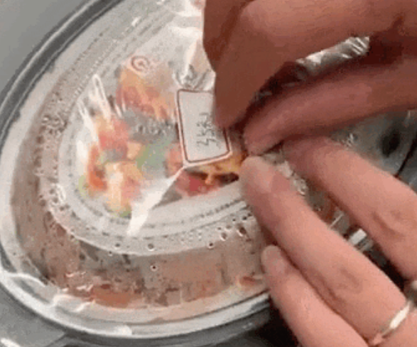

# 乘客坐高铁花35元买“肉沫豆腐” 发现15元标价被贴纸盖住 12306回应

每经编辑：李泽东

据西部决策网，9月14日，浙江金华一网友发视频称在G2344高铁上花35元购买1份盒饭， **揭开包装发现包装本来印着售价15元字样，竟被贴纸盖住。**

视频发布者称，当时列车员说有盒饭和煲仔饭两种，盒饭只有这一款肉沫豆腐的，是35元。毫无怀疑买了一份，没想到打开包装却出现这一幕。

15日，12306回应“高铁35买盒饭发现包装标价15元”表示，建议旅客找现场工作人员咨询，也会将此事反映给领导处理。

**12306客服表示，会反馈该情况，由相关部门进行核实，按照规定来说，商品都是明码标价必须按照标价进行销售。**

无独有偶，就在今年7月3日，一位网友在社交媒体发布视频称，他在动车上买的盒饭出现了双层价签。

据网友所拍视频显示，他在动车上买的“鱼香肉丝”盒饭，包装外层手写标签为35元，也是他的实际购买价格，但用手撕开价签贴后，下面还标有一个该盒饭原零售价：15元。

据大河报7月4日报道，对于“动车盒饭双层价签”一事， **12306回应：“该行为是违反相关规定的，我们会转正相关部门落实。”**

每日经济新闻综合西部决策、大河报

每日经济新闻

