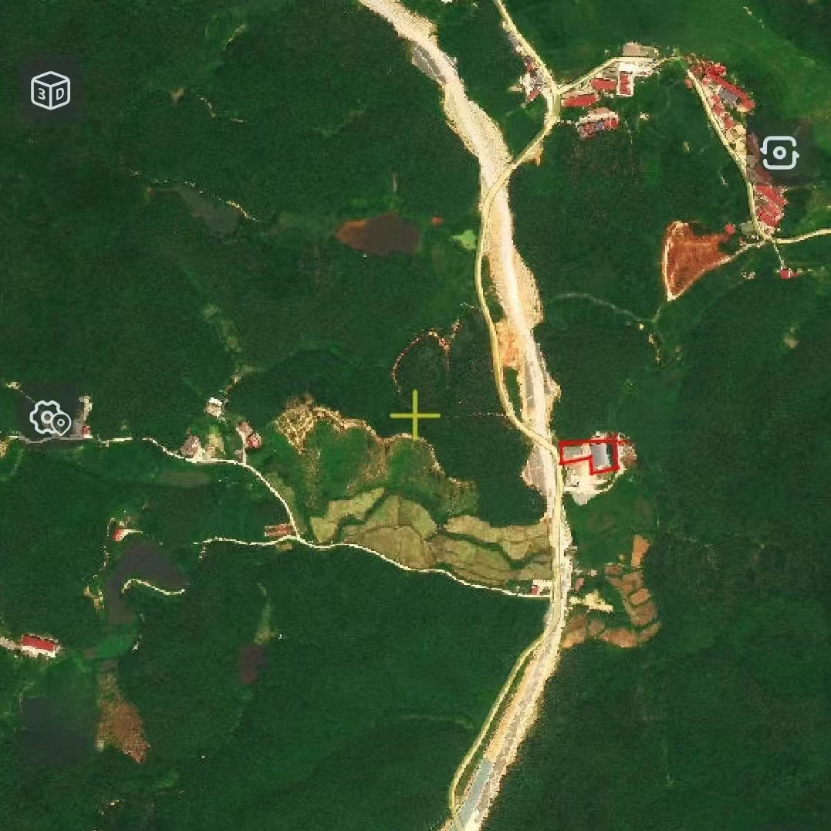
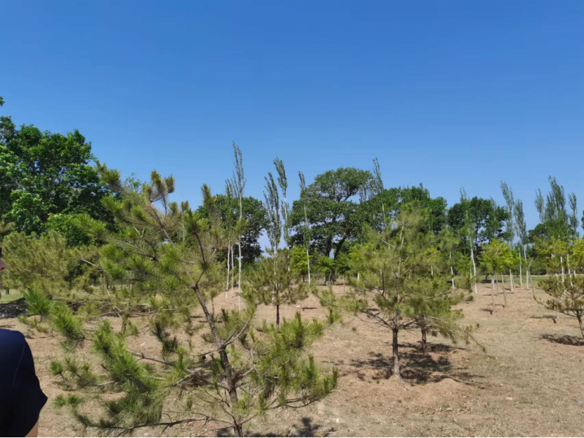
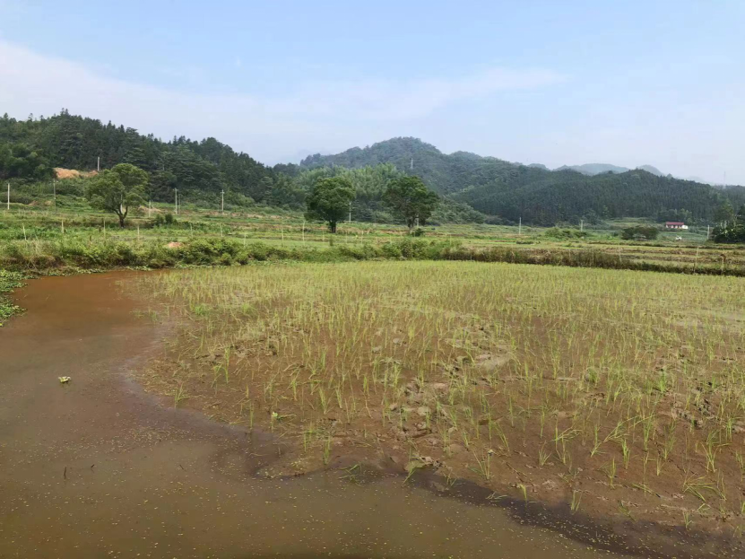
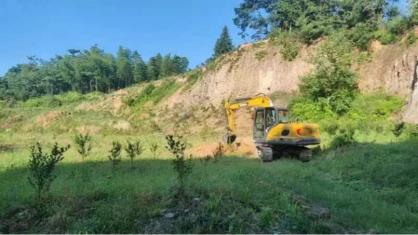

# 住了几十年的房子，卫星拍照认定违法须拆除，执法人员：我都觉得不对

**核心要点**

  * _1_ 短短几年，这片土地的性质经历了耕地-林地-耕地-林地-耕地的变化，让人苦笑不得。更让人感到魔幻的是，林地还原成耕地之后按规定不能撂荒，必须种上粮食作物。但是本村的农民在平原造林之后早就不种地了。政府必须想办法求着农民去种地，在必要时甚至需要“出钱雇人种地”。
  * _2_ 一些农民在基本农田上种植价值更高的经济作物，在树苗尚小时卫星并不能拍出来。当树苗长大时，卫星则立马拍摄，认定违法。但问题是，一些果树种了三四年，甚至有的已经到了挂果的时候了，这时候叫农民把树拔了，农民肯定不干。
  * _3_ 某位乡镇执法队员说：“我跑去农民家给他做工作，说他违法占地了，但是人家一句话就把我噎住了——我这鱼塘自己用了十几年了，怎么突然变成农田了？我的老房子，住了几十年，为什么划成基本农田了呢？——其实，我自己都没办法说服自己，我认为他说的有道理。”

王波 武汉大学社会学院博士生

一、图斑整治之“拔树”任务

今年5月份笔者来到北方某省份一个普通乡镇调研，当我想要了解该镇规划办的主要工作内容时，我被忙碌的工作人员带到了一处执法现场。出于好奇，我询问了此次外勤的工作任务。带头的干部利索地回答了两个字：“拔树！”

一番询问我得知了他们正在进行耕地流出整改工作。2019年以来，为了更有效保护耕地，保障粮食安全，全国范围内推动进行耕地流出整改工作，打击各种违法占地行为，保证耕地数量。其工作方式主要是通过卫片执法，也就是通过卫星拍照的方式判断土地用途是否发生变化。具体而言，卫片上耕地影像呈现绿色，若在耕地上动工建房，影像就变成土黄色，变更其他用途也是同样的道理。

一旦某个地方有变化，系统会自动提取图斑。这些卫片会下发到基层，基层根据这些卫片上的图斑信息到现场进行执法。而如何判断是否为耕地，则依据2009年第二次全国国土调查（简称二调）以及2019年第三次全国国土调查（简称三调）的统计数据。

_某处的卫片，其中红色的方框部分是需要整改的地方_

这次乡镇工作人员处理的正是一处上级要求处理的图斑——一片几亩的林地。

规划办工作人员介绍说，现在这里种了树被卫星拍到，对比三调数据此处应该是基本农田，因此必须拔树整治。经过了解后，我发现实际的情况远比这复杂。要求整治的所谓“耕地”的周围都是林地，为什么仅仅这几亩地被划为耕地呢？

其实最开始此处为耕地，此地在2019年之前为了防风沙曾大力推行平原造林，这块耕地被转变成林地。随后，为了保持耕地面积相对不变，一些土地被划成基本农田。此处的耕地就是当时强行从一片林地“挖出来”的耕地。后又因为此处临近公路处有坟地，为了美观当地政府又在“耕地”上种了树木，成为了林地，而且他们通过二调数据发现此处确实是林地。这也是现在林地的由来。

但是问题来了：首先，三调在当时的时间节点上将此地划为基本农田，与二调林地的划定产生冲突；其次，种树的时候树苗不大，卫星认定这是农田，也就不做处理。但是等树苗成形之后，卫星就认定是林地。因此目前林地必须整改。

就这样，在上级的严厉问责之下，规划办的干部必须赶在当天中午12点前将几亩的树苗全部拔掉，平整后变成耕地。当天上午规划办统筹林业局带来十几个人、几台挖掘机将林地变成了耕地。

短短几年，这片土地的性质经历了耕地-林地-耕地-林地-
耕地的变化，让人苦笑不得。更让人感到魔幻的是，林地还原成耕地之后按规定不能撂荒，必须种上粮食作物。但是本村的农民在平原造林之后早就不种地了。政府必须想办法求着农民去种地，在必要时甚至需要“出钱雇人种地”。

_整治树林的现场_

二、精准技术的不精准

“拔树”的案例虽然极端，但是它具有典型性，是当前国土治理领域困境的一个缩影。除了以上提及的地区，笔者七、八月份在中部两省的两个乡镇也观察到了类似的现象。乡镇干部普遍对耕地流出和卫片执法工作叫苦连天。

保护耕地主要有两个指标： **防止基本农田“非粮化”和防止一般农田“非农化”。**

在基层，具体表现为防止农民占用农田种树、搭棚、挖池塘养鱼、建房、修路等违法行为。是否存在违法行为，用卫星一拍，再对照三调数据，很快便可确定。如果违法事实判定精准，那么基层执法人员实际上并不存在压力，依法办事即可。但是最担心的是，违法的判定往往并不精准。这种不精准是由于各种原因导致的，主要有以下几点：

**一是二调与三调的结果相冲突。**

在H省，乡镇干部表示至少30%耕地流出的任务是由于第三次国土调查结果失真导致的。例如错把坟地、林地、建设用地划为耕地。为什么会错划，原因很复杂。部分出于技术落后的原因，例如在卫星识别精确度不高时，田间的道路被认定为耕地，等技术进步之后，卫星拍到了硬化的道路。单从“图上对比”来看，田间突然多出一条路来，显然是违规占用耕地，但是实际上完全不是。

除了技术落后，自上而下的国土统计工作与熟悉情况的地方人士衔接错位也是失真的来源之一。在J省的某乡镇，出现了村庄集中居住区中心某块地被划为基本农田的情况，其原因是：农民在预备建房的宅基地种上蔬菜，自己则长期在外务工，攒够钱回来建房。三调时，由于周围邻居无人为其解释，下乡统计的工作人员误将这块地划为基本农田。

各种原因导致的两次调查结果相冲突，为了把握耕地红线，基层在执法中往往同时参考两次调查的结果，一处地方但凡有一次调查中被划定为耕地，那么就按照耕地处理。这种冲突给基层执法带来很大的困扰。

**二是卫星监察的不精准。**

除了两次调查结果相互冲突，卫星监察的不精准也是基层干部吐槽最多的。

近年来，国家加强了卫片执法的力度。从调研来看，部分地区卫片下发频率由一个季度一次变成一个月一次。卫星拍照能够精准捕捉到土地上的变化，再以生成图斑的形式下发到属地进行整治。表面上看，卫星拍照具有很强的精确度。它表现为识别度高、对变化敏感两个方面。一些乡镇干部表示，现在的卫星技术可以精确到厘米级别，甚至可以看清马路上汽车的车牌号。而对变化的敏感更是卫星技术的主要优点。
**在实际执法中，图斑生成的灵敏度有时超过了基层工作人员的想象。**
卫星对颜色的变化特别敏感，农户家的水泥地从灰色变为蓝色会被拍到，甚至农民屋顶换一个颜色都会被拍到。但是这种看似精准的技术在操作过程中存在大量不精准。这种不精确表现在
**三个方面：**

**——拍摄的滞后性。**

卫星主要拍摄土地的变化，但是实际上当变化是缓慢发生时，卫星的拍摄可能并不敏感。例如一些农民在基本农田上种植价值更高的经济作物，在树苗尚小时卫星并不能拍出来。当树苗长大时，卫星则立马拍摄，认定违法。但问题是，一些果树种了三四年，甚至有的已经到了挂果的时候了，这时候叫农民把树拔了，农民肯定不干。也正是这样，针对田间种树问题，基层执法遇到的阻力特别大。类似的问题包括农民挖塘养鱼，挖的时候没有被拍，结果用了十几年被卫星认定占用基本农田。最麻烦的是，农民住了十几年的房屋，突然被认定是占用基本农田。

_被划定为基本农田的鱼塘种上了水稻_

**——拍摄的偶然性。**

有的地方乡镇干部反映，五口鱼塘都属于违法占地，但是卫星只生成了其中一口的违法图斑，这种对比很难不让群众怀疑执法的合理性。而且在基层执法中，图斑生成的规则让人琢磨不透。最让人印象深刻的是，J省的某位农民因为给自家油茶林除草被卫星拍到，结果一查发现油茶地是一般农田，不能种树，于是强制改种番薯。有趣的是，这位农民并不是因为种油茶树这种直接占用耕地行为被发现的，反而是因为除草这种看似无关紧要的行为被发现。

 _油茶树林整改之后种上了红薯苗_

**——拍摄的片面性。**

卫星拍摄的唯一标准是土地性质及其变动。这种过分追求静止的土地用途的技术导向可能忽视土地实际使用的变动性。例如H省某乡镇农民有稻虾连种的种植习惯。这样的生产方式本身具有一定的波动性，当地农民在龙虾行情好时候会将农田部分变成坑塘进行养殖。但是这样的行为被卫星认定为将耕地改变成水面。这种片面性对当地的产业发展产生了一定的影响。

当前基层干部图斑整治的重点和难点就在于这些因为调查和技术导致的偏差中。
**J省某乡镇规划办的负责人说：“（执法中）主动违法的情况特别少，大部分是被划错了的。”**

三、基层干部：“我连自己都不能说服”

既然存在这么多不精准，那么更加熟悉情况的基层政府及其工作人员可以向上反映吗？理论上可以，但实际很难。这主要是由于严厉的考核监督与漫长的反馈周期之间的矛盾导致的。

近些年来，国家高度重视耕地保护，中央会议曾表示“要压实地方各级党委和政府责任，实行党政同责，从严查处各类违法违规‘非农化’、严格管控‘非粮化’，对在耕地保护方面有令不行、有禁不止、失职渎职的，要严肃追究责任”。与之相对应的是，违法占地的卫片一经下发到地方政府，地方政府就有责任进行迅速整改。整改不及时、不到位的地方可能面临上级领导、纪委的斥责和约谈。因此基层政府往往迅速做出反应。相反，一旦发现偏差，基层向上反馈的周期则十分漫长。
**H省某乡镇的副镇长表示：“有的问题要求我们2个月整改到位，而我们向上反馈材料、证明，走程序至少90天，根本没有回旋的余地。”**

紧急的考核问责压力促使基层政府想方设法完成整改任务，而将技术带来的对错之争放到相对次要的位置。常规的手段包括执法与做工作。但是事实证明这两种方式大部分情况会失效。

抛开执法力量不足、法律下乡困难等客观因素，其实最大的问题在于执法者自己都无法说服自己。某位乡镇执法队员说：“我跑去农民家给他做工作，说他违法占地了，但是人家一句话就把我噎住了——我这鱼塘自己用了十几年了，怎么突然变成农田了？我的老房子，住了几十年，为什么划成基本农田了呢？——其实，我自己都没办法说服自己，我认为他说的有道理。”（注：划定为基本农田后，就要恢复原样）

执法与群众工作都没办法，基层不得不采取补偿的方式“花钱保平安”。无论是拔树、拆房还是填平池塘都得由基层买单。我们调研中听乡镇干部介绍，某村有一个活动中心被划定为基本农田，只能拆除。到最后是政府帮助村民找项目建新楼并且进行赔偿。

 _乡镇干部指挥挖掘机进行图斑整治工作_

即使如此，花钱真能“保平安”吗？

我们在J省某乡镇调研发现了这么一个案例：当地一家竹制品加工厂扩建时被卫星发现，经过调查发现此处土地在2009年是基本农田。当时建厂时管理比较松，该厂未办手续就建立了，一直延续了10年以上，直到这次装修变动被发现。按理说工厂补办相关手续就行，但矛盾的是，该厂因为这次被卫星抓拍认定为违规占用农用地，有了违法记录，也就不能办理相关手续。而消除违法记录又需要办理相关建厂手续，两者形成相互需要证明的矛盾境地。最后没办法，该加工厂只能被拆除，老板宣布破产。

此事对基层政府带来了巨大的麻烦，当地不仅损失了一份产业，也损失了几十个就业机会，本来可以就近工作的村民不得不背井离乡外出打工。同时，老板破产之后，拖欠了农民的工资，只能由政府兜底。更为关键的是，农民觉得是政府错了，农民不懂土地性质，他们只想知道：为什么厂子开了十几年都没问题，现在突然说违法，要拆除呢？
**基层政府应对不合理卫片的策略性的处理可能透支农民对政府的信任，为基层治理带来新的矛盾。**

四、技术治理的反思

总体而言，近些年兴起的卫片执法、图斑整治及背后隐含的技术治理的倾向给基层治理带来了新的变化。
**我们发现依赖于所谓“高科技”进行的治理行为似乎并没有显著提高基层的治理效能，相反，它有可能产生一些非预期后果。**
技术对于基层治理的影响至少可以讨论两个方面的内容。

**一是作为中间层级的乡镇地位弱化。**

卫星执法通过高科技实现对全国土地的全方位监控，国家不再依赖基层政府逐级反映违法行为。直接的监控摆脱了科层体制可能出现的偏差和惰性，体现出强大的国家能力。通过技术监控，土地的规划和管理实现了全息化，任何违法行为都难逃“法眼”。但是，从另一个角度说，这种自上而下的监控将基层的治理主体的地位转变为单一执行者的地位，来自技术和上级的权威压缩了基层自治的空间。
**某位副镇长表示：“之前是人管人，发现问题了，有回旋的余地，可以慢慢发现问题，慢慢解决。现在是高科技管人，立马发现问题，立马整治……慢慢做可能还不出问题，着急做肯定要出问题。”**

**二是治理的空中视角忽视了基层社会的复杂性。**

卫星执法本质上是一种空中视角。它以俯视的角度客观地抓拍地面的物理属性及其变化。这样一种俯视的、外部的生态学视角忽视附着在土地之上的文化、习俗和关系，简单来说没有以平视、内部的视角看待土地上的人及其生活。生态学视角带来的是一种治理简单化倾向，这种视角下，土地是耕地还是林地一目了然。只需要按照所划定好的客观属性执法即可。但是这种视角忽视了，
**土地不仅仅具有物理属性，也是居住在它之上的人生产、生活、交往、寄托意义的所在——人们赋予了它更多的意义。**
人们对土地的使用和意义的感知往往叠加了多重因素并且是处于变动之中的，它具有很强的不规则性。简单化的治理可能导致生产灵活性的丧失、村庄内矛盾的激化和个人怨气的产生。在使用技术时如何做到既“俯视众人”又“目中有人”是一个需要思考的问题。

