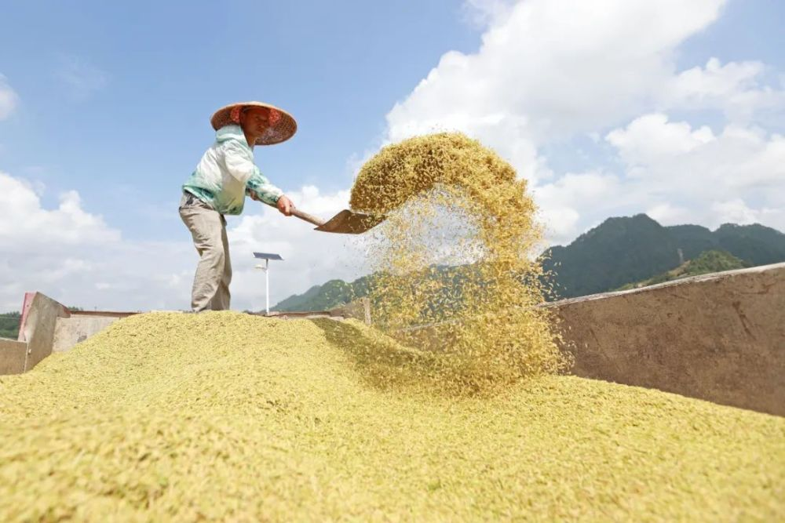
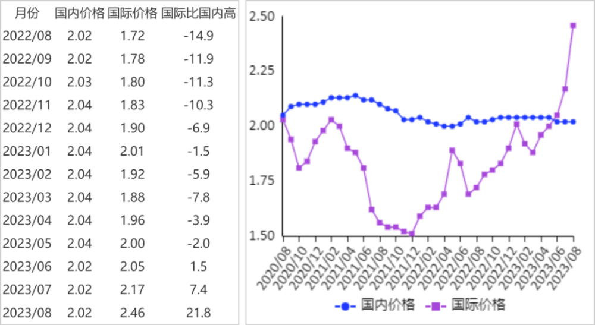
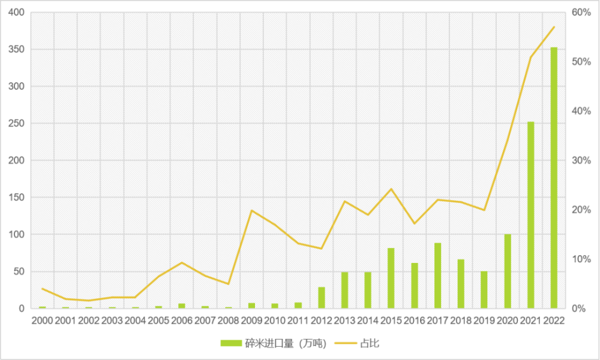
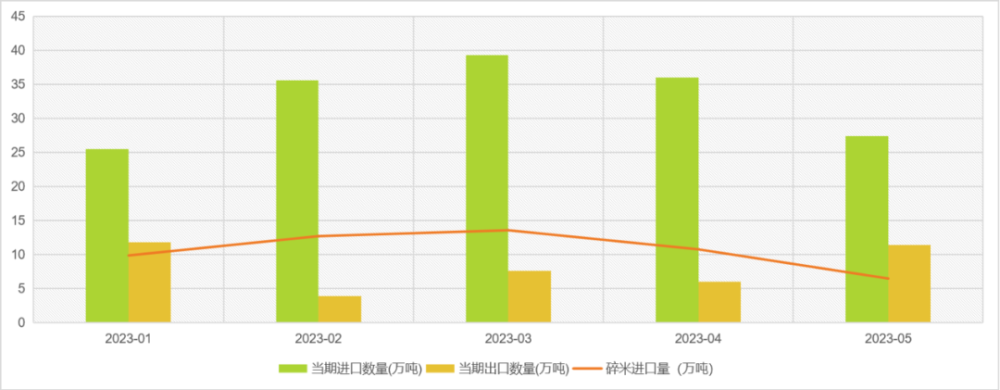
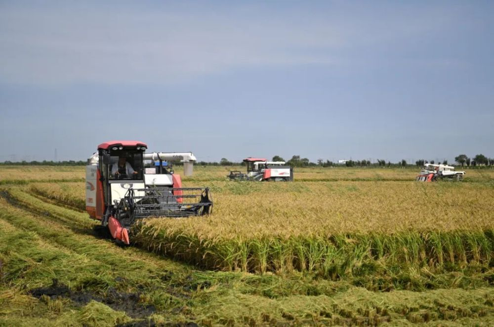
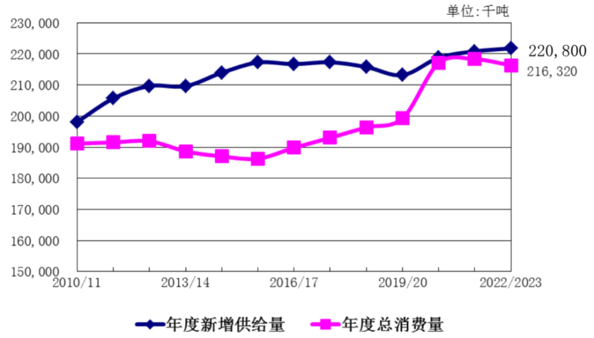
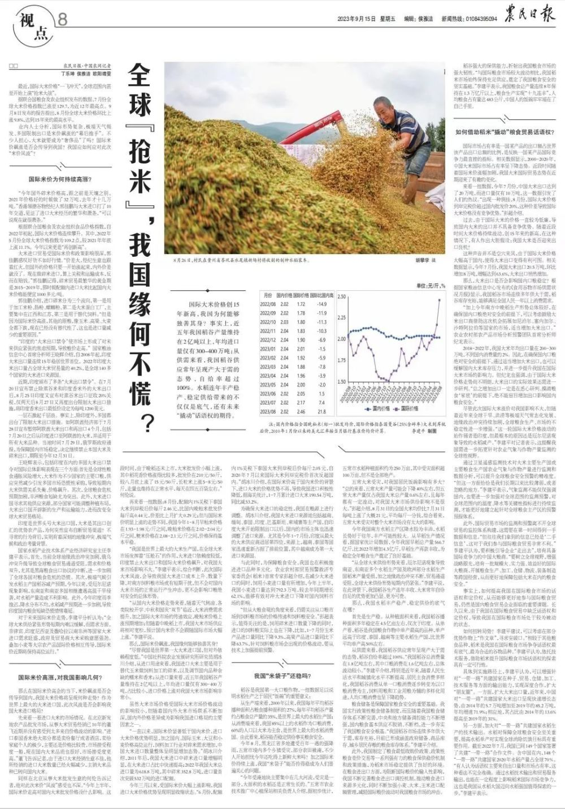

# 全球“抢米”，我国缘何不慌？

国际大米价格创15年新高，我国为何能够独善其身？事实上，近五年我国稻谷产量维持在2亿吨以上，年均进口量仅有300-400万吨；从供需来看，我国稻谷供应常年呈现产大于需的态势，自给率超过100%。水稻连年丰产稳产、稳定供给带来的不仅仅是底气，还有未来“撬动”话语权的期待。

最近，国际大米价格“一飞冲天”，全球范围内甚至开始上演“抢米大战”。

据联合国粮食及农业组织发布的数据，7月份全球大米价格指数已涨至129.7，为近12年最高点。9月8日发布的报告指出，8月份全球大米价格环比上涨9.8%，达到15年来的最高水平。

业内人士分析，国际形势复杂、极端天气频发、多国限制出口是米价飙涨的“幕后推手”。不少人担心，大米就要成为“奢侈品”了吗？国际米价飙涨是否会传导到我国？我国应如何应对此次“米价风波”？

**国际米价为何持续高涨？**

“今年国外碎米价格高，跟之前是天壤之别，2021年价格好的时候做了32万吨，去年才十几万吨。”香港领德谷物经纪人郭佳鹏与大米进口打了10年交道，见证了进口大米经历的繁华和萧条，“可以说现在就很萧条。”

根据联合国粮食及农业组织食品价格指数，自2022年初起，国际大米价格连续攀升。其中，2022年5月份全球大米价格指数为109.2点，较2021年年底上涨11.1%。今年以来更是“再创新高”。

大米进口贸易受国际米价和政策影响很深，郭佳鹏感叹好货不如好行情。“价差大，经纪生意也跟着红火，但国外的价格只要一开始涨起来，内外价差就没了。现在做碎米进口，算上关税和运输成本，反而在赔钱。”郭佳鹏记得，碎米贸易最繁华的黄金期是2015-2019年，那时候配额内进口大米比起国内大米价格能便宜1000多元/吨。

郭佳鹏介绍，进口碎米分为三个流向，第一是用于加工米粉、肠粉、螺蛳粉，第二是大米蛋白工厂，主要集中在江西和江苏，第三是用于替代饲料。“但是因为国际米价高涨，其他的原粮，像玉米、高粱、大麦全都下跌，现在已经没有替代性了，这也是进口量减少的重要原因。”

“印度的‘大米出口禁令’使市场上形成了对未来供应紧张的焦虑预期，导致粮价走高。”国家粮油信息中心首席分析师王晓辉介绍，自2008年起，印度大米出口量连续15年稳居世界首位。2022年印度大米出口量占全球大米贸易量的40.2%，是全球140多个国家的大米进口来源国。

近期，印度颁布了多条“大米出口禁令”。在7月20日宣布禁止除蒸谷米和印度香米外的大米出口后，8月25日印度又宣布对蒸谷米出口征收20%关税，仅两天后8月27日又再度出台限制大米出口措施，将印度香米出口最低价设定为每吨1200美元。

一层石激起千层浪。事实上，除印度外，多国都出台了限制大米出口措施。如阿联酋经济部于7月28日宣布暂停阿联酋大米出口和再出口4个月，包括7月20日之后从印度进口至阿联酋的大米，并适用于所有大米品种。当地时间7月29日，俄罗斯政府通报，为保障国内市场稳定，决定继续禁止本国大米及碎米出口，期限至今年12月31日。

王晓辉表示，包括印度在内的多国大米出口禁令对国际总体影响表现在三个方面:首先是全球性粮食通胀风险增大，大米作为不少国家的主要口粮，供应突然减少引发多国市场恐慌性采购，导致短期内大米供需关系失衡、价格飙升。其次，全球粮食危机预期加剧，非洲粮食短缺尤为突出。此外，大米进口国寻求其他供应来源，部分国家可能调整种植布局，大米出口国开辟新的生产和运输能力，进而改变全球大米贸易格局。

印度是世界头号大米出口国，大米是其出口创汇的优势农产品，为何突然宣布自断贸易渠道？不寻常的行为背后，实则有着深刻的地缘冲突、极端气候和政治考量背景。

国家水稻产业技术体系产业经济研究室主任李建平表示，首先，当前全球地缘政治冲突加剧，俄乌冲突升级导致全球粮食贸易通道受阻，需求和价格双升，尤其是黑海粮食出口协议的中断，进一步加剧了全球各国对粮食危机的恐慌。其次，极端气候引发水稻主产国稻谷减产预期，今年以来，受厄尔尼诺现象影响，东南亚和南亚多国相继遭遇高温干旱侵袭，对水稻产量造成不利影响。此外，今年印度雨季推迟，降水分布不均，水稻减产预期进一步加剧,导致印度国内粮食短缺恐慌情绪蔓延。

对于未来国际米价走势，李建平分析认为：“全球大米供给紧张形势短期内难以缓解，而需求方面，菲律宾、印度尼西亚及撒哈拉以南非洲等国家大米进口需求旺盛，政府及贸易商大米采购意愿强劲。叠加小麦等大宗农产品国际价格相互传导，国际米价近期将保持高位运行。”

**国际米价高涨，对我国影响几何？**

那么在国际米价高企的当下，米价飙涨是否会传导到国内，我国大米价格将呈现何种走势？作为世界上最大的大米进口国，此次风波是否会影响我国大米进口格局？

先来看一看进口大米的市场情况。在北京新发地农产品批发市场，从事大米贸易经销已10年的董飞近期并没有感受到太多来自价格波动的影响。“进口泰国香米绝大部分都是卖给餐厅或者酒店，卖给家庭个人的极少，主要还是价格比较贵，市场接受程度一般，现在国内大米品质也很好，市场接受度更高。”董飞告诉记者，由于进口大米经销生意不佳，他所经销的进口大米数量已经大幅减少，主销大米品种已转向国内大米。

同样在北京从事大米批发生意的何伦告诉记者，他对此次米价“风波”感受也不深。“今年上半年，国际米价走高对国内大米批发价格没什么影响。这段时间，由于晚稻还未上市，大米批发价小幅上涨，其中稻花香价格涨得比较多，批发价在210元/50斤，较八月底上涨了15元/50斤，长粒米上涨5-8元/50斤，走量也维持在正常水平，每天在四五百袋左右。”何伦说。

再来看一组数据：8月份，配额内1%关税下泰国大米到岸税后价每斤2.46元，比国内晚籼米批发价每斤高0.44元，价差比上月扩大0.29元；但与国际米价明显上涨的走势不同，我国今年1-8月早籼米价格在1.93-1.98元/斤之间，晚籼米价格在2.02-2.04元/斤之间，粳米价格在2.08-2.1元/斤之间，价格保持基本平稳。

“我国是世界上最大的大米生产国，在全球大米市场发挥着‘压舱石’的作用，大米进口依赖度较低，印度禁止大米出口和国际大米价格飙升，对我国大米市场影响不大。”李建平表示，综合判断，此次国际大米风波，会导致我国大米进口成本上升、数量下降，对南方饲料粮市场或有短期干扰，但不会对国内大米市场的正常运行产生冲击，更不会影响口粮绝对安全的总体形势。

“从国内大米价格走势来看，随着天气转凉、各类院校开学、中秋和国庆‘双节’临近，大米消费需求提升，加之国际大米市场的传递效应，晚籼米价格上涨预期增加；但随着中晚稻上市，我国大米市场供应将相对宽松，预计国内米价不会跟随国际市场大幅上涨。”李建平说。

**那么，国际米价飙涨，我国缘何能够独善其身？**

“尽管我国是世界第一大大米进口国，但对外依赖程度低。”中国社科院农业发展研究所研究员胡冰川介绍，从进口用途来看，我国进口大米主要是用于替代玉米做饲料加工的碎米，以及调节国内品种余缺的糯米和香米；从进口量来看，近五年我国稻谷产量维持在2亿吨以上，年均进口量仅有300-400万吨，占比较小，进口价格上涨对我国大米市场影响非常小。

虽然大米市场价格受国际大米市场价格波动的影响较小，但随着国内外大米市场联系不断加深，国内外价格差异成为影响我国进口格局的主要因素之一。

“一直以来，国际米价显著低于国内米价，进口大米价格优势明显，加之国内、国际玉米、大豆和小麦价格高位运行，饲料加工行业对碎米需求增加，中国大米进口数量整体呈明显增加态势。”胡冰川介绍，2011年后，我国大米进口中碎米进口量增幅明显，在大米进口占比中快速提高；2022年我国大米总进口量为618.8万吨，其中碎米352.8万吨，进口量首次突破532万吨的进口配额。

2000-2022年我国碎米进口量。 李建平制图

今年三月以来，受国际米价大幅上涨影响，我国进口大米价格优势呈现明显收缩状态。“6月份，配额内1%关税下泰国大米到岸税后价每斤2.05元，自2020年7月以来国际大米到岸完税价首次反超国内。”胡冰川介绍，在国际米价高于国内米价的背景下，进口大米的价格优势不再，导致我国进口积极性降低，据海关统计，1-7月累计进口大米190.54万吨，同比减53.2%。

2023年上半年大米进出口量较去年同期显著下降。李建平 制图

为确保大米进口的稳定性，我国在粮源上进行调整。胡冰川介绍，我国大米进口来源地包括越南、缅甸、泰国、印度、巴基斯坦、柬埔寨等主产国，自印度大米开始限制出口以后，国内的市场主体也迅速调整了进口来源。尤其是今年1-7月份，印度从最大的大米供应商退居第四位，来源上，越南、泰国等国家迅速重新占据了排前位置，其中越南成为第一大进口来源国。

与此同时，为保障粮食安全，我国也在积极推进进口品种多元化。农业农村部贸易预警救济专家委员会（稻米）首席专家彭超介绍，在减少大米进口的同时，饲用小麦进口量有所增加，今年上半年，我国小麦进口量达到792.3万吨，较去年同期增长62.1%，能够有效对冲大米进口下降对国内饲料市场的影响。

“但从大粮食观的角度来看，仍需关注从口粮市场到饲料粮市场的价格传递和饲料粮安全。”彭超表示，值得关注的是，饲用碎米进口数量下降的同时，进口的饲料粮实际上也在下降，比如，1-7月份玉米产品进口量同比下降9.3%，高粱产品进口量同比下降63.7%，针对饲料粮市场会出现的价格波动，要从技术上加强提前预警。

**我国“米袋子”还稳吗？**

稻谷是我国第一大口粮作物，一组数据足以说明水稻生产之于居民“饭碗”的重要意义：

从生产端来看，2000年以来，我国每年平均稻谷播种面积占粮食播种面积的27%，每年平均稻谷产量约占粮食总产量的35%，是世界上最大的水稻生产国；从消费端来看，我国85%以上的水稻作为口粮消费，60%的人口以大米为主食，是世界上最大的水稻消费国。由此看来，稻谷能否稳定供给事关粮食安全。

今年8月，黑龙江省多地遭受百年一遇的强降雨，五常市境内多个乡镇受灾，部分农田被淹，不少人开始担忧今年还吃得上新鲜大米吗？加之国际米价持续上涨，我国“米袋子”能否拎得稳成为人们普遍关心的问题。

“今年受淹地块主要集中在几大河流，受灾是一部分，大面积的水稻还是正常生长的。”五常市农业技术推广中心植保站相关负责人介绍，据初步统计，五常市水稻种植面积约为250万亩，其中受灾面积超100万亩，但不是全部绝产。

五常大米受灾，对我国居民饭碗影响有多大？“总的来看，五常大米产量可能会下降40%左右，但五常大米产量仅占我国大米总产量0.6%左右，且每年都有一定波动，对我国大米市场供给影响不是很大。”彭超介绍，8月31日的全国大米均价比7月31日每吨上涨了大概21元，平均每斤一分钱，综合看来，五常大米受灾对整个大米市场没有太大的影响。

今年我国南方水稻主产区降水较为丰沛，水稻长势好于往年，丰产可能性较大。从早稻生产情况看，据国家统计局数据，今年我国早稻总产量566.7亿斤，比2022年增加4.3亿斤，早稻生产再获丰收，为稳定全年粮食生产奠定了良好基础。

“从全球大米供给形势来看，厄尔尼诺现象导致南亚、东南亚多个水稻主产国及欧洲部分水稻生产国稻米产量受损，加之地缘政治冲突不断，贸易通道受阻，全球大米供给形势短期内仍紧张。”李建平说，在此背景下，我国稻谷生产连年丰收、大米常年自给自足的优势更加凸显、更为可贵。

**那么，我国水稻丰产稳产、稳定供给的底气在哪？**

首先是生产稳。从种植面积来看，我国稻谷播种面积多年稳定在4.5亿亩左右，仅次于印度。从单产看，稻谷是我国粮食作物中单产最高的品种，单产远高于印度、泰国、越南等主要水稻生产国，比世界平均单产高50%左右。

近十年国内稻谷市场供给大于需求。李建平 制图

从供需来看，我国稻谷供应常年呈现产大于需的态势，稻谷自给率超过100%。“我国稻谷总消费量在1.8亿吨左右，其中口粮消费在1.6亿吨左右，总体波动较小。”李建平介绍，特别是近年来，随着人民生活水平和城镇化水平不断提高、居民主食消费多样化，我国稻谷消费从单一口粮消费逐步转变为以口粮消费为主，饲料用粮和工业用粮为辅的多样化用途，人均口粮消费也呈下降趋势。

粮食储备是保障国家粮食安全的重要基础。我国实行政策性粮食储备制度，而且随着我国粮食储存体系不断完善，中央和地方储备调控能力不断增强，国内粮食基本供应不脱销、不断档，进一步夯实了我国粮食安全根基。“我国稻谷市场连续多年供大于需，库存充裕，目前已形成涵盖政府储备、商品库存、城乡居民存粮的粮食库存体系。”李建平介绍。

此外，我国制定了粮食最低收购价政策、政策性粮食竞价交易等一系列强有力的粮食保供稳价机制和政策措施，为稻米市场稳定提供了良好的环境。在粮食进出口方面，为阻断国际粮价的输入性影响，我国不断完善粮食进出口调控机制，推动粮食进口来源多元化，同时不断加强小麦、大米、玉米进口配额管理，减轻国际粮价波动对我国粮食市场的冲击。

稻谷强大的保供能力，折射出我国粮食市场的强大韧性。“与国际粮食市场较大波动相比，我国稻米市场始终保持充足供应，奠定了我国粮食安全的坚实基础。”李建平表示，我国粮食总产量连续8年保持在1.3万亿斤以上，粮食生产实现“十九连丰”，人均粮食占有量达483公斤，中国人的饭碗牢牢端在了自己手里。

**如何借助稻米**

**“撬动”粮食贸易话语权？**

国际市场占有率是一国某产品的出口额占世界该产品出口总额的比例，是反映一国某产品国际竞争力最直接的指标。相关数据显示，2000-2020年，中国大米国际市场占有率呈下降态势。近段时间随着国际米价涨幅加剧，我国大米国际贸易态势在近期迎来了有趣的变化。

来看一组数据，今年7月份，中国大米出口达到了20万吨，而进口量仅有10万吨，这一数据引发了人们的热议。“出现一种倒挂，8月份，国际大米价格到岸完税价超过国内批发价20%，这种价差导致国际大米价格没有竞争优势。”彭超介绍。

过去，由于国际大米的价格一直较为低廉，导致国内大米的出口并不具备竞争优势。随着近段时间大米价格持续波动，创15年来的新高，在这种情况下，有人作出大胆假设：我国大米是否迎来出口良机？

这种声音并不是空穴来风，由于国际大米价格大幅高于国内，使得大米出口变得有利可图。相关数据显示，今年7月份，我国大米出口20.5万吨，环比增加8万吨，增幅达到63.6%，大米出口悄然增加。

那么，大米出口是否会影响国内口粮稳定？根据国家粮油信息中心发布的《食用谷物市场供需状况月报》显示，我国稻谷市场连续多年供大于需，稻谷库存充裕，能够满足全国人民一年以上消费需求。

“加上今年南方中晚稻生产形势总体较好，在确保国内口粮绝对安全的前提下，可以考虑鼓励大米出口商借助这次机会拓展如尼泊尔、塞内加尔、沙特阿拉伯等国家的市场，适当增加大米出口。”农业农村部农产品市场分析预警团队首席分析师纪龙表示。

2018-2022年，我国大米年均出口量在200-300万吨，不到国内消费量的2%。因此，在确保国内口粮绝对安全的前提下，通过适当增加大米出口，也可以缓解国内大米库存压力，并进一步提升我国在国际大米市场的影响力。但纪龙也强调，由于国际大米价格走势尚不明朗，大米出口的实际效果还需进一步研判。“总之增加出口一定是在悉心研判、摸清粮食‘家底’的前提下，绝不能盲目增加出口影响国内粮食安全。”

尽管此次国际大米涨价对我国影响不大，但随着近年来全球干旱、洪涝等极端天气常态化发展、地缘政治冲突持续加剧，全球粮食生产、市场的不稳定性进一步增强。“这一轮国际大米价格波动的始作俑者是印度，但最根本的原因还是厄尔尼诺现象导致的水稻减产。”李建平对记者表示，这提醒我国需进一步拓宽针对农业气象与作物产量监测的全球性视野。

通过卫星遥感监测技术对大米主要生产国或主要粮食生产国农业气象与作物产量进行监测和数据分析，可以提升全球粮食安全预警的精准度。“但这一方面恰恰是我们长期以来比较薄弱，或者忽略的地方。”李建平表示，气象监测不能仅仅强调国内，也要进一步加强对全球范围的监测预警，对全球范围内的温度、降水等关键性指标进行持续监测，才能更好地建立起针对全球粮食主产区的预警预报体系。

此外，国际贸易市场的监测和预警离不开全球贸易的监控体系构建，这需要在第一时间得到一手数据和信息。“但往往我们拿到的信息已经是‘二手信息’，这对于我们参与国际粮食贸易非常不利。”李建平认为，要积极引导企业“走出去”，培育具备国际竞争力的中国大粮商。“要树立全球视野，增强战略眼光，培育一批规模大、实力强、效益好的国际大粮商，开展粮食生产、加工、仓储、物流、装备制造等跨国经营，从而更好地保障包括大米在内的粮食安全。”

事实上，如何提高我国在国际粮食市场的话语权和定价权，从而能够更好地参与国际粮食贸易，仍然是国内粮食贸易企业面临的重要课题。长久以来，由于我国在国际粮食贸易中缺乏话语权和定价权，导致我国在国际粮食市场处于较为被动的状态。

如何扭转局势？李建平建议，可以考虑在部分优势作物上“作文章”，寻求突破口。“相较于其他粮食品种，稻米是我国在国际粮食市场争夺话语权最有底气、最为合适的谷物品种。”李建平认为，依托技术服务，借助稻米提升国际粮食市场话语权的探索具有一定可行性。

具体到实施路径上，李建平认为，可以增强针对“一带一路”共建国家在种子、贸易、仓储、加工、技术服务等方面的输出能力，实现深度合作，扩大“朋友圈”。一方面，扩大大米出口量，近年来，中国对“一带一路”共建国家大米出口呈现快速增长态势，由2014年的5.7万吨增加至2019年的85.2万吨，年均增速71.9%；相应地，其占比由2014年的13.6%提高至2019年的31%。

另一方面，加大对“一带一路”共建国家水稻生产的技术输出。水稻对保障全球粮食安全至关重要，提高水稻单产对实现全球消除饥饿目标具有重要作用。截至2022年7月，我国已同149个国家签署了共建“一带一路”合作文件。含中国在内，148个“一带一路”共建国家2020年水稻产量占全球70%。“有人认为话语权主要来自出口量和市场占有率，这种看法不完全准确。通过水稻技术输出和贸易服务输出，也能在一定程度上影响稻米国际市场竞争力，这也是我国从水稻大国迈向水稻强国值得探索的一步。”李建平表示。

**作者：农民日报·中国农网记者 丁乐坤 侯雅洁 欧阳靖雯**

**【版权声明】本文著作权归农民日报所有，未经授权，不得转载。**

