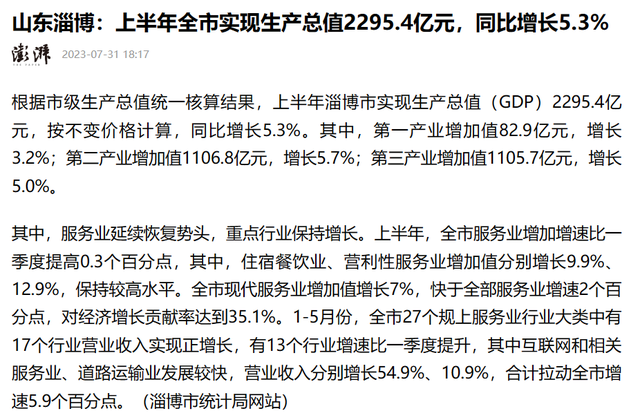
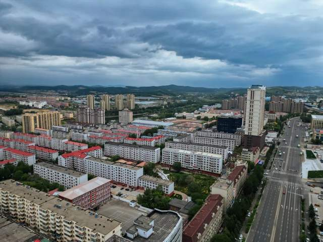
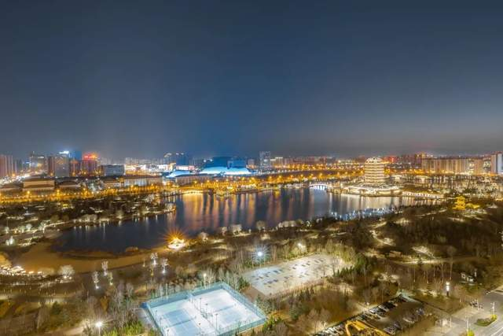

# 冰川思想库评论：淄博鹤岗现在知道了，做网红拉动不了经济

**网红城市营销，带动流量经济崛起，它直接利好文旅行业，而不管是淄博还是鹤岗，它们经济的基本支撑还是传统工业，旅游业的经济贡献率相当低。**

**撰稿丨熊志**

网红城市淄博，还是被打回了原形。

烧烤经济的热闹降温之后，前不久，淄博公布了上半年的经济运行情况。

从数据来看，可能要让不少人有些意外了——上半年GDP为2295.4亿元，同比增长5.3%，跑输5.5%的全国大盘增速，也大幅落后6.2%的山东平均增速，增速位列山东倒数第三。

都以为淄博火爆的流量，会反馈到经济运行上，形成一个爆炸的数据， **结果却事与愿违，它甚至拖了山东的后腿。**

_图/网络_

无独有偶，另一个被打上网红标签的城市鹤岗，一季度增速领跑全国的高光表现，也未能得到延续。一季度同比增长8.5%，上半年则掉到5.7%，呈断崖式下滑状态。

淄博、鹤岗身上，散发着中国城市的“网红焦虑症”，它们面临转型困境，知名度和存在感却被流量效应激活。但只有当热度退潮时，我们才能更加冷静地评判，它们在流量经济中的得与失。

01

整个2023年上半年，淄博无疑是最具关注度的城市，而且可能没有之一，霸屏热搜数日，“五一”期间到发旅客48万人次，创造了淄博的历史纪录。

对很多外地游客来说，淄博特色的烧烤，带来了久违的烟火气；物美价廉的消费，不欺客宰客的市场环境，良好的治安，以及地方政府在烧烤专列等方面的主动作为，让外界看到了重视游客、开放友好的城市风貌。

淄博集全市之力的资源投入，确实收获了一定的回报， **这尤其体现在和旅游业直接相关的领域中。**

数据显示，2023年上半年，淄博的住宿餐饮业、营利性服务业增加值分别增长9.9%、12.9%。此外，消费层面，社会消费品零售总额639.4亿元，同比增长9.7%。

这样漂亮的增长背后，是成百上千家餐饮店，在烧烤经济中实现了营业额的大幅上涨。开烧烤店，一度成为当地的风口创业项目。媒体报道提到，从2023年3月到6月，淄博新开张的烧烤店就超过了450家。

 _▲淄博烧烤现场（图/视频创意）_

然而，烧烤经济再热闹，产业规模再庞大， **经济贡献率也比较有限，因为烧烤消费涉及的上下游很短。**

事实上，别说对整个地方经济了，哪怕是对服务业，都起不到太强的拉动效果：2023年上半年，尽管淄博的住宿餐饮业、营利性服务业高速增长，但整个第三产业，同比增长只有5.0%。

抛开流量效应对城市知名度的加持效果，如果只看数据，那么我们甚至可以得出结论：淄博的这一轮爆火，在经济层面可能是徒有热闹罢了。

02

淄博之外，以低房价著称的鹤岗，在翻红的同时也逆袭了一把。

2023年一季度，鹤岗GDP同比增长8.5%，而黑龙江全省为5.1%，全国平均增速为4.5%。但这种领跑全国的势头，并没能得到延续，上半年增速只有5.7%，勉强跑赢了全国大盘，二季度鹤岗经济的颓势尽显。

所以一个残酷的事实是，和淄博一样， **流量经济的热闹，除了在线上给地方带来一些注意力资源外，并没有为地方经济注入太多的动能。**

其实没必要对此感到意外。

网红城市营销，带动流量经济崛起，它直接利好文旅行业，而不管是淄博还是鹤岗，它们经济的基本支撑还是传统工业，旅游业的经济贡献率相当低。

以淄博为例，在靠着特色烧烤和贴心的城市服务出圈之前，老工业城市，才是它更突出的城市属性。

历史上的淄博，创造了工业史上的很多第一，但过于依赖重化工产业，形成了“传统产业占70%，重工业占传统产业70%”的畸形结构，面临资源枯竭的困境，在新旧动能转换中，这成为了城市的沉重包袱。

淄博的问题，是传统低端资源产业正在加速淘汰，但缺少新兴产业来填补空白。烧烤经济的出现， **看似带来了火爆的流量，实际上远远无法补上产业转型的巨大窟窿。**

鹤岗的遭遇类似。它一季度、二季度的经济波动，是因为受到了煤炭产业、资源价格波动的巨大影响。低房价带来的流量和人气，就贡献度来讲，在整个经济层面几乎可以忽略不计。

_▲鹤岗（图/图虫创意）_

这并不是唱衰淄博或者鹤岗。

在淄博火爆时，一些批评或者呼吁不要捧杀的声音，很容易被湮没在点赞声中，但高挂热搜不可能是一座城市的常态，流量经济到底挣不挣钱，还是只能为城市赚一些吆喝，它需要的是冷静、理性的思考，甚至是多泼一点冷水。

比如，值得我们思考的是， **经济属于低于预期，是否说明淄博模式存在致命缺陷？**

正如有观察者提到的，城市发展要靠大量外来消费去推动时，就容易形成潮汐现象，这对旅游经济运行，对城市产业链、供应链发展是不利的。

大量的人力物力投入到烧烤相关产业中，本身打破了地方资源流动的稳定、平衡状态。淄博烧烤火爆时，当地形成开店潮；热度下降后，当地又出现了关店潮。这种不稳定的状态，资源要素错配，是否也是经济不振的一个原因呢？

03

淄博和鹤岗，是不少北方城市的缩影。

在社交媒体、短视频时代，相较于大城市自带流量的属性，这类中小城市面临人口流失，存量人口中老龄人口占比相当高，缺少朝气和活力；产业结构层面，以传统资源产业为主，又显得太老太笨重。

因此它们有着深刻的流量焦虑，希望抓住一切机会，借助互联网出圈，一炮走红，让自己年轻化、有网感起来，在城市竞争中更有存在感，能吸引年轻人流入，吸引资本来投资。

**但事实上，一座城市的翻盘之路，押宝在成为网红城市上，注定是希望渺茫的。** 像杭州、成都等新一线城市，之所以能持续走红，前提是有比较扎实的产业基础。

所以最让人担心的是，一些存在转型压力，缺少存在感的小城市，在淄博的样板下，为了撬动流量而进行用力过猛的投入，把资源都集中在一些低效、带动力弱的领域中。

在某种意义上，淄博经济低于预期，还是一种干预式思维的结果。看到烧烤经济有流量，政府就大手一挥，调动一切资源顶上去，就跟过去调动一切要素搞资源产业、化工产业一样。

_▲淄博齐盛湖（图/图虫创意）_

当然，淄博仍然是幸运的。这一轮烧烤热潮，大大增加了它的知名度，贴心的服务也为地方城市形象起到了加分的效果。主动采取多种手段，积极进行城市营销，单凭这一点，淄博就已经跑赢了很多沉闷的城市。

只不过，不管是淄博还是鹤岗，都需要直面问题核心， **将精力更多用在传统产业转型上，减少不必要的干预，让市场真正在资源配置中起到决定性作用。**

如今的淄博，真正意义上凉下来了，这不是坏事。经济数据不会说谎，也只有冷静下来，那些有流量焦虑的城市，才会发现真相——网红城市其实不好当。

