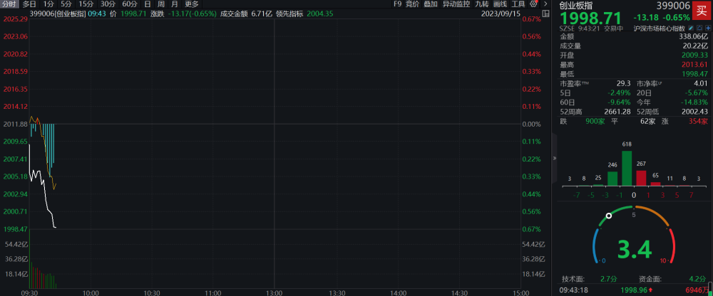

# 创业板指跌破2000点关口，为2020年4月以来首次

9月15日，上证指数高开0.23%，深证成指高开0.16%，创业板指低开0.13%。

早盘指数持续走低，创业板指跌破2000点，为2020年4月以来首次，今年年内跌幅超14%。

国盛证券指出，基于短期市场表现羸弱，量能不足的现状，策略上还是以多看少动，耐心持股为主，重点观察创业板指何时止跌企稳。若后续汇率趋于稳定，9、10月的各项经济数据能持续改善，叠加各项利好政策的不断落地，市场走出一波强势的上涨行情也未尝不可期。

渤海证券指出，市场短期仍被北向资金的离场过程所压制。短期需跟踪地产政策密集释放后，房地产的成交扭转程度；另一方面关注通胀数据，油价支撑下，美联储9月议息会议是否会传递更鹰派信号，上述因素变化对短期北向资金的进出将产生一定影响。就A股中期判断而言，社融等基本面数据越来越明显展现经济的底部企稳迹象，叠加“活跃资本市场”的政策预期，A股在中期将迎来震荡向上过程。

