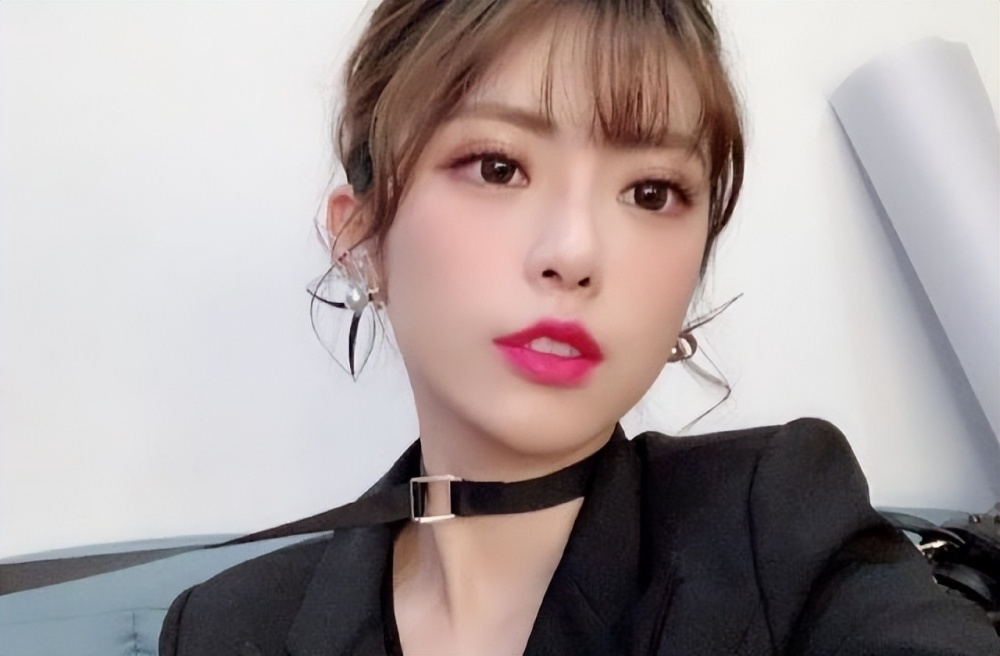
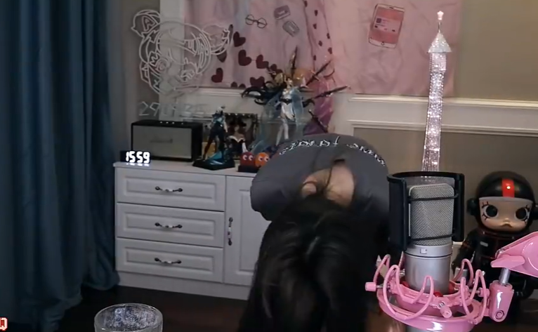
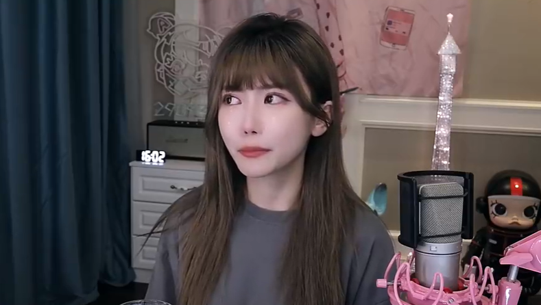
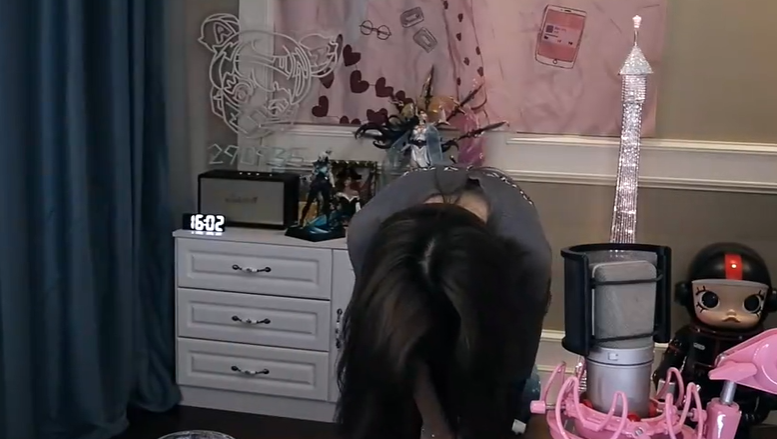
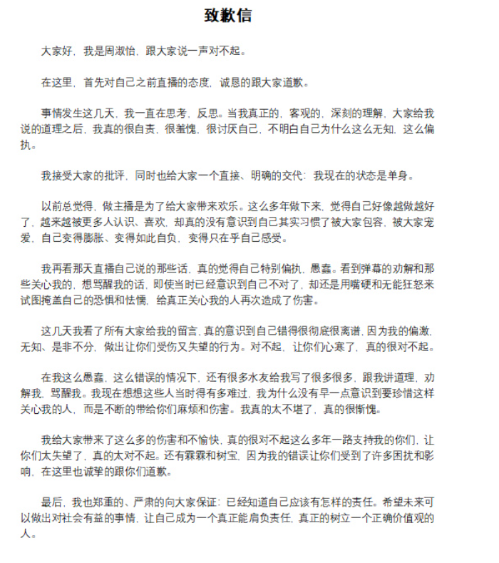

# 和PGone分手？周淑怡直播痛哭公开道歉：我现在是单身，接受一切批评

自从周淑怡传出和PGone的恋情后，她的直播间和微博就已经沦陷。前几天周淑怡开播的时候，面对大量弹幕的质疑，她没有选择辟谣和否认，当然也没有直接承认，而是对弹幕破口大骂，一顿嘲讽，看起来像是默认了和PGone的恋情，为了恋情决定放弃观众。而就在这几天休整之后，周淑怡再次开播，这次直播的态度和之前有了180度的大转变，不仅没有嘲讽痛骂观众，而是直播泪洒现场，公开道歉并且表示自己现在是单身状态。

周淑怡直播的回应如下，她上来就表示：跟大家说一声对不起。然后当着镜头的面公开鞠躬。

随后回到座位上，周淑怡也控制不住情绪，开始泪流满面，并且解释：这几天我一直在反思和自责，这几天觉得很羞愧，很讨厌自己，觉得自己很无知和偏执，我接受大家一切的批评，同时也给大家一个交代，我现在的状态是单身。之前做主播受到了大家的喜爱后，变得很膨胀和自负，只考虑到了自己的感受，现在再看我那天直播说的话，觉得自己很偏执和愚蠢，看到很多弹幕在关心我，想要骂醒我，但是我还是嘴硬，给真正关心我的人造成了伤害。

接着周淑怡也表示：这几天看了大家的留言，意识到了自己错的很离谱，非常对不起，让大家受伤和失望了。然后周淑怡再次鞠躬向大家道歉，最后她表示：自己已经知道了自己的责任，未来会做出对社会有用的事情，树立正确的价值观。在道歉完毕后，周淑怡也表示需要一段时间调整自己，晚点再直播，随后就匆忙下播了。

除了直播道歉之外，周淑怡还在微博公开发表了道歉信，和直播一样，也是为自己之前的直播态度道歉，并且道歉信的内容就是她直播说的原话，应该是直播的时候把道歉信念了一遍。

从周淑仪的言论中可以确定，她之前应该是和PGone在交往，所以面对当时直播弹幕的辱骂，她选择维护自己的男友，但是下播后，事情发酵，口碑崩塌，不少观众表达了失望之情后，周淑怡选择和PGone分手来挽回观众的心。不过到底是谁提的分手目前还不确定，而且到底是不是真的分手了，也需要看后面还有没有蛛丝马迹被发现了。

事已至此这件事情应该告一段落了，后面她再次开播，应该还会有弹幕来带节奏，就看她到时候如何处理了。这件事情让周淑怡掉粉无数，人缘和口碑都炸了，想要挽回这么多的损失，不是一封道歉信和一次直播痛哭道歉就能够弥补的，还是要看后面重回直播后她的态度了。其实第一波节奏出来的时候，当时处理好现在也没有这么多事情了，现在道歉看起来还是有点晚了。

那么，对于这件事情，你们有什么想说的吗？欢迎在评论区留言探讨。

