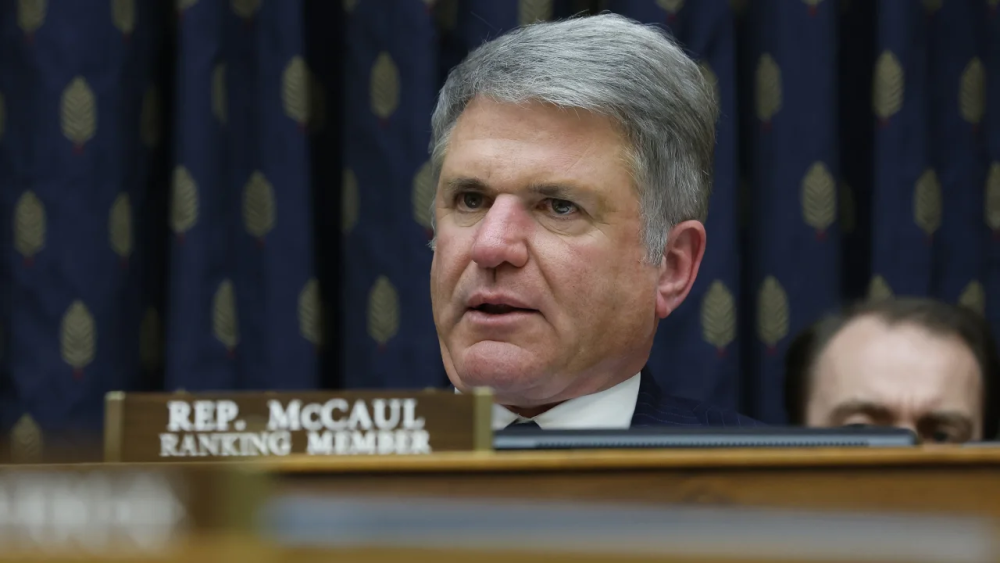
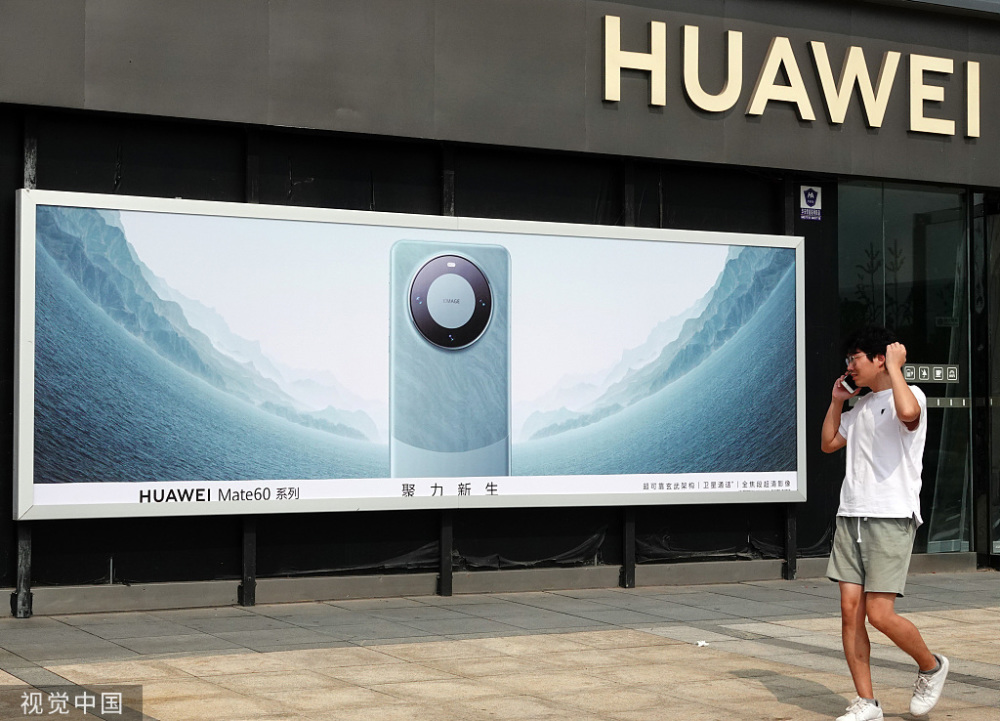

# 外媒：华为推出新手机后，一群美政客致信敦促拜登政府进一步打压

【环球网报道 记者
索炎琦】华为在美国芯片封锁下推出新手机，在美政坛引发强烈轰动，也炸出了不少酸葡萄心理的美国政客。据路透社报道，一群美国众议院“资深共和党人”当地时间14日致信拜登政府，敦促后者进一步打击华为和中国半导体公司中芯国际。

报道称，这些共和党议员包括美国国会众议院的外交事务委员会主席、能源和商务委员会主席、军事委员会主席以及“美中战略竞争特别委员会”主席。他们敦促美国商务部停止向中芯国际等中国企业发放许可证，并呼吁拜登政府施加更多压力，“以向对手实施更有效的出口管制”。

_美国国会众议院外交事务委员会主席迈克尔·麦考尔 资料图 图源：CNN_

报道进一步称，由美众议院外交事务委员会主席迈克尔·麦考尔牵头的这封信，呼吁美政府“战略性地禁止将中芯国际生产的半导体进口到美国，特别是那些对国家安全构成风险的半导体”，并要求政府“对中芯国际和华为的高管提出刑事指控”。

对于上述来自美众议院共和党人的呼吁，路透社称，美国商务部没有立即发表评论。但报道提到，美国商务部曾声称，该部门正在获取华为Mate 60
Pro手机所搭载的7纳米芯片的更多性能和成分信息。

_华为专卖店 资料图 图源：视觉中国_

据此前报道，搭载中国自研芯片的华为手机在美国持续引发关注，有反华政客因此扬言要加大对中国的科技制裁。与此同时，华盛顿内部正在争论，这是否意味着过去美国对中国科技遏制的失败，未来是否需要加强相关管制。据路透社报道，美国众议院“美中战略竞争特别委员会”主席加拉格尔本月6日宣称，如果没有美国的技术，华为新机的芯片可能无法生产出来，并呼吁美国商务部停止对华为及其芯片供应商的所有技术出口。美国众议院外交委员会主席麦考尔臆测说，中企有可能违反了美国的制裁令，因此需要对此进行调查。

中国国际问题研究院美国研究所副所长张腾军本月8日对《环球时报》记者表示，加拉格尔和麦考尔都是共和党人，他们的表态一方面是为了向拜登政府施压，推动中美高科技“脱钩”的计划；另一方面也是为了迎合美国国内反华势力渲染“中国威胁”、煽动反华情绪的需要，推进其自身特定政治议程。目前来看，拜登政府明白这是两败俱伤的游戏，不可能一棍子把中国打死，实际上也打不死，所以美方显然会对此作进一步评估。

针对美国政府声称“对华为最新款智能手机中中国制造的先进芯片进行正式调查”，中国外交部发言人毛宁9月8日表示，我们一贯反对将经贸科技问题政治化，反对滥用和泛化国家安全概念。美国滥用国家力量无理打压中国企业，违反自由贸易原则和国际经贸规则，扰乱全球产供链稳定，损人不利己。我想强调的是，制裁遏制打压阻止不了中国发展，只会增强中国自立自强、科技创新的决心和能力。

