# 大水浸街！广州一地暴雨红色预警生效中，预警发布中心紧急提醒

雨雨雨！广州又开启“倒水”模式……

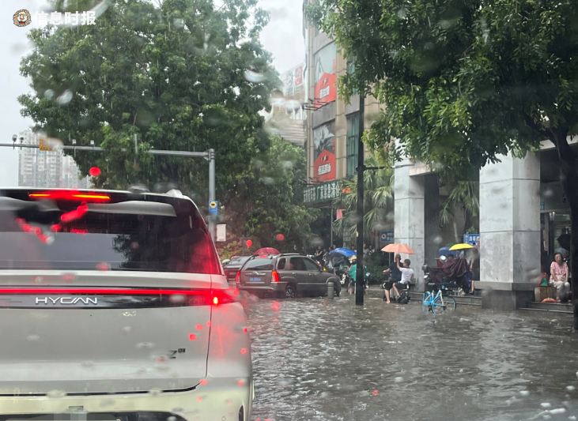

_暴雨现场。信息时报记者 袁丹琳 摄_

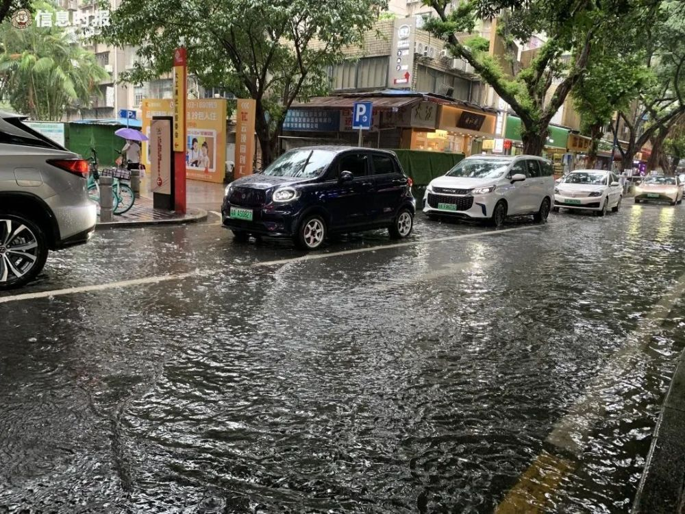

_大江直街。信息时报记者 伍建文 摄_

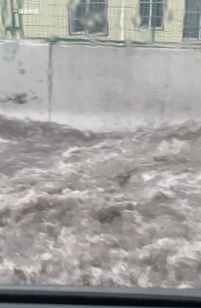

_今天14时许的环城高速。信息时报记者 吴海桐 摄_

据@广州天气，目前市区和番禺还在“疯狂倒水”， **番禺西南边还有新的“番茄蛋”回波靠过来，番禺区暴雨红色预警正在生效！**

大家要留意所在区域的最新预警，注意安全！路遇不明深度的积水不要轻易涉水！

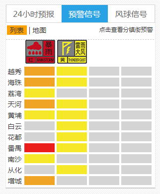

**广州市气象灾害应急指挥部已经启动**

**广州市气象灾害（暴雨）三级应急响应** ，同时启动广州市气象灾害（雷雨大风）四级应急响应。

**广州预警发布中心紧急提醒**

刚刚，广州应急、交通、气象部门发布提醒：当前，番禺区暴雨红色预警已生效。请市民注意出行安全，处于安全场所的人员尽量避免外出，户外人员迅速寻找安全场所暂避，暂停户外活动和作业，不冒险涉水，不在低洼处逗留等待，远离室外带电设备、大树、简易构筑物等，处于风险隐患区域群众密切关注预警信号，积极配合转移避险。安全第一，谨慎为上。

**番禺区暴雨橙色预警升级为红色**

**14时46分，番禺暴雨红色预警信号生效！**

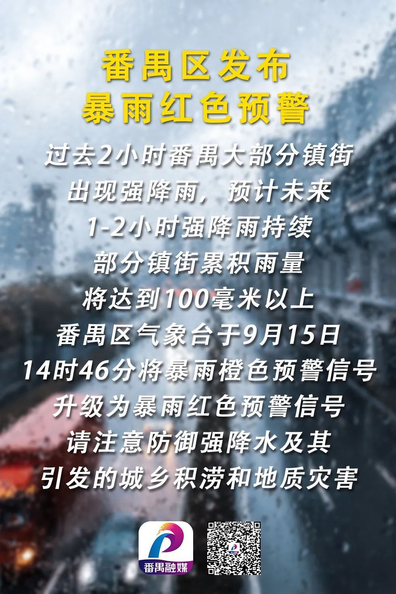

受强雷雨云团影响，番禺区已出现强雷雨和局地7级阵风，预计未来2小时强雷雨天气持续，伴有短时强降水和局地7级左右阵风。

过去2小时，广州市中南部出现大到暴雨，9个站点(1.9%)雨量在50~100毫米之间，66个站点(13.6%)雨量在25~50毫米之间。

**番禺区沙头街录得全市**

**最大累积雨量74.4毫米。**

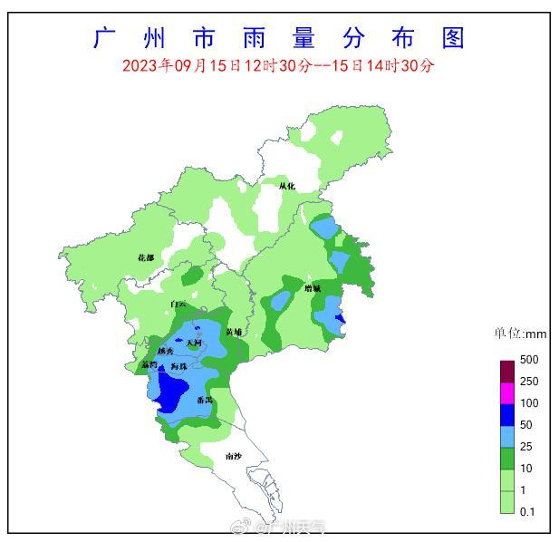

番禺区气象台于9月15日14时10分发布雷雨大风黄色预警信号，目前番禺区暴雨红色预警信号正在生效，请注意防范强降水、局地雷击、短时大风及其引发的灾害。

据统计，9月8日以来广州最长停雨时间仅17小时，目前台风“海葵”残余涡旋已经离开广东。但是！今明两天，“冷空气雨”持续！

广州已连续一周降雨，啥时候停？

**就在本周日，阳光回归！**

**广东多地发布暴雨预警**

据@广东天气，午后，中南部的雷雨北上与北面的降雨云团完成对接+合体，多地暴雨持续，风大雨急，撑伞也能打湿身……

截至14时56分， **广东省暴雨预警已达53个，其中清远市清新区和广州市番禺区暴雨红色预警，广州、东莞、深圳、清远、肇庆等27个市县暴雨橙色预警。**

有网友反映， **珠江新城和番禺一些地方出现水浸街** 大家出门要小心~

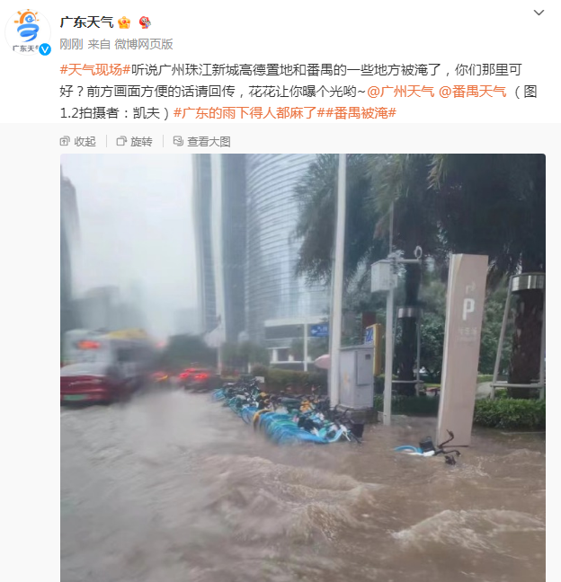

**广州周日阳光回归**

据广州气象台，今天夜间到明天白天受高空槽、切变线和弱冷空气影响， **16日白天仍有雷阵雨，17日起转多云间晴天气，** 下周，就可以安排露天晾晒了。

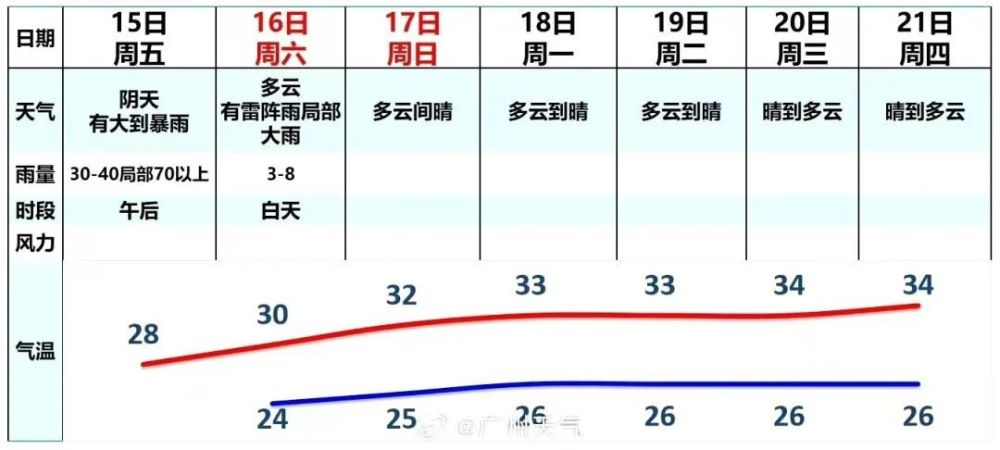

近期天气不稳定

这些安全事项大家再复习一下吧

↓ ↓ ↓

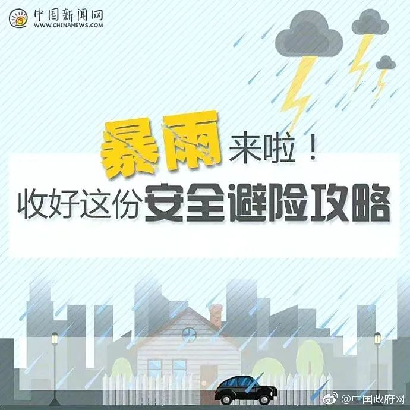

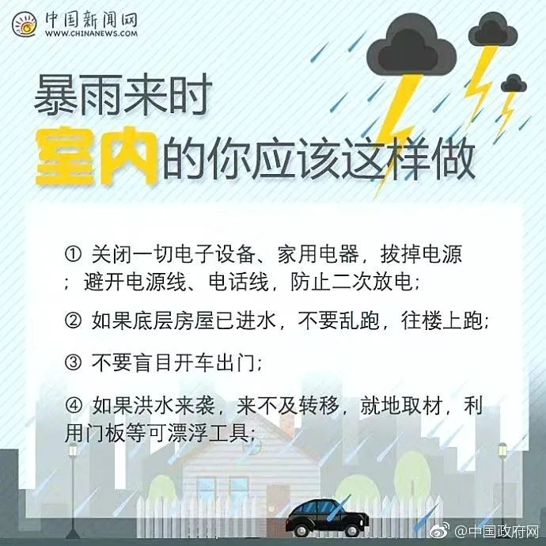

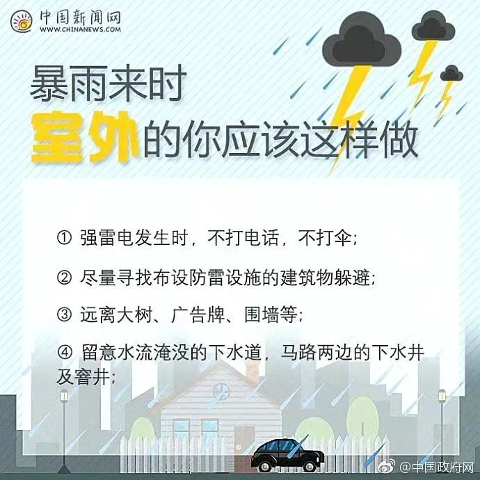

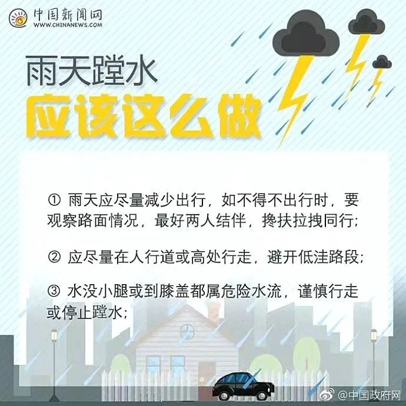

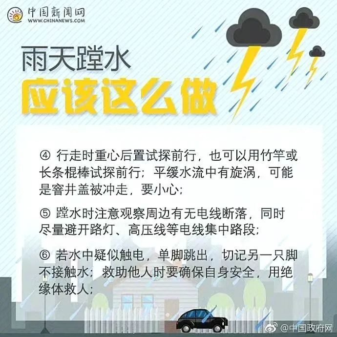

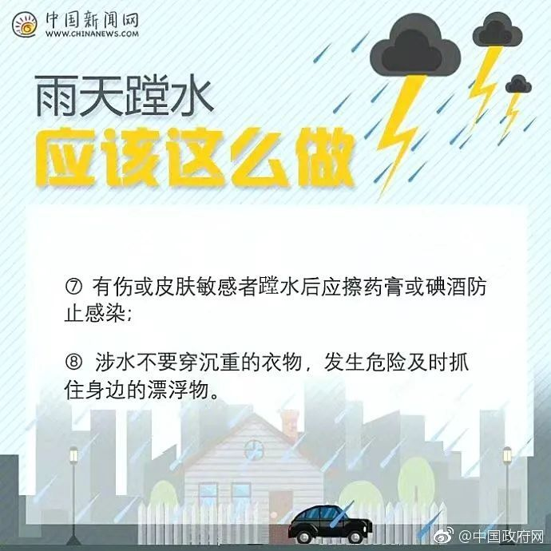

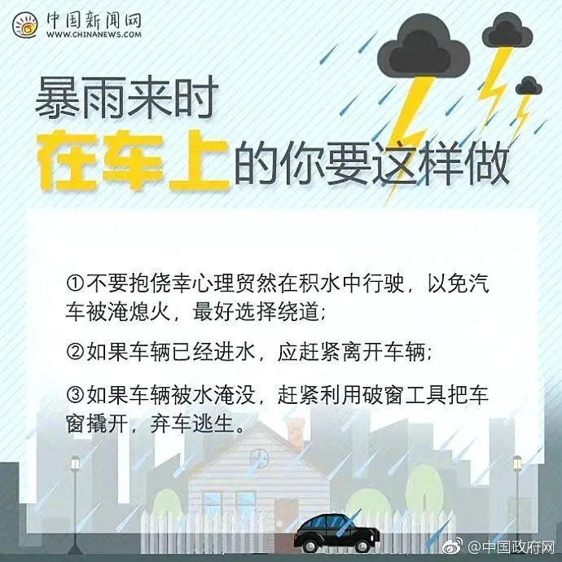

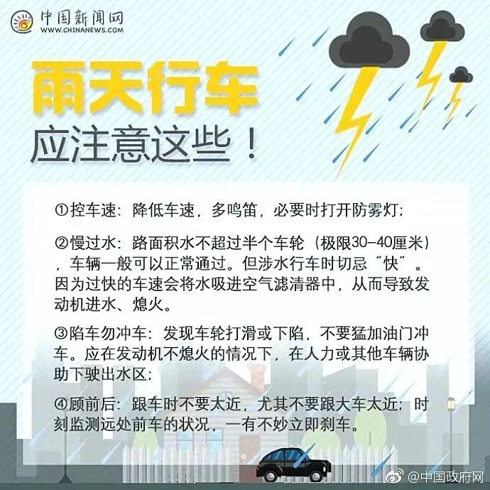

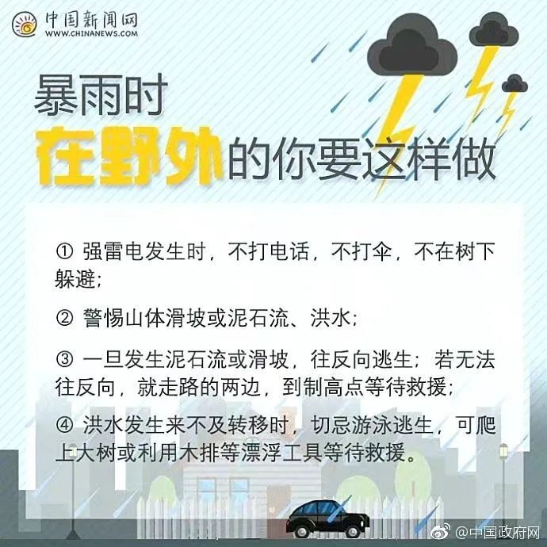

来源：综合广州天气、广东天气、番禺气象、@广州交通电台、中国政府网

图片：信息时报记者 袁丹琳 伍建文 吴海桐

信息时报编辑：黄英奇

